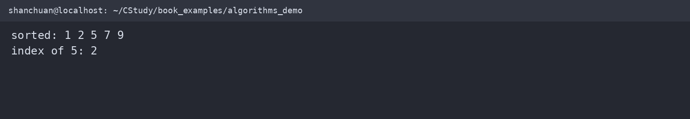
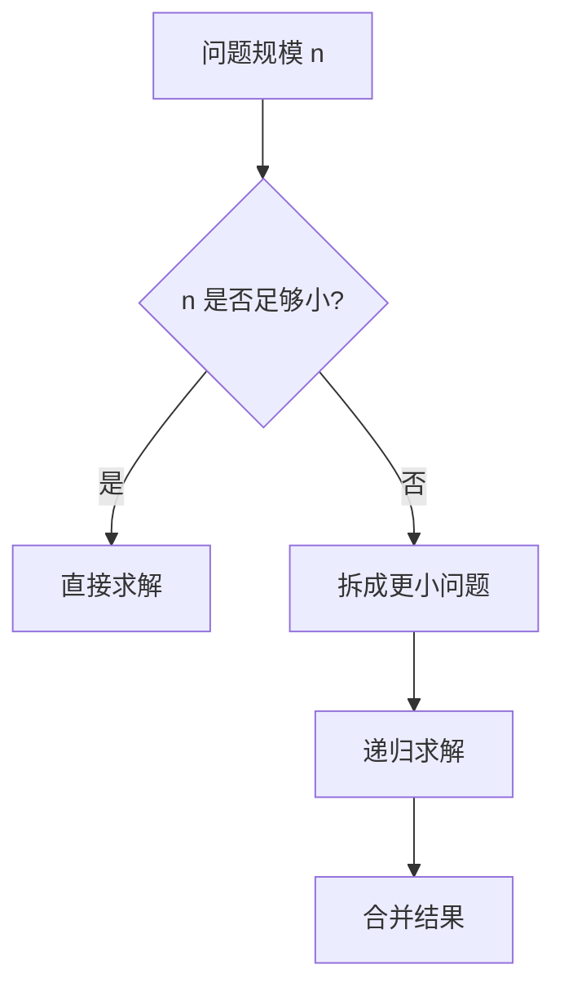

# 查找与排序

算法不是孤立的代码技巧，而是数据结构、边界条件和复杂度之间的取舍。

下面的示例在 WSL2 `/home/shanchuan/CStudy/book_examples/algorithms_demo.c` 中编译运行：



## 顺序查找与二分查找

顺序查找不要求数组有序，最坏需要检查所有元素；二分查找要求数组按同一规则排序，每次把搜索范围缩小一半：

```c
#include <stddef.h>

int binary_search(const int values[], size_t count, int target) {
    size_t left = 0;
    size_t right = count;
    while (left < right) {
        size_t middle = left + (right - left) / 2;
        if (values[middle] == target) return (int)middle;
        if (values[middle] < target) left = middle + 1;
        else right = middle;
    }
    return -1;
}
```

## 排序与比较函数

函数指针可以把“如何比较”传给通用排序函数。标准库的 `qsort` 采用这一模式：

```c
#include <stdlib.h>

static int ascending_int(const void *left, const void *right) {
    int a = *(const int *)left;
    int b = *(const int *)right;
    return (a > b) - (a < b);
}

qsort(values, count, sizeof values[0], ascending_int);
```

不要直接写 `return a - b` 作为比较结果，因为整数相减可能溢出。

## 递归与分治

递归函数必须有停止条件，并且每次调用都要更接近停止条件：



朴素递归斐波那契会重复计算同一子问题。可以使用记忆化或自底向上的循环降低复杂度。

## 复杂度的直观比较

| 方法 | 前提 | 平均复杂度 |
| --- | --- | --- |
| 顺序查找 | 无序也可 | O(n) |
| 二分查找 | 已排序 | O(log n) |
| 冒泡排序 | 任意 | O(n²) |
| `qsort` | 提供比较函数 | 实现相关，平均通常为 O(n log n) |

复杂度分析不能代替实测；元素数量、缓存局部性和比较函数成本也会影响实际表现。
