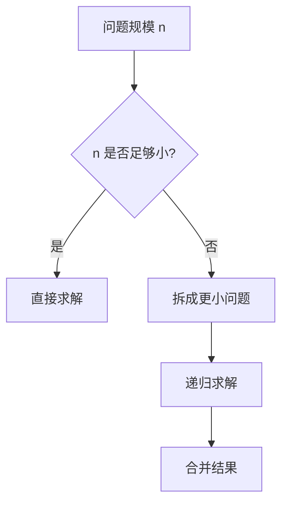

# 查找与排序

算法不是孤立的代码技巧，而是数据结构、边界条件和复杂度之间的取舍。


## 顺序查找与二分查找

顺序查找不要求数组有序，最坏需要检查所有元素；二分查找要求数组按同一规则排序，每次把搜索范围缩小一半：

```c
#include <stddef.h>

int binary_search(const int values[], size_t count, int target) {
    size_t left = 0;
    size_t right = count;
    while (left < right) {
        size_t middle = left + (right - left) / 2;
        if (values[middle] == target) return (int)middle;
        if (values[middle] < target) left = middle + 1;
        else right = middle;
    }
    return -1;
}
```

示例返回 `int` 下标，因此只适用于下标不超过 `INT_MAX` 的数组；如果接口需要支持任意 `size_t` 范围，应返回 `size_t` 并额外用布尔值表示是否找到，或使用输出参数承载结果。

## 排序与比较函数

函数指针可以把“如何比较”传给通用排序函数。标准库的 `qsort` 采用这一模式：

```c
#include <stdlib.h>

static int ascending_int(const void *left, const void *right) {
    int a = *(const int *)left;
    int b = *(const int *)right;
    return (a > b) - (a < b);
}

qsort(values, count, sizeof values[0], ascending_int);
```

不要直接写 `return a - b` 作为比较结果，因为整数相减可能溢出。

### 三种基础排序

冒泡排序容易观察交换过程，但复杂度为 `O(n²)`；插入排序在数据接近有序时通常更实用；归并排序把复杂度稳定在 `O(n log n)`，代价是需要额外的辅助空间。学习时应同时记录循环不变量、空数组和重复元素等边界条件，而不是只记住代码模板。

```c
static void insertion_sort(int values[], size_t count) {
    for (size_t i = 1; i < count; ++i) {
        int value = values[i];
        size_t j = i;
        while (j > 0 && values[j - 1] > value) {
            values[j] = values[j - 1];
            --j;
        }
        values[j] = value;
    }
}
```

`qsort` 的具体算法和复杂度由实现决定，不能把它当作稳定排序；如果需要稳定性，应在接口中明确规定，或使用带原始下标的记录自行实现。

## 递归与分治

递归函数必须有停止条件，并且每次调用都要更接近停止条件：


```mermaid
flowchart TD
    A[问题规模 n] --> B{n 是否足够小?}
    B -- 是 --> C[直接求解]
    B -- 否 --> D[拆成更小问题]
    D --> E[递归求解]
    E --> F[合并结果]
```

朴素递归斐波那契会重复计算同一子问题。可以使用记忆化或自底向上的循环降低复杂度。

分治算法通常包含“拆分、递归、合并”三个步骤。递归函数应明确输入规模如何缩小、停止条件是什么，以及合并阶段的额外空间；否则很容易写出正确性不明或栈深度不可控的实现。

## 复杂度的直观比较

| 方法      | 前提     | 平均复杂度                 |
| ------- | ------ | --------------------- |
| 顺序查找    | 无序也可   | O(n)                  |
| 二分查找    | 已排序    | O(log n)              |
| 冒泡排序    | 任意     | O(n²)                 |
| `qsort` | 提供比较函数 | 实现相关，平均通常为 O(n log n) |

复杂度分析不能代替实测；元素数量、缓存局部性和比较函数成本也会影响实际表现。

## 可运行完整示例

将下面内容保存为 `algorithms_demo.c`：

```c
#include <stdio.h>
#include <stdlib.h>

static int compare_ints(const void *left, const void *right) {
    int a = *(const int *)left;
    int b = *(const int *)right;
    return (a > b) - (a < b);
}

static int binary_search(const int values[], size_t count, int target) {
    size_t left = 0;
    size_t right = count;
    while (left < right) {
        size_t middle = left + (right - left) / 2;
        if (values[middle] == target) return (int)middle;
        if (values[middle] < target) left = middle + 1;
        else right = middle;
    }
    return -1;
}

int main(void) {
    int values[] = {7, 2, 9, 1, 5};
    size_t count = sizeof values / sizeof values[0];
    qsort(values, count, sizeof values[0], compare_ints);
    printf("sorted:");
    for (size_t i = 0; i < count; ++i) printf(" %d", values[i]);
    printf("\nindex of 5: %d\n", binary_search(values, count, 5));
    return 0;
}
```

编译运行：

```sh
gcc -std=c11 -Wall -Wextra -Wpedantic algorithms_demo.c -o algorithms_demo
./algorithms_demo
```
