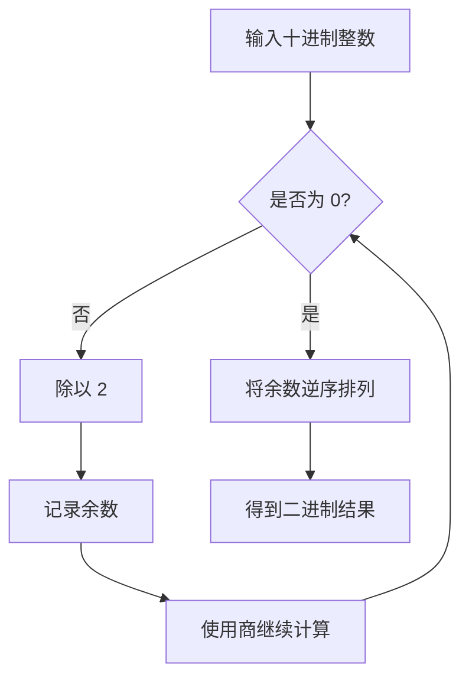

# C语言基础

> **学习路径**：本章回答“源代码怎样变成程序”，并补齐预处理、头文件和进制表示这些基础工具。掌握编译流程后，下一章再讨论数据类型如何决定对象的大小、表示和转换。

## C 语言编译与链接过程

一个 C 程序从源代码到可执行文件，通常会经历预处理、编译、汇编和链接四个阶段。


### 过程概览

<table><thead><tr><th width="115.4000244140625">阶段</th><th width="175.39990234375">输入</th><th width="177.5999755859375">输出</th><th>常用命令</th></tr></thead><tbody><tr><td>预处理</td><td><code>.c</code>、<code>.h</code></td><td><code>.i</code></td><td><code>gcc -E main.c -o main.i</code></td></tr><tr><td>编译</td><td><code>.i</code></td><td><code>.s</code></td><td><code>gcc -S main.i -o main.s</code></td></tr><tr><td>汇编</td><td><code>.s</code></td><td><code>.o</code></td><td><code>gcc -c main.s -o main.o</code></td></tr><tr><td>链接</td><td>一个或多个 <code>.o</code></td><td>可执行文件</td><td><code>gcc main.o -o main</code></td></tr></tbody></table>

在 Linux 中，可执行文件通常命名为 `main`；在 Windows 中，常见名称是 `main.exe`。

### 预处理

预处理是编译器正式分析 C 代码之前的阶段。它处理以 `#` 开头的预处理指令，主要包括：

* 展开头文件；
* 展开宏；
* 处理条件编译；
* 删除注释。

执行预处理：

```bash
gcc -E main.c -o main.i
```

预处理器主要进行文本处理，不进行完整的类型检查。宏展开成功，并不代表展开后的代码一定正确。

### 宏展开

宏使用 `#define` 定义：

```c
#define PI 3.1415926
#define SQUARE(x) ((x) * (x))
```

使用宏时：

```c
double area = PI * SQUARE(2.0);
```

预处理器会把宏名替换为宏体。宏没有类型，也不会像函数一样只保证参数求值一次：

```c
#define SQUARE(x) ((x) * (x))

int i = 3;
int value = SQUARE(i++);  // i++ 可能被执行两次
```

因此，简单常量可以使用宏；带参数的计算通常优先使用 `static inline` 函数：

```c
static inline int square_int(int x) {
    return x * x;
}
```

宏展开可以理解为下面的过程：


### 头文件展开

`#include` 会把头文件的内容插入当前源文件。它本身不是函数调用，也不会在运行时执行。

```c
#include <stdio.h>
```

预处理过程可以简化为：


尖括号和双引号通常有不同的查找顺序：

```c
#include <stdio.h>      // 优先查找系统头文件
#include "config.h"      // 优先查找当前项目中的头文件
```

为了避免同一个头文件被重复展开，可以使用头文件保护：

```c
#ifndef CONFIG_H
#define CONFIG_H
#define BUFFER_SIZE 128
#endif
```

## C 源程序

一个最小的 C 程序如下：

```c
#include <stdio.h>
int main(void) {
    printf("Hello, C!\n");
    return 0;
}
```

编译并运行：

```bash
gcc -std=c17 -Wall -Wextra -Wpedantic main.c -o main
./main
```

程序输出：

```
Hello, C!
```

### C 源程序的结构

一个 C 程序可以由一个或多个源文件组成：

```
project/
├── main.c
├── math_utils.c
└── math_utils.h
```

每个源文件可以包含：

* 预处理指令；
* 类型定义；
* 变量声明和定义；
* 函数声明；
* 函数定义。

需要注意：

1. 一个可执行程序通常只能有一个 `main` 函数。
2. 一个源程序可以包含多个 `.c` 文件。
3. 一个 `.c` 文件可以定义多个函数。
4. 普通表达式语句通常以分号 `;` 结束。
5. 预处理指令以 `#` 开头，不写分号。
6. 复合语句使用花括号 `{}`，不要求在右花括号后再写分号。
7. 头文件通常放声明、类型和宏，函数实现通常放在 `.c` 文件中。


```c
#ifndef MATH_UTILS_H
#define MATH_UTILS_H
int add(int a, int b);
#endif
```



```c
#include "math_utils.h"
int add(int a, int b) {
    return a + b;
}
```



```c
#include <stdio.h>
#include "math_utils.h"
int main(void) {
    printf("%d\n", add(2, 3));
    return 0;
}
```


编译多个源文件：

```bash
gcc -std=c17 -Wall -Wextra -Wpedantic \
    main.c math_utils.c -o main
```

链接器会把 `main.c` 和 `math_utils.c` 生成的目标代码合并，并解析函数和变量之间的引用关系。

## 进制转换

### 基本规则

在 `X` 进制中，每当某一位达到 `X`，就向更高位进一：

```
二进制：逢 2 进 1
八进制：逢 8 进 1
十进制：逢 10 进 1
十六进制：逢 16 进 1
```

常见进制前缀：

| 进制   | C 语言写法      | 示例       |
| ---- | ----------- | -------- |
| 二进制  | `0b`，C23 支持 | `0b1010` |
| 八进制  | `0`         | `012`    |
| 十进制  | 无前缀         | `10`     |
| 十六进制 | `0x` 或 `0X` | `0xA`    |

### 其他进制转换为十进制

把每一位乘以对应的位权，再求和。

例如，二进制 `1010`：

$$
1 \times 2^3 + 0 \times 2^2 + 1 \times 2^1 + 0 \times 2^0 = 10
$$

因此：

```
(1010)₂ = (10)₁₀
```

二进制位权从右到左依次为：

```
128 64 32 16 8 4 2 1
```

### 十进制转换为二进制

常用方法是“除 2 取余，逆序排列”：



例如，十进制 `13`：

```
13 ÷ 2 = 6 ... 1
 6 ÷ 2 = 3 ... 0
 3 ÷ 2 = 1 ... 1
 1 ÷ 2 = 0 ... 1
```

从下向上读取余数：

```
(13)₁₀ = (1101)₂
```

### 二进制与八进制

二进制转换为八进制时，从右向左每三位分成一组，不足三位时在左侧补 `0`：

```
1100111
= 001 100 111
=   1   4   7
```

因此：

```
(1100111)₂ = (147)₈
```

### 二进制与十六进制

二进制转换为十六进制时，从右向左每四位分成一组：

```
1100111
= 0110 0111
=    6    7
```

因此：

```
(1100111)₂ = (67)₁₆
```

十六进制数字 `A` 到 `F` 分别表示十进制的 `10` 到 `15`：

| 十六进制 | 十进制 |
| ---- | --- |
| `A`  | 10  |
| `B`  | 11  |
| `C`  | 12  |
| `D`  | 13  |
| `E`  | 14  |
| `F`  | 15  |

## 编译诊断与可移植性

教学示例建议使用明确的标准版本和警告选项：

```bash
gcc -std=c17 -Wall -Wextra -Wpedantic -Wconversion -g main.c -o main
```

其中：

* `-std=c17` 指定语言标准，避免编译器默认模式不同；
* `-Wall -Wextra -Wpedantic` 打开常见警告；
* `-Wconversion` 帮助发现隐式窄化转换；
* `-g` 保留调试信息，便于使用 GDB 或 AddressSanitizer。

编译器警告不是“编译器多管闲事”，而是把许多运行时问题提前暴露出来。应尽量做到零警告，再进入运行测试。

C 语言标准只规定语言和库的行为，不规定某个操作系统一定有名为栈、堆或数据段的区域，也不规定 `int` 必须占用 4 字节。涉及固定宽度的数据、文件格式或网络协议时，应使用 `stdint.h` 中的 `int32_t`、`uint64_t` 等类型，并明确字节序。
