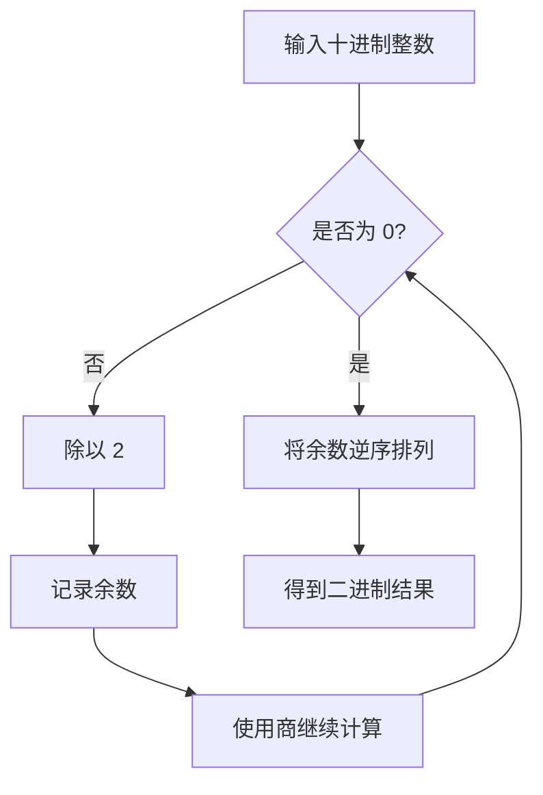

# C 语言基础

在开始一切之前，还有些知识点是我们需要了解的。

## C 语言编译与链接过程

一个 C 程序从源代码到可执行文件，通常会经历预处理、编译、汇编和链接四个阶段。像一条流水线一样，投入 `.c` 原料，最终给你一个可执行程序。


```mermaid
flowchart LR
    A["源文件 .c / 头文件 .h"] --> B["预处理"]
    B --> C["编译"]
    C --> D["汇编"]
    D --> E["链接"]
    E --> F["可执行文件"]
    F --> G["加载为进程并执行"]
```

### 过程概览

<table><thead><tr><th width="98.60015869140625">阶段</th><th width="137.7999267578125">输入</th><th width="115.20001220703125">输出</th><th>常用命令</th></tr></thead><tbody><tr><td>预处理</td><td><code>.c</code>、<code>.h</code></td><td><code>.i</code></td><td><code>gcc -E main.c -o main.i</code></td></tr><tr><td>编译</td><td><code>.i</code></td><td><code>.s</code></td><td><code>gcc -S main.i -o main.s</code></td></tr><tr><td>汇编</td><td><code>.s</code></td><td><code>.o</code></td><td><code>gcc -c main.s -o main.o</code></td></tr><tr><td>链接</td><td>一个或多个 <code>.o</code></td><td>可执行文件</td><td><code>gcc main.o -o main</code></td></tr></tbody></table>

在 Linux 中，可执行文件通常命名为 `main`；在 Windows 中，常见名称是 `main.exe`，所以 Windows 下运行程序要使用 `.\main.exe` 。

这条流水线里只有预处理阶段是 "文本替换"，后面三步才真正开始处理 C 程序。要知道的是：报错里出现 `error:` 多半是编译阶段，说明写错了什么；出现 `undefined reference` 是链接阶段，说明少写了什么。

### 一步到位还是 Step by step

平时写作业，当然一条命令就够了：

```bash
gcc main.c -o main
```

GCC 会将任务一次性跑完并清除掉中间产物以保持清爽，但工程中更常见的还是分步编译。

```shellscript
gcc -c main.c -o main.o
gcc -c math_utils.c -o math_utils.o
gcc main.o math_utils.o -o main
```

这样操作的好处显而易见，当只改了一个 `.c` 文件时，只需要重新编译它，其余 `.o` 直接复用。项目大到几百个文件后就变为 "等 3 秒" 和 "等 30 分钟" 的区别。

还有几个高频选项需要了解，他们在本书的编译命令中会反复出现：

<table><thead><tr><th width="240.60009765625">选项</th><th>作用</th></tr></thead><tbody><tr><td><code>-o file</code></td><td>指定输出文件名</td></tr><tr><td><code>-c</code></td><td>只编译到目标文件，不链接</td></tr><tr><td><code>-I dir</code></td><td>追加头文件搜索目录</td></tr><tr><td><code>-L dir</code> / <code>-l name</code></td><td>追加库搜索目录 / 链接某个库（如 <code>-lm</code> 数学库）</td></tr><tr><td><code>-Wall -Wextra -Wpedantic</code></td><td>打开警告，越早打开越省事</td></tr><tr><td><code>-g</code></td><td>保留调试信息，供 GDB 使用</td></tr><tr><td><code>-O0</code> ~ <code>-O3</code></td><td>优化级别，<code>-O0</code> 不优化便于调试，<code>-O2</code> 日常使用</td></tr></tbody></table>

> `.o` 文件不能直接运行。它里面装着机器码、符号表（函数和变量的名字及地址）和重定位信息，还缺少 "将所有名字各就各位" 的步骤 —— 链接。

### 预处理

预处理是编译器正式分析 C 代码之前的阶段。它处理以 `#` 开头的预处理指令，主要包括：

* 展开头文件
* 展开宏
* 处理条件编译
* 删除注释

执行预处理：

```bash
gcc -E main.c -o main.i
```

当打开 `main.i` 时会发现突然出现了很多我们并没有写过的代码，那就是头文件所带来的全部内容。

预处理器主要进行文本处理，不进行完整的类型检查。宏展开成功，并不代表展开后的代码一定正确。

#### 头文件展开

`#include` 会把头文件的内容插入当前源文件。它本身不是函数调用，也不会在运行时执行。

```c
#include <stdio.h>
```

预处理过程可以简化为：


```mermaid
flowchart LR
    A["include 指令"] --> B["查找头文件"]
    B --> C["插入声明、类型和宏"]
    C --> D["继续预处理"]
```

尖括号和双引号通常有不同的查找顺序：

```c
#include <stdio.h>       // 优先查找系统头文件
#include "config.h"      // 优先查找当前项目中的头文件
```

双引号形式也可以用 `-I` 追加搜索目录，例如 `gcc -I./include main.c`。

为了避免同一个头文件被重复展开，可以使用头文件保护：

```c
#ifndef CONFIG_H
#define CONFIG_H

#define BUFFER_SIZE 128

#endif
```

`#ifndef CONFIG_H`

* `#ifndef` 即为 “if not defined”，如果宏 `CONFIG_H` **没有定义**，则继续执行下面的代码。
* 第一次包含这个头文件时，`CONFIG_H` 还没有定义，所以条件成立。

`#define CONFIG_H`

* 定义一个名为 `CONFIG_H` 的宏，通常不赋值。
* 这样下次再包含这个头文件时，`CONFIG_H` 已经存在，`#ifndef` 条件就不成立，头文件内容会被跳过。

现代编译器也支持更简短的写法 `#pragma once`，但它不属于 ISO C 标准，需要跨编译器移植时仍建议使用 `#ifndef`。

#### 宏展开

宏展开可以理解为下面的过程：


```mermaid
flowchart LR
    A["C 源文件"] --> B["预处理器"]
    B --> C["展开宏"]
    C --> D["得到预处理后的 C 源码"]
    D --> E["交给编译器"]
```

宏使用 `#define` 定义：

```c
#define PI 3.1415926
#define SQUARE(x) ((x) * (x))
```

使用宏时：

```c
double area = PI * SQUARE(2.0);
// double area = 3.1415926 * ((2.0) * (2.0));
```

预处理器会把宏名替换为宏体。宏没有类型，也不会像函数一样只保证参数求值一次：

```c
#define SQUARE(x) ((x) * (x))

int i = 3;
int value = SQUARE(i++);  // i++ 可能被执行两次
```

同一个变量在一次求值中被修改两次，而两次修改之间没有确定的先后顺序，这属于**未定义行为**，结果不可预测。打开 `-Wall` 时，GCC 会直接给出提示：

```
warning: operation on 'i' may be undefined [-Wsequence-point]
```

宏还有一类常见错误来自括号。如果写成 `#define SQUARE(x) x * x`，`SQUARE(1 + 2)` 会展开成 `1 + 2 * 1 + 2`，结果是 `5` 而不是 `9`。所以宏体里的每个参数都要加括号，整个宏体也要加括号。

宏还能写成 "多行" 的，用反斜杠 `\` 续行：

```c
#define CHECK(cond)                             \
    do {                                        \
        if (!(cond)) {                          \
            printf("failed: %s\n", #cond);      \
        }                                       \
    } while (0)
```

**`#cond` 是什么意思**

宏的参数只是**一段文本**，预处理器不理解它的含义。`#` 的作用就是把这段文本原样套上双引号，变成字符串字面量，这个操作叫**字符串化**（stringize）。

两个宏对比一下就清楚了：

```c
#define CHECK(cond) printf("failed: %s\n", #cond)
#define PLAIN(cond) printf("failed: %s\n", cond)
​
CHECK(n < 0);
PLAIN(n < 0);
```

用 `gcc -E` 看，两行展开结果如下：

```
printf("failed: %s\n", "n < 0");
printf("failed: %s\n", n < 0);
```

* 加了 `#`：`n < 0` 变成了字符串 `"n < 0"`，运行时会把这条表达式原样打印出来，出错时一眼就知道是哪里的问题；
* 不加 `#`：`n < 0` 被当成表达式代入，`printf` 收到的是整数 `0` 或 `1`，而 `%s` 要的是字符串 —— 这是未定义行为，通常打印一堆乱码或者直接崩溃。

标准库里的 `assert` 就是靠 `#` 做到"报错时把表达式打出来"的：`assert(x > 0)` 失败时会打印 `Assertion 'x > 0' failed`。

**为什么外面要套 `do { ... } while (0)`**

因为宏展开后是**好几条语句**，而调用点的那个分号会插在它们后面，把 `if` 提前结束掉。看一个反例：

```c
#define BAD(x) { if (!(x)) printf("bad\n"); }
​
if (a) BAD(a); else printf("ok\n");
```

展开后是：

```c
if (a) { if (!(a)) printf("bad\n"); }; else printf("ok\n");
```

注意 `}` 后面那个分号：`if (a) { ... }` 到这里已经是一条完整语句，分号只是又补了一条空语句，于是 `else` 找不到自己的 `if` 了。GCC 的报错很直接：

```
error: 'else' without a previous 'if'
```

换成 `do { ... } while (0)` 就没这个问题：

```c
#define GOOD(x) do { if (!(x)) printf("bad\n"); } while (0)
​
if (a) GOOD(a); else printf("ok\n");
```

展开后：

```c
if (a) do { if (!(a)) printf("bad\n"); } while (0); else printf("ok\n");
```

`do ... while (0);` 整体是**一条**语句（`while (0)` 保证循环体只跑一次），分号是它自带的结尾，所以 `else` 依然能正确配对。

> 如果宏体只有一条语句，其实不需要这层包装。但只要可能写多句，就统一加上 `do { ... } while (0)` —— 这是 C 里包装多语句宏的标准写法。

预处理器还自带一批宏，调试时会起到大作用：

```c
printf("%s:%d\n", __FILE__, __LINE__);
printf("编译于 %s %s\n", __DATE__, __TIME__);
```

编译器报错时所展示的 `main.c:12:5`，就是 `__FILE__` 和 `__LINE__` ，写日志和断言时这两个宏几乎必用。

因此，简单常量可以使用宏；带参数的计算通常优先使用 `static inline` 函数：

```c
static inline int square_int(int x) {
    return x * x;
}
```

`static inline` 函数是一种结合了 `inline` 和 `static` 特性的优化工具。他们的定义如下：

* **`inline`** 提示编译器将函数体直接嵌入到调用处，减少函数调用的开销。
* **`static`** 限制函数的作用域为当前源文件，避免与其他文件中的同名函数发生冲突。

通过这种方式，编译器可以将 `square_int` 函数的代码直接嵌入到调用它的位置，从而提高性能。

#### 条件编译

预处理还有一项能力：条件编译。它能让同一份源码在不同环境下走向不同分支：

```c
#define DEBUG 1
​
#if DEBUG
    printf("x = %d\n", x);
#endif
```

配合 `-D` 选项可以在命令行直接定义宏，不必改源码：

```shellscript
gcc -DDEBUG=1 main.c -o main
```

发布版本则常用 `#ifdef NDEBUG` 关掉 `assert`。这也解释了为什么 "我本地跑得好好的" 和 "服务器上跑得不一样" 有时能同时成立 —— 两端编译时打开的宏不同。

## C 源程序

一个最小的 C 程序如下：

```c
#include <stdio.h>
int main(void) {
    printf("Hello, C!\n");
    return 0;
}
```

编译并运行：

```bash
gcc -std=c17 -Wall -Wextra -Wpedantic main.c -o main
./main
```

程序输出：

<pre><code>Hello, C!
<strong>
</strong></code></pre>

”我去，怎么多了一行出来？“

这是因为 `\n` 是**转义序列**，表示一个换行符：它在源码里写作 `\` 和 `n` 两个字符，在字符串中实际只占 1 个字节（`0x0A`）。输出到终端时，光标会跳到下一行行首。

<table><thead><tr><th width="218">程序</th><th width="315.99993896484375">输出字节（十六进制）</th><th width="79.5906982421875">字节数</th></tr></thead><tbody><tr><td><code>printf("Hello, C!\n");</code></td><td><code>48 65 6C 6C 6F 2C 20 43 21 0D 0A</code></td><td>11</td></tr><tr><td><code>printf("Hello, C!");</code></td><td><code>48 65 6C 6C 6F 2C 20 43 21</code></td><td>9</td></tr></tbody></table>

> Windows 的文本模式下，`\n` 写入文件时会自动变成 `\r\n`（`0D 0A`）两个字节；Linux 下始终是 `0A`。

所以：

* 有 `\n`：输出 **`Hello, C!` 再加一个换行**
* 没有 `\n`：输出 **只有 `Hello, C!`**，光标停在 `!` 后面不动

顺便一提常见的转义序列如下，详见附件 [**转义字符**](appendix.md#chang-yong-zhuan-yi-zi-fu)：

<table data-search="true"><thead><tr><th>转义</th><th>含义</th></tr></thead><tbody><tr><td><code>\n</code></td><td>换行</td></tr><tr><td><code>\t</code></td><td>制表符</td></tr><tr><td><code>\\</code></td><td>反斜杠本身</td></tr><tr><td><code>\"</code></td><td>双引号</td></tr><tr><td><code>\0</code></td><td>空字符，字符串结束的标志</td></tr><tr><td><code>\x41</code> / <code>\101</code></td><td>十六进制 / 八进制字符，两个都等于 <code>'A'</code></td></tr></tbody></table>

`main` 的返回值会交给操作系统：`0` 表示程序正常结束，非 `0` 表示异常退出。命令行工具和脚本常靠这个值判断上一步是否成功。

### main 的两种写法

`main` 可以带参数，也可以不带：

```c
int main(void) { ... }                      // 不接收命令行参数
int main(int argc, char *argv[]) { ... }    // 接收命令行参数
```

第二种写法里的 `argc` 是参数个数，`argv` 是参数字符串数组，将在[命令行参数](command-line.md)那一章进行讲解。

### C 源程序的结构

一个 C 程序可以由一个或多个源文件组成：

```
project/
├── main.c
├── math_utils.c
└── math_utils.h
```

每个源文件可以包含：

* 预处理指令；
* 类型定义；
* 变量声明和定义；
* 函数声明；
* 函数定义。

**需要注意：**

1. 一个可执行程序通常只能有一个 `main` 函数。
2. 一个源程序可以包含多个 `.c` 文件。
3. 一个 `.c` 文件可以定义多个函数。
4. 普通表达式语句通常以分号 `;` 结束。
5. 预处理指令以 `#` 开头，不写分号。
6. 复合语句使用花括号 `{}`，不要求在右花括号后再写分号。
7. 头文件通常放声明、类型和宏，函数实现通常放在 `.c` 文件中。

顺带一提，注释有两种写法，而且**不能嵌套**：

```c
// 单行注释
/* 多行
   注释 */
```

`/* /* */` 不会得到"嵌套注释"，而是提前结束，后面那半个 `*/` 会变成语法错误。


```c
#ifndef MATH_UTILS_H
#define MATH_UTILS_H
int add(int a, int b);
#endif
```



```c
#include "math_utils.h"
int add(int a, int b) {
    return a + b;
}
```



```c
#include <stdio.h>
#include "math_utils.h"
int main(void) {
    printf("%d\n", add(2, 3));
    return 0;
}
```


编译多个源文件：

```bash
gcc -std=c17 -Wall -Wextra -Wpedantic \
    main.c math_utils.c -o main
```

链接器会把 `main.c` 和 `math_utils.c` 生成的目标代码合并，并解析函数和变量之间的引用关系。

## 进制转换

### 为什么要有这么多进制

人类用十进制，大概是因为有十根手指；计算机用二进制，是因为电路有"通"和"断"两种状态。至于八进制和十六进制，纯粹是为了让人少写几个零。

1 位十六进制正好对应 4 位二进制，1 个字节（8 位）用两位十六进制就能写完。

```
二进制     1010 1111 0000 1101
十六进制      A    F    0    D
```

同一个数，二进制要写 16 个字符，十六进制只要 4 个。查看内存、地址和文件内容时，十六进制因此比二进制更紧凑、比十进制更直观。

**会说话的十六进制**

`0xDEADBEEF` 读作 "dead beef"，是一个 32 位的哨兵值，常被用来填充未初始化的内存。 在调试器里看到一片 `DE AD BE EF`，通常意味着这块内存从没被正确写过，而不是某个变量真的等于 3735928559。&#x20;

他们同族的还有 `0xCAFEBABE`（Java 类文件的魔数）和 `0xBAADF00D`（微软用来填充未初始化的堆内存）。 顺带一提，x86 上这四个字节在内存里是反着躺的（`EF BE AD DE`）这是字节序的原因，下一章会提到。

### 基本规则

在 `X` 进制中，每当某一位达到 `X`，就向更高位进一

<p align="center"><strong>二进制：逢 2 进 1</strong><br><strong>八进制：逢 8 进 1</strong><br><strong>十进制：逢 10 进 1</strong><br><strong>十六进制：逢 16 进 1</strong></p>

常见进制前缀：

| 进制   | C 语言写法      | 示例       |
| ---- | ----------- | -------- |
| 二进制  | `0b`，C23 支持 | `0b1010` |
| 八进制  | `0`         | `012`    |
| 十进制  | 无前缀         | `10`     |
| 十六进制 | `0x` 或 `0X` | `0xA`    |

`0b` 是 C23 才加入标准的字面量写法。GCC 和 Clang 早已把它作为扩展支持，但用本书推荐的 `-std=c17 -Wall -Wextra -Wpedantic` 编译时会出现 `warning: binary constants are a GCC extension`。想彻底避开警告，可以改用 `0x` 形式，或者把标准切到 C23。

#### 0 到 15 的对照表

这张表覆盖了二进制与十六进制互转的全部内容：

<table><thead><tr><th width="55.20001220703125">十</th><th width="96">二</th><th width="81.5999755859375">八</th><th width="74.4000244140625">十六</th><th width="77.60003662109375">十</th><th width="84.79998779296875">二</th><th width="67.20001220703125">八</th><th>十六</th></tr></thead><tbody><tr><td>0</td><td>0000</td><td>0</td><td>0</td><td>8</td><td>1000</td><td>10</td><td>8</td></tr><tr><td>1</td><td>0001</td><td>1</td><td>1</td><td>9</td><td>1001</td><td>11</td><td>9</td></tr><tr><td>2</td><td>0010</td><td>2</td><td>2</td><td>10</td><td>1010</td><td>12</td><td>A</td></tr><tr><td>3</td><td>0011</td><td>3</td><td>3</td><td>11</td><td>1011</td><td>13</td><td>B</td></tr><tr><td>4</td><td>0100</td><td>4</td><td>4</td><td>12</td><td>1100</td><td>14</td><td>C</td></tr><tr><td>5</td><td>0101</td><td>5</td><td>5</td><td>13</td><td>1101</td><td>15</td><td>D</td></tr><tr><td>6</td><td>0110</td><td>6</td><td>6</td><td>14</td><td>1110</td><td>16</td><td>E</td></tr><tr><td>7</td><td>0111</td><td>7</td><td>7</td><td>15</td><td>1111</td><td>17</td><td>F</td></tr></tbody></table>

### 其他进制转换为十进制

把每一位乘以对应的位权，再求和。一般地，一个 `n` 位数在 `R` 进制下的值可以写成

<p align="center"><span class="math">d_{n-1} \times R^{n-1} + \dots + d_1 \times R^1 + d_0 \times R^0</span></p>

**位权**就是从右往左数第 `i` 位对应的 `R^i`。记住这个公式，四种进制互转就只剩下如何分组的问题。

例如，二进制 `1010`：

<p align="center"><span class="math">1 \times 2^3 + 0 \times 2^2 + 1 \times 2^1 + 0 \times 2^0 = 10</span></p>

因此：

```
(1010)₂ = (10)₁₀
```

八位二进制（1 个字节）的位权，从左到右依次为：

```
128 64 32 16 8 4 2 1
```

十六进制的位权则是 16 的幂（`1、16、256、…`）。例如 `0x2F`：

<p align="center"><span class="math">2 \times 16^1 + 15 \times 16^0 = 32 + 15 = 47</span></p>

### 十进制转换为二进制

整数部分常用"除 2 取余，逆序排列"：


```mermaid
flowchart TD
    A["输入十进制整数"] --> B{"是否为 0?"}
    B -- "否" --> C["除以 2"]
    C --> D["记录余数"]
    D --> E["使用商继续计算"]
    E --> B
    B -- "是" --> F["将余数逆序排列"]
    F --> G["得到二进制结果"]
```

例如，十进制 `13`：

```
13 ÷ 2 = 6 ... 1
 6 ÷ 2 = 3 ... 0
 3 ÷ 2 = 1 ... 1
 1 ÷ 2 = 0 ... 1
```

从下向上读取余数：

```
(13)₁₀ = (1101)₂
```

转八进制、十六进制的方法完全一样，只是除数换成了 8 和 16。以 103 为例：

```
103 ÷ 8 = 12 ... 7
 12 ÷ 8 =  1 ... 4
  1 ÷ 8 =  0 ... 1        → (147)₈
​
103 ÷ 16 = 6 ... 7
  6 ÷ 16 = 0 ... 6        → (67)₁₆
```

小数部分则反过来，用"乘 2 取整"：把小数不断乘 2，每次取走整数部分，直到小数部分变成 0。例如 `0.625`：

```
0.625 × 2 = 1.25  → 取 1，剩 0.25
0.25  × 2 = 0.5   → 取 0，剩 0.5
0.5   × 2 = 1.0   → 取 1，剩 0
​
(0.625)₁₀ = (0.101)₂
```

顺序是从上往下读，正好和整数部分相反。也正因为这个算法不一定收敛，`0.1` 在二进制里是无限循环小数正是因为在编译器中 `0.1 + 0.2 != 0.3`。

### 二进制与八进制

二进制转换为八进制时，从右向左每三位分成一组，不足三位时在左侧补 `0`：

```
1100111
= 001 100 111
=   1   4   7
```

因此：

```
(1100111)₂ = (147)₈
```

反向转换同样简单：把每个八进制位拆成三位二进制再拼接。

```
(147)₈ = 001 100 111 = (1100111)₂
```

### 二进制与十六进制

二进制转换为十六进制时，从右向左每四位分成一组，不足四位时在左侧补 `0`：

```
1100111
= 0110 0111
=    6    7
```

因此：

```
(1100111)₂ = (67)₁₆
```

反过来，把每个十六进制位拆成四位二进制即可：

```
(67)₁₆ = 0110 0111 = (1100111)₂
```

为什么偏偏是 3 位和 4 位？

这是因为 `8 = 2³`、`16 = 2⁴`。这样分组能成立正是因为 8 和 16 都是 2 的幂。十进制就无法做到这一点，所以它和二进制互转只能老老实实做除法。

十六进制数字 `A` 到 `F` 分别表示十进制的 `10` 到 `15`：

| 十六进制 | 十进制 |
| ---- | --- |
| `A`  | 10  |
| `B`  | 11  |
| `C`  | 12  |
| `D`  | 13  |
| `E`  | 14  |
| `F`  | 15  |

**负数怎么办**

上面讨论的都是非负整数。负数在计算机里用**补码**表示，32 位下 `-1` 的位模式是 `0xFFFFFFFF`。这同样属于下一章的内容，这里先埋个引子：以后用 `%x` 打印出一个 `ffffffff`，别慌，那通常就是一个负数。

### 在 C 中读写其他进制

字面量用前缀表示（见基本规则处表），输出和解析则靠格式符与库函数：

```c
#include <stdio.h>
#include <stdlib.h>
​
int main(void) {
    int n = 0x2F;
​
    printf("%d\n", n);    // 47    十进制
    printf("%o\n", n);    // 57    八进制
    printf("%#o\n", n);   // 057   八进制，带前缀
    printf("%x\n", n);    // 2f    十六进制（小写）
    printf("%#x\n", n);   // 0x2f  十六进制，带前缀
    printf("%X\n", n);    // 2F    十六进制（大写）
​
    // 按指定进制解析字符串；base 传 0 表示自动识别 0x / 0 前缀
    printf("%ld\n", strtol("0x2F", NULL, 0));   // 47
    printf("%ld\n", strtol("147", NULL, 8));    // 103
    return 0;
}
```

要注意 `%o` 和 `%x` 输出的是无符号形式，默认不打印前缀；想带上 `0` 或 `0x`，加个 `#` 标志就行。至于二进制输出，C 标准直到 C23 才加入 `%b`，老编译器并不认 —— 想打印二进制则需要自己写个循环。
