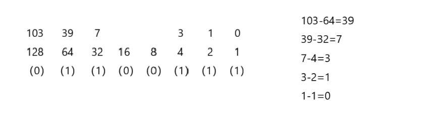

# C语言基础

## C语言编译链接过程

### 在C语言的编译链接中，分为以下四个阶段：

<p align="center">​ 源文件( *.c源文件/ *.h头文件 )</p>

<p align="center">​ 预编译( *.i预编译文件 ) gcc -E main.c -o main.i</p>

<p align="center">​ 编 译( *.s汇编文件 )(从上到下) gcc -S main.i -o main.s</p>

<p align="center">​ 汇 编( *.o/ *.obj二进制目标文件 ) gcc -c main.s -o main.o</p>

<p align="center">​ 链 接( *.exe可执行文件 ) gcc -o main.o -o main</p>

<p align="center">​ 执 行 --> 进程(从main函数开始)</p>

其中每一步都十分重要，不可或缺，接下来的部分是对每一步的详细解释

#### **预编译（Preprocessing）**

命令：`gcc -E main.c -o main.i`

作用是处理源代码中的预处理指令，生成预处理后的文本文件（`.i`）。

具体操作包括展开所有 `#include`头文件（将头文件内容插入当前文件）、处理所有 `#define`宏定义（替换宏名与宏体，删除`#define`指令）、删除注释（`//`或`/*...*/`）、处理条件编译指令（如`#if`、`#elif`、`#else`、`#endif`，保留满足条件的代码）。输出文件为`main.i`（纯文本，保留 C 语法结构，但已展开预处理内容）。



```c
#include<stdio.h>
#define PI 3.14
int main(){
    int pi = PI;
    printf("hello Linux");
    return 0;
}
```



```c
//...
# 959 "/usr/include/stdio.h" 3 4
extern int __uflow (FILE *);
extern int __overflow (FILE *, int);
# 983 "/usr/include/stdio.h" 3 4

# 2 "main.c" 2

# 3 "main.c"
int main(){
 int pi = 3.14;
 printf("hello Linux");
 return 0;
}
```


#### **编译（Compilation）**

命令：`gcc -S main.i -o main.s`

作用是将预处理后的`.i`文件转化为汇编代码（`.s`）。

具体操作包括对代码进行语法分析（检查语法错误）、语义分析（检查逻辑合理性，如变量未定义）、进行代码优化（如常量折叠、死代码删除，可通过`-O[0-3]`选项控制优化级别，`-O0`无优化，`-O3`为最高优化，优化后程序运行更快但编译时间更长）、将高级 C 语法转化为对应架构的汇编指令（如 x86、ARM 汇编）。输出文件为`main.s`（汇编语言文本，包含 CPU 可理解的低级指令）。

<figure><figcaption></figcaption></figure>

#### **汇编（Assembly）**

命令：`gcc -c main.s -o main.o`（也可直接对`.c`文件执行：`gcc -c main.c -o main.o` 或 `gcc -c main.c`，跳过手动预编译和编译步骤）

作用是将汇编代码（`.s`）转化为机器码（二进制指令），生成目标文件（`.o`）。具体操作是汇编器（`as`）将每条汇编指令翻译为对应 CPU 的二进制机器码，生成目标文件（`.o`，Linux 下为 ELF 格式，Windows 下为 COFF 格式），包含二进制指令、数据、符号表（变量 / 函数名与地址的映射）等信息。目标文件是单个源代码编译后的二进制文件，不可独立执行；与之相关的还有静态库（`.a`，Linux）/（`.lib`，Windows）—— 多个目标文件的归档文件，链接时会被完整复制到可执行程序中，优点是可执行程序独立运行，缺点是体积大、更新需重新编译；以及动态库（`.so`，Linux）/（`.dll`，Windows）—— 链接时仅记录库文件的引用，运行时由操作系统动态加载，优点是体积小、更新方便，缺点是依赖库文件存在。

<figure><figcaption></figcaption></figure>

#### **链接（Linking）**

命令：`gcc main.o -o main`（Linux 生成`main`，Windows 生成`main.exe`）

作用是将多个目标文件（`.o`）及所需库文件（静态库或动态库）合并，生成可执行程序。具体操作包括符号解析（将不同目标文件中的符号如函数调用、变量引用与实际地址关联，例如`main.o`中调用的`add()`函数在`add.o`中定义，链接器需找到其地址）、重定位（调整目标文件中指令的地址，目标文件中地址为相对地址，链接后需转为绝对地址，确保 CPU 能正确寻址）、合并代码段与数据段（将多个目标文件的代码和数据合并为统一的段）。链接时可通过`-L<dir>`指定库文件搜索路径，`-l<lib>`指定需链接的库（如`-lm`表示链接数学库`libm.so`）。输出文件为可执行程序（Linux 为 ELF 格式，Windows 为 PE 格式，可直接被操作系统加载执行）。

<figure><figcaption></figcaption></figure>

#### **多文件编译**

当程序包含多个源代码文件（如`main.c`、`add.c`、`max.c`）时，可通过以下方式编译：

分步编译 + 链接（推荐，适合大型项目）：

```bash
gcc -c main.c -o main.o    # 编译main.c为main.o，可添加-Wall显示所有警告信息（如未使用变量、类型不匹配）辅助排查问题
gcc -c add.c -o add.o      # 编译add.c为add.o，添加-g可在目标文件中加入调试信息，支持gdb调试
gcc -c max.c -o max.o      # 编译max.c为max.o，-I<dir>可指定头文件搜索路径（如`-I./include`）
gcc main.o add.o max.o -o main  # 链接所有目标文件生成可执行程序main
```

一步编译（适合小型项目，GCC 自动完成预编译→编译→汇编→链接）：

<figure><figcaption></figcaption></figure>

```bash
gcc -o main main.c add.c max.c  # 直接生成可执行程序main
```

不同平台存在一定差异：可执行文件格式上，Linux 为 ELF（Executable and Linkable Format），Windows 为 PE（Portable Executable）；删除目标文件时，Linux 使用`rm *.o`，Windows（CMD）使用`del *.o`，PowerShell 使用`Remove-Item *.o`。

## C程序样式

以下是一个经典的 C 语言入门示例程序 ——"Hello World" 程序。这段代码虽简短，却完整展示了 C 程序的基本结构，包含注释、预编译处理指令、主函数、执行语句及返回值等核心组成部分，是初学者理解 C 语言程序运行逻辑的基础范例。

```c
//hello.c                      //注释 /* */不允许嵌套使用
#include <stdio.h>             //预编译处理
int main(void)                 //主函数 程序入口
{
    printf("Hello World");     //语句
    return 0;
}
```

## C源程序结构特点

一个 C 程序可以由一个或多个源文件（通常以`.c`为后缀）组成；每个源文件可以由一个或多个函数组成，且一个完整的 C 程序**必须且只能有一个`main`函数**（作为程序入口）；每一个声明或语句必须以`;`结尾；标识符与关键字、标识符与标识符之间，无需强制使用空格间隔，若存在括号、逗号、分号等**明显分隔符**，或语法上已能明确区分（如关键字后接括号），则可省略空格。

## 进制转换

进制的核心逻辑可概括为 “逢 X 进 1”，即 X 进制下，计数达到 X 时向高位进位。

非十进制（二进制、八进制、十六进制）向十进制转换的通用规则是按位权展开求和。此处的 **“位权”** 指每一位数字对应的权重，以基数（进制数）的幂次表示，从右向左依次为基数的 0 次方、1 次方、2 次方…… 例如二进制转十进制时，基数为 2，对二进制数 1010 展开计算：最右侧第一位（0）对应 2⁰，即 0×2⁰=0；第二位（1）对应 2¹，即 1×2¹=2；第三位（0）对应 2²，即 0×2²=0；第四位（1）对应 2³，即 1×2³=8；累加后得 0+2+0+8=10，即二进制 1010 对应十进制 10。二进制常用位权值（从高位到低位）为 128、64、32、16、8、4、2、1，可直接用于快速计算。

十进制向其他进制转换的逻辑因目标进制而异。转换为二进制时，通常采用 “**贪心思想**”：从大于当前十进制数的最小二进制位权开始，依次判断该位权是否小于等于剩余数值，若是则在对应位置记为 1 并减去该位权，否则记为 0，重复操作直至剩余数值为 0，最终拼接所有标记位即得二进制数。

<figure><figcaption></figcaption></figure>

转换为八进制时，可先将十进制数转为二进制，再对二进制数从右向左每 3 位划分为一组，若最左侧分组不足 3 位则在左侧补 0；每组二进制数对应一个八进制数（0-7），拼接后即得结果。例如二进制 **001100111** 可分为 **001**、**100**、**111** 三组，分别对应 1、4、7，即八进制 147。

转换为十六进制的逻辑与八进制类似，同样先转为二进制后按每 4 位一组划分（不足 4 位左侧补 0），每组对应一个十六进制数（0-9 对应 0-9，10-15 对应 A-F）。例如二进制 01100111 可分为 0110、0111 两组，分别对应 6、7，即十六进制 67。

下一章，我们将真正的踏上C语言的学习路程，希望一路走来我们皆有所获！

