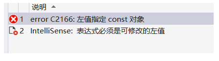

# 常量

### 字面常量

- 字面意思是啥就是啥，看其表示就可以知道其 值和类型。
- 有值无名，一般用来初始化变量，与一种字符相关联。

```c
#include <stdio.h>
int main()
{
	10;//int型数字10
	'c';//char型字符c
	"Hello world!";//字符串常量（！C语言无字符串类型）
	
	int sum=10+20;//10,20为字面常量可直接用
	int a=10;//与一种字符相关联
	
	return 0;
}
```

### 宏常量 

- 用 #define 定义的宏常量,定义的标识符不占内存,只是临时的符号,预编译后不存在

```c
eg. #define PI 3.14
//标识符一般大写

#include <stdio.h>
#define Age 21
int main()
{
	printf("%d\n",Age);
	int x = Age;//可当作常量赋值
	printf("%d\n",x);
	return 0;
}
//21
//21
//请按任意键继续...
```

- 宏可在任何位置出现，但只在宏定义及其往后才可用
- 宏 一旦定义好，不可再程序中修改。若要修改只用改#define后面的值，提升了代码的可维护性

### 常变量

C语言中,把用const修饰的变量称为常变量

常变量具有常量属性,不可被直接修改(可间接修改)

```c
#include <stdio.h>
const int y = 200;//全局常变量
int main()
{
	const int x = 100;//也可写成：int const x = 100;局部常变量
	x = 200;//error！
	
	return 0;
}

const int len = 10;
int arr[len] = {1,2,3,4,5,6,7,8,9,10};//c语言不支持,c++支持

//C语言中,const后可以不初始化,c++不行
```



### 枚举常量

枚举即一一列举

```c
#include <stdio.h>
enum color//自定义类型-->枚举类型
{
	Yellow,//枚举常量
	Black,
	Green,
	Orange
};
int main()
{
	enum color a;
    a  = Yellow;//Yellow在此为常量
	return 0;	
}
```

### **字符常量和字符串常量**

#### ASCII码表（部分，详见附件）

ASCII (American Standard Code for Information Interchange)是美国信息交换标准代码，基于拉丁字母的一套电脑编码系统，主要用于显示现代英语和其他西欧语言。它是最通用的信息交换标准，并等同于国际标准 ISO/IEC 646。ASCII第一次以规范标准的类型发表是在1967年，最后一次更新则是在1986年，到目前为止共定义了128个字符。

其中**0～31及127(共33个)是控制字符或通信专用字符（其余为可显示字符）**，如控制符LF(换行)、CR(回车)、FF(换页)、DEL(删除)、BS(退格)、BEL(响铃)等；又如通信专用字符SOH（文头）、EOT（文尾）、ACK（确认）等；

| Bin(二进制) | Oct(八进制) | Dec(十进制) | Hex(十六进制) | 缩写/字符                   | 解释         |
| ----------- | ----------- | ----------- | ------------- | --------------------------- | ------------ |
| 0000 0000   | 00          | **0**       | 0x00          | NUL(null)                   | 空字符       |
| 0000 0001   | 01          | 1           | 0x01          | SOH(start of headline)      | 标题开始     |
| 0000 0011   | 03          | 3           | 0x03          | ETX (end of text)           | 正文结束     |
| …… | …… | …… | …… | …… | …… |
| 0100 0000   | 0100        | 64          | 0x40          | @                           | 电子邮件符号 |
| 0100 0001   | 0101        | **65**      | 0x41          | A                           | 大写字母A    |
| 0100 0100   | 0104        | 68          | 0x44          | D                           | 大写字母D    |
| …… | …… | …… | …… | …… | …… |
| 0101 1010   | 0132        | 90          | 0x5A          | Z                           | 大写字母Z    |
| 0101 1011   | 0133        | 91          | 0x5B          | [                           | 开方括号     |
| 0101 1100   | 0134        | 92          | 0x5C          | \                           | 反斜杠       |
| 0101 1101   | 0135        | 93          | 0x5D          | ]                           | 闭方括号     |
| 0101 1110   | 0136        | 94          | 0x5E          | ^                           | 脱字符       |
| 0101 1111   | 0137        | 95          | 0x5F          | _                           | 下划线       |
| 0110 0000   | 0140        | 96          | 0x60          | `                           | 开单引号     |
| 0110 0001   | 0141        | **97**      | 0x61          | a                           | 小写字母a    |
| 0110 0011   | 0143        | 99          | 0x63          | c                           | 小写字母c    |
| 0110 0100   | 0144        | 100         | 0x64          | d                           | 小写字母d    |
| 0110 0101   | 0145        | 101         | 0x65          | e                           | 小写字母e    |
| ……          | ……          | …………        | ……            | ……                          | ……           |

#### 字符常量	

' , " 被称为定界符,

' 是字符的定界符:'a' --> 97

" 是字符串的定界符:"a" --> 97 \0

```c	
char ch = 'a';
printf("%d %c",ch,ch);//97 a
```

#### 转义字符

字母前加" \ "来表示常见的那些不能显示的ASCII字符，如\0,\t,\n等，因为后面的字符都不是它本来的ASCII字符意思,称为转义字符

| 转义字符 | 意义                                | ASCII码值（十进制） |
| -------- | ----------------------------------- | ------------------- |
| \a       | 响铃(BEL)                           | 007                 |
| \b       | 退格(BS) ，将当前位置移到前一列     | 008                 |
| \f       | 换页(FF)，将当前位置移到下页开头    | 012                 |
| \n       | 换行(LF) ，将当前位置移到下一行开头 | 010                 |
| \r       | 回车(CR) ，将当前位置移到本行开头   | 013                 |
| \t       | 水平制表(HT) （跳到下一个TAB位置）  | 009                 |
| \v       | 垂直制表(VT)                        | 011                 |
| \ \      | 代表一个反斜线字符" \ "             | 092                 |
| \ '      | 代表一个单引号（撇号）字符          | 039                 |
| \ "      | 代表一个双引号字符                  | 034                 |
| \?       | 代表一个问号                        | 063                 |
| \0       | 空字符(NUL)                         | 000                 |
| \ddd     | 1到3位八进制数所代表的任意字符      | 三位八进制          |
| \xhh     | 十六进制所代表的任意字符            | 十六进制            |

#### 字符串

```c
char str[6] = {"hello"};//h e l l o \0
int len = strlen(str);//5
int size = sizeof(str);//6
```
