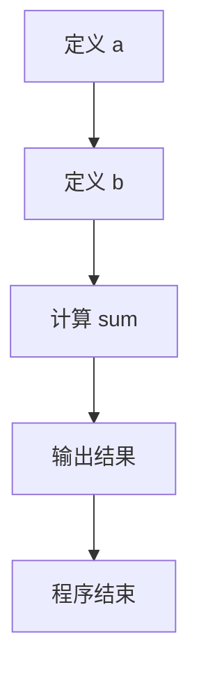
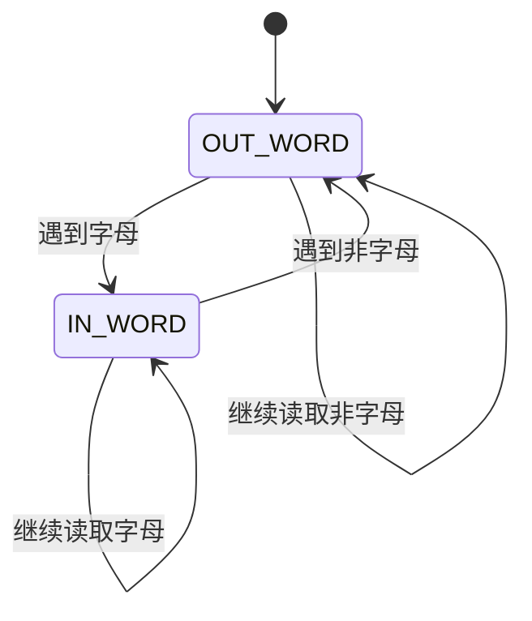
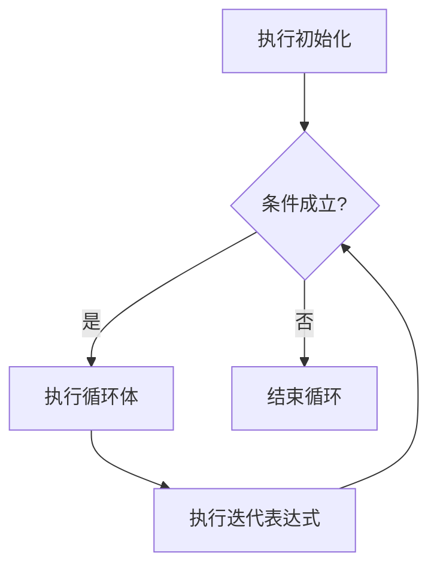
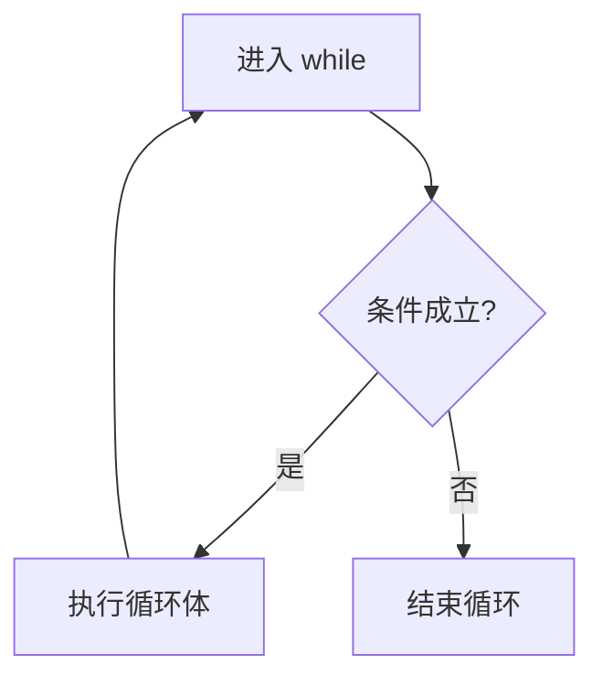
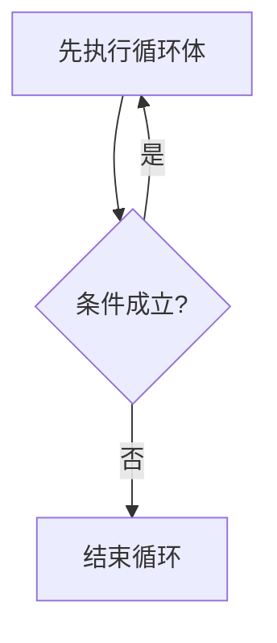
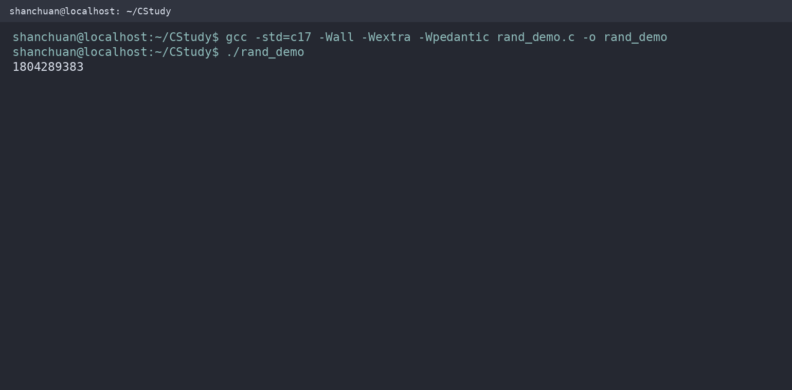
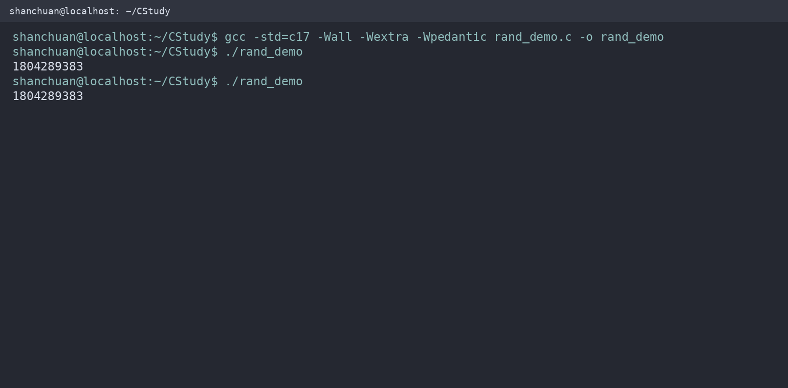
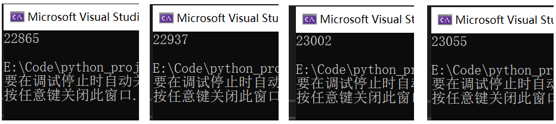

# 控制语句，随机数

C 语言常见的控制流结构包括：

* 顺序结构：按照代码书写顺序执行；
* 选择结构：根据条件选择执行路径；
* 循环结构：重复执行一段代码；
* 跳转语句：直接跳转到指定位置。

## 顺序结构

顺序结构是最基本的执行方式。程序从上到下依次执行每条语句：

```c
#include <stdio.h>
​
int main(void)
{
    int a = 10;
    int b = 20;
    int sum = a + b;
​
    printf("%d + %d = %d\n", a, b, sum);
​
    return 0;
}
```

程序会按照下面的顺序执行：



## 空语句

只有一个分号的语句称为空语句：

```c
;
```

空语句不执行任何操作，但它仍然是一条完整的 C 语句。有时它用于表示“这里故意什么也不做”，但更多时候是多写了一个分号。

### 多余分号导致的错误

```c
#include <stdio.h>

int main(void)
{
    int age = 20;
    double salary = 5000.0;

    if (age >= 60);  // 这个分号已经结束了 if 语句

    {
        salary *= 1.2;
    }

    printf("%.2f\n", salary);

    return 0;
}
```

上面的代码等价于：

```c
if (age >= 60)
{
    ;
}

salary *= 1.2;
```

因此，无论 `age` 是否达到 60 岁，`salary *= 1.2` 都会执行。

正确写法：

```c
if (age >= 60)
{
    salary *= 1.2;
}
```

建议给 `if`、`for` 和 `while` 始终使用花括号。这样不仅更容易阅读，也能避免多余分号和后续扩展代码造成的问题。

## 选择语句

选择语句根据条件表达式的结果，决定是否执行某段代码。

在 C 语言中：

* 表达式结果为 `0`，表示假；
* 表达式结果不为 `0`，表示真。

```c
if (0)
{
    printf("不会执行\n");
}

if (1)
{
    printf("会执行\n");
}
```

### `if` 语句

#### 单分支 `if`

语法：

```c
if (表达式)
{
    语句;
}
```

当表达式的值不为 `0` 时，执行花括号中的代码；当表达式的值为 `0` 时，跳过这段代码。

```c
#include <stdio.h>

int main(void)
{
    int age;

    printf("请输入你的年龄：");

    if (scanf("%d", &age) != 1)
    {
        printf("输入格式错误。\n");
        return 1;
    }

    if (age >= 18)
    {
        printf("你已经成年。\n");
    }

    return 0;
}
```

#### 双分支 `if...else`

语法：

```c
if (表达式)
{
    语句 1;
}
else
{
    语句 2;
}
```

表达式为真时执行 `if` 分支，否则执行 `else` 分支。

```c
#include <stdio.h>

int main(void)
{
    int age;

    printf("请输入你的年龄：");

    if (scanf("%d", &age) != 1)
    {
        printf("输入格式错误。\n");
        return 1;
    }

    if (age >= 18)
    {
        printf("成年\n");
    }
    else
    {
        printf("未成年\n");
    }

    return 0;
}
```

#### 多分支 `if...else if...else`

语法：

```c
if (表达式 1)
{
    语句 1;
}
else if (表达式 2)
{
    语句 2;
}
else
{
    语句 3;
}
```

程序从上到下依次判断条件。只要某个条件成立，就执行对应分支，然后结束整个 `if` 结构，后面的条件不会继续判断。

```c
#include <stdio.h>

int main(void)
{
    int age;

    printf("请输入年龄：");

    if (scanf("%d", &age) != 1)
    {
        printf("输入格式错误。\n");
        return 1;
    }

    if (age < 0)
    {
        printf("年龄不能为负数。\n");
    }
    else if (age <= 12)
    {
        printf("童年\n");
    }
    else if (age < 18)
    {
        printf("青少年\n");
    }
    else if (age < 60)
    {
        printf("成年\n");
    }
    else
    {
        printf("老年\n");
    }

    return 0;
}
```

#### `if` 中的赋值错误

下面的代码很容易写错：

```c
if (value = 1)
{
    printf("条件成立\n");
}
```

这里的 `=` 是赋值运算符，代码会先把 `1` 赋给 `value`，然后使用表达式结果 `1` 作为条件，因此条件总是成立。

如果要进行比较，应使用 `==`：

```c
if (value == 1)
{
    printf("value 等于 1\n");
}
```

编译时打开警告可以帮助发现这类问题：

```bash
gcc -Wall -Wextra -Wpedantic main.c -o main
```

### `switch` 语句

当一个表达式需要与多个固定整数值进行比较时，可以使用 `switch`。

语法：

```c
switch (整数表达式)
{
case 常量表达式 1:
    语句;
    break;

case 常量表达式 2:
    语句;
    break;

default:
    语句;
    break;
}
```

使用 `switch` 时需要注意：

1. `switch` 表达式的类型通常为整数、字符或枚举类型。
2. `case` 后面必须是整数常量表达式。
3. 不同 `case` 的值不能重复。
4. `break` 用于退出整个 `switch`。
5. 如果没有匹配的 `case`，则执行 `default`。
6. 如果缺少 `break`，程序会继续执行下一个 `case`，这叫作“贯穿”或“穿透”。

#### 星期示例

```c
#include <stdio.h>
​
int main(void)
{
    int day;
​
    printf("请输入数字 1～7：");
​
    if (scanf("%d", &day) != 1)
    {
        printf("输入格式错误。\n");
        return 1;
    }
​
    switch (day)
    {
    case 1:
        printf("星期一\n");
        break;
​
    case 2:
        printf("星期二\n");
        break;
​
    case 3:
        printf("星期三\n");
        break;
​
    case 4:
        printf("星期四\n");
        break;
​
    case 5:
        printf("星期五\n");
        break;
​
    case 6:
        printf("星期六\n");
        break;
​
    case 7:
        printf("星期日\n");
        break;
​
    default:
        printf("输入错误，请输入 1～7。\n");
        break;
    }
​
    return 0;
}
```

#### `case` 穿透

下面的代码故意省略了第一个 `break`：

```c
#include <stdio.h>

int main(void)
{
    int grade = 2;

    switch (grade)
    {
    case 1:
        printf("优秀\n");

    case 2:
        printf("良好\n");
        break;

    default:
        printf("其他等级\n");
        break;
    }

    return 0;
}
```

当 `grade` 为 `1` 时，程序会先输出“优秀”，然后继续执行 `case 2`，再次输出“良好”。

如果穿透是有意设计的，建议添加注释：

```c
case 1:
    printf("优秀\n");
    /* 继续执行 case 2 */

case 2:
    printf("良好\n");
    break;
```

如果不是有意设计的，就应补上 `break`。

## 有限状态机

有限状态机（Finite State Machine，FSM）是一种把程序行为划分为若干状态，并根据输入在状态之间切换的模型。

有限状态机通常包含：

* 一组有限的状态；
* 当前状态；
* 输入事件；
* 状态转换规则；
* 每个状态对应的处理逻辑。



下面的程序统计字符串中包含多少个单词：

```c
#include <ctype.h>
#include <stdio.h>

enum State
{
    OUT_WORD,
    IN_WORD
};

int main(void)
{
    const char text[] = "hello world from c";
    enum State state = OUT_WORD;
    int word_count = 0;

    for (int i = 0; text[i] != '\0'; ++i)
    {
        if (isalpha((unsigned char)text[i]))
        {
            if (state == OUT_WORD)
            {
                ++word_count;
                state = IN_WORD;
            }
        }
        else
        {
            state = OUT_WORD;
        }
    }

    printf("单词数量：%d\n", word_count);

    return 0;
}
```

输出：

```
单词数量：4
```

使用 `isalpha` 时，建议将字符转换为 `unsigned char`，这样可以避免某些平台上负值字符导致未定义行为。

## 循环语句

循环语句用于重复执行一段代码。只要循环条件成立，循环体就会继续执行。

常见循环语句包括：

* `for`
* `while`
* `do...while`

### `for` 循环

语法：

```c
for (初始化表达式; 条件表达式; 迭代表达式)
{
    循环体;
}
```

执行顺序如下：

1. 执行初始化表达式，只执行一次；
2. 判断条件表达式；
3. 条件为真，执行循环体；
4. 执行迭代表达式；
5. 回到第 2 步；
6. 条件为假，结束循环。



#### 遍历数组

```c
#include <stdio.h>

int main(void)
{
    int numbers[] = {1, 2, 3, 4, 5};
    int length = sizeof(numbers) / sizeof(numbers[0]);

    for (int i = 0; i < length; ++i)
    {
        printf("%d ", numbers[i]);
    }

    printf("\n");

    return 0;
}
```

输出：

```
1 2 3 4 5
```

`for` 循环的三个部分都可以省略：

```c
for (;;)
{
    // 无限循环
}
```

虽然三个表达式都可以省略，但两个分号不能省略。

### `break`

`break` 用于立即终止当前所在的循环或 `switch` 语句。

```c
#include <stdio.h>

int main(void)
{
    for (int i = 1; i <= 10; ++i)
    {
        if (i == 5)
        {
            break;
        }

        printf("%d ", i);
    }

    return 0;
}
```

输出：

```
1 2 3 4
```

`break` 终止的是整个循环，而不是当前这一次循环。

### `continue`

`continue` 用于结束本次循环，直接进入下一轮循环。

```c
#include <stdio.h>

int main(void)
{
    for (int i = 1; i <= 10; ++i)
    {
        if (i == 5)
        {
            continue;
        }

        printf("%d ", i);
    }

    return 0;
}
```

输出：

```
1 2 3 4 6 7 8 9 10
```

在 `for` 循环中，执行 `continue` 后会先执行迭代表达式，再判断下一轮条件。

### `while` 循环

语法：

```c
while (条件表达式)
{
    循环体;
}
```

`while` 是先判断、后执行的循环。如果条件一开始就是假，循环体一次也不会执行。



#### 输出 1～10

```c
#include <stdio.h>

int main(void)
{
    int i = 1;

    while (i <= 10)
    {
        printf("%d ", i);
        ++i;
    }

    printf("\n");

    return 0;
}
```

循环体中必须有能够改变条件的语句，否则可能产生无限循环：

```c
int i = 1;

while (i <= 10)
{
    printf("%d\n", i);
    // 忘记写 i++，循环将一直执行
}
```

#### `while` 中使用 `break`

```c
#include <stdio.h>

int main(void)
{
    int i = 1;

    while (i <= 10)
    {
        if (i == 5)
        {
            break;
        }

        printf("%d ", i);
        ++i;
    }

    return 0;
}
```

输出：

```
1 2 3 4
```

#### `while` 中使用 `continue`

使用 `continue` 时，要确保下一轮循环能够继续推进。

错误示例：

```c
int i = 1;

while (i <= 10)
{
    if (i == 5)
    {
        continue;  // i 不再增加，程序会一直停在 i == 5
    }

    printf("%d ", i);
    ++i;
}
```

当 `i` 等于 `5` 时，程序不断执行 `continue`，而 `++i` 永远不会执行，因此形成死循环。

正确写法：

```c
#include <stdio.h>

int main(void)
{
    int i = 1;

    while (i <= 10)
    {
        if (i == 5)
        {
            ++i;
            continue;
        }

        printf("%d ", i);
        ++i;
    }

    return 0;
}
```

### `do...while` 循环

语法：

```c
do
{
    循环体;
}
while (条件表达式);
```

`do...while` 是先执行、后判断的循环，因此循环体至少执行一次。



#### 基本示例

```c
#include <stdio.h>

int main(void)
{
    int choice;

    do
    {
        printf("请输入 0 退出：");
        scanf("%d", &choice);
    }
    while (choice != 0);

    printf("程序结束。\n");

    return 0;
}
```

#### `do...while` 中使用 `break`

```c
#include <stdio.h>

int main(void)
{
    int i = 1;

    do
    {
        if (i == 5)
        {
            break;
        }

        printf("%d ", i);
        ++i;
    }
    while (i <= 10);

    return 0;
}
```

输出：

```
1 2 3 4
```

#### `do...while` 中使用 `continue`

在 `do...while` 中，执行 `continue` 后会直接跳到条件判断位置，而不是执行循环体末尾的其他语句。

下面的代码会造成死循环：

```c
int i = 1;

do
{
    if (i == 5)
    {
        continue;  // 直接跳到 while 条件判断
    }

    printf("%d ", i);
    ++i;
}
while (i <= 10);
```

当 `i` 等于 `5` 时，`continue` 会跳过 `++i`，然后再次判断 `i <= 10`。由于 `i` 仍然是 `5`，程序会反复执行同一过程。

正确写法：

```c
#include <stdio.h>

int main(void)
{
    int i = 1;

    do
    {
        if (i == 5)
        {
            ++i;
            continue;
        }

        printf("%d ", i);
        ++i;
    }
    while (i <= 10);

    return 0;
}
```

## `goto` 语句

`goto` 可以无条件跳转到当前函数中的指定标签。

语法：

```c
goto 标签;

/* 其他代码 */

标签:
    语句;
```

示例：

```c
#include <stdio.h>

int main(void)
{
    int value = 0;

retry:
    printf("请输入一个非负整数：");

    if (scanf("%d", &value) != 1)
    {
        printf("输入格式错误。\n");
        return 1;
    }

    if (value < 0)
    {
        printf("输入不能为负数，请重新输入。\n");
        goto retry;
    }

    printf("输入有效：%d\n", value);

    return 0;
}
```

虽然 `goto` 可以实现跳转，但普通业务逻辑通常更适合使用循环和函数。滥用 `goto` 会让程序的执行路径变得难以追踪。

### `goto` 的使用规则

* `goto` 只能跳转到当前函数中的标签，不能跨函数跳转。
* 标签属于独立的标签命名空间，与变量、函数等普通标识符不冲突。
* 同一个函数中的标签名称不能重复。
* 标签后面必须跟一条语句，即使这条语句为空也可以。

```c
void example(void)
{
    goto end;
​
end:
    ;
}
```

下面的写法是错误的，因为标签 `label3` 位于另一个函数中：

```c
void test1(void)
{
    goto label3;  // 错误：不能跨函数跳转
}
​
void test2(void)
{
label3:
    ;
}
```

### `goto` 与变量作用域

C 语言中，`goto` 不能跳入变长数组等具有特殊存储要求的变量作用域：

```c
void example(int n)
{
    goto label;
​
    int array[n];  // 变长数组
​
label:
    ;
}
```

这类跳转会违反 C 语言的作用域和存储规则。实际编程时，不要使用 `goto` 跳入尚未正常进入的代码块。

## 随机数

### **`rand()` 函数**

C 语言可以使用 `<stdlib.h>` 中的 `rand` 函数生成伪随机数。

```
int rand(void);
```

`rand()` 返回一个位于 `0` 到 `RAND_MAX` 之间的整数：

```c
#include <stdio.h>
#include <stdlib.h>
int main(void)
{
    int value = rand();
    printf("%d\n", value);
    return 0;
}
```

`RAND_MAX` 是 `<stdlib.h>` 中定义的宏。C 标准只规定它至少为 `32767`，具体值由编译器实现决定。

<figure><figcaption></figcaption></figure>

​ 再运行几次，会发现每次产生的随机数都一样

<figure><figcaption></figcaption></figure>

​实际上，`rand()` 生成的是伪随机数，而不是真正意义上的随机数。它根据一个初始种子，通过确定的算法生成数字序列。如果每次运行程序时种子相同，就会得到相同的数字序列。这种可重复性有时反而很有用，例如调试程序或编写测试代码。

​种子在每次启动计算机时是随机的，但是一旦计算机启动以后它就不再变化了；也就是说，每次启动计算机以后，种子就是定值了，所以根据公式推算出来的结果（也就是生成的随机数）就是固定的。

### **`srand()` 函数**&#x20;

`srand` 通常使用当前时间作为种子，用于给 `rand()`函数设定种子。

```c
void srand(unsigned int seed);
```

​它需要一个 `unsigned int` 类型的参数。实际开发中，可以用时间作为参数，只要每次播种的时间不同，那么生成的种子就不同，最终的随机数也就不同。 ​ 使用 `<time.h>` 头文件中的 `time()` 函数即可得到当前的时间（精确到秒)：`srand((unsigned)time(NULL));`

对上面的代码进行修改，生成随机数之前先进行播种：

```c
#include <stdio.h>
#include <stdlib.h>
#include <time.h>
int main() {
    int a;
    srand((unsigned)time(NULL));
    a = rand();
    printf("%d\n", a);
    return 0;
}
```

<figure><figcaption></figcaption></figure>

多次运行程序，会发现每次生成的随机数都不一样了。但是，这些随机数会有逐渐增大或者逐渐减小的趋势，这是因为我们以时间为种子，时间是逐渐增大的，结合上面的正态分布图，很容易推断出随机数也会逐渐增大或者减小。

完整程序中通常只调用一次 `srand`，而不是每次调用 `rand` 前都重新设置种子。需要注意，`time(NULL)` 的精度通常是秒。如果程序在同一秒内连续启动多次，仍然可能得到相同的随机序列。

### **生成一定范围内的随机数**

实际开发中，我们往往需要一定范围内的随机数，过大或者过小都不符合要求，那么，如何产生一定范围的随机数呢？

可以利用取模的方法：生成 `0` 到 `9` 的随机数：

```c
int value = rand() % 10;
```

生成 `min` 到 `max` 范围内的随机数：

```c
int value = rand() % (max - min + 1) + min;
```

例如，生成 `13` 到 `63` 之间的随机数：

```c
int value = rand() % 51 + 13;
```

```
rand() % 51      得到 0～50
rand() % 51 + 13 得到 13～63
```

取模即取余，`rand()%51+13` 可以看成两部分： `rand()%51`是产生 0\~50 的随机数，后面的加 13 保证 a 最小只能是 13，最大就是 50+13=63。

最后给出产生 13\~63 范围内随机数的完整代码：

```c
#include <stdio.h>
#include <stdlib.h>
#include <time.h>
int main(){
    int a;
    srand((unsigned)time(NULL));
    a = rand() % 51 + 13;
    printf("%d\n",a);
    return 0;
}
```
