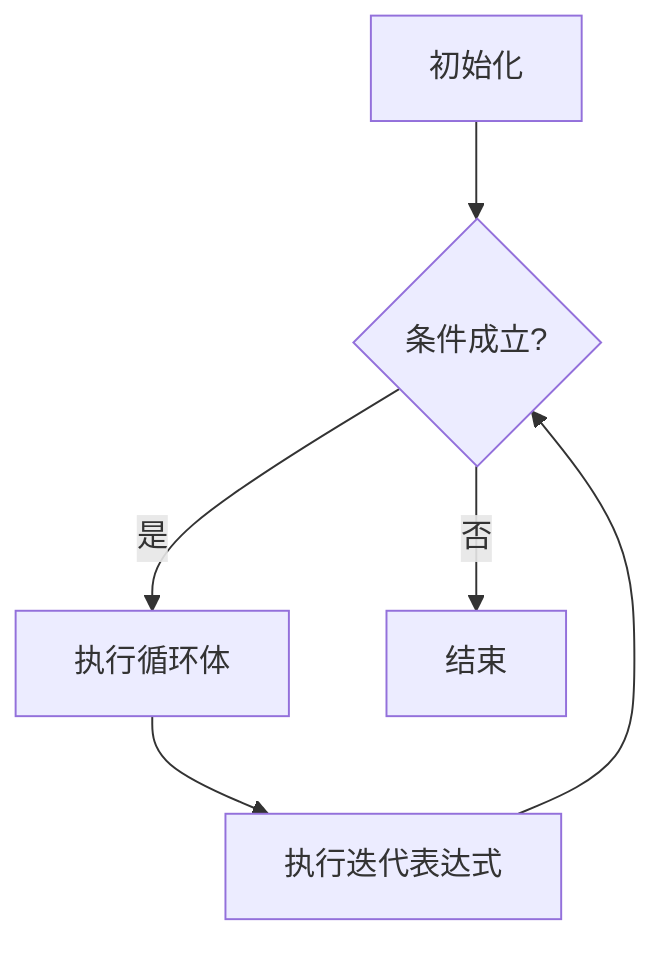
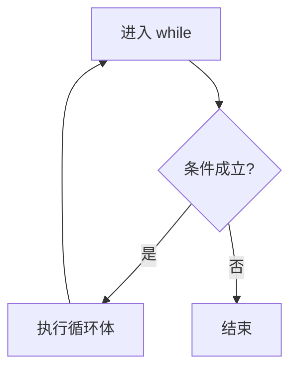
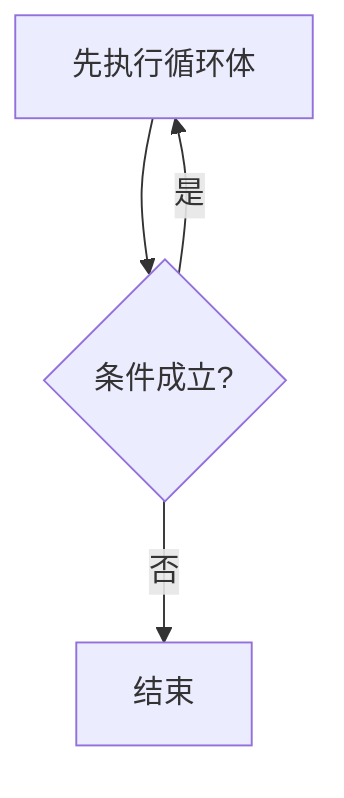
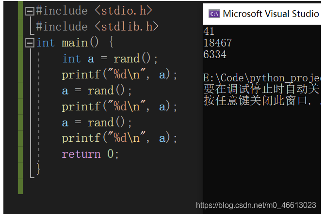
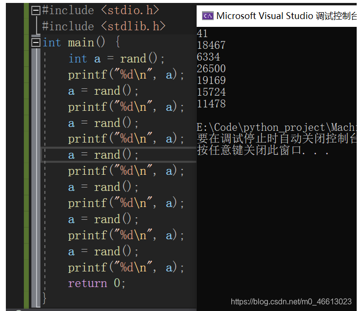

# 控制语句，随机数

### 顺序语句

按语句出现的先后次序依次执行

### 选择语句

根据条件判断是否执行相关语句

#### if语句

##### 0. 空语句

```c
int main(void)
{
    int age = 0;
    double sa = 5000;
    scanf("%d",&age);
    //error
    if(age>=60);//空语句成为if的第一条语句,改变了if语句的结构
    {
        sa *= 1.2; 
    }
    //等价于
    if(age>=60)
    {
        ;
    }
    sa *= 1.2; 
    //right
    if(age>=60)
    {
        sa *= 1.2; 
    }
}
```

##### 1. 单分支

if(表达式)  执行语句;

```c
#include <stdio.h>
int main(void) {
	int age = 0;
	printf("请输入你的年龄:>");
	scanf("%d", &age);
	if (age >= 18)  //当if括号内表达式为真时（即非0），才会执行紧接if的第一条语句
		printf("成年\n");
	return 0;
}
//18
//成年
```

##### 2. 双分支

if(表达式) 执行语句1;
else 执行语句2;

```c
#include <stdio.h>
int main(void) {
	int age = 0;
	printf("请输入你的年龄:>");
	scanf("%d", &age);
	if (age >= 18)  //当if括号内表达式为真则执行下面第一条语句
		printf("成年\n");
	else   //当上面表达式都不匹配时，则匹配else,执行else下面第一条语句
		printf("未成年\n");
	return 0;
}
```

##### 3. 多分支

if(表达式1) 执行语句1; 

else if(表达式2) 执行语句2;
else 执行语句3;

```c
//根据用户输入年龄，输出所处年龄段
#include <stdio.h>
int main(void) {
	int age = 0;
	printf("请输入你的年龄:>");
	scanf("%d", &age);
	if (age <= 12)   //当if表达式为真，输出童年并退出整个if语句,否则继续向下判断
	{
		printf("童年\n");
	}
	else if (age < 18)  //当年龄大于12小于18此表达式为真，输出青少年，
	{
		printf("青少年\n");
	}
	else if (age < 60) //当年龄大于等于18小于60此表达式为真，输出壮年，
	{
		printf("壮年\n");
	}
	else      //当上面多个表达式都不匹配时最后会匹配else对应语句，即输出老年
	{
		printf("老年\n");
	}
	return 0;
}
```

#### switch语句

switch(整形表达式)
{
  case 整数常量表达式1 :
   语句1_1
   语句1_2
   [break]
   …
  case 整数常量表达式2 :
   语句2_1
   语句2_2
   …
   [break]
      …
  default
   语句n_1
   [break]
}

**说明**

- 当case后面常量表达式值**等于**switch的整数表达式时，执行该case后面的语句，**但不退出switch**,而是一直执行下去，直到整个switch结束，**所以case只是switch的入口**，**这跟if匹配到某个表达式执行对应语句后就退出不一样**
- case后面的**常量表达式的值不能相同**，例如出现多个 case 1
- **在switch中遇到break会退出整个switch**
- **当switch的整数表达式与所有case都没匹配上时，则执行default对应语句**

```c
//当用户输入1-7时输出对应星期几
#include <stdio.h>
int main()
{
    int day = 0;
    printf("请输入今天是星期几：>  ");
    scanf("%d", &day);
    switch (day)   
    {
    case 1:       
        printf("星期一\n");
        break;  //遇到break跳出对应switch
    case 2:
        printf("星期二\n");
        break;
    case 3:
        printf("星期三\n");
        break;
    case 4:
        printf("星期四\n");
        break;
    case 5:
        printf("星期五\n");
        break;
    case 6:
        printf("星期六\n");
        break;
    case 7:
        printf("星期天\n");
        break;
    default:
        printf("输入错误，请输入1-7范围内的数字\n");
        break;
    }
    return 0;
}
//注意case穿透
```

- 有限状态机

```c
#include <stdbool.h>
#include <stdio.h>
char c;
#define BEGIN 0
#define IN_WORD 1
#define OUT_WORD 2
int main(void) {
	char str[] = "hello world";
	int sum = 0;
	int state = BEGIN;
	for(int i = 0;str[i]!='\0';i++){
		switch(state){
			case BEGIN:
				if(isalpha(str[i]))
					state = IN_WORD;
				else
					state = OUT_WORD;
				break;
			case IN_WORD:
				if (!isalpha(str[i])) {
					sum += 1;
					state = OUT_WORD;
				}
				break;
			case OUT_WORD:
				if (isalpha(str[i])) {
					state = IN_WORD;
				}
				break;
		}
	}
	if(state == IN_WORD)
		sum += 1;
	printf("%d\n", sum);
	return 0;
}
```

### 循环语句

当条件成立时,重复执行某些语句
#### for

for(表达式1;表达式2;表达式3)
  循环语句;



```c
//输出数组所有元素
#include <stdio.h>
int main() {
	int arr[] = {1,2,3,4,5,6,7,8,9,10};
	int i;
	//第一次循环首先将i初始化为0，这个初始化部分只会执行1次,此时i<10(只有判断条件为真才会进入循环)
	//执行循环语句输出arr[0]，然后进入调整部分让变量i加1,此时i=1；
	//第二次循环，首先进入判断部分进入判断；此时i<10 即 1<10为真，执行循环语句输出arr[1],然后进入调整部分
	//让变量i+1，此时i=2；后续循环跟第二次循环类似
	//注意：初始化部分在整个for循环只执行1次，判断部分会比循环语句多1次
	for (i = 0; i < 10; i++) 
	{
		printf("%d ", arr[i]);
	}
	return 0;
}
//for (; ;)无限循环，分号不能省略  
```

**break：循环中遇到break直接\*终止整个循环\*（while、do while中也一样）**

```c
//在1-10中输出小于5的数 
#include <stdio.h>
int main()
{
	int i = 0;
	for (i = 1; i <= 10; i++)
	{
		if (i == 5) //当i == 5时，if条件为真，执行break，跳出整个for循环，所以数字5及后续数字不会打印
			break;
		printf("%d ", i);
	}
	return 0;
}
```

**continue：循环中遇到continue会\*终止本次循环\*，也就是本次循环continue后面代码不会执行（while、do while中也一样）**

```c
#include <stdio.h>
int main()
{
	int i = 0;
	for (i = 1; i <= 10; i++)
	{
		if (i == 5) //当i == 5时，if条件为真，执行continue，终止本次循环后面代码（即5不会打印）。直接跳到调整部分，i++后i为6，进行下一次循环的判断
			continue;
		printf("%d ", i);
	}
	return 0;
}
```

#### while

while(表达式)
  循环语句



```c
//输出1-10
#include <stdio.h>
int main()
{
	int i = 1;
	while (i <= 10) //当表达式为真执行里面{ }内循环语句
	{
		printf("%d ", i);  
		i++;   //调整部分，使i变量逐渐大于10后终止循环，没有调整部分将会是死循环
	}
	return 0;
}
```

break

```c
//输出1-4
#include <stdio.h>
int main()
{
	int i = 1;
	while (i <= 10) //当表达式为真执行里面{ }内循环语句
	{
		if (i == 5) //当i==5时执行break,终止整个while循环
			break;
		printf("%d ", i);  
		i++;  
	}
	return 0;
}
```

continue

```c
#include <stdio.h>
int main()
{
	int i = 1;
	while (i <= 10) //当表达式为真执行里面{ }内循环语句
	{
		if (i == 5) //当i==5时执行continue,终止本地循环continue后面部分，i++不会执行，所以进入判断部分i还是5，导致死循环
			continue;
		printf("%d ", i);  
		i++;   //调整部分，使i变量逐渐大于10后终止循环，没有调整部分将会是死循环
	}
	return 0;
}
```

#### do while

do
  循环语句
while(表达式)



```c
#include <stdio.h>
int main()
{
	
	do
	{
		printf("哈哈哈\n");
	} while (0); //第一次循环时输出 哈哈哈,由于表达式为假，退出do while循环
	return 0;
}
```

break

```c
//输出1-4
#include <stdio.h>
int main()
{
	int i = 1;
	do
	{
		if (i == 5)
			break;
		printf("%d ", i);
		i++;
	} while (i <= 10); 
	return 0;
}
```

continue

```c
#include <stdio.h>
int main()
{
	int i = 1;
	do
	{
		if (i == 5) //当i=5时表达式为真，执行continue,直接到判断部分，此时i<=10进入循环语句，但i=5时表达式为真，执行continue,直接到判断部分依此类推，程序陷入死循环
			continue;
		printf("%d ", i);
		i++;
	} while (i <= 10); 
	return 0;
}
```

#### goto

标号：
  语句；

if(表达式)
  goto 标签;

标签：表达需要跳转的位置
goto 标签：跳到哪个标签去

```c
//当用户输入 博主是个大帅哥 就会输出 你也是大帅哥 退出程序，否则死循环
#include <stdio.h>
#include <string.h>
int main()
{
	char input[20];
	printf("请输入：博主是个大帅哥，否则程序死循环\n");
	again: //使用 again标记需要跳转位置
		scanf("%s", input);
		if (strcmp(input,"博主是个大帅哥") == 0) //strcmp() 字符串比较函数，当为0代表两个字符串相等
		{
			printf("你也是个大帅哥\n");
		}
		else
		{
			printf("你说谎，请重新输入：>");
			goto again; //跳转到again标号对应位置
		}
		return 0;
}
```

**goto使用注意事项**

- goto不能跨函数，指定的标签必须位于当前函数中，所有标签为内部命名空间的成员，因此不会干扰其他标识符

- goto跳转到标签位置的范围内不能有任何变量的初始化，除非该变量作用域不与标签作用域相同

  ```c
  例1
  void test1()
  {
  		printf("-test1-");
          goto label3; // 错误，goto不能跨越函数
  label1:
  		printf("-label1-");
  label2:
          printf("-label2-");
  }
  
  void test2()
  {
          printf("-test2-");
  label3:
          printf("-label3-");
  label4:
          printf("-label4-");
  }
  
  例2
  void test1()
  {
  		printf("-test1-");
          goto label2;
  label1:
  		printf("-label1-");
  label2:
          printf("-label2-");
  }
  
  void test2()
  {
          printf("-test2-");
  label2:
          printf("-test2() label2-");
  label3:
          printf("-label3-");
  label4:
          printf("-label4-");
  }
  /* test1函数中label2标签与test2函数中label2标签不冲突，因为标签为内部命名空间的成员，作用域只在当前函数 */
  
  例3
  void test1()
  {
          printf("-test1-");
          goto label2;
          int i; // 正确
  label1:
          printf("-label1-");
          int j = 2; // 错误，不允许对变量初始化
  label2:
          printf("-label2-");
  }
  
  void test1()
  {
          printf("-test1-");
          goto label2;
          int i; // 正确
  label1:
          printf("-label1-");
  		{
  			int j = 2; // 正确，通过大括号将变量j作用域与标签相隔离
  		}
  label2:
          printf("-label2-");
  }
  ```


### 随机数

1. **rand() 函数**

   在C语言中，我们一般使用 <stdlib.h> 头文件中的 rand() 函数来生成随机数，它的用法为：`int rand (void);`

​	rand() 会随机生成一个位于 0 ~ RAND_MAX 之间的整数。
​	RAND_MAX 是 <stdlib.h> 头文件中的一个宏，它用来指明 rand( ) 所能返回的随机数的最大值。C语言标准并没有规定 RAND_MAX 的具体数值，只是规定它的值至少为 32767。在实际编程中，我们也不需要知道 RAND_MAX 的具体值，把它当做一个很大的数来对待即可。



​	再运行几次，会发现每次产生的随机数都一样



​	实际上，rand() 函数产生的随机数是伪随机数，是根据一个数值按照某个公式推算出来的，这个数值我们称之为“种子”。种子和随机数之间的关系是一种正态分布。

​	种子在每次启动计算机时是随机的，但是一旦计算机启动以后它就不再变化了；也就是说，每次启动计算机以后，种子就是定值了，所以根据公式推算出来的结果（也就是生成的随机数）就是固定的。

2. **srand() 函数**
   srand()函数用于给rand()函数设定种子。srand() 的用法为`void srand (unsigned int seed);`

​	它需要一个 unsigned int 类型的参数。实际开发中，可以用时间作为参数，只要每次播种的时间不同，那么生成的种子就不同，最终的随机数也就不同。
​	使用 <time.h> 头文件中的 time() 函数即可得到当前的时间（精确到秒)：`srand((unsigned)time(NULL));`

对上面的代码进行修改，生成随机数之前先进行播种：

```c
#include <stdio.h>
#include <stdlib.h>
#include <time.h>
int main() {
    int a;
    srand((unsigned)time(NULL));
    a = rand();
    printf("%d\n", a);
    return 0;
}
```

	

多次运行程序，会发现每次生成的随机数都不一样了。但是，这些随机数会有逐渐增大或者逐渐减小的趋势，这是因为我们以时间为种子，时间是逐渐增大的，结合上面的正态分布图，很容易推断出随机数也会逐渐增大或者减小。

3. **生成一定范围内的随机数**
   实际开发中，我们往往需要一定范围内的随机数，过大或者过小都不符合要求，那么，如何产生一定范围的随机数呢？可以利用取模的方法：

   `int a = rand() % 10; //产生0~9的随机数，注意10会被整除`

​	如果要规定上下限：

​	`int a = rand() % 51 + 13; //产生13~63的随机数`

​	分析：取模即取余，rand()%51+13可以看成两部分：	rand()%51是产生 0~50 的随机数，后面+13保证 a 最小只能是 13，最大就是 50+13=63。

最后给出产生 13~63 范围内随机数的完整代码：

```c
#include <stdio.h>
#include <stdlib.h>
#include <time.h>
int main(){
    int a;
    srand((unsigned)time(NULL));
    a = rand() % 51 + 13;
    printf("%d\n",a);
    return 0;
}
```
