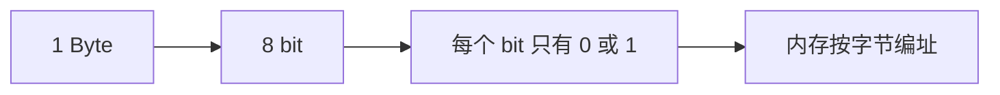

# 数据类型

字节(Byte)作为存储容量的计量单位，由八位二进制位 (bit) 构成，即 `1 Byte = 8 bits`。它是内存寻址的基本单位。基本数据类型分为整型、浮点型和其他特殊类型。可以使用`sizeof( )`计算变量或数据类型大小。

**整形**

<table data-search="false"><thead><tr><th width="411.60009765625">数据类型</th><th width="344.5999755859375">数据大小</th></tr></thead><tbody><tr><td>char</td><td>1</td></tr><tr><td>short</td><td>2</td></tr><tr><td>int</td><td>4</td></tr><tr><td>long int</td><td>4</td></tr><tr><td>iong long</td><td>8</td></tr></tbody></table>

如果没有注明，则默认为有符号整型，若是声明为 unsigned 则表示为无符号整型，只能表示大于0的数据。

**浮点型**

| 数据类型        | 数据大小               |
| ----------- | ------------------ |
| float       | 4                  |
| double      | 8                  |
| long double | 8 (vs2019)/12(dev) |

C语言在设置浮点型数据时本身就带符号，因此用unsigned声明会被认为是一种无效的修饰方案。

**bool类型(c99后引入)**：0代表false,1代表true，只有true和false两种,0代表假,非0代表真，.cpp 文件可直接应用, .c 文件需要引入`stdbool.h`头文件

**void空类型/无类型**：不允许定义变量

## 数值范围

整数的二进制表示方式分为原码、反码、补码3种。正数的原码反码补码都相同，例如3的原反补码都是00000011。

负数则需要注意，直接将数值按照正负数的形式翻译成⼆进制得到的就是原码。 将原码的符号位不变，其他位依次按位取反就可以得到反码。反码经过加一就得到了补码。如-3的原反补码依次为10000011，11111100 ，11111101。在这里不对另一种求补码方式进行介绍。

字节与存储单位转换如下所示：



对于数据类型的表示范围，可以看作为一个循环。以char类型为例，当数值从0（0000 0000）增加到127（0111 1111）后，继续加一会引起符号位改变，数据位置零，从而让数值变为-128（1000 0000），随着数值继续增长，当达到-1（1111 1111）时又因为加一变为1 0000 0000，又因为char类型为1字节8位，因此数据变为0（0000 0000）。


```c
// 危险：死循环！
int main() {
	for (char i = 0; i < 128; i++) {
		printf("%d ", i);
	}
	return 0;
}
```

数据将在127的时候重新回到-128，因此永远无法达到循环的退出条件。倘若是`unsigned char`类型，则他的符号位也为数值位，从0（0000 0000）开始直到255（1111 1111）。

<table><thead><tr><th width="186.4000244140625">数据类型</th><th width="84.199951171875">位数</th><th width="241.4000244140625">十进制取值范围</th><th>十六进制范围</th></tr></thead><tbody><tr><td><strong>signed char</strong></td><td>8 位</td><td>-128 ~ 127</td><td>0x80 ~ 0x7F</td></tr><tr><td><strong>unsigned char</strong></td><td>8 位</td><td>0 ~ 255</td><td>0x00 ~ 0xFF</td></tr><tr><td><strong>short / signed short</strong></td><td>16 位</td><td>-32768 ~ 32767</td><td>0x8000 ~ 0x7FFF</td></tr><tr><td><strong>unsigned short</strong></td><td>16 位</td><td>0 ~ 65535</td><td>0x0000 ~ 0xFFFF</td></tr><tr><td><strong>int / signed int</strong></td><td>32 位</td><td>-2147483648 ~ 2147483647</td><td>0x80000000 ~ 0x7FFFFFFF</td></tr><tr><td><strong>unsigned int</strong></td><td>32 位</td><td>0 ~ 4294967295</td><td>0x00000000 ~ 0xFFFFFFFF</td></tr><tr><td><strong>long / signed long</strong></td><td>32 位</td><td>-2147483648 ~ 2147483647</td><td>0x80000000 ~ 0x7FFFFFFF</td></tr><tr><td><strong>unsigned long</strong></td><td>32 位</td><td>0 ~ 4294967295</td><td>0x00000000 ~ 0xFFFFFFFF</td></tr><tr><td><strong>long long</strong></td><td>64 位</td><td>-9223372036854775808 ~ 9223372036854775807</td><td>0x8000000000000000 ~ 0x7FFFFFFFFFFFFFFF</td></tr><tr><td><strong>unsigned long long</strong></td><td>64 位</td><td>0 ~ 18446744073709551615</td><td>0x0000000000000000 ~ 0xFFFFFFFFFFFFFFFF</td></tr></tbody></table>

在C语言`<limits.h>`库中定义了各种**整数类型的取值范围**，包括 _char_、_short_、_int_、_long_ 和 _long long_ 等类型的**最大值**与**最小值**（见附件）。保证各平台上程序的可移植性和安全性。

## 存储方式

在计算机中，数据是以补码的形式存储的，这是因为在补码中，+0 和 -0 的表示相同，均为 _00000000_，避免了原码和反码中零的重复表示问题，节省了存储空间。补码将减法转化为加法，硬件只需实现加法器即可完成加减运算。例如5 + (-3) 的补码运算： 00000101 (+5) + 11111101 (-3) = 00000010 (+2)，因为补码的符号位也参与运算，所以无需额外判断正负号。

### 大小端存储模式

“大端（Big-endian）” 与 “小端（Little-endian）” 的概念，最早由计算机科学家 Danny Cohen 在 1980 年的经典论文《[ON HOLY WARS AND A PLEA FOR PEACE](https://facstaff.bloomu.edu/rmontant/readings/ien137.Cohen-Holy_Wars.html)》中正式提出，术语源自《格列佛游记》中围绕 “从鸡蛋的大端还是小端敲开” 引发的争端，用以代指计算机领域多字节数据的两种字节排列规则。

两种字节序的出现，本质是计算机硬件体系结构设计的必然结果。计算机系统的内存以 **字节（8bit）** 为最小寻址单位，每个内存地址对应 1 个字节；但在 C 语言等编程语言中，存在 16bit 的 short、32bit 的 int、64bit 的 long 等多字节数据类型，同时 16 位及以上的处理器，其寄存器宽度、运算位宽均大于 1 个字节。当一个多字节数据存入连续的内存地址时，必然需要明确 “字节的排列顺序”，也就是高位字节和低位字节分别对应内存的低地址还是高地址，这就是大小端之分的核心来源。

早期计算机的内存与 CPU 之间通过双向总线进行数据读写，数据的字节顺序直接决定了读写的正确性。在计算机发展初期，大端字节序是行业更广泛采用的方案，其核心逻辑是**最高有效位（MSB，数据权重最高的字节）存储在内存的低地址，最低有效位（LSB，数据权重最低的字节）存储在内存的高地址**。这种排列方式与人类读写数字 “从高位到低位” 的习惯完全一致，更容易理解和调试，也能通过内存首个字节快速判断数据的正负与量级。

而小端字节序的设计逻辑则完全贴合 CPU 的运算特性：**最低有效位存储在内存的低地址，最高有效位存储在内存的高地址**。CPU 执行加减乘除等算术运算时，通常从数据的最低位开始计算进位，小端模式下可以直接从低地址读取数据启动运算，无需额外的字节顺序转换，硬件实现更简单、运算效率更高；同时小端模式对部分类型转换更友好，例如将 32 位 int 强制转换为 16 位 short 时，直接读取低地址的 2 个字节即可得到正确的低位数值，无需计算地址偏移。例如 x86 架构处理器全线采用小端字节序，PowerPC、早期的 Motorola 68000 系列则采用大端字节序，这也使得跨架构、跨系统的数据交换，必须优先解决字节序兼容问题。

我们有以下代码作为参考：

```c
int main() {
	short a = 0x1234;
	int b = 0x12345678;
}
```


示例代码中的 2 字节 short 类型、4 字节 int 类型变量，就有存储顺序的问题，按照不同的存储顺序，可以将其分为大端字节序存储和小端字节序存储。


大端存储是指数据的低位字节保存在内存的高地址中，而数据的高位字节，保存在内存的低地址中。小端存储是指数据的低位字节保存在内存的低地址中，而数据的高位字节，保存在内存的高地址中。

从示例的内存窗口可以看到，变量的高位字节存储在内存的高地址、低位字节存储在内存的低地址，完全符合小端字节序的规则，因此可以判断该处理器（我们常用的 X86 结构）存储方式为小端存储。

## 变量的扩充和截取

变量的扩充与截取，是C语言中**不同字节长度的整型数值**在赋值、运算时发生的核心类型转换行为，属于C语言赋值类型转换与隐式类型转换的核心场景。该规则仅针对char、short、int、long等基本数值类型生效，结构体、联合体、指针等非基本类型不支持该自动转换规则。

### 变量的截取

当**长字节的整型数据，赋值给短字节的整型变量**时，编译器会自动执行截取操作：丢弃长数据的高位字节，仅保留与目标变量字节数匹配的**低位字节**，将其赋值给短变量。该过程可自动隐式执行，也可通过强制类型转换显式完成。

截取仅以**目标变量的字节长度**为依据，仅保留数值的低位对应字节，高位字节全部丢弃；截取仅处理字节层面的截断，不考虑数值的正负、大小，可能导致数值发生改变（甚至正负反转）；该行为与系统的大小端存储模式无关，截取的是数值本身的低位字节，而非内存地址的低地址字节。

```c
int main() {
    // 示例1：4字节int赋值给1字节char
    int a = 0x1234; 		// 4字节int，二进制：00000000 00000000 00010010 00110100
    char ch = a;     		// 1字节char，仅截取低1字节：00110100（即0x34）
    printf("ch = %d\n", ch);
    // 示例2：4字节int赋值给2字节short、1字节char
    int x = 0x123456A8; 	// 4字节int，二进制：00010010 00110100 01010110 10101000
    short a_short = x;   	// 2字节short，截取低2字节：01010110 10101000（即0x56A8）
    char b_char = x;     	// 1字节char，截取低1字节：10101000（即0xA8）
    printf("a_short = %d, b_char = %d\n", a_short, b_char);
    // 示例3：显式强制类型转换的截取
    int ia = 0x12345678;
    char ch2 = (char)ia; 	// 显式强制转换，效果与隐式截取一致，取低1字节0x78
    short sa = (short)ia; 	// 取低2字节0x5678
    printf("ch2 = %d, sa = %d\n", ch2, sa);
    return 0;
}
```

```
ch = 52
a_short = 22184, b_char = -88
ch2 = 120, sa = 22136
```

截取操作可能导致数据溢出、数值失真，例如将大于char取值范围的int值赋值给char，会丢失高位信息，最终数值与原数值差异极大，开发中需谨慎使用，建议仅在明确需要低位字节时使用。

### 变量的扩充

当**短字节的整型数据，赋值给长字节的整型变量**、或短字节类型参与运算时，编译器会自动将短字节数据扩展为长字节长度，该过程称为扩充（也叫整型提升）。核心分为**符号扩展**和**零扩展**两种规则，由原数据的类型（有符号signed/无符号unsigned）决定。

| 原数据类型                      | 扩展规则 | 执行逻辑                                                        |
| -------------------------- | ---- | ----------------------------------------------------------- |
| 有符号整型（signed char/short）   | 符号扩展 | 高位补充的字节，全部填充原数据的**符号位**（正数符号位为0，负数符号位为1），保证扩展前后数值的正负、大小完全不变 |
| 无符号整型（unsigned char/short） | 零扩展  | 高位补充的字节，全部填充0，仅保留原数据的有效数值位                                  |

```c
int main() {
    // 示例1：有符号正数的符号扩展
    char a1 = 5;        		// 1字节有符号char，二进制：0000 0101（符号位为0）
    short x1 = a1;      		// 扩展为2字节short，高位补符号位0：00000000 00000101
    printf("x1 = %d\n", x1); 	// 输出5，数值不变
    // 示例2：有符号负数的符号扩展
    char a2 = -5;       		// 1字节有符号char，补码二进制：1111 1011（符号位为1）
    short x2 = a2;      		// 扩展为2字节short，高位补符号位1：11111111 11111011
    printf("x2 = %d\n", x2); 	// 输出-5，数值不变
    // 示例3：无符号数的零扩展（正数）
    unsigned char a3 = 5; 		// 1字节无符号char，二进制：0000 0101
    short x3 = a3;         		// 扩展为2字节short，高位补0：00000000 00000101
    printf("x3 = %d\n", x3);
    // 示例4：无符号数的零扩展（高位为1的数值）
    unsigned char a4 = 251; 	// 1字节无符号char，二进制：1111 1011
    short x4 = a4;           	// 扩展为2字节short，高位补0：00000000 11111011
    printf("x4 = %d\n", x4); 	// 输出251，而非负数
    return 0;
}
```

```
x1 = 5
x2 = -5
x3 = 5
x4 = 251
```

整型提升不仅发生在赋值场景，也会在算术运算中自动执行：char、short类型参与运算时，会先自动提升为int类型，再进行运算，避免运算过程中溢出；扩展操作完全保留原数据的数值，不会发生数据失真，是C语言的安全类型转换行为。

### 相关类型转换的注意事项

**类型相容前提**：扩充与截取的自动转换，仅针对char、short、int、long、unsigned系列、float、double等基本算术类型生效；结构体、联合体、枚举、不同类型的指针，不属于类型相容的范畴，无法自动转换。

```c
// 错误示例1：不同结构体即使成员一致，也无法直接赋值
struct Student {
    char s_name[20];
    int s_age;
};
struct Person {
    char s_name[20];
    int s_age;
};
int main() {
    struct Student s1 = { "shanchuan", 23 };
    struct Person p1 = { "bunianjiu", 12 };
    s1 = p1; // 编译报错，类型不相容，无法自动转换
    // 错误示例2：不同类型的指针无法直接赋值
    char ch = 'a';
    int a = 10;
    char* cp = &ch;
    int* ip = &a;
    cp = ip; // waring “=”: 从“int *”到“char *”的类型不兼容
    ip = cp; // waring “=”: 从“char *”到“int *”的类型不兼容
    // 指针需通过强制类型转换显式转换
    cp = (char*)ip;
    ip = (int*)cp;
}
```


**显式强制转换**：无论是扩充还是截取，都可以通过`(目标类型)数据`的方式显式执行强制类型转换，效果与隐式转换一致，同时可以消除编译器的类型转换警告。

### 隐式转换的规则

既然不同数据类型的变量参与表达式运算时会发生隐式转换，那为什么不直接将所有数据类型都转换为表达式中最大的那个类型？从性能和空间角度看，这是一种既浪费时间资源又浪费空间资源的做法。C 编译器的隐式转换规则如下所述：

**低字节数据类型向高字节数据类型转换**：这是隐式转换的核心规则，取参与表达式运算的所有变量中**最大的数据类型**作为标准，其他变量的数据类型都自动隐式转换为该标准类型。

示例 1：表达式 `a（char类型） + b（int类型）` 中，最大类型是 int，因此 char 类型的 a 会被转换为 int 类型后再参与运算。

示例 2：表达式 `a（char类型） + b（int类型） + c（float类型）` 中，最大类型是 float，因此 char 类型的 a 和 int 类型的 b 都会被转换为 float 类型后再参与运算。

混合运算中，类型转换优先级从低到高为：char/short、int、unsigned int、long long、unsigned long long、double，转换后再进行运算，结果为高精度类型。

**有符号数向无符号数转换**：当表达式中同时存在有符号数（如 signed int）和无符号数（如 unsigned int）时，有符号数会隐式转换为对应的无符号数类型。但当操作数为char或short时，无论是不是有符号类型，均转化为int。

**整型类型向浮点数类型转换**：当一个表达式中同时出现整数类型（如 char、short、int、long）和浮点数类型（如 float、double）的数据时，整型数据会隐式转换为浮点数类型。该规则本质上是 “低字节向高字节转换” 的特例，因实际开发中极为常见，故单独说明。

> 需要注意的是，IDE 对 `sizeof(int)` 表达式的**类型推导提示**为`(unsigned int)4U`，所以在比较的时候需要注意隐式类型转化。

有如下例子可以很清楚的讲明白其中的内容

```c
int main() {
    // char + char
    char a = 100;       // 二进制：0110 0100，值：100
    char b = 200;       // 超出 char 范围(-128~127)，实际存补码：1100 1000（值：-56）
    char c = a + b;     // 运算时先提升为 int，结果 44，赋值给 char 截断后仍为 44
    printf("c = %d, a+b = %d\n\n", c, a + b); // 输出：c = 44, a+b = 44
    // (unsigned char)c + uc
    char c1 = -128;         // 二进制：1000 0000（有符号 char，值：-128）
    unsigned char uc1 = 128;// 二进制：1000 0000（无符号 char，值：128）
    unsigned short us1;
    us1 = (unsigned char)c1 + uc1;
    // 1. (unsigned char)c1：1字节强转1字节，二进制不变，值变为 128
    // 2. 整数提升：两个 1字节 扩成 int（高位补0）
    // 3. 相加：128 + 128 = 256
    // 4. 赋值：256 存入 unsigned short（无溢出）
    printf("us1(hex) = %x\n\n", us1); // 输出：us1(hex) = 100
    // (unsigned short)c + uc
    char c2 = -128;         // 二进制：1000 0000（有符号 char，值：-128）
    unsigned char uc2 = 128;// 二进制：1000 0000（无符号 char，值：128）
    unsigned short us2;
    us2 = (unsigned short)c2 + uc2;
    // 1. (unsigned short)c2：有符号 char 转 2字节 unsigned short
    //    规则：原来有符号 扩展补符号位（1）
    //    1字节 1000 0000 2字节 1111 1111 1000 0000（值：65408）
    // 2. uc2 提升：无符号 char 扩成 int（高位补0） 128
    // 3. 相加：65408 + 128 = 65536
    // 4. 赋值：65536 超出 unsigned short 最大值(65535) 截断低16位 → 0
    printf("us2(hex) = %x\n\n", us2); // 输出：us2(hex) = 0
    return 0;
}
```

## 浮点数的存储与比较

`float` 和 `double` 用二进制科学计数法保存实数。以常见的 IEEE 754 单精度为例，一个 `float` 有 1 位符号、8 位指数和 23 位有效小数位。指数采用偏置值 127 保存，因此位模式并不是把小数点“挪到内存里”那么简单。

```c
#include <stdint.h>
#include <stdio.h>
#include <string.h>

int main(void) {
    float x = 13.25f;
    uint32_t bits;
    memcpy(&bits, &x, sizeof bits);
    printf("x = %.2f\\n", x);
    printf("bits = 0x%08x\\n", bits);
    printf("sign=%u exponent=%u fraction=0x%06x\\n",
           bits >> 31, (bits >> 23) & 0xffu, bits & 0x7fffffu);
}
```

这里用 `memcpy` 读取对象表示，避免通过不兼容的指针类型直接解引用。浮点数比较也要留出误差：

```c
#include <math.h>
int nearly_equal(double a, double b, double eps) {
    return fabs(a - b) <= eps * fmax(1.0, fmax(fabs(a), fabs(b)));
}
```

不要用 `a == b` 判断两个计算结果是否“数学上相等”，除非你明确知道它们来自同一条无舍入误差的路径。金额、计数和文件大小优先使用整数；浮点数适合测量值、几何计算和统计结果。


