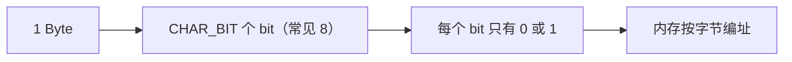

# 数据类型

## 字节、位与基本类型

字节（byte）是 C 语言定义的可寻址存储单位，具体包含多少 bit 由实现通过 `<limits.h>` 的 `CHAR_BIT`  指定；现代常见平台通常是 8 bit，但可移植代码不能直接写死这个假设。基本数据类型分为整型、浮点型和其他特殊类型。可以使用 `sizeof` 计算对象或类型占用多少个 byte。


```mermaid
flowchart LR
    B["1 Byte"] --> C["CHAR_BIT 个 bit（常见 8）"]
    C --> D["每个 bit 只有 0 或 1"]
    D --> E["内存按字节编址"]
```

`sizeof` 返回对象或类型占几个字节。注意是字节数，不是位数。

C 的基本类型分三类：整型、浮点型，以及 `void`、`_Bool` 这类特殊类型。

### **整形**

`sizeof(char)` 始终为 1，但一个 byte 不一定是 8 bit。`short`、`int`、`long`、`long long` 的宽度由实现决定，标准只保证他们的最小值：

<table><thead><tr><th width="156.79998779296875">类型</th><th width="186.0001220703125">标准保证的最小宽度</th><th>常见实现</th></tr></thead><tbody><tr><td><code>char</code></td><td>8 位</td><td>8 位</td></tr><tr><td><code>short</code></td><td>16 位</td><td>16 位</td></tr><tr><td><code>int</code></td><td>16 位</td><td>32 位</td></tr><tr><td><code>long</code></td><td>32 位</td><td>Windows 64 位是 32 位，Linux 64 位是 64 位</td></tr><tr><td><code>long long</code></td><td>64 位</td><td>64 位</td></tr></tbody></table>

Windows 64 位用 LLP64 模型，Linux 64 位用 LP64 模型，所以 `long` 到底几个字节还需要通过 `sizeof` 来求得。

当然，其他类型的实际大小也应通过 `sizeof` 和 `<limits.h>` 查询。需要固定宽度时使用 `<stdint.h>` 中存在的 `intN_t` 或 `uintN_t` 类型。

如果没有注明，整数类型默认是有符号类型；声明为 `unsigned` 后表示无符号类型，可以表示 0 和正数，但不能表示负数。

### **浮点型**

<table><thead><tr><th width="139.20001220703125">类型</th><th width="304.20001220703125">常见大小</th><th>十进制有效数字</th></tr></thead><tbody><tr><td><code>float</code></td><td>4 字节</td><td>约 6 ~ 7 位</td></tr><tr><td><code>double</code></td><td>8 字节</td><td>约 15 ~ 16 位</td></tr><tr><td><code>long double</code></td><td>由实现决定，MSVC 下等同 <code>double</code></td><td>—</td></tr></tbody></table>

C 语言在设置浮点型数据时本身就带符号，因此用 `unsigned` 声明会被认为是一种无效的修饰方案。

```
error: both 'unsigned' and 'float' in declaration specifiers
```

### bool

`_Bool` 是 C99 引入的布尔类型，取值只有 0 和 1。引入 `<stdbool.h>` 后可以写成 `bool`、`true`、`false`。任何标量转换为 `_Bool` 时按"非 0 即真"判断，但存进 `_Bool` 对象后只会留下 0 或 1：

```c
bool a = 42;   // a 是 1，不是 42
bool b = 0;    // b 是 0
```

从 C23 起 `bool`、`true`、`false` 成了关键字，不再需要 `<stdbool.h>`。

### void

`void` 表示"没有类型"，不能用来定义对象：

```c
void v;   // 错误：变量不能是 void 类型
```

它有另外三种正当用途：作函数返回类型，表示不返回值；作 `void *` 通用对象指针；以及 `(void)expr`，表示"这个结果我故意不要"。

## 数值范围

教材通常从原码、反码、补码讲起：原码用最高位表示符号，其余位存绝对值；反码在原码基础上按位取反；补码再将反码加一。

在常见的二进制补码实现中，正负整数使用统一的加法电路处理，且只有一个零的位模式。下面的位级例子用于解释常见硬件，不代表 C 标准规定了所有对象的内存表示：

<p align="center"><strong>00000101 (+5) + 11111101 (-3) = 00000010 (+2)</strong></p>

因为补码的符号位也参与运算，所以无需额外判断正负号。推导过程值得自行演算，结论是补码使加法和减法可以共用同一套电路，并且零只有一种表示。

$$
[X]_{\text{补}} =
\begin{cases}
X, & X \ge 0, \\[4pt]
2^n + X = 2^n - |X|, & X < 0.
\end{cases}
$$

C 标准并不要求所有实现使用同一种有符号数表示。涉及位级布局时，应先说明目标实现；不要把某个平台的补码图示当成 ISO C 的确凿数据。

在常见的 8 位二进制补码实现中，`-3` 的位模式是 `11111101`；原码和反码只是帮助理解历史表示方式的模型。

> C17 及更早的标准允许实现选原码、反码或补码，C23 已经强制要求补码，本书示例按 C17 讲。

### 边界值查询

整数的最小值和最大值不应硬编码，应查询 `<limits.h>` 中定义的宏：

```c
#include <limits.h>
#include <stdio.h>
​
int main(void) {
    printf("CHAR_BIT = %d\n", CHAR_BIT);
    printf("char     = %d ~ %d\n", CHAR_MIN, CHAR_MAX);
    printf("int      = %d ~ %d\n", INT_MIN, INT_MAX);
    printf("long     = %ld ~ %ld\n", LONG_MIN, LONG_MAX);
    return 0;
}
```

在 Windows 64 位 MinGW 上运行，输出为 `CHAR_BIT = 8`、`char = -128 ~ 127`、`int = -2147483648 ~ 2147483647`。

### 常见实现下的整数类型

以 Windows 64 位 MinGW 实测为例，`CHAR_BIT` 为 8，`sizeof(long)` 为 4：

<table><thead><tr><th width="144.4000244140625">类型</th><th width="68.20001220703125">字节</th><th width="224.0001220703125">十进制范围</th><th>相关宏</th></tr></thead><tbody><tr><td><code>signed char</code></td><td>1</td><td>-128 ~ 127</td><td><code>SCHAR_MIN</code> <code>SCHAR_MAX</code></td></tr><tr><td><code>unsigned char</code></td><td>1</td><td>0 ~ 255</td><td><code>UCHAR_MAX</code></td></tr><tr><td><code>short</code></td><td>2</td><td>-32768 ~ 32767</td><td><code>SHRT_MIN</code> <code>SHRT_MAX</code></td></tr><tr><td><code>unsigned short</code></td><td>2</td><td>0 ~ 65535</td><td><code>USHRT_MAX</code></td></tr><tr><td><code>int</code></td><td>4</td><td>-2147483648 ~ 2147483647</td><td><code>INT_MIN</code> <code>INT_MAX</code></td></tr><tr><td><code>unsigned int</code></td><td>4</td><td>0 ~ 4294967295</td><td><code>UINT_MAX</code></td></tr><tr><td><code>long</code>（Windows 64 位）</td><td>4</td><td>同 <code>int</code></td><td><code>LONG_MIN</code> <code>LONG_MAX</code></td></tr><tr><td><code>long</code>（Linux / macOS 64 位）</td><td>8</td><td>-9223372036854775808 ~ 9223372036854775807</td><td>同上</td></tr><tr><td><code>long long</code></td><td>8</td><td>-9223372036854775808 ~ 9223372036854775807</td><td><code>LLONG_MIN</code> <code>LLONG_MAX</code></td></tr><tr><td><code>unsigned long long</code></td><td>8</td><td>0 ~ 18446744073709551615</td><td><code>ULLONG_MAX</code></td></tr></tbody></table>

`unsigned long` 的范围随 `long` 变化，两个平台上相差一倍，因此未单独列出，查询 `ULONG_MAX` 即可。

### 标准保证的下限

标准给出的数字比常见实现更保守：

<table><thead><tr><th width="154.4000244140625">宏</th><th width="239.40008544921875">标准保证</th><th>本机实测</th></tr></thead><tbody><tr><td><code>SCHAR_MIN</code> / <code>SCHAR_MAX</code></td><td>≤ -127 / ≥ 127</td><td>-128 / 127</td></tr><tr><td><code>UCHAR_MAX</code></td><td>≥ 255</td><td>255</td></tr><tr><td><code>SHRT_MIN</code> / <code>SHRT_MAX</code></td><td>≤ -32767 / ≥ 32767</td><td>-32768 / 32767</td></tr><tr><td><code>USHRT_MAX</code></td><td>≥ 65535</td><td>65535</td></tr><tr><td><code>INT_MIN</code> / <code>INT_MAX</code></td><td>≤ -32767 / ≥ 32767</td><td>-2147483648 / 2147483647</td></tr><tr><td><code>UINT_MAX</code></td><td>≥ 65535</td><td>4294967295</td></tr><tr><td><code>LONG_MIN</code> / <code>LONG_MAX</code></td><td>≤ -2147483647 / ≥ 2147483647</td><td>-2147483648 / 2147483647</td></tr><tr><td><code>ULONG_MAX</code></td><td>≥ 4294967295</td><td>4294967295</td></tr><tr><td><code>LLONG_MIN</code> / <code>LLONG_MAX</code></td><td>≤ -9223372036854775807 / ≥ 9223372036854775807</td><td>-9223372036854775808 / 9223372036854775807</td></tr><tr><td><code>ULLONG_MAX</code></td><td>≥ 18446744073709551615</td><td>18446744073709551615</td></tr></tbody></table>

C17 及更早的标准允许原码和反码表示，反码中存在 `-0`，可表示的最小负数因此少一个。C23 强制补码后，这一限制不再存在。

## 有符号 char

在某些常见的 8 位补码实现中，带符号 `char` 从 127 再递增会表现为负数；但 C 标准不保证 `char` 带符号，也不保证这种转换按循环方式发生。

需要遍历所有 byte 值时应使用 `unsigned char`，需要固定范围时使用 `<stdint.h>` 类型。


因此，下面的循环不能作为可移植的“必然死循环”示例；它依赖 `CHAR_BIT == 8`、`char` 带符号以及具体的有符号转换规则。使用 `unsigned char` 时，取值范围也应通过 `UCHAR_MAX` 查询，而不是直接写成 255。

```c
// 危险：死循环！
int main() {
	for (char i = 0; i < 128; i++) {
		printf("%d ", i);
	}
	return 0;
}
```

在 C 语言 `<limits.h>` 中定义了各种整数类型的实现范围，包括 `CHAR_MIN`、`INT_MAX` 等宏（更直观的表示见[附件](appendix.md#limits.h-he-float.h)）。使用这些宏查询当前实现的边界，才能避免把某个平台的取值范围误当成跨平台保证。

```c
#include <limits.h>
#include <stdio.h>

int main(void) {
    printf("CHAR_BIT = %d\n", CHAR_BIT);
    printf("char   %2d 字节  %d ~ %d\n", (int)sizeof(char),   CHAR_MIN,  CHAR_MAX);
    printf("short  %2d 字节  %d ~ %d\n", (int)sizeof(short),  SHRT_MIN,  SHRT_MAX);
    printf("int    %2d 字节  %d ~ %d\n", (int)sizeof(int),    INT_MIN,   INT_MAX);
    printf("long   %2d 字节  %ld ~ %ld\n", (int)sizeof(long), LONG_MIN,  LONG_MAX);
    printf("llong  %2d 字节  %lld ~ %lld\n",
           (int)sizeof(long long), LLONG_MIN, LLONG_MAX);
    return 0;
}
```

## 存储方式

### 大小端存储模式

“大端（Big-endian）” 与 “小端（Little-endian）” 的概念，最早由计算机科学家 Danny Cohen 在 1980 年的经典论文 [_**ON HOLY WARS AND A PLEA FOR PEACE**_](https://facstaff.bloomu.edu/rmontant/readings/ien137.Cohen-Holy_Wars.html) 中正式提出，术语源自《格列佛游记》中围绕 “从鸡蛋的大端还是小端敲开” 引发的争端，用以代指计算机领域多字节数据的两种字节排列规则。

两种字节序的出现，本质是计算机硬件体系结构设计的结果。计算机系统的内存以 byte 为最小寻址单位，每个内存地址对应 1 个 byte，byte 包含多少 bit 由 `CHAR_BIT` 决定。

当一个多字节数据存入连续的内存地址时，必然需要明确 “字节的排列顺序”，也就是高位字节和低位字节分别对应内存的低地址还是高地址，这就是大小端之分的核心来源。

早期计算机的内存与 CPU 之间通过双向总线进行数据读写，数据的字节顺序直接决定了读写的正确性。在计算机发展初期，**大端字节序**是行业更广泛采用的方案，其核心逻辑是**最高有效位**（MSB，数据权重最高的字节）存储在内存的**低地址**，**最低有效位**（LSB，数据权重最低的字节）存储在内存的**高地址**。

* **大端（big-endian）**：最高有效字节放在低地址。和人类读写数字的习惯一致，`0x12345678` 在内存里就是 `12 34 56 78`。
* **小端（little-endian）**：最低有效字节放在低地址。x86 和多数 ARM 配置都是这样，`0x12345678` 在内存里是 `78 56 34 12`。

具体选择是 ABI 和硬件实现的约定，不能简单推导出某种字节序必然更快。

C 的整数转换是按数值规则进行的，不是简单“读取低地址的几个字节”。只有在检查对象表示或设计二进制协议时，才需要讨论字节序；此时应逐字节编码或解码，而不是直接把结构体写入文件。

我们有以下代码作为参考：

```c
int main() {
	short a = 0x1234;
	int b = 0x12345678;
}
```


示例代码中的 2 字节 short 类型、4 字节 int 类型变量，就有存储顺序的问题，按照不同的存储顺序，可以将其分为大端字节序存储和小端字节序存储。


从示例的内存窗口可以看到，变量的高位字节存储在内存的高地址、低位字节存储在内存的低地址，完全符合小端字节序的规则，因此可以判断该处理器（我们常用的 X86 结构）存储方式为小端存储。

## 变量的扩充和截取

变量的扩充与截取，是 C 语言中**不同字节长度的整型数值**在赋值、运算时发生的核心类型转换行为，属于 C 语言赋值类型转换与隐式类型转换的核心场景。该规则仅针对 char、short、int、long 等基本数值类型生效，结构体、联合体、指针等非基本类型不支持该自动转换规则。

### 变量的截取

当**长字节的整型数据，赋值给短字节的整型变量**时，编译器会自动执行截取操作：丢弃长数据的高位字节，仅保留与目标变量字节数匹配的**低位字节**，将其赋值给短变量。该过程可自动隐式执行，也可通过强制类型转换显式完成。

截取仅以**目标变量的字节长度**为依据，仅保留数值的低位对应字节，高位字节全部丢弃；截取仅处理字节层面的截断，不考虑数值的正负、大小，可能导致数值发生改变（甚至正负反转）；该行为与系统的大小端存储模式无关，截取的是数值本身的低位字节，而非内存地址的低地址字节。

```c
int main() {
    // 示例 1：4 字节 int 赋值给 1 字节 char
    int a = 0x1234; 		  // 4 字节 int，二进制：00000000 00000000 00010010 00110100
    char ch = a;     		  // 1 字节 char，仅截取低 1 字节：00110100（即 0x34）
    printf("ch = %d\n", ch);
    // 示例 2：4 字节 int 赋值给 2 字节 short、1 字节 char
    int x = 0x123456A8; 	// 4 字节 int，二进制：00010010 00110100 01010110 10101000
    short a_short = x;   	// 2 字节 short，截取低 2 字节：01010110 10101000（即 0x56A8）
    char b_char = x;     	// 1 字节 char，截取低 1 字节：10101000（即 0xA8）
    printf("a_short = %d, b_char = %d\n", a_short, b_char);
    // 示例 3：显式强制类型转换的截取
    int ia = 0x12345678;
    char ch2 = (char)ia; 	// 显式强制转换，效果与隐式截取一致，取低 1 字节 0x78
    short sa = (short)ia; // 取低 2 字节 0x5678
    printf("ch2 = %d, sa = %d\n", ch2, sa);
    return 0;
}
```

```
ch = 52
a_short = 22184, b_char = -88
ch2 = 120, sa = 22136
```

截取操作可能导致数据溢出、数值失真，例如将大于 char 取值范围的 int 值赋值给 char，会丢失高位信息，最终数值与原数值差异极大，开发中需谨慎使用，建议仅在明确需要低位字节时使用。

### 变量的扩充

当**短字节的整型数据，赋值给长字节的整型变量**、或短字节类型参与运算时，编译器会自动将短字节数据扩展为长字节长度，该过程称为扩充（也叫整型提升）。核心分为**符号扩展**和**零扩展**两种规则，由原数据的类型（有符号 signed/无符号 unsigned）决定。

<table><thead><tr><th width="195.20013427734375">原数据类型</th><th width="102.5999755859375">扩展规则</th><th>执行逻辑</th></tr></thead><tbody><tr><td>有符号整型（signed char/short）</td><td>符号扩展</td><td>高位补充的字节，全部填充原数据的<strong>符号位</strong>（正数符号位为 0，负数符号位为 1），保证扩展前后数值的正负、大小完全不变</td></tr><tr><td>无符号整型（unsigned char/short）</td><td>零扩展</td><td>高位补充的字节，全部填充 0，仅保留原数据的有效数值位</td></tr></tbody></table>

```c
int main() {
    // 示例 1：有符号正数的符号扩展
    char a1 = 5;        		  // 1 字节有符号 char，二进制：0000 0101（符号位为 0）
    short x1 = a1;      		  // 扩展为 2 字节 short，高位补符号位 0：00000000 00000101
    printf("x1 = %d\n", x1); 	// 输出 5，数值不变
    // 示例 2：有符号负数的符号扩展
    char a2 = -5;       		  // 1 字节有符号 char，补码二进制：1111 1011（符号位为 1）
    short x2 = a2;      		  // 扩展为 2 字节 short，高位补符号位 1：11111111 11111011
    printf("x2 = %d\n", x2); 	// 输出-5，数值不变
    // 示例 3：无符号数的零扩展（正数）
    unsigned char a3 = 5; 		// 1 字节无符号 char，二进制：0000 0101
    short x3 = a3;         		// 扩展为 2 字节 short，高位补 0：00000000 00000101
    printf("x3 = %d\n", x3);
    // 示例 4：无符号数的零扩展（高位为 1 的数值）
    unsigned char a4 = 251; 	// 1 字节无符号 char，二进制：1111 1011
    short x4 = a4;           	// 扩展为 2 字节 short，高位补 0：00000000 11111011
    printf("x4 = %d\n", x4); 	// 输出 251，而非负数
    return 0;
}
```

```
x1 = 5
x2 = -5
x3 = 5
x4 = 251
```

整型提升不仅发生在赋值场景，也会在算术运算中自动执行：char、short 类型参与运算时，会先自动提升为 int 类型，再进行运算，避免运算过程中溢出；

很遗憾的是即使提升之后照样可能溢出。C11 起可以用 `_Generic` 验证提升后的类型：

```c
_Generic((char)1 + (char)1, int: "int", default: "其他")   // "int"
```

若提升后的类型为 int，就会返回 ”int“，否则就会为 ”其他“。

至于扩展操作则会完全保留原数据的数值，不会发生数据失真，是 C 语言的安全类型转换行为。

### 相关类型转换的注意事项

**类型相容前提**：扩充与截取的自动转换，仅针对 char、short、int、long、unsigned 系列、float、double 等基本算术类型生效；结构体、联合体、枚举、不同类型的指针，不属于类型相容的范畴，无法自动转换。

```c
// 错误示例 1：不同结构体即使成员一致，也无法直接赋值
struct Student {
    char s_name[20];
    int s_age;
};
struct Person {
    char s_name[20];
    int s_age;
};
int main() {
    struct Student s1 = { "shanchuan", 23 };
    struct Person p1 = { "bunianjiu", 12 };
    s1 = p1; // 编译报错，类型不相容，无法自动转换
    // 错误示例 2：不同类型的指针无法直接赋值
    char ch = 'a';
    int a = 10;
    char* cp = &ch;
    int* ip = &a;
    cp = ip; // warning: 从“int *”到“char *”的类型不兼容
    ip = cp; // warning: 从“char *”到“int *”的类型不兼容
    // 指针需通过强制类型转换显式转换
    cp = (char*)ip;
    ip = (int*)cp;
}
```


**显式强制转换**：无论是扩充还是截取，都可以通过 `(目标类型)数据` 的方式显式执行强制类型转换，效果与隐式转换一致，同时可以消除编译器的类型转换警告。

### 隐式转换的规则

常见说法是"取表达式中最大的类型"，这个说法并不准确。真正的规则分两步。

第一步是整数提升。`_Bool`、`char`、`short` 及其无符号版本，只要 `int` 能表示它们的全部取值，就提升为 `int`；否则提升为 `unsigned int`。

第二步是通常算术转换。两个操作数类型不同时，先比较等级：等级低的转换为等级高的。若一方为无符号类型，还要看有符号类型能否表示其全部取值：能，则转换为有符号类型；不能，则两者都转换为有符号类型对应的无符号类型。

等级顺序为 `long long` > `long` > `int` > `short` > `char`。

"最大类型"这一说法在等级相同时会失效。实测：

```c
1L + 1u      // 结果为 unsigned long
```

在 Windows 64 位上 `long` 与 `unsigned int` 都是 32 位，`long` 无法表示 `unsigned int` 的全部取值，因此两者都转换为 `unsigned long`。按"取最大类型"推导会得到错误结论。

## sizeof 的类型

`sizeof` 的结果类型是 `size_t`，一个无符号类型。本机实测为 `unsigned long long`。因此下面这段代码的行为与直觉相反：

```c
int n = -1;
if (n < sizeof(int)) {          // 条件不成立
    printf("进入分支\n");
}
```

比较时 `n` 被转换为无符号类型，-1 成为最大的无符号数，条件不成立。实测 `-1 < sizeof(int)` 的结果是 `0`，GCC 同时给出警告：

```
warning: comparison of integer expressions of different signedness:
         'int' and 'long long unsigned int' [-Wsign-compare]
```

因此不应记忆 `(unsigned int)4U` 这类具体形式，只需记住 `sizeof` 的结果是无符号的。实际编码中可将两侧转换为同一种有符号类型，或用 `int` 接收 `sizeof` 的结果。

### 转换位置决定结果

```c
char c1 = -128;
unsigned char uc1 = 128;
unsigned short us1;
​
us1 = (unsigned char)c1 + uc1;
printf("us1 = %u (0x%x)\n", (unsigned)us1, (unsigned)us1);   // us1 = 256 (0x100)
```

四步推导：

* 强制转换 `(unsigned char)c1`。标准规定无符号类型的转换按模运算进行：`-128 + 256 = 128`。在补码机器上，这等价于保持位模式 `1000 0000` 不变，改按无符号解释。
* 整数提升。`(unsigned char)c1` 与 `uc1` 均属 char 等级，`int` 能表示 0 至 255，两者都提升为 `int`，值均为 128。
* 加法。`int + int` 仍为 `int`，结果 256。
* 赋值。256 落在 `unsigned short` 的范围（0 至 65535）内，原样存入。十进制为 256，十六进制为 `0x100`。

### 同样的输入，不同的结果

```c
char c2 = -128;
unsigned char uc2 = 128;
unsigned short us2;
​
us2 = (unsigned short)c2 + uc2;
printf("us2 = %u (0x%x)\n", (unsigned)us2, (unsigned)us2);   // us2 = 0 (0x0)
```

* 强制转换 `(unsigned short)c2`。目标为 2 字节的 `unsigned short`，同样按模运算：`-128 + 65536 = 65408`。在补码机器上，这等价于将 `1000 0000` 符号扩展为 `1111 1111 1000 0000`，再按无符号解释。
* 整数提升。`(unsigned short)c2` 为 `unsigned short`，`uc2` 为 `unsigned char`。`int` 能表示 `unsigned short` 的全部取值，两者都提升为 `int`，值分别为 65408 与 128。
* 加法。`int + int` 得到 65536，这一步没有溢出。
* 赋值。65536 超出 `unsigned short` 的上限 65535，无符号类型按模运算回绕：`65536 mod 65536 = 0`。

两个示例的输入相同，差别只在一个强制转换的位置：前者先转为 1 字节，后者先转为 2 字节，前者补零、后者补一，最终结果分别是 256 与 0。

需要说明的是，`%u` 与 `%x` 打印的是同一个值的两种进制写法，`0x100` 按位权展开等于 256。

## 浮点数

`float` 和 `double` 用二进制科学计数法保存实数。IEEE 754 单精度将一个 `float` 分为三段：1 位符号、8 位指数、23 位尾数。指数以偏置值 127 保存，内存中的位模式与小数点的位置没有直接对应关系。

以 `13.25` 为例：`1101.01₂ = 1.10101₂ × 2³`，指数为 `3 + 127 = 130`，尾数为 `10101`。

```c
#include <stdint.h>
#include <stdio.h>
#include <string.h>
​
int main(void) {
    float x = 13.25f;
    uint32_t bits;
    memcpy(&bits, &x, sizeof bits);   // 按字节读取对象表示，避免指针类型不兼容
​
    printf("x = %.2f\n", x);
    printf("bits = 0x%08x\n", bits);
    printf("sign=%u exponent=%u fraction=0x%06x\n",
           bits >> 31, (bits >> 23) & 0xffu, bits & 0x7fffffu);
    return 0;
}
```

实测输出：

```
x = 13.25
bits = 0x41540000
sign=0 exponent=130 fraction=0x540000
```

浮点数不宜直接用 `==` 比较：

```c
#include <math.h>
​
int nearly_equal(double a, double b, double eps) {
    return fabs(a - b) <= eps * fmax(1.0, fmax(fabs(a), fabs(b)));
}
```

受二进制表示限制，`0.1` 存入后已不等于数学意义上的 0.1，`0.1 + 0.2 == 0.3` 在多数机器上不成立。金额、计数和文件大小应使用整数，浮点类型适用于测量值、几何计算和统计结果。

另有几个特殊值需要了解：`INFINITY` 表示无穷，`NAN` 表示非数。判断它们应使用 `isinf` 和 `isnan`，`NAN != NAN` 恒为真，不能用 `==` 判断。

## 固定宽度类型与对象表示

`int`、`long` 等基本类型的宽度由实现决定。需要固定宽度时，应使用 `<stdint.h>`，打印它们要用 `<inttypes.h>` 里的宏：

```c
#include <stdint.h>
#include <inttypes.h>
#include <stdio.h>

int main(void) {
    uint32_t value = UINT32_C(0x12345678);
    printf("value = %" PRIx32 "\n", value);   // value = 12345678
    return 0;
}
```

对象在内存中的表示由字节序、对齐和实现共同决定。把结构体或整数直接写入文件，可能把填充字节和平台字节序一并写入，换一台机器后就无法正确读取。可移植格式应逐字段编码，并明确整数宽度和字节序。
