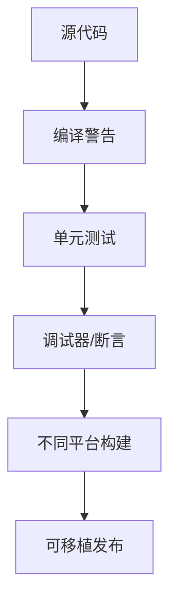

# 调试与可移植性

正确的 C 程序不仅要在一次运行中输出正确结果，还要能解释失败原因，并尽量减少对编译器、平台和 ABI 细节的依赖。

## 编译器警告

建议从警告开始：

```sh
gcc -std=c11 -Wall -Wextra -Wpedantic -g source.c -o program
```

警告不应全部关闭。类型不匹配、未使用变量、隐式声明和格式字符串错误往往是运行时故障的前兆。

调试版本可以增加 AddressSanitizer 和 UndefinedBehaviorSanitizer：

```sh
gcc -std=c11 -Wall -Wextra -Wpedantic -g \
    -fsanitize=address,undefined source.c -o program
./program
```

消毒器用于发现越界、释放后使用、整数未定义行为等问题；它不是正式发布构建的替代品。

## 错误处理

库函数通常通过返回值报告失败，系统调用还可能设置 `errno`：

```c
#include <errno.h>
#include <stdio.h>
#include <string.h>

FILE *file = fopen("missing.txt", "r");
if (file == NULL) {
    fprintf(stderr, "open failed: %s\n", strerror(errno));
}
```

不要用 `errno` 替代返回值判断；只有在函数明确报告失败后，`errno` 才有诊断意义。

## 断言与输入校验

断言描述程序员假设，例如链表头指针不应为非法状态；用户输入、文件内容和命令行参数必须用普通条件判断校验。两者的职责不同。

## 可移植类型

需要固定宽度时使用 `<stdint.h>`：

```c
#include <stdint.h>
#include <inttypes.h>

uint32_t count = 100;
printf("count=%" PRIu32 "\n", count);
```

数组下标和对象大小优先使用 `size_t`。不要假定 `int`、指针或枚举在所有平台上具有相同宽度。


