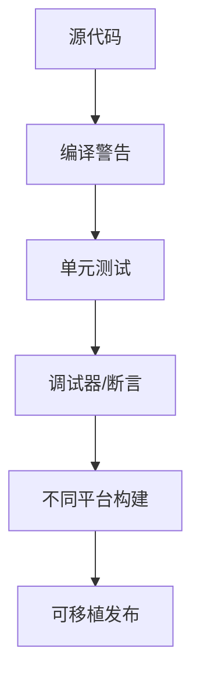

# 调试与可移植性

正确的 C 程序不仅要在一次运行中输出正确结果，还要能解释失败原因，并尽量减少对编译器、平台和 ABI 细节的依赖。

## 编译器警告

建议从警告开始：

```sh
gcc -std=c11 -Wall -Wextra -Wpedantic -g source.c -o program
```

警告不应全部关闭。类型不匹配、未使用变量、隐式声明和格式字符串错误往往是运行时故障的前兆。

建议把“编译”和“运行”分成两个步骤。先使用 `-fsyntax-only` 检查语法和类型，再生成带调试信息的程序；发布构建则明确优化级别和是否保留符号。不同编译器的警告选项不完全相同，不能把 GCC 的选项原样复制给 MSVC 或 Clang-cl。

```sh
gcc -std=c11 -Wall -Wextra -Wpedantic -Wconversion -fsyntax-only source.c
gcc -std=c11 -Wall -Wextra -Wpedantic -g -O0 source.c -o program
```

零警告不是目的本身。每条被保留或关闭的警告都应有理由；如果某段代码确实依赖实现扩展，应在最小范围内使用编译器诊断抑制，并在注释中说明原因。

## 一个最小调试循环

先用最小输入复现问题，再记录实际输出、预期输出和编译器版本。GDB 的基本流程是：

```sh
gdb ./program
(gdb) break main
(gdb) run
(gdb) next
(gdb) print value
(gdb) backtrace
```

断点、单步和调用栈适合定位控制流错误；AddressSanitizer 适合发现越界和释放后使用；它们解决的是不同问题，不能互相替代。修复后应把最小复现输入加入回归测试。

观察变量时要注意优化的影响。`-O2` 可能让变量被寄存器合并、消除或重新排序，调试器显示的值不一定对应源代码的每一行。初次定位问题可以使用 `-O0 -g`，确认逻辑后再在优化构建中复现一次，避免只修复了调试版本的偶然表现。

内存错误的排查顺序通常是：先确认分配大小，再确认每次访问的边界，再确认对象生命周期，最后检查别名和并发访问。不要看到崩溃位置就认为那里是根因；释放后使用往往在更早的写越界之后才表现出来。

调试版本可以增加 AddressSanitizer 和 UndefinedBehaviorSanitizer：

```sh
gcc -std=c11 -Wall -Wextra -Wpedantic -g \
    -fsanitize=address,undefined source.c -o program
./program
```

消毒器用于发现越界、释放后使用、整数未定义行为等问题；它不是正式发布构建的替代品。

## 错误处理

库函数通常通过返回值报告失败，系统调用还可能设置 `errno`：

```c
#include <errno.h>
#include <stdio.h>
#include <string.h>

FILE *file = fopen("missing.txt", "r");
if (file == NULL) {
    fprintf(stderr, "open failed: %s\n", strerror(errno));
}
```

不要用 `errno` 替代返回值判断；只有在函数明确报告失败后，`errno` 才有诊断意义。

错误处理要回答三个问题：失败如何表示、错误信息由谁生成、资源由谁清理。例如一个同时持有文件和动态内存的函数，应在每个失败分支释放已经取得的资源，并保留原始错误原因。C 中常用统一的清理出口：

```c
int load_data(const char *path) {
    FILE *file = NULL;
    unsigned char *buffer = NULL;
    int result = -1;

    file = fopen(path, "rb");
    if (file == NULL) goto cleanup;
    buffer = malloc(4096);
    if (buffer == NULL) goto cleanup;
    /* 读取并校验数据。 */
    result = 0;

cleanup:
    free(buffer);
    if (file != NULL && fclose(file) != 0) result = -1;
    return result;
}
```

`goto` 在这种“逆序释放资源”的局部模式中可以减少重复代码，但跳转目标必须位于当前函数，并且清理代码不能使用已经释放的对象。

## 断言与输入校验

断言描述程序员假设，例如链表头指针不应为非法状态；用户输入、文件内容和命令行参数必须用普通条件判断校验。两者的职责不同。

断言通常会在定义 `NDEBUG` 的发布构建中被移除，因此不能把文件写入、权限检查或用户身份校验放进 `assert` 的表达式中。尤其不要写 `assert(fopen(path, "r") != NULL)`，因为关闭断言后，`fopen` 也不会执行。

未定义行为、实现定义行为和未指定行为要区分对待：未定义行为允许编译器做任意假设；实现定义行为要求实现给出说明；未指定行为允许实现从多个结果中选择。调试器能显示一次运行的结果，却不能把未定义行为变成可靠规则。

## 可移植类型

需要固定宽度时使用 `<stdint.h>`：

```c
#include <stdint.h>
#include <inttypes.h>

uint32_t count = 100;
printf("count=%" PRIu32 "\n", count);
```

数组下标和对象大小优先使用 `size_t`。不要假定 `int`、指针或枚举在所有平台上具有相同宽度。

可移植性还包括字节序、路径分隔符、文本换行、字符编码和编译器扩展。把平台相关代码集中在少数接口中，并用 `#if defined(_WIN32)` 等条件编译隔离；不要在业务代码中到处散落平台宏。

文件格式尤其容易暴露平台差异：`sizeof(long)`、结构体填充、浮点格式和字节序都可能不同。跨平台格式应逐字段编码，并明确整数宽度、端序和文本编码；不要直接把结构体内存写入长期保存的文件。

一个实际的可移植性检查表包括：使用 `sizeof` 或 `<limits.h>` 检查类型范围；使用 `<inttypes.h>` 打印固定宽度整数；使用 `size_t` 表示对象大小；对 `ctype.h` 函数先转换为 `unsigned char`；避免依赖路径分隔符、换行符和编译器默认语言标准；至少在两种编译器或两个平台上构建一次。

## 可复现案例：从边界错误到回归测试

下面这段代码故意把循环条件写成 `i <= count`。当 `count == 3`，最后一次读取的是 `values[3]`，已经越过数组末尾。不要根据某次恰好输出的数字判断程序是否正确。

```c
/* bounds_bug.c：故意错误，仅用于调试练习 */
#include <stddef.h>
#include <stdio.h>

static int sum(const int values[], size_t count) {
    int result = 0;
    for (size_t i = 0; i <= count; ++i) result += values[i];
    return result;
}

int main(void) {
    int values[] = {1, 2, 3};
    printf("%d\n", sum(values, sizeof values / sizeof values[0]));
    return 0;
}
```

先在支持 AddressSanitizer 的 GCC/Clang 环境编译运行；它应指出越界读取，具体报告格式随工具链变化：

```sh
gcc -std=c11 -Wall -Wextra -Wpedantic -g -O0 -fsanitize=address,undefined bounds_bug.c -o bounds_bug
./bounds_bug
```

把 `<=` 改为 `<` 后重新编译，预期输出 `6`。再测试空数组对应的调用 `sum(NULL, 0)`：修正后的循环不会解引用指针，结果为零。真实项目还需考虑求和溢出，这属于另一类错误；消毒器能帮助定位部分有符号溢出，却不能替代输入范围设计。Windows 的 MSVC 调试器、AddressSanitizer 选项和运行方式不同，应按实际工具链文档操作。

排查时记录四项信息：最小输入、编译命令、实际诊断、修复后的回归结果。只有修复并复测，才算完成一次调试。


```mermaid
flowchart TD
    A[源代码] --> B[编译警告]
    B --> C[单元测试]
    C --> D[调试器/断言]
    D --> E[不同平台构建]
    E --> F[可移植发布]
```
