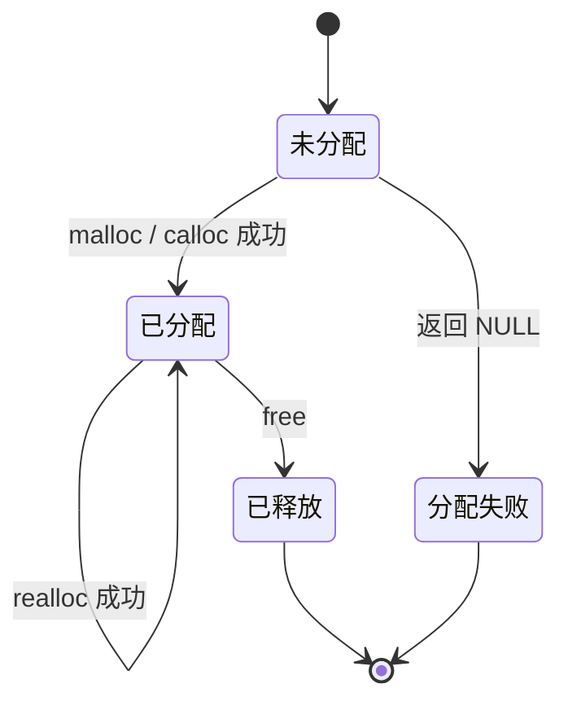

# 动态内存

## 为什么需要动态内存

局部变量和数组的大小通常在进入代码块前就已经确定。如果数据量由用户输入、文件内容或运行时状态决定，固定长度数组可能不够用，也可能浪费空间。动态内存允许程序在运行期间申请一块存储空间，并在不再需要时释放。

动态内存通常来自堆区，但 C 标准并不要求实现必须使用名为“堆”的特定区域。程序只需要遵守申请、使用和释放的规则。

## malloc、calloc 与 free

### malloc

malloc 申请指定字节数的内存，返回一个 void 指针。申请成功后，内存中的字节值是不确定的：

```c
#include <stdio.h>
#include <stdlib.h>

int main(void) {
    size_t count = 5;
    int *values = malloc(count * sizeof *values);

    if (values == NULL) {
        fprintf(stderr, "memory allocation failed\n");
        return EXIT_FAILURE;
    }

    for (size_t i = 0; i < count; ++i) {
        values[i] = (int)(i * i);
        printf("%d ", values[i]);
    }
    putchar('\n');

    free(values);
    values = NULL;
    return EXIT_SUCCESS;
}
```

malloc 只负责申请空间，不负责初始化内容。需要清零时，应显式初始化，或者使用 calloc。

### calloc

calloc 接收元素个数和每个元素的大小，申请空间后将所有字节初始化为零：

```c
#include <stdio.h>
#include <stdlib.h>

int main(void) {
    size_t count = 4;
    int *values = calloc(count, sizeof *values);

    if (values == NULL) {
        return EXIT_FAILURE;
    }

    for (size_t i = 0; i < count; ++i) {
        printf("%d ", values[i]);
    }
    putchar('\n');

    free(values);
    return EXIT_SUCCESS;
}
```

对整数类型来说，清零字节通常得到数值 0；但对于浮点数、指针或结构体，不能把“所有字节为零”简单等同于所有成员都具有语言层面的零值。需要可移植地初始化复杂对象时，应逐成员赋值。

### free

free 释放由 malloc、calloc 或 realloc 申请的内存：

```c
int *p = malloc(10 * sizeof *p);

if (p != NULL) {
    free(p);
    p = NULL;
}
```

free(NULL) 是安全的。释放后将指针设为 NULL，可以降低重复使用同一指针的风险，但不能让其他指向同一内存的指针自动失效。

## 动态内存的生命周期

动态对象通常经历以下阶段：



申请失败时，malloc、calloc 和 realloc 会返回 NULL。申请失败不是“小概率异常”，程序必须检查返回值并决定如何处理。

## sizeof 与溢出检查

申请数组时，通常使用 sizeof \*pointer，避免类型修改后忘记同步：

```c
double *data = malloc(count * sizeof *data);
```

计算 count 乘以元素大小时可能发生整数溢出。溢出后传给 malloc 的字节数可能比预期小，后续写入就会越界：

```c
#include <stdint.h>
#include <stdio.h>
#include <stdlib.h>

int allocate_ints(size_t count, int **out) {
    if (out == NULL || count > SIZE_MAX / sizeof **out) {
        return 0;
    }

    int *p = malloc(count * sizeof *p);
    if (p == NULL) {
        return 0;
    }

    *out = p;
    return 1;
}
```

实际项目中，任何来自文件、网络或用户输入的数量都应该在乘法前进行范围检查。

## realloc：调整已有内存

realloc 用于调整已有动态内存的大小：

```c
int *tmp = realloc(values, new_count * sizeof *values);
if (tmp == NULL) {
    /*
     * 原来的 values 仍然有效。
     * 这里可以释放它，也可以保留并采用降级方案。
     */
    free(values);
    values = NULL;
    return EXIT_FAILURE;
}

values = tmp;
```

不要直接覆盖唯一的原指针：

```c
values = realloc(values, new_count * sizeof *values);
```

如果 realloc 失败，它会返回 NULL，而原来的内存仍然存在。直接覆盖 values 会丢失原地址，造成内存泄漏。

realloc 成功后有两种可能：

* 内存区域在原位置扩大或缩小；
* 分配新的区域，复制旧内容，再释放旧区域。

因此，realloc 成功后原指针不能继续使用，必须使用返回的新指针。

当 new\_size 为 0 时，realloc 的行为和实现有关，不应依赖它来代替明确的 free。需要释放内存时，直接调用 free 更清楚。

## 所有权与接口设计

动态内存最容易出错的地方不是 malloc 本身，而是“这块内存由谁负责释放”没有说清楚。

常见的所有权约定：

| 场景            | 约定                |
| ------------- | ----------------- |
| 函数内部申请并返回指针   | 调用者负责最终 free      |
| 调用者传入缓冲区      | 调用者负责缓冲区的生命周期     |
| 函数只读取指针       | 函数不释放，也不修改所有权     |
| 函数接收二级指针并替换对象 | 接口文档必须说明旧对象是否会被释放 |
| 结构体拥有成员指针     | 结构体销毁函数负责释放成员     |

下面的接口让所有权关系清楚：函数申请空间，成功后由调用者释放。

```c
#include <stdlib.h>

int create_message(char **out) {
    if (out == NULL) {
        return 0;
    }

    char *message = malloc(32);
    if (message == NULL) {
        return 0;
    }

    message[0] = 'o';
    message[1] = 'k';
    message[2] = '\0';
    *out = message;
    return 1;
}
```

调用方：

```c
char *message = NULL;

if (create_message(&message)) {
    puts(message);
    free(message);
    message = NULL;
}
```

## 动态数组示例

下面的程序读取数量，动态申请数组，计算平均值，并在所有路径上释放资源：

```c
#include <stdio.h>
#include <stdlib.h>

int main(void) {
    size_t count;

    printf("count: ");
    if (scanf("%zu", &count) != 1 || count == 0) {
        fprintf(stderr, "invalid count\n");
        return EXIT_FAILURE;
    }

    int *values = malloc(count * sizeof *values);
    if (values == NULL) {
        fprintf(stderr, "memory allocation failed\n");
        return EXIT_FAILURE;
    }

    long long sum = 0;
    for (size_t i = 0; i < count; ++i) {
        printf("value[%zu]: ", i);
        if (scanf("%d", &values[i]) != 1) {
            fprintf(stderr, "invalid value\n");
            free(values);
            return EXIT_FAILURE;
        }
        sum += values[i];
    }

    printf("average = %.2f\n", (double)sum / count);
    free(values);
    return EXIT_SUCCESS;
}
```

如果申请了多块内存，发生错误时要按照已经成功申请的部分逐一释放。资源清理应覆盖正常路径和错误路径。

## 二维动态数组

二维数据有多种分配方式。最简单的是申请一整块连续内存：

```c
#include <stdlib.h>

size_t rows = 3;
size_t cols = 4;

int *matrix = malloc(rows * cols * sizeof *matrix);
if (matrix == NULL) {
    return EXIT_FAILURE;
}

matrix[1 * cols + 2] = 42;
free(matrix);
```

访问元素时使用 row \* cols + column。连续内存有利于缓存访问，也只需要释放一次。

如果需要使用 matrix\[row]\[column] 的写法，可以申请指针数组和每一行：

```c
int **matrix = malloc(rows * sizeof *matrix);
if (matrix == NULL) {
    return EXIT_FAILURE;
}

for (size_t row = 0; row < rows; ++row) {
    matrix[row] = malloc(cols * sizeof *matrix[row]);
    if (matrix[row] == NULL) {
        while (row > 0) {
            free(matrix[--row]);
        }
        free(matrix);
        return EXIT_FAILURE;
    }
}

/* 使用 matrix[row][column] */

for (size_t row = 0; row < rows; ++row) {
    free(matrix[row]);
}
free(matrix);
```

这种方式的每一行可能位于不同位置，释放时必须先释放每一行，再释放指针数组。它与真正的二维数组 int matrix\[rows]\[cols] 不是同一种类型。

## 常见错误

| 错误                  | 后果                   |
| ------------------- | -------------------- |
| 解引用 malloc 返回的 NULL | 未定义行为或程序崩溃           |
| 使用 malloc 后未初始化就读取  | 读取不确定值               |
| 申请字节数计算溢出           | 分配空间过小，后续越界          |
| 直接覆盖 realloc 原指针    | realloc 失败时发生内存泄漏    |
| free 后继续读写          | use-after-free，未定义行为 |
| 对同一地址重复 free        | double free，未定义行为    |
| 忘记 free             | 内存泄漏                 |
| 返回局部数组地址            | 函数结束后指针悬空            |
| 释放不是动态申请得到的地址       | 未定义行为                |
| 把二维数组当作 int \*\*    | 指针类型和步长不匹配           |
| 多行分配只释放外层指针         | 每行内存泄漏               |
| 把内存所有权交给多个模块        | 容易重复释放或遗漏释放          |

动态内存的三个检查问题：

1. 申请是否成功？
2. 这块内存现在由谁负责？
3. 所有退出路径是否都能释放它？

## 调试工具

GCC 和 Clang 可以使用 AddressSanitizer 检查越界、释放后使用和重复释放：

```bash
gcc -std=c17 -Wall -Wextra -Wpedantic \
    -g -fsanitize=address,undefined dynamic_memory.c \
    -o dynamic_memory

./dynamic_memory
```

Linux 下还可以使用 Valgrind 检查内存泄漏：

```bash
valgrind --leak-check=full ./dynamic_memory
```

这些工具不能替代边界设计和所有权约定，但能把许多“运行一会儿才崩”的问题提前暴露出来。

## 练习建议

1. 编写一个动态数组，实现追加元素的 push 操作。
2. 使用 realloc 将数组容量扩大一倍，并处理申请失败。
3. 编写一个函数，返回动态生成的字符串，并设计对应的释放函数。
4. 分别实现连续二维数组和分行二维数组，比较它们的访问和释放方式。
5. 故意制造一次越界写入，用 AddressSanitizer 观察诊断信息。

动态内存给了程序更多空间，也把释放责任交给了程序员。申请很容易，正确地管理生存期才是这部分真正的练习。
