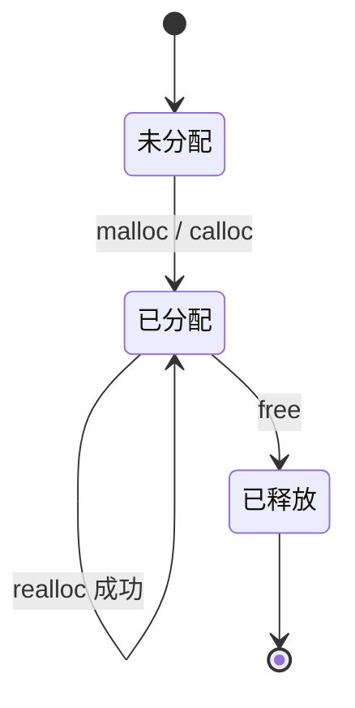
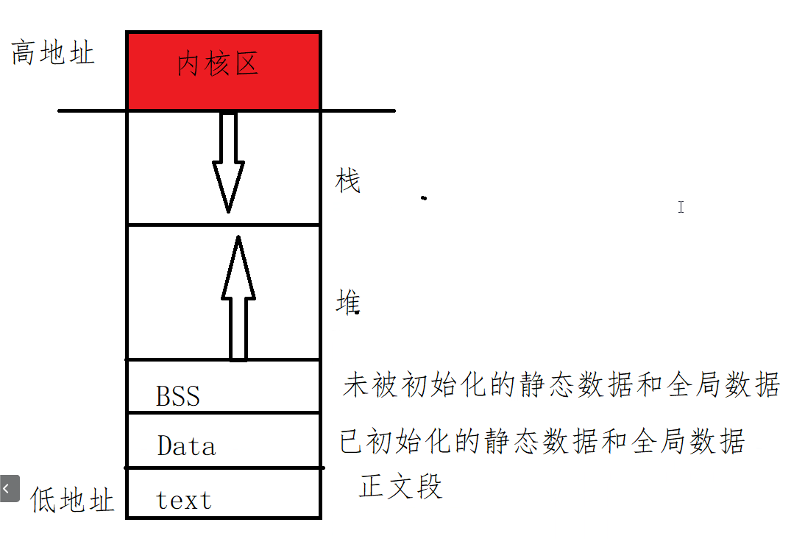

# 动态内存

### 动态内存的所有权

`malloc` 返回未初始化的字节，`calloc` 返回清零的字节，`realloc` 尝试调整已有区域，`free` 结束这段内存的所有权。申请多少、谁负责释放，应该在接口旁边说清楚。

```c
Student *students = calloc(count, sizeof *students);
if (!students) {
    perror("calloc");
    return EXIT_FAILURE;
}

Student *tmp = realloc(students, new_count * sizeof *students);
if (!tmp) {
    free(students);       /* 原指针仍然有效 */
    return EXIT_FAILURE;
}
students = tmp;
```

不要直接把 `realloc` 的结果写回唯一的原指针。失败时它会返回 `NULL`，原区域仍然存在；直接覆盖会造成内存泄漏。释放后不要再读写该地址，也不要重复 `free`。



程序出现越界、use-after-free 或 double free 时，可用 AddressSanitizer 检查：

```bash
gcc -std=c17 -g -fsanitize=address,undefined main.c -o main
./main
```



