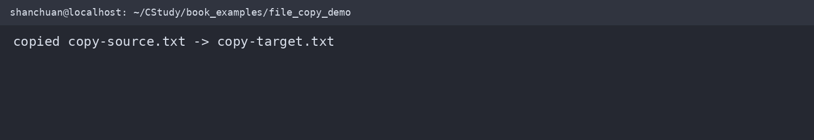
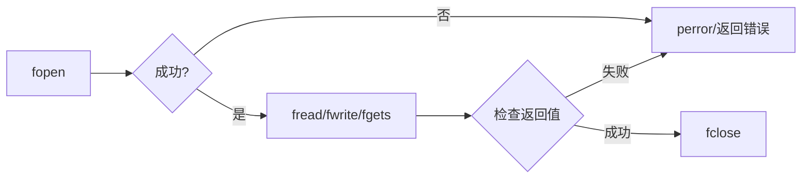

# 文件工程

文件程序的基本顺序是：打开、检查、读写、检查结果、关闭。任何一步失败，都应该保留可诊断的错误信息。

下面的示例在 WSL2 `/home/shanchuan/CStudy/book_examples/file_copy_demo.c` 中编译运行：





## 文件拷贝

二进制拷贝不应使用字符串函数，因为文件内容可能包含 `\0`：

```c
#include <stdio.h>

int copy_file(const char *source_name, const char *target_name) {
    FILE *source = fopen(source_name, "rb");
    if (source == NULL) return -1;

    FILE *target = fopen(target_name, "wb");
    if (target == NULL) {
        fclose(source);
        return -1;
    }

    unsigned char buffer[4096];
    size_t read_count;
    int result = 0;
    while ((read_count = fread(buffer, 1, sizeof buffer, source)) > 0) {
        if (fwrite(buffer, 1, read_count, target) != read_count) {
            result = -1;
            break;
        }
    }
    if (ferror(source)) result = -1;
    if (fclose(target) != 0) result = -1;
    if (fclose(source) != 0) result = -1;
    return result;
}
```

真实程序还应检查源文件与目标文件是否指向同一个文件，并在覆盖目标前确认用户意图。

## 随机访问

`fseek` 移动位置，`ftell` 查询位置，`rewind` 回到文件开头并清除错误标志。需要按字节精确定位时，应使用二进制模式。

## 结构体序列化

直接执行 `fwrite(&object, sizeof object, 1, file)` 只适合同一编译器、同一 ABI 和同一字节序的受控场景。跨平台格式应逐字段写入，并明确整数宽度、字节序和文本编码。

## `fflush` 的边界

对输出流调用 `fflush` 是可移植的；`fflush(stdin)` 不是 ISO C 规定的清空输入缓冲区方法。需要丢弃当前输入行时，应读取字符直到换行或 `EOF`。

## 可运行完整示例

将下面内容保存为 `file_copy_demo.c`：

```c
#include <stdio.h>

static int copy_file(const char *source_name, const char *target_name) {
    FILE *source = fopen(source_name, "rb");
    if (source == NULL) return -1;
    FILE *target = fopen(target_name, "wb");
    if (target == NULL) {
        fclose(source);
        return -1;
    }

    unsigned char buffer[128];
    size_t read_count;
    int result = 0;
    while ((read_count = fread(buffer, 1, sizeof buffer, source)) > 0) {
        if (fwrite(buffer, 1, read_count, target) != read_count) {
            result = -1;
            break;
        }
    }
    if (ferror(source)) result = -1;
    if (fclose(target) != 0 || fclose(source) != 0) result = -1;
    return result;
}

int main(void) {
    const char *source = "copy-source.txt";
    const char *target = "copy-target.txt";
    FILE *file = fopen(source, "wb");
    if (file == NULL) return 1;
    fputs("C file copy\n", file);
    fclose(file);
    if (copy_file(source, target) != 0) return 1;
    printf("copied %s -> %s\n", source, target);
    return 0;
}
```

编译运行：

```sh
gcc -std=c11 -Wall -Wextra -Wpedantic file_copy_demo.c -o file_copy_demo
./file_copy_demo
```

程序会在当前目录生成 `copy-source.txt` 和 `copy-target.txt`，并输出复制成功信息。
