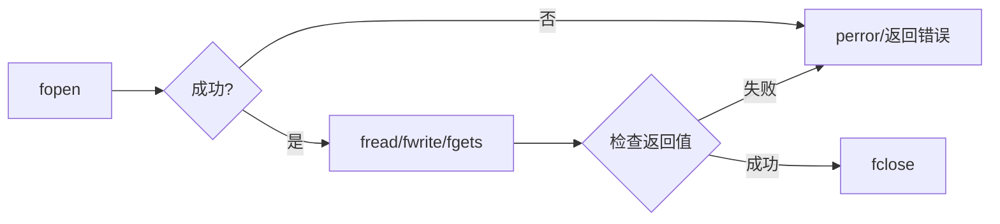

# 文件工程

文件程序的基本顺序是：打开、检查、读写、检查结果、关闭。任何一步失败，都应该保留可诊断的错误信息。



```mermaid
flowchart LR
    A[fopen] --> B{成功?}
    B -- 否 --> E[perror/返回错误]
    B -- 是 --> C[fread/fwrite/fgets]
    C --> D{检查返回值}
    D -- 失败 --> E
    D -- 成功 --> F[fclose]
```

## 文件拷贝

二进制拷贝不应使用字符串函数，因为文件内容可能包含 `\0`：

```c
#include <stdio.h>

int copy_file(const char *source_name, const char *target_name) {
    FILE *source = fopen(source_name, "rb");
    if (source == NULL) return -1;

    FILE *target = fopen(target_name, "wb");
    if (target == NULL) {
        fclose(source);
        return -1;
    }

    unsigned char buffer[4096];
    size_t read_count;
    int result = 0;
    while ((read_count = fread(buffer, 1, sizeof buffer, source)) > 0) {
        if (fwrite(buffer, 1, read_count, target) != read_count) {
            result = -1;
            break;
        }
    }
    if (ferror(source)) result = -1;
    if (fclose(target) != 0) result = -1;
    if (fclose(source) != 0) result = -1;
    return result;
}
```

真实程序还应检查源文件与目标文件是否指向同一个文件，并在覆盖目标前确认用户意图。

文件拷贝有两个容易遗漏的失败点。第一，`fread` 返回 0 既可能表示正常到达 EOF，也可能表示读取错误，必须用 `ferror` 和 `feof` 区分。第二，`fwrite` 成功只代表本次数据交给了 C 流，最终落盘仍可能在 `fflush` 或 `fclose` 时失败。因此关闭输出流的返回值也必须检查。

如果目标文件已经存在，`fopen(target, "wb")` 会在打开时截断它。需要“写完后替换”的程序应先写入同目录临时文件，调用 `fflush`、关闭文件并确认成功，再使用平台接口替换原文件。临时文件必须和目标位于同一文件系统，才能尽量保证替换操作的原子性。

## 随机访问

`fseek` 移动位置，`ftell` 查询位置，`rewind` 回到文件开头并清除错误标志。需要按字节精确定位时，应使用二进制模式。

随机访问前必须先确认偏移量不会超出文件格式允许的范围：

```c
if (fseek(file, 0, SEEK_END) != 0) {
    perror("fseek");
    return -1;
}
long length = ftell(file);
if (length < 0) {
    perror("ftell");
    return -1;
}
rewind(file);
```

`ftell` 返回 `long`，不适合无条件表示超大文件；需要处理大文件时，应使用目标平台提供的接口，并在章节开头明确平台范围。

文本模式下的 `fseek` 偏移有额外限制，不能把文本文件中的换行转换当成固定字节数。需要按字节定位时使用二进制模式；需要按记录定位时，最好设计明确的记录长度或索引，而不是依赖“第几个换行符”。

## 结构体序列化

直接执行 `fwrite(&object, sizeof object, 1, file)` 只适合同一编译器、同一 ABI 和同一字节序的受控场景。跨平台格式应逐字段写入，并明确整数宽度、字节序和文本编码。

可靠的文件格式还应包含版本号、记录数量和长度边界。写入时先写临时文件，成功关闭后再替换目标文件，可以避免程序中途退出留下半个文件；读取时必须检查文件是否完整，不能相信文件中的数量字段一定合理。

一个稳健的读取流程通常是：先读取并验证魔数，再读取版本号和记录数量，检查数量乘以单条记录大小不会溢出，最后逐条读取并验证字段范围。任何一步失败都应停止解析，不能继续把未初始化或部分读取的数据交给业务层。

## `fflush` 的边界

对输出流调用 `fflush` 是可移植的；`fflush(stdin)` 不是 ISO C 规定的清空输入缓冲区方法。需要丢弃当前输入行时，应读取字符直到换行或 `EOF`。

`fflush` 只刷新 C 流的用户态缓冲区，不等价于“数据已经写入物理介质”。需要更强的持久化保证时，要使用目标操作系统提供的同步接口，并把这部分平台依赖隔离在文件模块中。

## 可运行完整示例

将下面内容保存为 `file_copy_demo.c`：

```c
#include <stdio.h>

static int copy_file(const char *source_name, const char *target_name) {
    FILE *source = fopen(source_name, "rb");
    if (source == NULL) return -1;
    FILE *target = fopen(target_name, "wb");
    if (target == NULL) {
        fclose(source);
        return -1;
    }

    unsigned char buffer[128];
    size_t read_count;
    int result = 0;
    while ((read_count = fread(buffer, 1, sizeof buffer, source)) > 0) {
        if (fwrite(buffer, 1, read_count, target) != read_count) {
            result = -1;
            break;
        }
    }
    if (ferror(source)) result = -1;
    if (fclose(target) != 0) result = -1;
    if (fclose(source) != 0) result = -1;
    return result;
}

int main(void) {
    const char *source = "copy-source.txt";
    const char *target = "copy-target.txt";
    FILE *file = fopen(source, "wb");
    if (file == NULL) return 1;
    fputs("C file copy\n", file);
    fclose(file);
    if (copy_file(source, target) != 0) return 1;
    printf("copied %s -> %s\n", source, target);
    return 0;
}
```

编译运行：

```sh
gcc -std=c11 -Wall -Wextra -Wpedantic file_copy_demo.c -o file_copy_demo
./file_copy_demo
```

程序会在当前目录生成 `copy-source.txt` 和 `copy-target.txt`，并输出复制成功信息。
