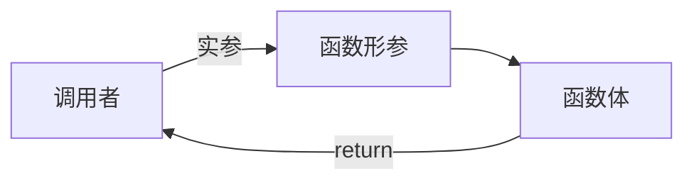
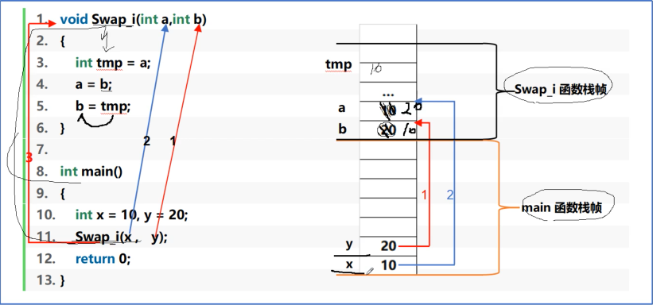
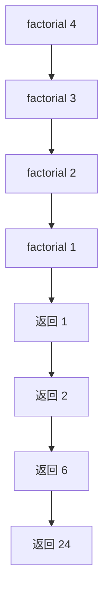

# 函数

​	在结构化程序设计中,将任务进行模块划分的基本单位,通过函数。可以把一个复杂任务分解成为若干个易于解决的小任务。充分体现结构化程序设计由粗到精,逐步细化的设计思想。一个大的程序一般应分为若干个程序模块,每个模块实现一个特定的功能，这些模块称为子程序,在C语言中子程序用函数实现。C语言不允许函数嵌套定义

定义函数语法

`函数返回类型 函数名(形参列表){ 函数体 }`

e.g

```c
#include <stdio.h>
#include <math.h>

float TriangArea(float a,float b,float c);//函数声明 a,b,c 形参
int main(void)
{
    float a,b,c;
    scanf("%f %f %f",&a,&b,&c);
    printf("%f",TriangArea(a,b,c));//函数调用,a,b,c 实参
    return 0;
}
float TriangArea(float a,float b,float c)//函数定义
{
    float s = -1;
    if(a + b >= c && a + c >= b && b + c >= a)
    {
    float p = (a+b+c)/2;
    float s = sqrt(p*(p-a)*(p-b)*(p-c));
    } 
    return s;
}
```



> - 实参向形参传值,从右向左结合
> - 函数返回值放入临时空间,函数栈帧清除,拷贝给主调函数后临时空间清除
> - 临时空间具有常性,只可读,不可写

### 传值

值传递



传地址

```c
void Swap(int *ap,int *bp){
    int tmp = *ap;
    *ap = *bp;
    *bp = tmp;
}
int main(){
    int x = 10,y = 20;
    printf("%d %d",x,y);
    Swap(&x,&y);
    printf("%d %d",x,y); 
    return 0;
}
```

### 参数 

​	**形式参数(形参)**:只能等到函数被调用时接收传递进来的数据，所以称为形式参数，简称形参,形式参数是指函数名后括号中定义的变量，形式参数只有在函数被调用的过程中给于赋值(分配存储空间)。函数执行完后形式参数变量就自动释放了，所以形式参数只在函数中可见(作用域).

​	**实际参数(实参)**:调用函数时给出的参数包含了实实在在的数据，所以称为实际参数，简称实参。实参可以是:常量、变量、表达式或函数等。无论实参是何种类型的量，在进行函数调用时，它们都必须有确定的值，以便把这些值传送给形参。

​	形参和实参的功能是传递数据，发生函数调用时，实参的值会传递给形参。

​	函数调用首先要进行参数传递，参数传递的方向是由实参传递给形参。传递过程是，先计算实参表达式的值，再将该值传递给对应的形参变量。一般情况下，实参和形参的个数和排列顺序应一一对应，**并且对应参数应类型匹配(赋值兼容)**,即实参的类型可以转化为形参类型。而对应参数的参数名则不要求相同。

​	在示例中` void Swap(int *ap,int *bp)`,*ap 和 *bp 是形参，在 main 中 &x , &y 是实参。

​	形参和实参的区别和联系

1. 形参变量只有在函数被调用时才会分配内存(在 stack 中),调用结束后，立刻释放内存,所以形参变量只有在函数内部有效， 不能在函数外部使用。
2. 实参可以是常量、变量、表达式、函数等，无论实参是何种类型的数据，在进行函数调用时，它们都必须有确定的值，以便把这些值传送给形参，所以应该提前用赋值、输入等办法使实参获得确定值.
3. 实参和形参在数量上、类型上、顺序上必须严格一致，否则会发生“类型不匹配”的错误。当然，如果能够进行自动类型转换，或者进行了强制类型转换，那么实参类型也可以不同于形参类型.
4. **函数调用中发生的数据传递是单向的，只能把实参的值传递给形参，而不能把形参的值反向地传递给实参.**换句话说，一旦完成数据的传递，实参和形参就再也没有关系，所以在函数调用过程中，形参的值发生改变并不会影响实参的值。

### 返回

return

​	**语句用于结束函数的执行，返回调用者，如果是主函数，则返回至操作系统(终止程序的执行)**

​	利用一个return语句可以将一个数据返回给调用者。通常，当函数的返回类型为void时， return语句可以省略，如果使用也仅作为函数或程序结束的标志

return 与 exit 函数的区别

​	在main 函数中执行return 语句是终止程序的一种方法，另一种方法是调用exit函数，此函数属于<stdlib.h>头文件中。传递给 exit 函数的实际参数和main 函数的返回值具有相同的含义:两者都说明程序终止时的状态，为了表示正常终止，传递0: exit(0)；

​	因为 0有点模糊，所以C语言允许用 EXIT SUCCESS来替代(效果是相同):

​	`exit(EXIT SUCCESS); /*normal termination */`

​	传递EXIT FAILURE表示异常终止:
​	`Exit(EXIT FAILURE);/*abnormal termination */`

​	EXIT SUCCESS和EXIT FAILURE都是定义在<stdlib.h>中的宏。

​	EXIT SUCCESS和EXIT FAILURE的值都分别是 0和 1

​	作为程序终止的方法，return 语句和exit函数在main 中是等价的，`return 表达式;`等价于` exit(表达式);` ,差异是,不管哪个函数调用exit 函数,都会导致程序终止， retur 语句仅当在main函数中调用才会导致程序终止

### 函数实现模块化程序设计

在软件开发领域，模块化设计是提升代码可维护性、可复用性的核心手段之一。而函数作为 C 语言中最基础的代码组织单元，其设计质量直接决定了模块化程序的优劣。下面从设计原则、核心要求、模块关系及接口设计四个维度，系统阐述如何通过函数实现高效的模块化程序设计。

#### 函数设计的基本原则

函数设计的五个基本原则，是保证模块化具备 “高内聚、低耦合” 特性的前提。

**封装性**是函数模块化的核心思想 —— 将功能逻辑封装在函数内部，对调用者隐藏实现细节。对调用者而言，仅需关注函数的入口参数；函数的对外影响也严格限制在返回值和指针形参的操作中。例如，一个实现数组打印的`Print_Ar`函数，调用者只需传入数组和长度，无需关心内部是通过循环还是其他方式完成打印，这就是封装性的直观体现。

**参数有效性检查**是函数健壮性的第一道防线。在函数执行逻辑前，必须对输入参数的合法性进行校验，比如检查指针是否为空、数值是否在合理范围等，以此保证函数调用的成功率。

**规模精简性**要求函数的代码体量不宜过大（行业普遍建议单函数行数 <80 行）。过于冗长的函数会导致逻辑混乱，既不便于维护，也违背了 “单一功能” 的设计初衷。

**功能单一性**强调每个函数只负责一项明确任务。比如 “计算两个数的和” 与 “打印计算结果” 应拆分为两个函数，而非在一个函数中同时完成，这样的拆分让代码逻辑更清晰，也更易复用。

**接口清晰性**要求函数的参数定义、返回值类型必须直观易懂。调用者仅通过函数声明，就能明确其功能、输入要求和输出含义，无需深入函数内部实现。

#### 核心要求

满足基本设计原则后，函数还需在 “可复用、可维护、可读、健壮” 四个维度达到更高要求。

**可复用性**是模块化的价值体现。一个设计良好的函数模块（如通用的`Print_Ar`数组打印函数），应能在不同项目、不同场景中重复调用。为实现这一点，需在设计时剥离业务强依赖的逻辑，保留通用化的功能内核。

**可维护性**是模块化的核心优势。当程序被拆分为多个函数模块后，错误往往仅局限于单个模块，开发者能快速定位并修复问题；修复后只需重新编译该模块，无需改动整个程序。这就像 “汽车修轮胎无需检修引擎”，模块化让局部修改与整体逻辑解耦。

**可读性**是团队协作的基础。代码不仅是写给编译器的，更是写给开发者的。清晰的函数命名、简洁的逻辑结构、必要的注释，能让其他开发者快速理解代码意图，降低维护成本。

**健壮性**是函数应对异常的能力。增强健壮性可从两方面入手：一是在函数入口处严格校验输入参数的合法性（如检查除数是否为 0）；二是对函数返回值进行有效性判断，保证功能执行结果符合预期。

#### 模块化

优秀的模块设计需同时满足 “高内聚” 与 “低耦合” 的特性。

**高内聚**要求模块内的所有元素紧密围绕同一功能目标协作。例如，一个 “学生信息管理模块”，其内部的 “添加学生”“查询学生”“修改学生” 等函数，都应围绕 “学生信息操作” 这一核心目标设计，元素间关联性越强，内聚性越高，模块也越易理解和使用。

**低耦合**要求模块之间尽可能独立，减少依赖关系。比如 “用户登录模块” 与 “商品展示模块” 应通过清晰的接口交互，而非直接操作对方的内部数据。低耦合让模块更易修改、替换，也便于单独复用。

#### C 语言函数接口

在 C 语言中，函数接口是调用者与实现者之间的 “协议”—— 调用者提供参数，函数返回时完成指定功能。

函数接口通过**函数名、参数列表、返回值类型**来描述这一协议。若函数名（如`CalcSum`）、参数（如`int a, int b`）命名直观，类型定义准确（如返回值为`int`），调用者仅通过接口声明就能明确其用法。当接口无法完全表达语义时（如特殊的参数约束、返回值的边界情况），需通过文档补充说明，保证调用者理解 “协议” 的全部细节。

### 函数与二维数组

在一维数组的函数传递中，数组名将退化为一个指针，但二位数组并不会退化为一个二级指针，而是指向数组的指针`int (*br)[4]`，表示这个数组由4个元素组成，每个元素是整型。

```c
void printArr(int (*br)[4]){
	// 遍历并打印二维数组的每个元素
	for (int i = 0; i < 3; i++) {
		for (int j = 0; j < 4; j++)  printf("%d ", br[i][j]);
		printf("\n");
	}
}
int main(){
	int ar[3][4] = { 1, 2, 3, 4, 5, 6, 7, 8, 9, 11, 12 };
	// 调用打印函数
	printArr(ar);
	return 0;
}
```

我们也可以将行和列传递进去实现对数组的遍历：

```c
void printArr(int (*br)[4],int row,int col) // printArr(ar,3,4);
{
	// 遍历并打印二维数组的每个元素
	for (int i = 0; i < row; i++) {
		for (int j = 0; j < cal; j++) {
			printf("%d ", br[i][j]);
		}
		printf("\n");
	}
}
```

### 递归函数

递归函数在函数体内调用自己。写递归时先问两个问题：什么时候停止？每次调用是否更接近停止条件？阶乘的基例是 `0! = 1`，递推关系是 `n! = n * (n-1)!`。

```c
unsigned long long factorial(unsigned n) {
    if (n <= 1) return 1;
    return n * factorial(n - 1);
}
```

调用 `factorial(4)` 时，程序先压入 4、3、2、1 四层栈帧，再按相反顺序返回结果：



递归很适合树遍历、分治和回溯；简单计数通常用循环更省栈空间。朴素递归斐波那契会重复计算同一个子问题，复杂度接近指数级。可以用数组记忆已经得到的结果，或者直接改成自底向上的循环。

运行这些示例时，终端工作目录为 `/home/shanchuan/CStudy`，完整输出见本节末的终端截图。
