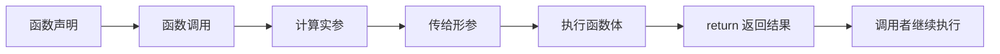
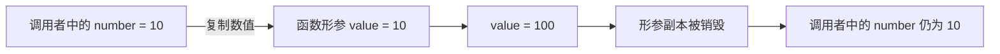
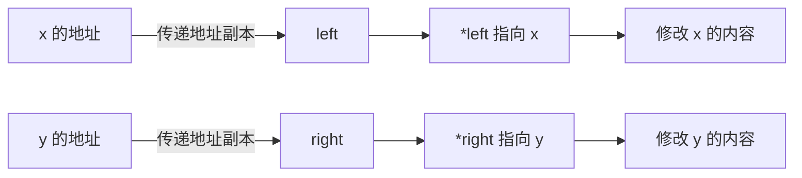
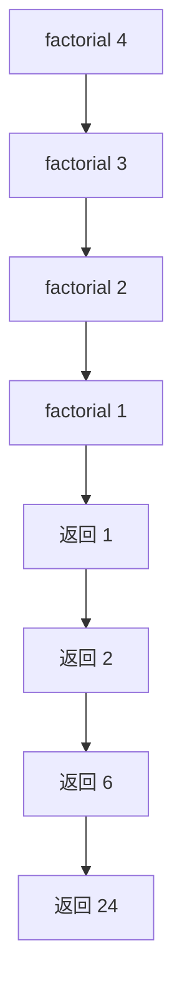

# 函数

​在结构化程序设计中,将任务进行模块划分的基本单位,通过函数。可以把一个复杂任务分解成为若干个易于解决的小任务。充分体现结构化程序设计由粗到精,逐步细化的设计思想。一个大的程序一般应分为若干个程序模块,每个模块实现一个特定的功能，这些模块称为子程序,在C语言中子程序用函数实现。C语言不允许函数嵌套定义

在结构化程序设计中，函数是划分任务的基本单位。一个复杂问题可以拆成若干个职责明确的小问题，每个小问题由一个函数负责。这样能减少重复代码，也让测试和排错有了清晰边界。

C 语言不允许在一个函数内部再定义另一个函数。函数可以调用其他函数，也可以调用自己，但每个函数定义都必须位于文件作用域。

## 函数的基本形式

函数定义的一般形式如下：

```c
返回类型 函数名(形参列表)
{
    函数体
}
```

一次完整的函数使用通常包含三个步骤：

1. 函数声明：告诉编译器函数的接口；
2. 函数调用：传入实参并执行函数体；
3. 函数定义：提供函数的具体实现。



### 函数声明、调用与定义

函数声明也叫函数原型，通常写在函数调用之前：

```c
int add(int a, int b);
```

形参名称在函数声明中可以省略：

```c
int add(int, int);
```

完整示例：

```c
#include <stdio.h>

int add(int a, int b);

int main(void)
{
    int result = add(2, 3);
    printf("result = %d\n", result);
    return 0;
}

int add(int a, int b)
{
    return a + b;
}
```

函数声明和定义的返回类型、函数名以及参数类型必须保持一致。参数名称可以不同，但参数类型和顺序不能随意改变。

### 使用函数计算三角形面积

下面的函数根据三条边计算三角形面积。半周长为 p = (a + b + c) / 2，面积为 sqrt(p \* (p - a) \* (p - b) \* (p - c))。

```c
#include <math.h>
#include <stdio.h>

double triangle_area(double a, double b, double c);

int main(void)
{
    double a;
    double b;
    double c;

    printf("请输入三条边长：");

    if (scanf("%lf %lf %lf", &a, &b, &c) != 3)
    {
        printf("输入格式错误。\n");
        return 1;
    }

    double area = triangle_area(a, b, c);

    if (area < 0.0)
    {
        printf("这三条边不能构成三角形。\n");
    }
    else
    {
        printf("面积为：%.2f\n", area);
    }

    return 0;
}

double triangle_area(double a, double b, double c)
{
    if (a <= 0.0 || b <= 0.0 || c <= 0.0)
    {
        return -1.0;
    }

    if (a + b <= c || a + c <= b || b + c <= a)
    {
        return -1.0;
    }

    double p = (a + b + c) / 2.0;
    return sqrt(p * (p - a) * (p - b) * (p - c));
}
```

使用 GCC 编译时需要链接数学库：

```bash
gcc -std=c17 -Wall -Wextra -Wpedantic triangle_area.c -o triangle_area -lm
```

### 参数与值传递

**形式参数**:只能等到函数被调用时接收传递进来的数据，所以称为形式参数，简称**形参**,形式参数是指函数名后括号中定义的变量，例如 int a 和 int b。

形式参数只有在函数被调用的过程中给于赋值(分配存储空间)。函数执行完后形式参数变量就自动释放了，所以形式参数只在函数中可见(作用域).

**实际参数**:调用函数时给出的参数包含了实实在在的数据，所以称为实际参数，简称**实参**。实参可以是常量、变量、表达式或函数等。无论实参是何种类型的量，在进行函数调用时，它们都必须有确定的值，以便把这些值传送给形参。

调用函数时，程序会先计算实参表达式的值，再将结果传给对应的形参。参数通常按位置一一对应，类型需要兼容或能够进行合法转换。

C 语言的普通参数传递是值传递。函数接收的是实参值的副本，修改形参不会改变调用者中的原变量。

```c
#include <stdio.h>

void set_value(int value)
{
    value = 100;
}

int main(void)
{
    int number = 10;
    set_value(number);
    printf("number = %d\n", number);
    return 0;
}
```

输出仍然是 number = 10。值传递过程如下：



图中的两个 10 属于两个不同的对象。函数修改的是形参副本，调用者中的变量不会跟着变化。

### 通过指针修改实参

C 语言没有单独的引用传递语法，但可以把变量的地址传给函数。函数通过指针访问原变量，从而修改调用者中的数据。

```c
#include <stdio.h>

void swap(int *left, int *right)
{
    int temporary = *left;
    *left = *right;
    *right = temporary;
}

int main(void)
{
    int x = 10;
    int y = 20;

    printf("交换前：x = %d, y = %d\n", x, y);
    swap(&x, &y);
    printf("交换后：x = %d, y = %d\n", x, y);
    return 0;
}
```

这里传递的仍然是值，只不过这个值是地址：



指针本身仍然是按值传递的。函数拿到的是地址副本，但这个地址副本仍然指向调用者的原对象。

## 返回值与 return

return 有两个作用：结束当前函数，并把一个值返回给调用者。

```c
int square(int value)
{
    return value * value;
}
```

返回类型为 void 的函数可以不返回值，也可以使用不带表达式的 return 提前结束：

```c
void print_positive(int value)
{
    if (value <= 0)
    {
        return;
    }

    printf("%d\n", value);
}
```

在 main 函数中，return 会结束整个程序并把返回值交给操作系统。exit 定义在 `stdlib.h` 中，无论在哪个函数中调用都会结束程序：

```c
#include <stdlib.h>

exit(EXIT_SUCCESS);  /* 正常结束 */
exit(EXIT_FAILURE);  /* 异常结束 */
```

`EXIT SUCCESS`和 `EXIT FAILURE`的值都分别是 0和 1。作为程序终止的方法，return 语句和exit函数在main 中是等价的，`return 表达式;`等价于`exit(表达式);` ，差异是不管哪个函数调用exit 函数，都会导致程序终止， retur 语句仅当在main函数中调用才会导致程序终止

### 函数与模块化设计

在软件开发领域，模块化设计是提升代码可维护性、可复用性的核心手段之一。而函数作为 C 语言中最基础的代码组织单元，其设计质量直接决定了模块化程序的优劣。

### **函数设计的基本原则**

函数设计的五个基本原则，是保证模块化具备 “高内聚、低耦合” 特性的前提。

#### **封装性**

函数模块化的核心思想 —— 将功能逻辑封装在函数内部，对调用者隐藏实现细节。对调用者而言，仅需关注函数的入口参数；函数的对外影响也严格限制在返回值和指针形参的操作中。例如，一个实现数组打印的`Print_Ar`函数，调用者只需传入数组和长度，无需关心内部是通过循环还是其他方式完成打印，这就是封装性的直观体现。

#### **参数有效性检查**

函数健壮性的第一道防线。在函数执行逻辑前，必须对输入参数的合法性进行校验，比如检查指针是否为空、数值是否在合理范围等，以此保证函数调用的成功率。

#### **规模精简性**

函数的代码体量不宜过大（行业普遍建议单函数行数 <80 行）。过于冗长的函数会导致逻辑混乱，既不便于维护，也违背了 “单一功能” 的设计初衷。

#### **功能单一性**

每个函数只负责一项明确任务。比如 “计算两个数的和” 与 “打印计算结果” 应拆分为两个函数，而非在一个函数中同时完成，这样的拆分让代码逻辑更清晰，也更易复用。

#### **接口清晰性**

函数的参数定义、返回值类型必须直观易懂。调用者仅通过函数声明，就能明确其功能、输入要求和输出含义，无需深入函数内部实现。

### **核心要求**

满足基本设计原则后，函数还需在 “可复用、可维护、可读、健壮” 四个维度达到更高要求。

#### **可复用性**

模块化的价值体现。一个设计良好的函数模块（如通用的`Print_Ar`数组打印函数），应能在不同项目、不同场景中重复调用。为实现这一点，需在设计时剥离业务强依赖的逻辑，保留通用化的功能内核。

#### **可维护性**

模块化的核心优势。当程序被拆分为多个函数模块后，错误往往仅局限于单个模块，开发者能快速定位并修复问题；修复后只需重新编译该模块，无需改动整个程序。这就像 “汽车修轮胎无需检修引擎”，模块化让局部修改与整体逻辑解耦。

#### **可读性**

团队协作的基础。代码不仅是写给编译器的，更是写给开发者的。清晰的函数命名、简洁的逻辑结构、必要的注释，能让其他开发者快速理解代码意图，降低维护成本。

#### **健壮性**

函数应对异常的能力。增强健壮性可从两方面入手：一是在函数入口处严格校验输入参数的合法性（如检查除数是否为 0）；二是对函数返回值进行有效性判断，保证功能执行结果符合预期。

```c
int divide(int dividend, int divisor, int *result)
{
    if (result == NULL || divisor == 0)
    {
        return 0;
    }

    *result = dividend / divisor;
    return 1;
}
```

## 二维数组作为函数参数

一维数组作为函数参数时，数组名通常转换为指向首元素的指针。二维数组则会转换为指向数组的指针。

```c
#include <stdio.h>

void print_matrix(int matrix[][4], int rows)
{
    for (int i = 0; i < rows; ++i)
    {
        for (int j = 0; j < 4; ++j)
        {
            printf("%d ", matrix[i][j]);
        }
        printf("\n");
    }
}

int main(void)
{
    int matrix[3][4] = {
        {1, 2, 3, 4},
        {5, 6, 7, 8},
        {9, 10, 11, 12}
    };

    print_matrix(matrix, 3);
    return 0;
}
```

`int matrix[][4]` 与 `int (*matrix)[4]` 在函数参数中含义相同。编译器必须知道每一行有多少列，才能计算 `matrix[i][j]` 的地址。

## 递归函数

递归函数会在函数体内直接或间接调用自己。设计递归函数时，必须回答两个问题：

1. 什么条件下停止递归？
2. 每次调用是否都更接近停止条件？

阶乘的递归实现如下：

```c
unsigned long long factorial(unsigned int n)
{
    if (n <= 1)
    {
        return 1;
    }

    return n * factorial(n - 1);
}
```

调用 factorial(4) 时，调用关系如下：



每次递归调用都会产生新的函数栈帧。递归层数过深可能导致栈空间耗尽，因此简单计数通常使用循环更节省空间。

## 本节示例的运行环境与截图

本节示例均在 WSL2 中运行，终端工作目录为：

```
/home/shanchuan/CStudy
```

例如：

```bash
cd /home/shanchuan/CStudy
gcc -std=c17 -Wall -Wextra -Wpedantic functions_demo.c -o functions_demo
./functions_demo
```

下面的截图展示了该目录中的函数示例编译命令和运行输出。图片文件已放入 GitHub 仓库，因此 GitBook 同步后可以直接显示。


## 函数接口的契约

函数接口不仅是函数名和参数类型，还应说明所有权、有效输入、错误表示和副作用。例如：

```c
/*
 * 返回 0 表示成功，-1 表示失败。
 * out_sum 不能为 NULL；调用者负责提供可写的 int 对象。
 */
int parse_sum(const char *text, int *out_sum);
```

设计接口时应明确：

1. 指针参数是否允许为空；
2. 数组参数对应的元素个数由哪个参数提供；
3. 返回的指针由谁释放；
4. 失败时对象是否保持不变；
5. 函数是否修改全局状态或静态状态。

这种契约能把“能不能调用”变成可检查的规则，也能减少函数之间的隐式约定。
