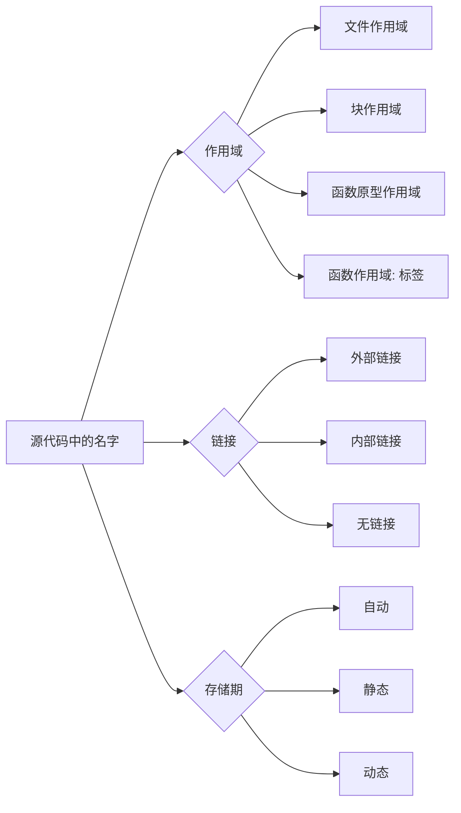

# 标识符与变量

## 标识符

标识符是程序员为变量、函数、结构体、枚举常量等实体取的名字。它只负责“指路”，真正保存数据的是对象本身。

### 命名规则

* 只能使用英文字母（`A-Z`、`a-z`）、数字（`0-9`）和下划线（`_`）。
* 第一个字符不能是数字。
* 不能使用 C 语言关键字，例如 `int`、`return`、`static`。
* C 区分大小写：`count`、`Count` 和 `COUNT` 是三个不同的标识符。
* 标准只规定实现必须识别一定长度的标识符，现代 GCC、Clang 和 MSVC 通常允许远超过 8 个字符。因此，“C89 只能使用 8 个字符” 是早期编译器的历史限制，不是今天的通用规则。

命名时优先选择能表达用途的名字。`student_count` 比 `n` 更容易维护；循环下标使用 `i`、`j` 则是约定俗成的例外。

> 有的说为了纪念杰出的计算机科学家 **Dijkstra**，取其中 **ijk** 作为循环变量。真正原因是 1957 年 FORTRAN 规定 I–N 开头默认是整数，循环变量又必须是整数，于是 i、j、k 成了最顺手的选择。又或许是因为 **j** 是 jndex，而 **k** 是 kndex \~\~\~

```c
int student_count = 30;     // 合法，含义清楚
int 2nd_count = 2;          // 错误：不能以数字开头
int return = 0;             // 错误：return 是关键字
int total-cost = 10;        // 错误：连字符不是标识符字符
```

## 变量、声明与定义

变量是一个有类型、名字和存储位置的对象。最常见的定义形式是：

```c
数据类型 变量名;
数据类型 变量名 = 初始值;
```

```c
int  sum = 10; 
float pi = 3.14f;
char  ch = 'a';
```

_声明_ 和 _定义_ 经常一起出现，但不是同一个概念：

* **声明（declaration）**&#x544A;诉编译器某个名字及其类型，让后续代码能够使用它。
* **定义（definition）**    是会创建对象或函数实体的声明。定义变量通常需要为对象保留存储空间，定义函数则提供函数体。

例如，下面的 `extern` 声明不创建变量，变量实体在另一个源文件中定义：


```c
extern int counter;       // 声明，不分配 counter 的存储空间
```



```c
int counter = 0;          // 定义，创建变量
```


注意：声明不一定&#x90FD;_&#x4E0D;分配内存_。函数声明通常没有函数体，但变量的定义也是一种声明；判断关键在于它是否创建了实体，而不是死&#x8BB0;_&#x58F0;明无内存、定义有内存_。

## 作用域、链接与存储期

这三个词描述的是不同问题：

<table><thead><tr><th width="99.99993896484375">概念</th><th width="389">回答的问题</th><th>例子</th></tr></thead><tbody><tr><td>作用域</td><td>在源代码的哪一段可以直接写出这个名字？</td><td>块作用域、文件作用域</td></tr><tr><td>链接</td><td>不同源文件中的同名标识符是否指向同一个实体？</td><td>外部链接、内部链接、无链接</td></tr><tr><td>存储期</td><td>对象从什么时候存在到什么时候消失？</td><td>自动、静态、动态</td></tr></tbody></table>

可以把它们理解成三张不同的地图：作用域管“看不看得见”，链接管“是不是同一个人”，存储期管“住多久”。



### 文件作用域与全局变量

定义在所有函数外的标识符具有文件作用域，从声明处一直到当前源文件末尾：

```c
#include <stdio.h>
int total = 500;  // 文件作用域；默认具有外部链接
int main(void)
{
    printf("%d\\n", total);
    return 0;
}
```

全局变量和文件作用域的静态变量都具有静态存储期。未显式初始化时，它们会被初始化为零（整数为 `0`，浮点数为 `0.0`，指针为空指针常量）。

### 块作用域与局部变量

在函数或复合语句（由花括号包围的代码块）中定义的普通变量具有块作用域。内层同名变量会遮蔽外层变量，离开内层代码块后，外层变量仍然可见：

```c
#include <stdio.h>
int main(void)
{
    int value = 100;
    {
        int value = 0;       // 遮蔽外层 value
        printf("inner: %d\\n", value);
    }
    printf("outer: %d\\n", value);
    return 0;
}
```

输出为：

```
inner: 0
outer: 100
```

这里的 `value` 是两个不同的对象。C 语言没有 C++ 的 `::` 作用域解析运算符，遇到同名变量时，应通过重命名或缩小作用域来减少混淆。

## `static` 关键字

`static` 的含义取决于它出现的位置。它主要影响链接或存储期，不是一个“让变量永远不变”的关键字；需要只读语义时，应使用 `const`。

### 文件作用域的 `static`：限制链接范围

在函数外定义的变量或函数前加 `static`，它获得内部链接，只能在当前 `.c` 文件中使用，其他源文件无法通过 `extern` 访问，这种写法适合实现模块的私有状态和辅助函数，也能避免大型项目中不同源文件的同名冲突。


```c
static int cache = 0;  // 只有 math_helpers.c 能访问
static int square(int x)  // 只有 math_helpers.c 能调用
{
    return x * x;
}
```


这种写法常用于实现模块的内部变量和辅助函数，也可以避免多个源文件之间出现同名冲突。

例如：


```c
static int hidden = 1;  // 当前文件私有
int visible = 2;        // 默认具有外部链接
```



```c
extern int visible;     // 可以访问
// extern int hidden;   // 错误：hidden 具有内部链接
```


编译链接时，`visible` 可以被其他源文件使用，而 `hidden` 只能在 `module.c` 中使用。

### 块作用域的 `static`：延长存储期

在函数内部定义局部变量时，如果使用 `static`，变量仍然具有块作用域，但存储期会延长到整个程序运行期间。

普通局部变量每次进入函数时都会重新创建，函数返回后通常失效；局部静态变量只初始化一次，函数返回后仍然保留原来的值。

```c
#include <stdio.h>
void print_call_count(void)
{
    static int count;  // 只初始化一次，默认值为 0
    ++count;
    printf("call %d\n", count);
}
int main(void)
{
    print_call_count();  // call 1
    print_call_count();  // call 2
    print_call_count();  // call 3

    return 0;
}
```

输出：

```
call 1
call 2
call 3
```

这里的 `count` 只能在 `print_call_count` 函数内部访问，但它的值不会因为函数返回而丢失。它适合保存调用次数、少量缓存数据等状态。

从 C 语言标准的角度看，`static` 改变的是存储期；至于变量具体放在栈、数据段还是其他内存区域，属于编译器和目标平台的实现细节。通常情况下，局部静态变量会被放在静态存储区域中。

### 多文件示例


```c
static int hidden = 1;
int visible = 2;
```



```c
extern int visible;
// extern int hidden;  // 错误：hidden 具有内部链接
```


编译链接时，`visible` 可以被 `main.c` 使用，`hidden` 则只存在于 `module.c` 的命名范围内。

### `static` 的作用总结

| 使用位置         | 主要作用              |
| ------------ | ----------------- |
| 文件作用域变量前     | 限制为当前源文件可见，获得内部链接 |
| 文件作用域函数前     | 限制函数只能在当前源文件中调用   |
| 函数内部变量前      | 保持变量值，存储期延长到程序结束  |
| 未初始化的静态存储期变量 | 自动初始化为零           |

> 文件外的 `static` 负责“隐藏”，函数内的 `static` 负责“记住”。

## 命名、接口契约与所有权

_以下内容做了解即可_

在定义变量名时应说明数据的含义，而不是只说明它的类型。`count` 表示元素数量，`capacity` 表示容量，`length` 表示字符串或序列的长度；三者不能混用。`data1`、`tmp`、`flag` 这类名称只有在作用域很小、含义非常明确时才适合使用。

指针变量除了类型，还应说明它指向什么、是否允许为空以及由谁负责释放。建议在接口注释中明确写出这些约定：

```c
/*
 * buffer:
 *   借用的可写数组，不能为 NULL。
 * count:
 *   buffer 中可写入的元素数量。
 *
 * 函数不会释放 buffer，也不会保存它的地址。
 * 返回 0 表示成功，返回 -1 表示参数无效。
 */
int fill_values(int *buffer, size_t count);
```

这里的 `buffer` 是借用指针。调用者仍然拥有这块内存，函数只能在调用期间使用它，不能对它调用 `free`，也不能在函数返回后继续保存这个地址。

如果函数申请内存并把结果交给调用者，就应明确说明所有权已经转移：

```c
/*
 * 返回一份新分配的字符串。
 * 成功后调用者拥有返回值，使用完毕后必须调用 free。
 * 申请失败时返回 NULL。
 */
char *duplicate_text(const char *source);
```

一种简单的实现如下：

```c
#include <stdlib.h>
#include <string.h>
​
char *duplicate_text(const char *source) {
    if (source == NULL) {
        return NULL;
    }
​
    size_t length = strlen(source);
    char *copy = malloc(length + 1);
    if (copy == NULL) {
        return NULL;
    }
​
    memcpy(copy, source, length + 1);
    return copy;
}
```

调用者负责释放返回的内存：

```c
char *copy = duplicate_text("hello");
if (copy != NULL) {
    puts(copy);
    free(copy);
}
```

### 常见的三种指针关系

#### **借用指针**

函数暂时使用调用者提供的对象，不负责释放：

```c
void print_text(const char *text);
```

`text` 可以是字符串字面量、字符数组或动态字符串。函数不会修改它，也不会释放它。

#### **拥有指针**

指针指向的对象由当前代码负责释放：

```c
void destroy_buffer(int *buffer) {
    free(buffer);
}
```

调用 `destroy_buffer` 后，调用者不能再使用原来的指针。

#### **所有权转移**

函数把对象的管理责任交给另一个函数或调用者。转移之后，原来的所有者不能再次释放同一对象：

```c
int *create_value(int value) {
    int *result = malloc(sizeof *result);
    if (result != NULL) {
        *result = value;
    }
    return result;
}
int *value = create_value(42);
if (value != NULL) {
    printf("%d\n", *value);
    free(value);
}
```

#### 数组参数必须配合长度

数组传给函数时通常会退化为指向首元素的指针，函数无法通过指针本身知道数组有多少个元素。因此，数组参数应同时传入长度：

```c
#include <stddef.h>
​
int sum_values(const int values[], size_t count) {
    int total = 0;
​
    for (size_t i = 0; i < count; ++i) {
        total += values[i];
    }
​
    return total;
}
```

调用时：

```c
int values[] = {1, 2, 3, 4};
size_t count = sizeof values / sizeof values[0];

printf("%d\n", sum_values(values, count));
```

如果函数需要修改数组内容，可以使用 `int values[]` 或 `int *values`；如果只读取数据，应加上 `const`：

```c
void sort_values(int values[], size_t count);
int sum_values(const int values[], size_t count);
```

`const` 表示函数不能通过这个参数修改数组元素，但不表示数组一定不能被其他代码修改。

#### `NULL` 参数约定

接口应明确说明参数是否允许为 `NULL`。如果不允许，函数应尽早检查：

```c
int first_value(const int *values, size_t count, int *result) {
    if (values == NULL || result == NULL || count == 0) {
        return -1;
    }

    *result = values[0];
    return 0;
}
```

如果 `NULL` 表示“没有结果”或“使用默认配置”，则应在注释中写明，而不是让调用者猜测：

```c
/*
 * options 可以为 NULL。
 * 为 NULL 时使用默认配置。
 */
int run_task(const char *input, const Options *options);
```

#### 资源释放和错误路径

一个函数申请多块资源时，失败路径必须释放已经成功申请的部分：

```c
#include <stdlib.h>

int create_pair(int **first, int **second) {
    if (first == NULL || second == NULL) {
        return -1;
    }

    *first = malloc(sizeof **first);
    if (*first == NULL) {
        return -1;
    }

    *second = malloc(sizeof **second);
    if (*second == NULL) {
        free(*first);
        *first = NULL;
        return -1;
    }

    return 0;
}
```

调用者获得成功结果后，也必须释放两块内存：

```c
int *first = NULL;
int *second = NULL;

if (create_pair(&first, &second) == 0) {
    *first = 10;
    *second = 20;

    free(first);
    free(second);
}
```

#### 作用域与共享状态

作用域越小，代码越容易检查。局部变量应优先放在函数内部；只有确实需要被多个函数共享的状态，才考虑文件作用域。文件作用域的变量应尽量使用 `static`，避免污染其他源文件：


```c
static int request_count;

void record_request(void) {
    ++request_count;
}

int request_total(void) {
    return request_count;
}
```


这里的 `request_count` 只能在 `counter.c` 中访问。其他源文件只能通过公开函数使用它，不能直接修改内部状态。

综上所述，本节描述的规则可以概括为：

* 名称说明含义，类型说明表示方式；
* 指针接口说明有效范围、可否为 `NULL` 和释放责任；
* 数组参数同时传入元素数量；
* 返回新内存时明确所有权；
* 失败路径释放已经获得的资源；
* 共享状态尽量隐藏在源文件内部。
