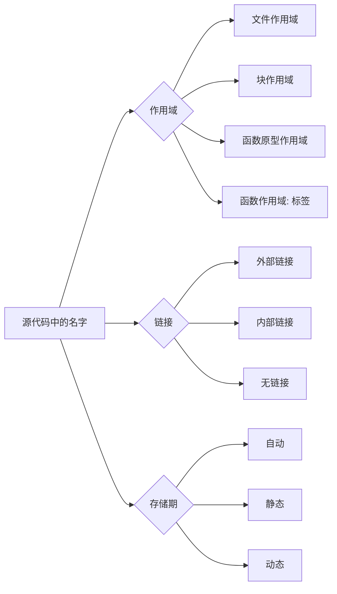

# 标识符与变量

> **学习路径**：本章把“对象是什么”推进到“对象在哪里可见、能活多久”。变量的声明、定义和链接属性会直接影响多文件编译；接下来先用输入输出把这些对象与用户交互连接起来。

## 标识符

标识符是程序员为变量、函数、结构体、枚举常量等实体取的名字。它只负责“指路”，真正保存数据的是对象本身。

### 命名规则

* 只能使用英文字母（`A-Z`、`a-z`）、数字（`0-9`）和下划线（`_`）。
* 第一个字符不能是数字。
* 不能使用 C 语言关键字，例如 `int`、`return`、`static`。
* C 区分大小写：`count`、`Count` 和 `COUNT` 是三个不同的标识符。
* 标准只规定实现必须识别一定长度的标识符，现代 GCC、Clang 和 MSVC 通常允许远超过 8 个字符。因此，“C89 只能使用 8 个字符”是早期编译器的历史限制，不是今天的通用规则。

命名时优先选择能表达用途的名字。`student_count` 比 `n` 更容易维护；循环下标使用 `i`、`j` 则是约定俗成的例外。

```c
int student_count = 30;     // 合法，含义清楚
int 2nd_count = 2;          // 错误：不能以数字开头
int return = 0;             // 错误：return 是关键字
int total-cost = 10;        // 错误：连字符不是标识符字符
```

## 变量、声明与定义

变量是一个有类型、名字和存储位置的对象。最常见的定义形式是：

```c
数据类型 变量名;
数据类型 变量名 = 初始值;
```

```c
int sum = 10; 
float pi = 3.14f;
char ch = 'a';
```

“声明”和“定义”经常一起出现，但不是同一个概念：

* **声明（declaration）**&#x544A;诉编译器某个名字及其类型，让后续代码能够使用它。
* **定义（definition）**&#x662F;会创建对象或函数实体的声明。定义变量通常需要为对象保留存储空间，定义函数则提供函数体。

例如，下面的 `extern` 声明不创建变量，变量实体在另一个源文件中定义：

```c
/* counter.h */
extern int counter;       // 声明，不分配 counter 的存储空间

/* counter.c */
int counter = 0;          // 定义，创建变量
```

注意：声明不一定都“不分配内存”。函数声明通常没有函数体，但变量的定义也是一种声明；判断关键在于它是否创建了实体，而不是死记“声明无内存、定义有内存”。

## 作用域、链接与存储期

这三个词描述的是不同问题：

<table><thead><tr><th width="99.99993896484375">概念</th><th width="389">回答的问题</th><th>例子</th></tr></thead><tbody><tr><td>作用域</td><td>在源代码的哪一段可以直接写出这个名字？</td><td>块作用域、文件作用域</td></tr><tr><td>链接</td><td>不同源文件中的同名标识符是否指向同一个实体？</td><td>外部链接、内部链接、无链接</td></tr><tr><td>存储期</td><td>对象从什么时候存在到什么时候消失？</td><td>自动、静态、动态</td></tr></tbody></table>

可以把它们理解成三张不同的地图：作用域管“看不看得见”，链接管“是不是同一个人”，存储期管“住多久”。



### 文件作用域与全局变量

定义在所有函数外的标识符具有文件作用域，从声明处一直到当前源文件末尾：

```c
#include <stdio.h>

int total = 500;  // 文件作用域；默认具有外部链接

int main(void)
{
    printf("%d\\n", total);
    return 0;
}
```

全局变量和文件作用域的静态变量都具有静态存储期。未显式初始化时，它们会被初始化为零（整数为 `0`，浮点数为 `0.0`，指针为空指针常量）。

### 块作用域与局部变量

在函数或复合语句（由花括号包围的代码块）中定义的普通变量具有块作用域。内层同名变量会遮蔽外层变量，离开内层代码块后，外层变量仍然可见：

```c
#include <stdio.h>

int main(void)
{
    int value = 100;
    {
        int value = 0;       // 遮蔽外层 value
        printf("inner: %d\\n", value);
    }

    printf("outer: %d\\n", value);
    return 0;
}
```

输出为：

```
inner: 0
outer: 100
```

这里的 `value` 是两个不同的对象。C 语言没有 C++ 的 `::` 作用域解析运算符，遇到同名变量时，应通过重命名或缩小作用域来减少混淆。

## `static` 关键字

`static` 的含义取决于它出现的位置。它主要影响链接或存储期，不是一个“让变量永远不变”的关键字；需要只读语义时，应使用 `const`。

### 文件作用域的 `static`：限制链接范围

在函数外定义的变量或函数前加 `static`，它获得内部链接，只能在当前 `.c` 文件中使用，其他源文件无法通过 `extern` 访问，这种写法适合实现模块的私有状态和辅助函数，也能避免大型项目中不同源文件的同名冲突。


```c
static int cache = 0;  // 只有 math_helpers.c 能访问
static int square(int x)  // 只有 math_helpers.c 能调用
{
    return x * x;
}
```


这种写法常用于实现模块的内部变量和辅助函数，也可以避免多个源文件之间出现同名冲突。

例如：


```c
static int hidden = 1;  // 当前文件私有
int visible = 2;        // 默认具有外部链接
```



```c
extern int visible;     // 可以访问

// extern int hidden;   // 错误：hidden 具有内部链接
```


编译链接时，`visible` 可以被其他源文件使用，而 `hidden` 只能在 `module.c` 中使用。

### 块作用域的 `static`：延长存储期

在函数内部定义局部变量时，如果使用 `static`，变量仍然具有块作用域，但存储期会延长到整个程序运行期间。

普通局部变量每次进入函数时都会重新创建，函数返回后通常失效；局部静态变量只初始化一次，函数返回后仍然保留原来的值。

```c
#include <stdio.h>

void print_call_count(void)
{
    static int count;  // 只初始化一次，默认值为 0

    ++count;
    printf("call %d\n", count);
}

int main(void)
{
    print_call_count();  // call 1
    print_call_count();  // call 2
    print_call_count();  // call 3

    return 0;
}
```

输出：

```
call 1
call 2
call 3
```

这里的 `count` 只能在 `print_call_count` 函数内部访问，但它的值不会因为函数返回而丢失。它适合保存调用次数、少量缓存数据等状态。

从 C 语言标准的角度看，`static` 改变的是存储期；至于变量具体放在栈、数据段还是其他内存区域，属于编译器和目标平台的实现细节。通常情况下，局部静态变量会被放在静态存储区域中。

### 多文件示例

```c
/* module.c */
static int hidden = 1;
int visible = 2;
```

```c
/* main.c */
extern int visible;
// extern int hidden;  // 错误：hidden 具有内部链接
```

编译链接时，`visible` 可以被 `main.c` 使用，`hidden` 则只存在于 `module.c` 的命名范围内。

### `static` 的作用总结

| 使用位置         | 主要作用              |
| ------------ | ----------------- |
| 文件作用域变量前     | 限制为当前源文件可见，获得内部链接 |
| 文件作用域函数前     | 限制函数只能在当前源文件中调用   |
| 函数内部变量前      | 保持变量值，存储期延长到程序结束  |
| 未初始化的静态存储期变量 | 自动初始化为零           |

> 文件外的 `static` 负责“隐藏”，函数内的 `static` 负责“记住”。

## 命名与所有权

变量名应说明数据含义，而不是只说明类型。指针变量还应在接口文档中说明它是否允许为 `NULL`、指向单个对象还是数组、由谁释放。作用域越小越容易验证；只有确实需要跨函数或跨文件共享的状态，才提升到文件作用域。
