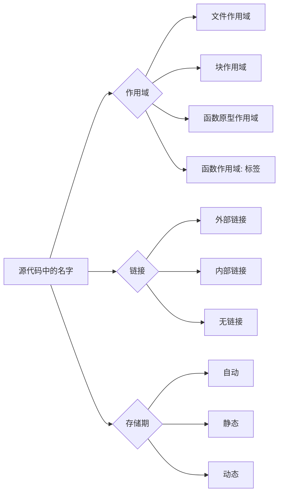

# 标识符与变量

## 标识符

标识符是程序员为变量、函数、结构体、枚举常量等实体取的名字。它只负责“指路”，真正保存数据的是对象本身。

### 命名规则

* 只能使用英文字母（`A-Z`、`a-z`）、数字（`0-9`）和下划线（`_`）。
* 第一个字符不能是数字。
* 不能使用 C 语言关键字，例如 `int`、`return`、`static`。
* C 区分大小写：`count`、`Count` 和 `COUNT` 是三个不同的标识符。

关于长度，标准规定的是实现必须识别的**有效字符数**，超出部分可以被忽略：

| 标准版本      | 内部标识符（含宏名） | 外部标识符 |
| --------- | ---------- | ----- |
| C89 / C90 | 31 个       | 6 个   |
| C99 及以后   | 63 个       | 31 个  |

现代编译器支持的字符数远超这个下限，但"只有前 N 个字符有效"这条规则在跨编译器协作时仍值得留意。

### 保留标识符

以下几类名字不属于使用者，写代码时应避开：

* 以两个下划线开头，或以下划线加一个大写字母开头的标识符，保留给实现用于任何用途，例如 `__FILE__`、`_Bool`。
* 以下划线开头的标识符，在文件作用域保留。因此 `_local` 作为局部变量可以，作为文件作用域的变量名或函数名不可以。
* 标准库中的名字（`printf`、`size_t`、`NULL` 等）在包含对应头文件后保留，不应另作他用。

```c
int __count = 0;    // 保留给实现，不应使用
int _Count  = 0;    // 保留给实现，不应使用
int _count  = 0;    // 文件作用域保留，块作用域可用
```

### 命名建议

名字应当说明数据的含义，而不只是类型。`count` 表示元素数量，`capacity` 表示容量，`length` 表示字符串或序列的长度，三者不宜混用。`data1`、`tmp`、`flag` 这类名字只适合作用域很小、含义一目了然的场合。

循环下标使用 `i`、`j`、`k` 是约定俗成的例外。这个习惯可以追溯到 FORTRAN：它的隐式类型规则规定以 I 到 N 开头的变量名默认为整型，而循环变量必须是整数，于是 `i`、`j`、`k` 成了最顺手的选择。

> 至于 "为了纪念 Dijkstra，取 D**ijk**stra 中的 `ijk`" 这个说法，是流传已久的程序员笑话。

```c
int student_count = 30;     // 合法，含义清楚
int 2nd_count = 2;          // 错误：不能以数字开头
int return = 0;             // 错误：return 是关键字
int total-cost = 10;        // 错误：连字符不是标识符字符
```

## 变量、声明与定义

变量是一个有类型、名字和存储位置的对象。最常见的定义形式是：

```c
数据类型 变量名;
数据类型 变量名 = 初始值;
```

```c
int  sum = 10; 
float pi = 3.14f;
char  ch = 'a';
```

### 声明与定义

声明告诉编译器某个名字及其类型，让后续代码可以使用它。定义是会创建对象或函数实体的声明：定义变量需要为对象保留存储空间，定义函数需要提供函数体。

两者的区别不在于 "有没有内存"，而在于是否创建了实体。函数声明通常没有函数体，但它依然是声明；变量的定义同时也是声明。判断标准是这条语句有没有产生一个实体。

跨文件共享变量时，声明与定义分开写。例如，下面的 `extern` 声明不创建变量，变量实体在另一个源文件中定义：


```c
extern int counter;       // 声明，不分配 counter 的存储空间
```



```c
int counter = 0;          // 定义，创建变量
```


注意：声明不一定&#x90FD;_&#x4E0D;分配内存_。函数声明通常没有函数体，但变量的定义也是一种声明；判断关键在于它是否创建了实体，而不是死&#x8BB0;_&#x58F0;明无内存、定义有内存_。

### 一个定义规则

具有外部链接的对象和函数，在整个程序中只能有一个定义，但可以有任意多个声明。

```c
int total = 10;    // 定义
int total = 20;    // 错误：重复定义，链接阶段报错
```

文件作用域下不带初始化器的 `int total;` 是**试探性定义**：它同时具有声明和定义的性质，同一个翻译单元内允许出现多次，最终合并为一个定义。

```c
int total;         // 试探性定义
int total;         // 允许，与上一条合并
```

函数同理：

```c
int add(int a, int b);            // 声明，可以出现多次
int add(int a, int b) { return a + b; }   // 定义，只能出现一次
```

### 初始化

初始化规则取决于对象的存储期，这一点容易被忽略。

静态存储期的对象（文件作用域变量、`static` 局部变量）在程序启动前完成初始化。未显式初始化时被置零：整数为 `0`，浮点数为 `0.0`，指针为空指针常量。初始化器必须是常量表达式，因此不能在文件作用域写 `int x = f();`。

自动存储期的对象（普通局部变量、函数参数）每次进入代码块时创建。未显式初始化时，它的值是**不确定的**，读取这种值是未定义行为：

```c
#include <stdio.h>
​
int main(void)
{
    int value;              // 未初始化，值不确定
    printf("%d\n", value);  // 未定义行为
    return 0;
}
```

编译器通常不会为此报错，`-Wall -Wextra` 也不一定提示。局部变量应当在使用前显式赋值。

## 作用域、链接与存储期

这三个概念回答的是不同问题，遇到一个标识符时可以依次对照：

<table><thead><tr><th width="99.20001220703125">概念</th><th>回答的问题</th><th>取值</th></tr></thead><tbody><tr><td>作用域</td><td>在源代码的哪一段可以直接写出这个名字？</td><td>块作用域、文件作用域、函数原型作用域、函数作用域</td></tr><tr><td>链接</td><td>不同源文件中的同名标识符是否指向同一个实体？</td><td>外部链接、内部链接、无链接</td></tr><tr><td>存储期</td><td>对象从什么时候存在到什么时候消失？</td><td>自动、静态、动态、线程</td></tr></tbody></table>

三者相互独立。函数内部的 `static` 变量具有块作用域和静态存储期；`malloc` 返回的对象没有可以直接书写的标识符，但具有动态存储期。

每个作用域的定义与示例、四种存储期的对照、以及程序加载后的内存区域划分，见[**可见性和生存期**](scope-lifetime.md)一章。


```mermaid
flowchart LR
    A[源代码中的名字] --> B{作用域}
    B --> B1[文件作用域]
    B --> B2[块作用域]
    B --> B3[函数原型作用域]
    B --> B4[函数作用域: 标签]
    A --> C{链接}
    C --> C1[外部链接]
    C --> C2[内部链接]
    C --> C3[无链接]
    A --> D{存储期}
    D --> D1[自动]
    D --> D2[静态]
    D --> D3[动态]
```

### 文件作用域与全局变量

定义在所有函数外的标识符具有文件作用域，从声明处一直到当前源文件末尾：

```c
#include <stdio.h>
int total = 500;  // 文件作用域；默认具有外部链接
int main(void)
{
    printf("%d\n", total);
    return 0;
}
```

全局变量和文件作用域的静态变量都具有静态存储期。未显式初始化时，它们会被初始化为零（整数为 `0`，浮点数为 `0.0`，指针为空指针常量）。

### 块作用域与局部变量

在函数或复合语句（由花括号包围的代码块）中定义的普通变量具有块作用域。内层同名变量会遮蔽外层变量，离开内层代码块后，外层变量仍然可见：

```c
#include <stdio.h>
int main(void)
{
    int value = 100;
    {
        int value = 0;       // 遮蔽外层 value
        printf("inner: %d\n", value);
    }
    printf("outer: %d\n", value);
    return 0;
}
```

输出为：

```
inner: 0
outer: 100
```

这里的 `value` 是两个不同的对象。C 语言没有 C++ 的 `::` 作用域解析运算符，遇到同名变量时，应通过重命名或缩小作用域来减少混淆。

### 存储类说明符

存储类说明符写在声明的开头，用来指定对象的存储期或链接属性。

<table><thead><tr><th width="141.5999755859375">说明符</th><th width="165.5999755859375">作用</th><th>说明</th></tr></thead><tbody><tr><td><code>auto</code></td><td>自动存储期</td><td>块作用域对象的默认属性，C 中几乎不写</td></tr><tr><td><code>register</code></td><td>建议放入寄存器</td><td>不能对该对象取地址；现代编译器通常忽略这个建议</td></tr><tr><td><code>static</code></td><td>见下节</td><td>文件作用域改变链接，块作用域改变存储期</td></tr><tr><td><code>extern</code></td><td>声明而非定义</td><td>用于引用其他翻译单元的对象或函数</td></tr><tr><td><code>_Thread_local</code></td><td>线程存储期（C11）</td><td>可与 <code>static</code> 或 <code>extern</code> 组合</td></tr><tr><td><code>typedef</code></td><td>定义类型别名</td><td>语法上位于存储类说明符的位置，但不是存储类</td></tr></tbody></table>

## static

`static` 的含义取决于它出现的位置。它主要影响链接或存储期，不是一个“让变量永远不变”的关键字；需要只读语义时，应使用 `const`。

### 文件作用域的 `static`：限制链接范围

在函数外定义的变量或函数前加 `static`，它获得内部链接，只能在当前 `.c` 文件中使用，其他源文件无法通过 `extern` 访问，这种写法适合实现模块的私有状态和辅助函数，也能避免大型项目中不同源文件的同名冲突。


```c
static int cache = 0;  // 只有 math_helpers.c 能访问
static int square(int x)  // 只有 math_helpers.c 能调用
{
    return x * x;
}
```


这种写法常用于实现模块的内部变量和辅助函数，也可以避免多个源文件之间出现同名冲突。

例如：


```c
static int hidden = 1;  // 当前文件私有
int visible = 2;        // 默认具有外部链接
```



```c
extern int visible;     // 可以访问
// extern int hidden;   // 错误：hidden 具有内部链接
```


编译链接时，`visible` 可以被其他源文件使用，而 `hidden` 只能在 `module.c` 中使用。

`extern int hidden;` 这条声明本身是合法的，问题出现在链接阶段：`hidden` 在定义它的翻译单元里具有内部链接，不会进入外部符号表，其他翻译单元找不到它。这属于链接错误，不是编译错误。

### 块作用域的 `static`：延长存储期

在函数内部定义局部变量时，如果使用 `static`，变量仍然具有块作用域，但存储期会延长到整个程序运行期间。

普通局部变量每次进入函数时都会重新创建，函数返回后通常失效；局部静态变量只初始化一次，函数返回后仍然保留原来的值。

```c
#include <stdio.h>
void print_call_count(void)
{
    static int count;  // 只初始化一次，默认值为 0
    ++count;
    printf("call %d\n", count);
}
int main(void)
{
    print_call_count();  // call 1
    print_call_count();  // call 2
    print_call_count();  // call 3

    return 0;
}
```

输出：

```
call 1
call 2
call 3
```

这里的 `count` 只能在 `print_call_count` 函数内部访问，但它的值不会因为函数返回而丢失。它适合保存调用次数、少量缓存数据等状态。

从 C 语言标准的角度看，`static` 改变的是存储期；至于变量具体放在栈、数据段还是其他内存区域，属于编译器和目标平台的实现细节。通常情况下，局部静态变量会被放在静态存储区域中。

需要留意两点。一是初始化发生在第一次执行到该声明之前，C11 之前的标准不保证多线程下的初始化是原子的；需要线程私有的状态应使用 `_Thread_local`。二是 `static` 改变的是语言层面的存储期，至于对象具体落在哪个内存区域，属于编译器与目标平台的实现细节。

<table><thead><tr><th width="287">使用位置</th><th>主要作用</th></tr></thead><tbody><tr><td>文件作用域变量前</td><td>限制为当前源文件可见，获得内部链接</td></tr><tr><td>文件作用域函数前</td><td>限制函数只能在当前源文件中调用</td></tr><tr><td>函数内部变量前</td><td>保持变量值，存储期延长到程序结束</td></tr><tr><td>未初始化的静态存储期变量</td><td>自动初始化为零</td></tr></tbody></table>

## extern

`extern` 表示这是一条声明而不是定义，用于引用其他翻译单元中定义的对象或函数。

```c
extern int counter;              // 引用别处定义的 counter
int read_counter(void);          // 函数声明默认具有外部链接
```

在块作用域内使用 `extern`，可以引用文件作用域的对象：

```c
void print_global(void)
{
    extern int total;    // 引用文件作用域的 total
    printf("%d\n", total);
}
```

## 其余说明符

`auto` 是块作用域对象的默认存储期，显式写出没有任何额外效果，实际代码中基本不用。`register` 只是对编译器的建议，同时禁止对该对象取地址；现代优化器自行决定是否放入寄存器，这个关键字已经失去实际意义。

`_Thread_local` 是 C11 引入的线程存储期说明符。每个线程拥有该对象的一份独立副本，适合线程私有的计数器或缓存：

```c
_Thread_local int thread_counter;
```
