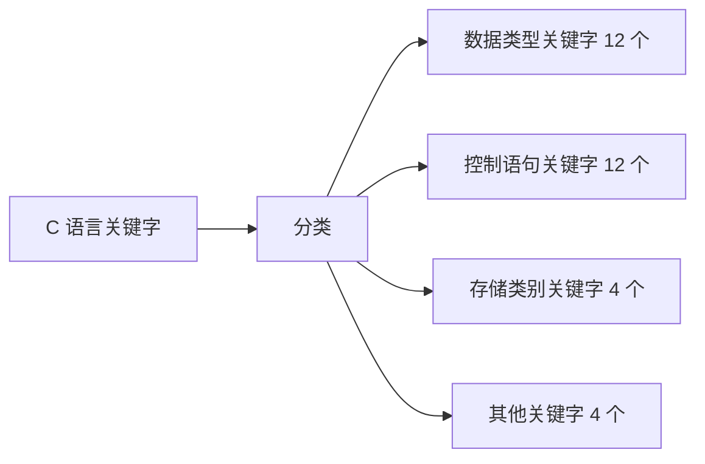
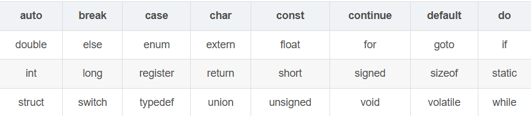

# 关键字

C语言标准定义的32个关键字可以分为如下四类：



#### 1. 数据类型关键字

| 序号 | 关键字 | 说明 |
| -------- |--------- |--------- |
| 1	| char |	声明字符变量 |
| 2  | double |	声明双精度变量 |
| 3	| float |	声明浮点型变量| 
| 4 | int |	声明整型变量 |
| 5	| short |	声明短整型变量 |
| 6	| long |	声明长整型变量 |
| 7	| unsigned |	声明无符号类型变量 |
| 8	| signed |	声明有符号类型变量 |
| 9	| struct |	声明结构体变量 |
| 10 | union |	声明共用体或联合数据类型 |
| 11 | void	|声明函数无返回值或无参数，声明无类型指针  |
| 12 | enum |	声明枚举类型 |

**重点说明：**
1、**chart、short、int、long、float、double**
有一个常被提及的问题：int类型究竟占多少个字节？一般默认为4个字节，而有一点功底的人都知道它的大小是跟机器有关的，感兴趣的可以查看其它文章。int具体大小可用sizeof（unsigned int）关键字查看，代码如下：

```c
# include <stdio.h>
void main()
{
	printf("char类型变量大小为%d字节\n",sizeof(char));
	printf("short类型变量大小为%d字节\n",sizeof(short));
	printf("int类型变量大小为%d字节\n",sizeof(int));
	printf("long类型变量大小为%d字节\n",sizeof(long));
	printf("float类型变量大小为%d字节\n",sizeof(float));
	printf("double类型变量大小为%d字节\n",sizeof(double));	
}
```

运行结果：


2、signed、unsigned
signed和nsigned用于修饰整数类型。默认的int、short、long为有符号数，如signed int 等价于 int(其它类推)。

另外，char共有三种不同的类型：char、signed char、unsigned char。char类型是真正的字符类型，用来声明字符；而signed char和unsigned char是用来声明数值的。因此不要将三者混用。

数值范围如下：
signed char表示范围：[-128, 128)；
unsigned char表示范围：[0, 256)；

3、struct
在实际问题中，一组数据往往具有不同的数据类型。struct关键字就可以将这些不同数据类型的数据打包成一种构造数据类型。这种构造类型由多个成员组成，每一个成员可以是一个基本数据类型或者另一个构造类型。一般情况下，结构体所占内存大小是其成员所占内存之和。但空结构体的内存大小在不同编译器里有0有1，读者可以试一试。

4、union
union关键字用法与struct非常相似，但也有区别。struct中的所有数据成员是共存的，不管有没有调用，编译器都会分配内存；而union中的数据成员是互斥的，它只配置一个足够大的空间来容纳最大长度的数据成员。即union中所有数据成员共用一个空间，同一时间只能存储其中一个数据成员，所有数据成员具有相同起始地址。

5、void
void的作用是对函数返回值的限定、对函数参数的限定和声明空类型指针。如果定义函数时不加返回类型限定，则编译器会作为返回整型处理，而不是void, 用void声明的函数表示该函数无返回值；同理，当函数无参数时，可以给无参数函数传送任意类型的参数而不影响程序执行，只有用void指明函数参数时，给无参函数传入参数时编译器才会报错。
另外，不同数据类型的指针必须经过类型强制转换后才能相互赋值，而void指针可以接受来自任意数据类型的指针赋值，但void指针不能在没有强制类型转换下直接赋值给其它类型的指针。

#### 2. 控制语句关键字

1、循环语句类型关键字（5个）

| 序号 | 关键字   | 说明                       |
| ---- | -------- | -------------------------- |
| 1    | for      | 遍历循环                   |
| 2    | do       | 其后紧跟循环体             |
| 3    | while    | 条件循环或死循环           |
| 4    | break    | 跳出当前循环               |
| 5    | continue | 终止本次循环，开始下次循环 |

2、条件语句类型关键字（3个）

| 序号 | 关键字 | 说明             |
| ---- | ------ | ---------------- |
| 6    | if     | 条件语句         |
| 7    | else   | 条件语句否定分支 |
| 8    | goto   | 无条件跳转语句   |

**重点说明：**
goto语句，有人主张禁用，有人主张慎用，个人认为用来跳出多重循环还是可以的。

3、开关语句类型关键字 （3个）

| 序号 | 关键字  | 说明               |
| ---- | ------- | ------------------ |
| 9    | switch  | 用于多条件判断语句 |
| 10   | case    | 多条件判断语句分支 |
| 11   | default | 开关语句的其它分支 |

重点说明：
switch、case组合语句可以看作为if、else语句的加强版。后者适用于二分支或嵌套较少的分支，前者则在面对多分支情况时有更高的效率。
case语句需要注意的点很多，如：
为了避免多个分支重叠，需要在case结尾加上break;
不要忘了default语句；
case语句的排序问题等。

4、返回语句类型关键字（1个）

| 序号 | 关键字 | 说明       |
| ---- | ------ | ---------- |
| 12   | return | 函数返回语 |

**重点说明：**
return用于终止一个函数，并返回其后面跟着的值。

#### 3. 存储类型关键字

| 序号 | 关键字   | 说明                     |
| ---- | -------- | ------------------------ |
| 1    | auto     | 声明自动变量             |
| 2    | extern   | 声明变量是在其他文件定义 |
| 3    | register | 声明寄存器变量           |
| 4    | static   | 声明静态变量             |

重点说明

在 C 语言里，auto、static、extern、register 这四个关键字主要用来修饰变量或函数，分别影响它们的存储方式、作用域、生命周期或是可见性

1. **auto** 关键字:它用来声明自动变量，也是编译器默认的变量存储类别 —— 就算你不写 auto，普通局部变量默认就是 auto 的。这种变量的内存是编译器自动分配的，存在栈区里，生命周期只限于它所在的代码块，比如函数、循环或者 if 语句块，代码块执行完，变量内存就会自动释放。不过要注意，auto 变量如果没初始化，里面的值是随机的，用之前最好显式赋值。

2. **static** 关键字:它的作用主要是限制作用域和延长生命周期，能修饰变量也能修饰函数。先看修饰变量的情况：如果在函数里用 static 修饰局部变量，这个变量的作用域还是只在函数内部，但生命周期会变成整个程序运行期间 —— 就算函数调用结束，它的值也不会丢，下次调用函数还能接着用，而且它的内存存在静态区，不是栈区，初始化也只在程序编译时做一次，之后不会重复初始化。如果用 static 修饰全局变量，那这个变量的作用域就仅限于定义它的文件，哪怕其他文件用 extern 声明也没法用它，能避免不同文件间的变量名冲突。再看修饰函数，给函数加 static 后，这个函数就只能在当前文件里被调用，其他文件看不到也用不了，同样是为了防止多文件下的函数名重复。

3. **extern** 关键字:它的作用很明确，就是声明某个变量或函数的定义在其他文件里，现在只是要在当前文件里用它。比如你在 A 文件里定义了一个全局变量 int num，想在 B 文件里用，就在 B 文件里写 extern int num，这样编译器链接的时候就会去其他文件找 num 的定义。要注意的是，extern 只能做声明，不能定义变量 —— 比如 extern int num; 是声明，而 extern int num=10; 就变成定义了，这不符合它的用法。

4. **register** 关键字:它是请求编译器尽量把变量存到 CPU 的内部寄存器里，而不是普通内存。因为 CPU 访问寄存器比访问内存快得多，所以这种变量用起来效率更高，适合那些频繁被使用的变量，比如循环里的计数变量。不过这只是个 “请求”，编译器可能不会满足 —— 如果寄存器满了，变量还是会存在内存里。另外，因为寄存器不是内存，所以不能用 & 符号取 register 变量的地址，这是它的一个重要限制。

​	这四个关键字的核心区别在于影响的维度不同：auto 主要管默认的存储和生命周期，static 管作用域和生命周期，extern 管跨文件的声明引用，register 管高效存储。

> 寄存器其实就是一块一块小的存储空间，只不过其存储数据要比内存快得多。

四、其它关键字

| 序号 | 关键字   | 说明                         |
| ---- | -------- | ---------------------------- |
| 1    | const    | 声明只读变量                 |
| 2    | sizeof   | 计算数据类型长度（字节数）   |
| 3    | typedef  | 给数据类型取别名             |
| 4    | volatile | 所修饰的对象不能被编译器优化 |

重点说明：
1、const修饰只读变量，变量一旦赋初值就不能被修改。编译器不为只读变量分配内存，这使得它的效率也很高。
2、sizeof后面常跟这一对括号，但它绝对不是函数，它可以计算数据类型的大小，单位为字节。
3、typedef的意思是给一个已经存在的数据类型取一个别名，而不是定义新的数据类型。尤其是结构体之类的自定义数据类型，常常需要取一个适用于实际情况的别名。如：

```c
typedef struct Student
{
int a;
}Stu;
//这里的Stu实际上就是struct Student的别名
stu x; 
----------------------------------
struct Student
{
	int a;
};
typedef struct Student GYStud;//struct Student GYStud;全局结构体变量
typedef struct Student PStud;
typedef int Arr[10];
typedef int* PINT;
typedef unsigned int UINT;
int main(void){
    struct Student stu;//无typedef
    GYStud x,y;
    PStud s,p;
    Arr a,b = {1,2,3,};
    UNIT a,b = 10;
    PINT p = NULL,s;
    return 0;
}
//struct Student Student;编译通过
//类型名不是关键字,变量命可以同名

--------------------------------
#include <stdio.h>
#define SINT int *
typedef int* PINT;
int main(void){
	SINT a,b;
  //int *a,b;
    PINT p,s;
    return 0;
}
```

4、volatile是一种类型修饰符，编译器会对它修饰的变量进行特殊地址的稳定访问而不进行代码上的优化。那这里的优化具体指的是什么意思呢？

比如你想要吃苹果，这时你有两种选择，去苹果园（特殊地址）摘和去商店买，商店里的苹果来自苹果园。所谓的优化实际上是一种“偷懒”行为，当你每次吃苹果都只是去商店买而不去苹果园摘，就是一种优化行为。volatile关键字就是要你每次吃苹果时都只能去苹果园摘而不能去商店买，这就是特殊地址的稳定访问。因为商店里的苹果可能是坏的，已经改变的，而苹果园里的苹果一直都是新鲜的，完好的。

回到程序里一想，如果你需要某个变量的值稳定，而它又可能在程序执行过程中移到其它地方（商店）时发生改变，为了防止编译器“偷懒”，故你需要在这个关键字前用volatile修饰。
五、表格汇总
32个关键字如下：



### 预处理器：宏、断言与条件编译

预处理器在真正编译前处理 `#include`、宏和条件编译。宏参数必须加括号，否则调用者的运算符优先级可能改变结果：

```c
#define SQUARE(x) ((x) * (x))
```

即使写对了括号，`SQUARE(i++)` 仍会把 `i++` 求值两次。需要单次求值时，优先使用 `static inline` 函数；需要按类型选择实现时，可以使用 C11 `_Generic`。

```c
static inline int abs_int(int x) { return x < 0 ? -x : x; }
#define ABS(x) _Generic((x), int: abs_int)(x)
```

头文件应有保护宏，避免同一个声明被展开多次：

```c
#ifndef CONFIG_H
#define CONFIG_H
/* 类型、常量和函数声明 */
#endif
```

`assert` 用来检查程序员的内部假设，不应替代用户输入校验。定义 `NDEBUG` 后，断言会被移除，所以断言表达式里不要放必须执行的副作用。

预定义宏可以帮助定位错误：

```c
#define CHECK(expr) \\
    do { if (!(expr)) fprintf(stderr, "%s:%d: %s\\n", \\
            __FILE__, __LINE__, #expr); } while (0)
```

怀疑宏展开结果时，用 `gcc -E source.c` 生成预处理后的源码再看；编译器不会替你猜宏作者的本意。
