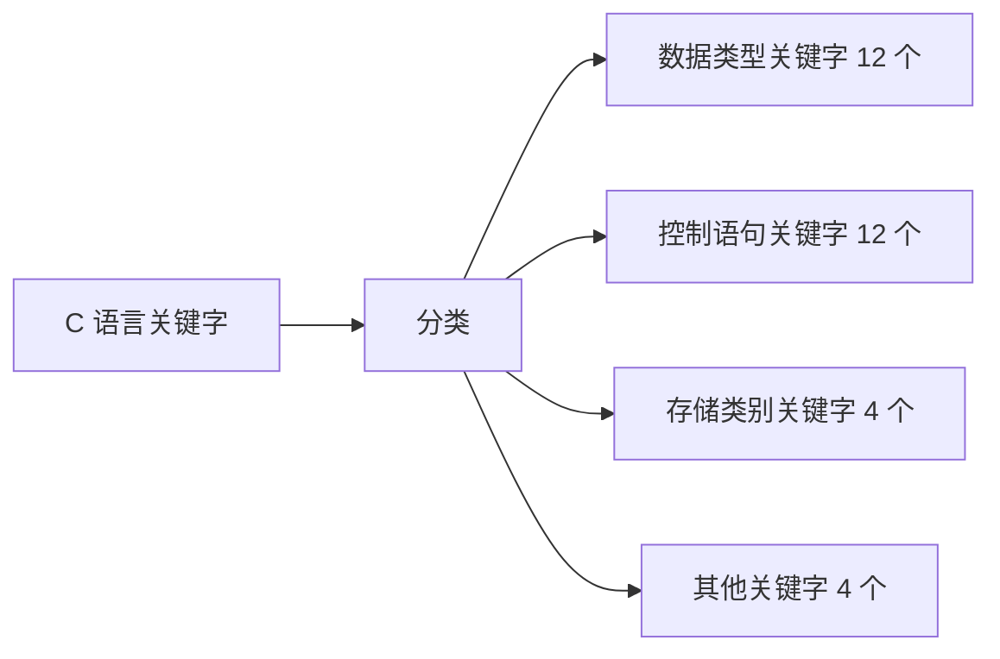

# 关键字



| 序号 | 关键字      | 说明                   |
| -- | -------- | -------------------- |
| 1  | char     | 声明字符变量               |
| 2  | double   | 声明双精度变量              |
| 3  | float    | 声明浮点型变量              |
| 4  | int      | 声明整型变量               |
| 5  | short    | 声明短整型变量              |
| 6  | long     | 声明长整型变量              |
| 7  | unsigned | 声明无符号类型变量            |
| 8  | signed   | 声明有符号类型变量            |
| 9  | struct   | 声明结构体变量              |
| 10 | union    | 声明共用体或联合数据类型         |
| 11 | void     | 声明函数无返回值或无参数，声明无类型指针 |
| 12 | enum     | 声明枚举类型               |

| 序号 | 关键字      | 说明            |
| -- | -------- | ------------- |
| 1  | for      | 遍历循环          |
| 2  | do       | 其后紧跟循环体       |
| 3  | while    | 条件循环或死循环      |
| 4  | break    | 跳出当前循环        |
| 5  | continue | 终止本次循环，开始下次循环 |
| 6  | if       | 条件语句          |
| 7  | else     | 条件语句否定分支      |
| 8  | goto     | 无条件跳转语句       |
| 9  | switch   | 用于多条件判断语句     |
| 10 | case     | 多条件判断语句分支     |
| 11 | default  | 开关语句的其它分支     |
| 12 | return   | 函数返回语         |

| 序号 | 关键字      | 说明           |
| -- | -------- | ------------ |
| 1  | auto     | 声明自动变量       |
| 2  | extern   | 声明变量是在其他文件定义 |
| 3  | register | 声明寄存器变量      |
| 4  | static   | 声明静态变量       |

| 序号 | 关键字      | 说明             |
| -- | -------- | -------------- |
| 1  | const    | 声明只读变量         |
| 2  | sizeof   | 计算数据类型长度（字节数）  |
| 3  | typedef  | 给数据类型取别名       |
| 4  | volatile | 所修饰的对象不能被编译器优化 |

关键字是 C 语言保留的单词，具有固定含义，不能用作变量名、函数名或结构体成员名。

例如，下面的写法会产生冲突：

```c
int int = 10;       // 错误：int 是关键字
int return = 0;     // 错误：return 是关键字
```

C90 标准定义了 32 个关键字。后续标准又增加了新的关键字，因此实际数量取决于使用的 C 语言标准版本。

## 关键字分类

<table><thead><tr><th width="263.7999267578125">类别</th><th>主要关键字</th></tr></thead><tbody><tr><td>类型关键字</td><td><code>char</code>、<code>short</code>、<code>int</code>、<code>long</code>、<code>float</code>、<code>double</code>、<code>void</code>、<code>signed</code>、<code>unsigned</code>、<code>struct</code>、<code>union</code>、<code>enum</code></td></tr><tr><td>控制语句关键字</td><td><code>if</code>、<code>else</code>、<code>switch</code>、<code>case</code>、<code>default</code>、<code>for</code>、<code>while</code>、<code>do</code>、<code>break</code>、<code>continue</code>、<code>goto</code>、<code>return</code></td></tr><tr><td>存储类别关键字</td><td><code>auto</code>、<code>extern</code>、<code>static</code>、<code>register</code></td></tr><tr><td>类型修饰与其他关键字</td><td><code>const</code>、<code>sizeof</code>、<code>typedef</code>、<code>volatile</code></td></tr></tbody></table>

C99、C11 和更高版本还增加了 `_Bool`、`inline`、`restrict`、`_Alignas`、`_Alignof`、`_Atomic`、`_Generic`、`_Static_assert`、`_Thread_local` 等关键字。

## 类型关键字

### 基本数据类型

| 关键字        | 含义             |
| ---------- | -------------- |
| `char`     | 字符类型，也可用于保存小整数 |
| `short`    | 短整型            |
| `int`      | 整型             |
| `long`     | 长整型            |
| `float`    | 单精度浮点型         |
| `double`   | 双精度浮点型         |
| `void`     | 无类型或无返回值       |
| `signed`   | 有符号类型修饰符       |
| `unsigned` | 无符号类型修饰符       |

数据类型占用的字节数由实现决定，不能把某个平台上的结果当成 C 标准的统一规定。可以使用 `sizeof` 查看当前编译器中的实际大小：

```c
#include <stdio.h>

int main(void) {
    printf("char:   %zu bytes\n", sizeof(char));
    printf("short:  %zu bytes\n", sizeof(short));
    printf("int:    %zu bytes\n", sizeof(int));
    printf("long:   %zu bytes\n", sizeof(long));
    printf("float:  %zu bytes\n", sizeof(float));
    printf("double: %zu bytes\n", sizeof(double));
    return 0;
}
```

`sizeof` 的结果类型是 `size_t`，输出时通常使用 `%zu`，而不是 `%d`。

运行结果会因平台和编译器不同而不同：

### signed、unsigned 与 char

默认情况下，`int`、`short` 和 `long` 都是有符号类型：

```c
signed int a = -10;
int b = -20;                // 与 signed int 等价
unsigned int c = 20u;
```

`char`、`signed char` 和 `unsigned char` 是三种不同的类型：

```c
char ch = 'A';
signed char value1 = -10;
unsigned char value2 = 250;
```

普通 `char` 是否带符号由实现决定。如果需要明确表示范围，应使用 `signed char` 或 `unsigned char`。

不要手写范围，使用 `<limits.h>` 中的宏更加可靠：

```c
#include <limits.h>
#include <stdio.h>

int main(void) {
    printf("CHAR_MIN = %d\n", CHAR_MIN);
    printf("CHAR_MAX = %d\n", CHAR_MAX);
    printf("UCHAR_MAX = %u\n", UCHAR_MAX);
    return 0;
}
```

`unsigned` 类型只保存非负数，发生超出范围的运算时会按该类型的模进行转换。涉及大小比较时，应特别注意有符号数和无符号数混合运算可能产生意外结果。

### struct

`struct` 用于定义结构体，把多个成员组织成一个对象：

```c
struct Student {
    char id[10];
    char name[20];
    int age;
};

int main(void) {
    struct Student student = {"09001", "Zhang San", 20};
    return student.age == 20 ? 0 : 1;
}
```

结构体成员可以是不同类型。成员按声明顺序排列，但成员之间可能存在对齐填充，因此：

```c
sizeof(struct Student)
```

不一定等于所有成员大小之和。

### union

`union` 用于定义联合体。所有成员共享同一段存储空间，同一时刻通常只读取当前写入的成员：

```c
union Number {
    int i;
    float f;
};

int main(void) {
    union Number number;

    number.i = 42;
    printf("%d\n", number.i);

    number.f = 3.14f;
    printf("%.2f\n", number.f);
    return 0;
}
```

联合体的大小至少能够容纳最大的成员，但联合体本身不会记录当前哪个成员有效。实际使用时，通常配合枚举标签：

```c
enum ValueKind {
    VALUE_INT,
    VALUE_DOUBLE
};

struct Value {
    enum ValueKind kind;
    union {
        int i;
        double d;
    } data;
};
```

读取联合体成员时，必须遵守标签所记录的类型。否则，程序可能按错误的方式解释同一段内存。

### enum

`enum` 用于定义一组相关的整数常量：

```c
enum Color {
    COLOR_RED,
    COLOR_GREEN,
    COLOR_BLUE
};

int main(void) {
    enum Color color = COLOR_GREEN;
    return color == COLOR_GREEN ? 0 : 1;
}
```

默认情况下，枚举成员从 `0` 开始递增，也可以显式指定值：

```c
enum HttpStatus {
    STATUS_OK = 200,
    STATUS_NOT_FOUND = 404,
    STATUS_ERROR = 500
};
```

枚举常量比直接写数字更容易阅读：

```c
enum Direction {
    DIRECTION_UP,
    DIRECTION_DOWN,
    DIRECTION_LEFT,
    DIRECTION_RIGHT
};
```

从文件、网络或用户输入得到整数后，不能直接假定它属于某个枚举集合，使用前应检查范围：

```c
int value = 2;

if (value >= DIRECTION_UP && value <= DIRECTION_RIGHT) {
    enum Direction direction = (enum Direction)value;
}
```

枚举类型的底层表示由实现决定，不应依赖它一定是某种固定宽度的整数。

### void

`void` 表示“无类型”或“无返回值”。

无返回值函数：

```c
void print_message(void) {
    puts("hello");
}
```

明确表示函数没有参数：

```c
int main(void) {
    return 0;
}
```

这里的 `void` 和省略参数列表不同：

```c
int old_style();       // 没有说明参数信息
int modern_style(void); // 明确表示没有参数
```

`void *` 是通用对象指针，可以保存任意对象的地址，但不能直接解引用：

```c
void print_int(const void *data) {
    const int *value = data;
    printf("%d\n", *value);
}
```

## 控制语句关键字

### 条件语句

| 关键字    | 含义               |
| ------ | ---------------- |
| `if`   | 根据条件决定是否执行语句     |
| `else` | `if` 条件不成立时执行的分支 |

```c
if (score >= 60) {
    puts("及格");
} else {
    puts("需要继续练习");
}
```

### 循环语句

| 关键字     | 含义              |
| ------- | --------------- |
| `for`   | 适合次数明确或有计数变量的循环 |
| `while` | 条件成立时重复执行       |
| `do`    | 先执行一次循环体，再判断条件  |

```c
for (int i = 0; i < 3; ++i) {
    printf("%d\n", i);
}

int n = 3;
while (n > 0) {
    --n;
}

do {
    puts("至少执行一次");
} while (0);
```

### break 与 continue

| 关键字        | 含义                 |
| ---------- | ------------------ |
| `break`    | 立即结束当前循环或 `switch` |
| `continue` | 跳过本轮剩余语句，进入下一轮循环   |

```c
for (int i = 0; i < 10; ++i) {
    if (i == 3) {
        continue;
    }
    if (i == 7) {
        break;
    }
    printf("%d\n", i);
}
```

`break` 只结束当前所在的循环或 `switch`，不会一次跳出多层循环。

### switch、case 与 default

| 关键字       | 含义                |
| --------- | ----------------- |
| `switch`  | 根据表达式的值选择分支       |
| `case`    | 一个具体的匹配分支         |
| `default` | 没有任何 `case` 匹配时执行 |

```c
int command = 2;

switch (command) {
    case 1:
        puts("start");
        break;
    case 2:
        puts("stop");
        break;
    default:
        puts("unknown command");
        break;
}
```

`case` 不会自动结束执行流程。如果不写 `break`，程序会继续执行后面的分支，这种行为称为贯穿：

```c
switch (value) {
    case 1:
    case 2:
        puts("value is 1 or 2");
        break;
    default:
        puts("other value");
        break;
}
```

`switch` 的表达式通常是整数、字符或枚举类型，不能直接使用浮点数或字符串。

### goto

`goto` 用于跳转到同一个函数中的标签：

```c
int result = 0;

if (failed) {
    goto cleanup;
}

result = 1;

cleanup:
    return result;
```

`goto` 不会跳转到其他函数，也不能跳入另一个函数的代码块。简单逻辑中优先使用循环、条件语句和函数；在统一清理资源或跳出多层嵌套时，`goto` 可以减少重复代码。

### return

`return` 用于结束当前函数，并可向调用者返回一个值：

```c
int add(int a, int b) {
    return a + b;
}

void stop(void) {
    return;
}
```

`main` 返回 `0` 通常表示程序正常结束，非零值通常表示发生了错误：

```c
int main(void) {
    return 0;
}
```

## 存储类别关键字

| 关键字        | 主要作用              |
| ---------- | ----------------- |
| `auto`     | 声明自动存储期的局部变量      |
| `static`   | 控制链接属性或延长局部变量的存储期 |
| `extern`   | 声明其他位置定义的对象或函数    |
| `register` | 请求编译器优先使用寄存器保存对象  |

### auto

普通函数内部定义的局部变量默认具有自动存储期，通常不需要显式写 `auto`：

```c
void function(void) {
    int value = 10;
    auto int count = 0;
}
```

自动变量在进入所在代码块时创建，离开代码块时结束生存期。未初始化的自动变量值是不确定的，使用前必须初始化。

不要把“自动变量一定在栈上”当作 C 标准保证。具体存储位置由编译器和优化策略决定。

### static

`static` 的含义取决于使用位置。

#### **修饰局部变量**

```c
#include <stdio.h>

void counter(void) {
    static int count = 0;
    ++count;
    printf("%d\n", count);
}

int main(void) {
    counter();
    counter();
    counter();
    return 0;
}
```

输出：

```
1
2
3
```

局部静态变量的作用域仍然是所在函数或代码块，但存储期贯穿整个程序运行过程，函数返回后值不会消失。

#### **修饰文件作用域变量**

```c
static int file_count = 0;
```

文件作用域的静态变量只在当前源文件中可见，其他源文件不能通过 `extern` 使用它。

#### **修饰函数**

```c
static void helper(void) {
    puts("only this source file can call me");
}
```

静态函数具有内部链接，只能在当前源文件中调用，适合隐藏模块内部实现。

#### extern

`extern` 用于声明在其他位置定义的对象或函数：

```c
/* config.c */
int max_connections = 100;
```

```c
/* main.c */
extern int max_connections;

int main(void) {
    return max_connections > 0 ? 0 : 1;
}
```

`extern int max_connections;` 是声明，不分配新的对象。

下面这句带初始化器，因此是定义：

```c
extern int max_connections = 100;
```

它语法上合法，但通常不需要这样写。跨文件共享对象时，应在一个源文件中定义，在其他源文件中使用 `extern` 声明。

#### register

`register` 是给编译器的优化建议：

```c
register int i;
```

现代编译器会自行决定变量是否放入寄存器，因此 `register` 通常不会带来明显收益。

`register` 变量不能使用取地址运算符：

```c
register int value = 10;
// int *p = &value;  // 错误
```

## 其他关键字

| 关键字        | 作用                    |
| ---------- | --------------------- |
| `const`    | 通过当前访问路径限制对象修改        |
| `sizeof`   | 计算类型或表达式的大小           |
| `typedef`  | 为已有类型创建别名             |
| `volatile` | 告知编译器对象值可能在程序控制之外发生变化 |

### const

`const` 用于限制通过某个名字或指针修改对象：

```c
const int value = 10;
// value = 20;       // 错误
```

常量指针和指向常量的指针含义不同：

```c
const int *p1;   // 不能通过 p1 修改目标对象
int *const p2;   // p2 不能改变指向
```

C 语言中的 `const` 变量不一定是编译期常量，也不一定不占用内存。需要编译期数组长度时，可以使用宏或枚举常量：

```c
enum { BUFFER_SIZE = 128 };
int buffer[BUFFER_SIZE];
```

### sizeof

`sizeof` 不是函数，而是一元运算符：

```c
int values[4];

printf("%zu\n", sizeof values);
printf("%zu\n", sizeof values / sizeof values[0]);
```

数组在 `sizeof` 中不会转换为指针，因此可以计算数组总大小。但数组作为函数参数时会调整为指针：

```c
void print_values(int values[]) {
    sizeof(values);  // 得到的是指针大小，不是数组大小
}
```

### typedef

`typedef` 为已有类型创建别名：

```c
typedef int Score;
typedef int Numbers[10];
typedef int *IntPointer;

Score score = 100;
Numbers values = {0};
IntPointer pointer = NULL;
```

使用结构体时，`typedef` 可以简化类型名称：

```c
typedef struct Student {
    char name[20];
    int age;
} Student;

Student student = {"Zhang San", 20};
```

`typedef` 不会创建新的运行时类型，也不会改变对象的存储布局。

需要注意宏与 `typedef` 的区别：

```c
#define SINT int *
typedef int *PINT;

SINT a, b;  // 展开为 int *a, b，只有 a 是指针
PINT p, q;  // p 和 q 都是 int *
```

涉及指针类型时，`typedef` 往往更容易读懂，但也不要滥用别名隐藏指针层级。

### volatile

`volatile` 用于告诉编译器：对象的值可能被程序之外的因素改变，每次访问都必须按照源代码要求执行：

```c
volatile int device_status;
```

典型场景包括：

* 内存映射硬件寄存器；
* 信号处理程序可能访问的对象；
* 某些嵌入式系统共享状态。

`volatile` 不等于线程安全，也不提供原子性，不等于内存屏障。多线程同步应使用 `<stdatomic.h>` 中的原子类型或线程库提供的同步工具。

## C99、C11 及更高版本的关键字

### C99

| 关键字          | 含义                       |
| ------------ | ------------------------ |
| `inline`     | 建议编译器考虑内联函数              |
| `restrict`   | 承诺某个指针访问的对象不会通过其他不相关指针访问 |
| `_Bool`      | 布尔类型                     |
| `_Complex`   | 复数类型                     |
| `_Imaginary` | 虚数类型，实际支持情况取决于实现         |

### C11

| 关键字              | 含义          |
| ---------------- | ----------- |
| `_Alignas`       | 指定对象的对齐要求   |
| `_Alignof`       | 查询类型的对齐要求   |
| `_Atomic`        | 声明原子类型      |
| `_Generic`       | 根据表达式类型选择结果 |
| `_Noreturn`      | 声明函数不会返回    |
| `_Static_assert` | 编译期断言       |
| `_Thread_local`  | 声明线程存储期对象   |

示例：

```c
#include <stdio.h>
#include <stdalign.h>

struct Data {
    char ch;
    int value;
};

int main(void) {
    printf("alignment = %zu\n", alignof(struct Data));
    _Static_assert(sizeof(int) >= 2, "int is too small");
    return 0;
}
```

## 预处理器：宏、断言与条件编译

预处理器在正式编译前处理 `#include`、宏和条件编译。

宏参数应加括号：

```c
#define SQUARE(x) ((x) * (x))
```

即使宏写对了括号，下面的调用仍然会让 `i++` 求值两次：

```c
#define SQUARE(x) ((x) * (x))

int i = 3;
int value = SQUARE(i++);
```

需要保证参数只求值一次时，优先使用 `static inline` 函数：

```c
static inline int square_int(int x) {
    return x * x;
}
```

头文件通常使用保护宏：

```c
#ifndef CONFIG_H
#define CONFIG_H

#define BUFFER_SIZE 128

#endif
```

`assert` 用于检查程序员的内部假设，不应替代用户输入校验：

```c
#include <assert.h>

int divide(int a, int b) {
    assert(b != 0);
    return a / b;
}
```

定义 `NDEBUG` 后，断言会被移除，因此不要把必须执行的副作用放进断言表达式。

预处理器宏可以帮助定位错误：

```c
#include <stdio.h>

#define CHECK(expr) \
    do { \
        if (!(expr)) { \
            fprintf(stderr, "%s:%d: %s\n", \
                    __FILE__, __LINE__, #expr); \
        } \
    } while (0)
```

怀疑宏展开结果时，可以使用下面的命令查看预处理后的源码：

```bash
gcc -E source.c -o source.i
```

## 关键字速查表

| 关键字        | 关键字        | 关键字        | 关键字      |
| ---------- | ---------- | ---------- | -------- |
| `auto`     | `break`    | `case`     | `char`   |
| `const`    | `continue` | `default`  | `do`     |
| `double`   | `else`     | `enum`     | `extern` |
| `float`    | `for`      | `goto`     | `if`     |
| `int`      | `long`     | `register` | `return` |
| `short`    | `signed`   | `sizeof`   | `static` |
| `struct`   | `switch`   | `typedef`  | `union`  |
| `unsigned` | `void`     | `volatile` | `while`  |

| 标准版本    | 关键字              | 分类    | 说明                      |
| ------- | ---------------- | ----- | ----------------------- |
| C89/C90 | `auto`           | 存储类别  | 声明自动存储期的局部变量            |
| C89/C90 | `break`          | 控制流   | 结束当前循环或 `switch`        |
| C89/C90 | `case`           | 控制流   | 定义 `switch` 的匹配分支       |
| C89/C90 | `char`           | 基本类型  | 声明字符类型                  |
| C89/C90 | `const`          | 类型限定符 | 限制通过当前访问路径修改对象          |
| C89/C90 | `continue`       | 控制流   | 跳过本轮循环的剩余语句             |
| C89/C90 | `default`        | 控制流   | `switch` 中没有匹配项时执行      |
| C89/C90 | `do`             | 控制流   | 定义至少执行一次的循环             |
| C89/C90 | `double`         | 基本类型  | 声明双精度浮点类型               |
| C89/C90 | `else`           | 控制流   | `if` 条件不成立时执行的分支        |
| C89/C90 | `enum`           | 构造类型  | 定义枚举类型                  |
| C89/C90 | `extern`         | 存储类别  | 声明其他位置定义的对象或函数          |
| C89/C90 | `float`          | 基本类型  | 声明单精度浮点类型               |
| C89/C90 | `for`            | 控制流   | 定义 `for` 循环             |
| C89/C90 | `goto`           | 控制流   | 跳转到当前函数中的指定标签           |
| C89/C90 | `if`             | 控制流   | 根据条件选择是否执行语句            |
| C89/C90 | `int`            | 基本类型  | 声明整型                    |
| C89/C90 | `long`           | 类型修饰符 | 声明长整型或扩展其他整数类型          |
| C89/C90 | `register`       | 存储类别  | 请求编译器优先使用寄存器保存对象        |
| C89/C90 | `return`         | 控制流   | 结束函数并返回结果               |
| C89/C90 | `short`          | 类型修饰符 | 声明短整型或修饰其他整数类型          |
| C89/C90 | `signed`         | 类型修饰符 | 声明有符号整数类型               |
| C89/C90 | `sizeof`         | 运算符   | 计算类型或表达式的大小             |
| C89/C90 | `static`         | 存储类别  | 控制链接属性或延长局部对象的存储期       |
| C89/C90 | `struct`         | 构造类型  | 定义结构体类型                 |
| C89/C90 | `switch`         | 控制流   | 根据整数或枚举值选择分支            |
| C89/C90 | `typedef`        | 类型定义  | 为已有类型创建别名               |
| C89/C90 | `union`          | 构造类型  | 定义共享存储空间的联合体            |
| C89/C90 | `unsigned`       | 类型修饰符 | 声明无符号整数类型               |
| C89/C90 | `void`           | 基本类型  | 表示无类型、无参数或无返回值          |
| C89/C90 | `volatile`       | 类型限定符 | 告知编译器对象的值可能被外部因素改变      |
| C89/C90 | `while`          | 控制流   | 定义条件循环                  |
| C99     | `inline`         | 函数说明  | 建议编译器考虑内联函数，编译器可以忽略     |
| C99     | `restrict`       | 类型限定符 | 承诺指针是访问目标对象的主要途径，便于优化   |
| C99     | `_Bool`          | 基本类型  | C 语言内置布尔类型，值为 `0` 或 `1` |
| C99     | `_Complex`       | 基本类型  | 声明复数类型                  |
| C99     | `_Imaginary`     | 基本类型  | 声明纯虚数类型，实际支持取决于实现       |
| C11     | `_Alignas`       | 对齐控制  | 指定对象或类型的对齐要求            |
| C11     | `_Alignof`       | 对齐查询  | 查询类型的对齐要求               |
| C11     | `_Atomic`        | 原子类型  | 声明原子类型或原子类型限定符          |
| C11     | `_Generic`       | 类型选择  | 根据表达式类型选择对应结果           |
| C11     | `_Noreturn`      | 函数说明  | 声明函数不会返回到调用者            |
| C11     | `_Static_assert` | 编译期检查 | 在编译阶段检查条件是否成立           |
| C11     | `_Thread_local`  | 存储类别  | 声明线程局部存储期对象             |

## C90 到 C17 关键字总表

下表按标准版本列出常用的 44 个关键字。编译器是否默认启用某个版本，取决于编译选项；阅读代码时应先确认 `-std=` 设置。

| 标准      | 关键字                                                                                                                                                                                                                                                                   |
| ------- | --------------------------------------------------------------------------------------------------------------------------------------------------------------------------------------------------------------------------------------------------------------------- |
| C90/C89 | `auto`、`break`、`case`、`char`、`const`、`continue`、`default`、`do`、`double`、`else`、`enum`、`extern`、`float`、`for`、`goto`、`if`、`int`、`long`、`register`、`return`、`short`、`signed`、`sizeof`、`static`、`struct`、`switch`、`typedef`、`union`、`unsigned`、`void`、`volatile`、`while` |
| C99 新增  | `_Bool`、`_Complex`、`_Imaginary`、`inline`、`restrict`                                                                                                                                                                                                                   |
| C11 新增  | `_Alignas`、`_Alignof`、`_Atomic`、`_Generic`、`_Noreturn`、`_Static_assert`、`_Thread_local`                                                                                                                                                                               |

`_Imaginary` 在不同编译器上的支持程度并不一致；使用复数和虚数类型时，应查阅目标编译器文档。C23 又引入了新的语法和关键字，不能把 C17 的 44 个关键字表当成所有标准版本的最终列表。
