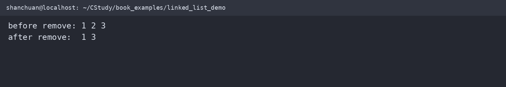
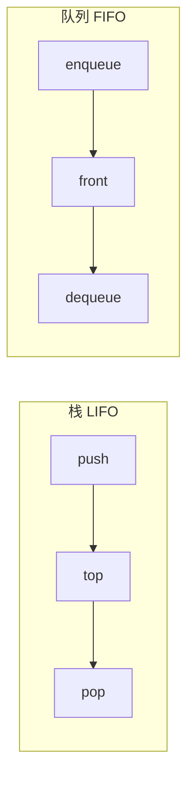

# 链表、栈与队列

数组提供连续存储，链表通过指针把分散的节点连接起来。链表章节建立在结构体、指针和动态内存之上。

下面的示例在 WSL2 `/home/shanchuan/CStudy/book_examples/linked_list_demo.c` 中编译运行：



```mermaid
flowchart LR
    H[head] --> N1[data | next]
    N1 --> N2[data | next]
    N2 --> N3[data | NULL]
```

## 静态链表

静态链表用数组保存节点，用下标代替指针：

```c
typedef struct {
    int value;
    int next; // 下一个节点的数组下标，-1 表示结束
} StaticNode;

StaticNode nodes[8];
int head = 0;
```

它不依赖 `malloc`，适合容量固定、需要可预测内存的场景，但节点数量不能超过数组容量。

## 动态单链表

```c
#include <stdio.h>
#include <stdlib.h>

typedef struct Node {
    int value;
    struct Node *next;
} Node;

Node *list_push_front(Node *head, int value) {
    Node *node = malloc(sizeof *node);
    if (node == NULL) return head;
    node->value = value;
    node->next = head;
    return node;
}

void list_print(const Node *head) {
    for (const Node *current = head; current != NULL; current = current->next)
        printf("%d ", current->value);
    putchar('\n');
}

void list_destroy(Node *head) {
    while (head != NULL) {
        Node *next = head->next;
        free(head);
        head = next;
    }
}
```

删除节点时必须先保存后继节点，再释放当前节点：

```c
Node *list_remove_first(Node *head, int value) {
    Node **link = &head;
    while (*link != NULL && (*link)->value != value)
        link = &(*link)->next;
    if (*link != NULL) {
        Node *removed = *link;
        *link = removed->next;
        free(removed);
    }
    return head;
}
```

## 栈与队列

栈遵循后进先出，队列遵循先进先出：



数组栈需要维护 `size` 和容量；循环队列需要维护 `front`、`size` 和容量。无论使用数组还是链表，都应明确谁负责释放动态节点。

## 常见错误

- 忘记初始化头指针为 `NULL`。
- 释放节点后继续访问它的成员。
- 删除头节点时没有更新 `head`。
- 插入失败时丢失原链表。
- 遍历过程中修改 `next` 导致链表断裂。
- 只释放头节点而没有释放所有节点。

## 可运行完整示例

将下面内容保存为 `linked_list_demo.c`：

```c
#include <stdio.h>
#include <stdlib.h>

typedef struct Node {
    int value;
    struct Node *next;
} Node;

static Node *push_front(Node *head, int value) {
    Node *node = malloc(sizeof *node);
    if (node == NULL) return head;
    node->value = value;
    node->next = head;
    return node;
}

static Node *remove_first(Node *head, int value) {
    Node **link = &head;
    while (*link != NULL && (*link)->value != value)
        link = &(*link)->next;
    if (*link != NULL) {
        Node *removed = *link;
        *link = removed->next;
        free(removed);
    }
    return head;
}

static void print_list(const Node *head) {
    for (; head != NULL; head = head->next)
        printf("%d ", head->value);
    putchar('\n');
}

static void destroy(Node *head) {
    while (head != NULL) {
        Node *next = head->next;
        free(head);
        head = next;
    }
}

int main(void) {
    Node *head = NULL;
    head = push_front(head, 3);
    head = push_front(head, 2);
    head = push_front(head, 1);
    printf("before remove: ");
    print_list(head);
    head = remove_first(head, 2);
    printf("after remove:  ");
    print_list(head);
    destroy(head);
    return 0;
}
```

编译运行：

```sh
gcc -std=c11 -Wall -Wextra -Wpedantic linked_list_demo.c -o linked_list_demo
./linked_list_demo
```

预期输出：

```text
before remove: 1 2 3
after remove:  1 3
```
