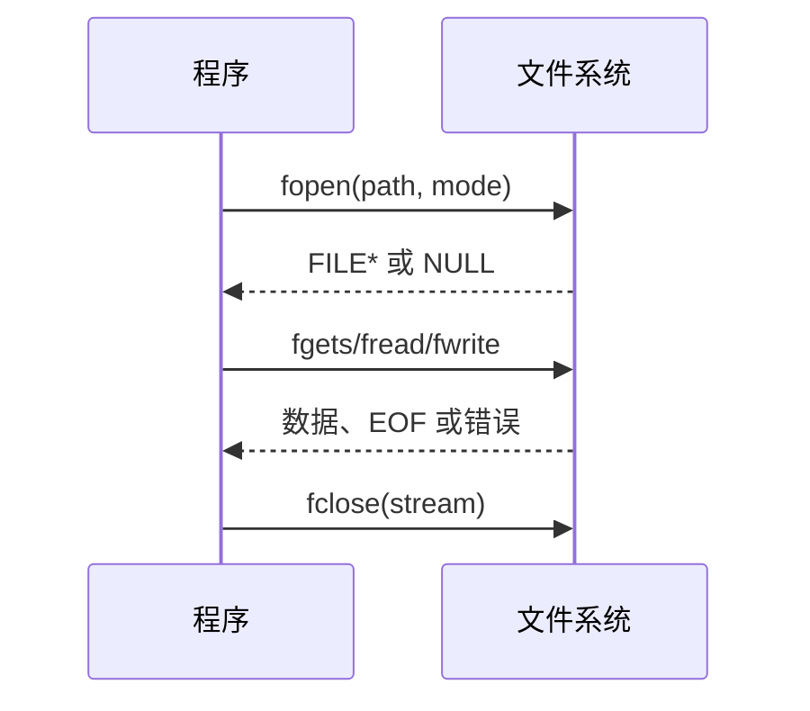

# 多文件结构

在 C 语言中，多文件结构是模块化开发的重要手段

### 多文件结构的作用

将不同功能的代码拆分到多个 `.c` 源文件和 `.h` 头文件中，可实现**功能模块化**，提升代码的可读性、可维护性，同时支持多人协作开发（不同开发者负责不同文件）。

### 头文件的包含方式及区别

C 语言通过 `#include` 指令包含头文件，有两种语法形式，作用路径不同：

* **尖括号形式（`<头文件>`）**：编译器优先到**系统预定义的路径**（如编译器安装目录的 `include` 文件夹）查找头文件，适用于标准库头文件（如 `#include <stdio.h>`、`#include <stdlib.h>`）。
* **双引号形式（`"头文件"`）**：编译器优先到**当前项目的目录**（或双引号指定的相对路径）查找头文件，若未找到，再到系统路径查找，适用于自定义的头文件（如 `#include "myheader.h"`）。

### 条件编译

防止头文件重复包含（`#ifndef`、`#define`、`#endif`）

当多个文件同时包含同一个头文件时，可能因 “重复定义” 导致编译错误。通过**条件编译指令**可避免此问题，格式如下：

```c
// 头文件 myheader.h
#ifndef MYHEADER_H  // 如果MYHEADER_H未被定义
#define MYHEADER_H  // 定义MYHEADER_H

// 头文件的声明内容（变量、函数、结构体等）

#endif  // 结束条件编译
```

* 原理：第一次包含头文件时，`MYHEADER_H` 未定义，会执行 `#define MYHEADER_H` 并加载头文件内容；后续再次包含时，`MYHEADER_H` 已定义，会跳过 `#ifndef` 和 `#endif` 之间的内容，从而避免重复定义。

### 多文件编译流程

C 语言多文件项目的构建分为 “编译” 和 “链接” 两个阶段：

* **编译阶段**：每个 `.c` 源文件（如 `hello.c`、`test.c`）会被单独编译为**目标文件**（`.obj`，如 `hello.obj`、`test.obj`）。编译时，编译器只处理当前文件的代码，生成包含二进制指令的目标文件。
* **链接阶段**：链接器将所有目标文件（`hello.obj`、`test.obj`）合并，最终生成可执行程序（图中最下方的空白框即代表可执行文件）。

图中使用 `#ifndef A_H`、`#define A_H`、`#endif` 构成**条件编译块**，目的是**防止 “重复定义” 错误**。其逻辑是：

* 第一次编译时，`A_H` 未被定义，会执行 `#define A_H` 并编译块内代码（如 `Add` 函数）；
* 若后续重复包含该块（如其他文件也包含相同逻辑），`A_H` 已被定义，会跳过块内代码，避免 “重复定义”。

图中 `hello.c` 和 `test.c` 都定义了同名函数 `int Add(int a, int b)`，这会导致**链接错误**—— 因为 C 语言不允许 “多个编译单元（.c 文件）中存在同名的全局函数定义”。

正确的做法是：

* 将函数**声明**放在头文件（如 `A.h`），用条件编译保护；
* 将函数**定义**放在一个 `.c` 文件中（如 `hello.c`）；
* 其他文件（如 `test.c`）通过 `#include "A.h"` 声明函数，即可调用该函数，避免重复定义。

### 文件间的变量与函数共享

#### 共享变量 / 函数：`extern` 关键字

若要在文件 A 中使用文件 B 定义的变量或函数，需在文件 A 中用 `extern` 声明：

*   **共享变量**：

    ```c
    // 文件B（b.c）：定义全局变量
    int globalVar = 10;

    // 文件A（a.c）：声明并使用该变量
    extern int globalVar;
    printf("%d", globalVar);  // 输出10
    ```
*   **共享函数**：

    ```c
    // 文件B（b.c）：定义函数
    void func() { printf("Hello\n"); }

    // 文件A（a.c）：声明并调用该函数
    extern void func();
    func();  // 输出Hello
    ```

#### 限制作用域：`static` 关键字

若希望变量或函数仅在**本文件内可见**（避免多文件命名冲突），可通过 `static` 修饰：

* **静态全局变量**：`static int localVar = 20;` —— 仅在定义它的 `.c` 文件内可访问。
* **静态函数**：`static void localFunc() { ... }` —— 仅在定义它的 `.c` 文件内可调用。

### 示例：计算器

以下是基于**多文件结构**实现该计算器的完整代码，包含头文件、功能模块文件和主文件，严格遵循模块化设计：

#### 1. 头文件 `calculator.h`（声明函数，防止重复包含）

```c
#ifndef CALCULATOR_H
#define CALCULATOR_H

// 函数声明
int Add_Int(int a, int b);    // 加法
int Sub_Int(int a, int b);    // 减法
int Mul_Int(int a, int b);    // 乘法
int Div_Int(int a, int b);    // 除法
void Show_Sum(int result);    // 显示结果
void Counter(void);           // 处理输入和运算分发

#endif
```

#### 2. 功能模块文件

**（1）加法模块 `add.c`**

```c
#include "calculator.h"

int Add_Int(int a, int b) {
    return a + b;
}
```

**（2）减法模块 `sub.c`**

```c
#include "calculator.h"

int Sub_Int(int a, int b) {
    return a - b;
}
```

**（3）乘法模块 `mul.c`**

```c
#include "calculator.h"

int Mul_Int(int a, int b) {
    return a * b;
}
```

**（4）除法模块 `div.c`（含除数非零校验）**

```c
#include "calculator.h"
#include <stdio.h>

int Div_Int(int a, int b) {
    if (b == 0) {
        printf("错误：除数不能为0！\n");
        return 0;
    }
    return a / b;
}
```

**（5）显示模块 `show.c`**

```c
#include "calculator.h"
#include <stdio.h>

void Show_Sum(int result) {
    printf("计算结果：%d\n", result);
}
```

**（6）运算分发模块 `counter.c`（处理输入和运算符判断）**

```c
#include "calculator.h"
#include <stdio.h>

void Counter(void) {
    int a, b, result;
    char op;

    printf("请输入“操作数1 运算符 操作数2”（如：10 + 20）：");
    scanf("%d %c %d", &a, &op, &b);

    switch (op) {
        case '+': result = Add_Int(a, b); break;
        case '-': result = Sub_Int(a, b); break;
        case '*': result = Mul_Int(a, b); break;
        case '/': result = Div_Int(a, b); break;
        default:  printf("错误：不支持的运算符！\n"); return;
    }

    Show_Sum(result);
}
```

#### 3. 主程序文件 `main.c`（处理循环和用户交互）

```c
#include "calculator.h"
#include <stdio.h>

int main() {
    char choice;

    do {
        Counter();  // 调用运算分发函数

        printf("是否继续？(Y/N)：");
        scanf(" %c", &choice);  // 空格吸收输入缓冲区的换行
    } while (choice == 'Y' || choice == 'y');

    printf("程序结束。\n");
    return 0;
}
```

### 文件流与随机访问

文件操作遵循“打开、检查、读写、关闭”的顺序。`fopen` 失败时返回 `NULL`，`perror` 可以把系统错误原因写出来：

```c
FILE *fp = fopen("scores.txt", "r");
if (!fp) {
    perror("scores.txt");
    return EXIT_FAILURE;
}

char line[128];
while (fgets(line, sizeof line, fp))
    fputs(line, stdout);
if (ferror(fp)) perror("read");
fclose(fp);
```

`fgets` 最多读取 `sizeof line - 1` 个字符，并在有空间时保留换行符。二进制文件使用 `fread` 和 `fwrite`，必须检查实际读写的元素个数。`fflush` 刷新输出缓冲区，不是清空输入缓冲区；`rewind` 回到开头并清除错误标志。

```c
if (fseek(fp, 0, SEEK_END) != 0) return EXIT_FAILURE;
long length = ftell(fp);
if (length < 0) return EXIT_FAILURE;
rewind(fp);
```



下面的截图来自本机 WSL2 的 `/home/shanchuan/CStudy`，命令和输出均为实际运行结果：


## 原稿图示
