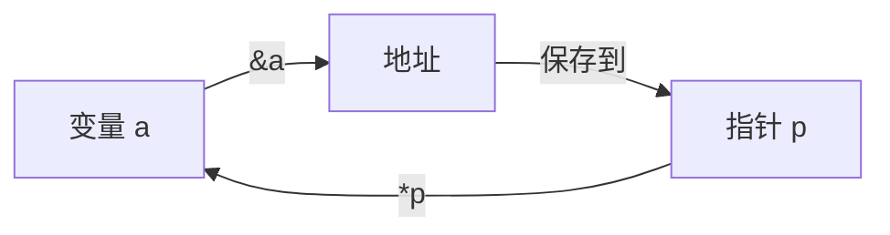
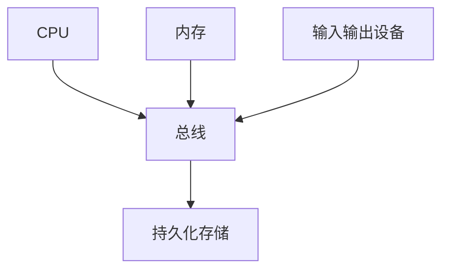
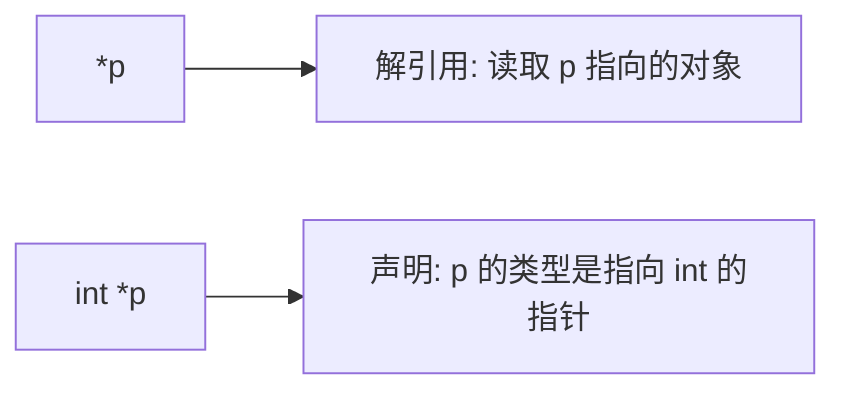
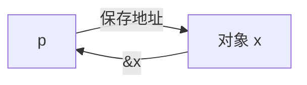
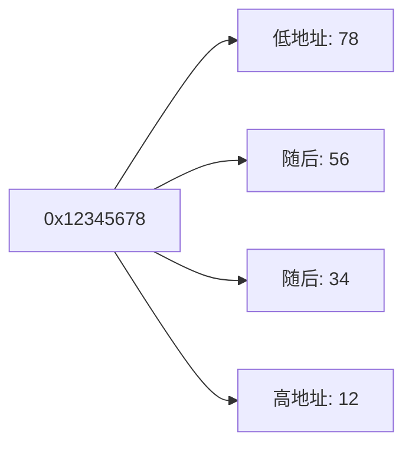
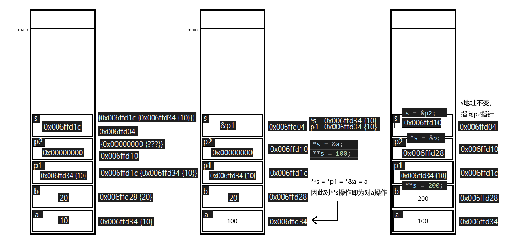
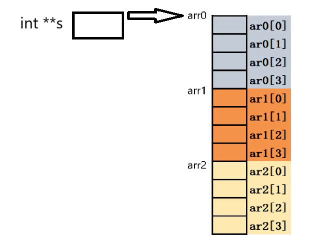
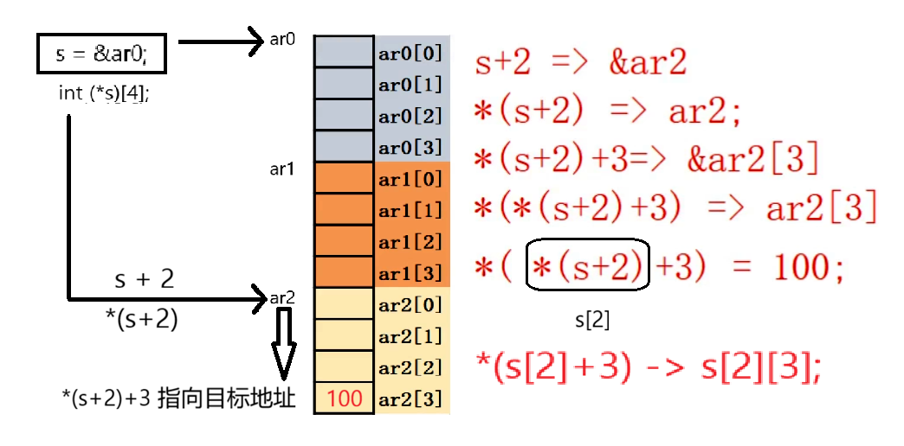

# 指针

### 什么是指针

​	计算机中所有的数据都必须放在内存中，不同类型的数据占用的字节数不一样，例如 int 占用4个字节，char 占用1个字节。为了正确地访问这些数据，必须为每个字节都编上号码，就像门牌号一样，每个字节的编号是唯一的，根据编号可以准确地找到某个字节。 本书将内存中字节的编号称为**地址( Address )**或**指针( Pointer )**。地址从0开始依次增加，对于 32位环境，程序能够使用的内存为 **4GB**。

最小的地址(首地址的编址)为 *0x0000 0000*，最大的地址(最后一个存储单元的编址)为*0XFFFFFFFF*.





内存：硬盘与CPU沟通的桥梁，计算机中所有程序的运行都是在内存中进行的，为了有效使用内存，就把内存以八位二进制位划分为存储单元（1字节）,并给其编号,这些编号被称为该**内存存储单元的地址**

地址为十六进制数,一个十六进制数占四位二进制数,两个十六进制数占八位二进制数,即一字节

在32位(x86)系统中,指针大小为4字节

在64位(x64)系统中,指针大小为8字节


C/C++中 ***运算符** 的定义:所在运行环境不同,含义不同



### 定义指针变量

定义指针变量与定义普通变量非常类似，不过要在变量名前面加星号*

格式为:`datatype *name;` 或者 `datatype * name = &value; `

*表示这是一个指针变量，datatype 表示该指针变量所指向的数据的类型。

在指针定义中 *号是和变量名结合；

```c
int main()
{
    int*p,s;		//p是整型指针变量，s 是整型变量
    char*cpa,*cpb;	// cpa 和 cpb 都是 char 类型指针变量
    int a = 10;
    int *ip;		// 未初始化的指针，不良的定义习惯
    ip = &a;		//与int *p= &a; // 等价
    return 0;
}
```

总结:所谓指针，也就是内存的地址;所谓指针变量，也就是保存了内存地址的变量。**指针的大小在 32 位平台是 4 个字节，在 64 位平台是 8 个字节**

使用指针变量首先明确指针变量自身的值（地址），再明确指针变量所指的实体（解引用）。

### 图解指针

```c
int main()
{
    int a = 10,b = 20;
    int *p = NULL;
    p = &a;
    *p = 100;
    
    p = &b;
    *p = 200;
    return 0;
}
```



> **小端存储**
>
> 高位数存放高位置，低位数存放低地址
>


### 指针的应用

> 实参的结合:从右向左

#### 值传递

```c
void SwapVal(int a, int b) {
	int temp = a;
	a = b;
	b = temp;
}

int main() {
	int x = 5, y = 10;
	printf("Before Swapval: x = %d, y = %d\n", x, y);
	SwapVal(x, y);
	printf("After Swapval: x = %d, y = %d\n", x, y);
	return 0;
}
```

```
Before Swapval: x = 5, y = 10
After Swapval: x = 5, y = 10
```


#### 指针传递

```c
void SwapPtr(int* a, int* b) {
	int temp = *a;
	*a = *b;
	*b = temp;
}

int main() {
	int x = 5, y = 10;
	printf("Before Swapptr: x = %d, y = %d\n", x, y);
	SwapPtr(&x, &y);
	printf("After Swapptr: x = %d, y = %d\n", x, y);
	return 0;
}
```

```
Before Swapptr: x = 5, y = 10
After Swapptr: x = 10, y = 5
```


### 野指针和空指针
在C语言中，野指针、空指针和悬空指针是指针操作中常见的概念，三者既有区别又存在关联，以下从定义、产生原因、危害及避免措施等方面总结核心知识点：

#### 野指针（Wild Pointer）
野指针是指**指向无效内存地址**的指针（该地址可能随机、未分配或无访问权限），其指向的内存区域无法被程序合法使用。

##### 产生原因  
1. **指针未初始化**：声明指针时未赋予初始值，此时指针的值是随机的（取决于内存中的垃圾值），指向未知区域。  
   例：`int *p; // p是野指针，值不确定`  
2. **指针指向非法地址**：人为将无效值（如非内存地址的整数）赋值给指针。  
   例：`int *p = 100; // 100通常不是合法的内存地址，p为野指针`  

野指针指向的内存可能是其他变量的地址、系统关键内存或未分配区域，操作（解引用、赋值）野指针会导致：  
- 程序崩溃（如段错误 `Segmentation Fault`）；  
- 数据被意外修改（破坏程序状态）；  
- 潜在的安全漏洞（如非法访问敏感内存）。  


##### 避免措施  
1. 指针声明时**立即初始化**（如初始化为`NULL`或明确指向一个有效变量）；  
   例：`int *p = NULL; // 初始化为空指针` 或 `int a; int *p = &a; // 指向有效变量`  
2. 避免将非地址值赋值给指针（除非明确确认该值是合法内存地址）。  


#### 空指针（Null Pointer）
空指针是**明确指向“空地址”** 的指针，在C语言中用宏`NULL`表示（标准定义为`(void*)0`，即地址0，该地址不对应任何有效内存）。  


##### 核心特性  
1. 空指针是**合法的指针值**（不同于野指针），表示“未指向任何有效内存”；  
2. 所有空指针的值相等（均为`NULL`），可通过`==`或`!=`判断指针是否为空。  


##### 作用  
1. 作为指针的**初始状态标记**：表示指针暂时未关联有效内存（避免野指针）；  
2. 作为函数返回值：表示“操作失败”或“无结果”（如`malloc`分配失败时返回`NULL`）；  
3. 作为条件判断依据：使用指针前检查是否为`NULL`，避免解引用无效内存。  


##### 注意事项  
- 解引用空指针（`*NULL`）是**未定义行为**，会直接导致程序崩溃（如段错误），因此使用指针前必须先判断：  
  例：`if (p != NULL) { *p = 10; } // 安全操作`  


#### 悬空指针（Dangling Pointer）
悬空指针是指**曾经指向有效内存，但该内存被释放后仍保留原地址**的指针（即指向的内存已无效，但指针值未改变）。  


##### 产生原因  
1. **动态内存释放后未重置指针**：通过`malloc`/`calloc`分配的内存被`free`释放后，指针仍保留原地址。  
   例：  
   ```c  
   int *p = malloc(sizeof(int));  
   free(p); // 内存被释放，但p仍指向原地址，此时p为悬空指针  
   ```
2. **指针指向已销毁的自动变量**：自动变量（栈上的变量）超出作用域后被销毁，指向它的指针成为悬空指针。  
   例：  
   ```c  
   int *get_ptr() {  
       int a = 10;  
       return &a; // 函数结束后a被销毁，返回的指针为悬空指针  
   }  
   ```

悬空指针指向的内存可能被系统重新分配给其他变量，操作该指针会：  
- 修改其他变量的数据（导致程序状态混乱）；  
- 读取到垃圾值（破坏数据一致性）；  
- 触发不可预测的崩溃（与野指针类似）。  


##### 避免措施  
1. 动态内存释放后，**立即将指针置为`NULL`**（便于后续通过`NULL`判断指针无效）；  
   例：`free(p); p = NULL;`  
2. 避免返回指向自动变量的指针（自动变量作用域仅限其定义的块内）；  
3. 对可能悬空的指针，使用前通过`NULL`检查或重新赋值为有效地址。  

### 指针的增加

指针的大小和它指向的数据类型无关，只由系统的地址位数（即 CPU 的寻址能力）决定。

在 32 位系统中，地址总线是 32 位的，能表示的内存地址范围是 0 到 2³²-1，对应的地址值需要用 4 个字节（32 位）来存储，所以无论指针指向的是 char、int、double 还是其他类型，指针变量本身的大小都是 4 字节。而在 64 位系统中，地址总线是 64 位的，地址值需要 8 个字节（64 位）存储，因此所有指针的大小都是 8 字节。你提供的例子里，str、p、d、pp、a 这些不同类型的指针，在 32 位系统中都是 4 字节，64 位系统中都是 8 字节，正好印证了这一点。


```
str:4
p:4
d:4
pp:4
a:4
```


```
str:8
p:8
d:8
pp:8
a:8
```

不过，指针的类型（即它指向的数据类型）并非毫无意义，它主要有两个关键作用：

1. 决定 “指针加 1” 的偏移量

指针加 1（如 p++）时，并不是简单地在地址上 + 1，而是根据指向的类型大小偏移对应的字节数，以保证指向 “下一个同类型元素”。比如：

- 若 p 是 int*（指向 int，32 位系统中 int 占 4 字节），则 p+1 的地址比 p 大 4 字节；
- 若 p 是 double*（指向 double，通常占 8 字节），则 p+1 的地址比 p 大 8 字节；
- 若 p 是 char*（指向 char，占 1 字节），则 p+1 的地址比 p 大 1 字节。

2. 决定解引用时访问的内存大小

当解引用指针（如 * p）时，编译器会根据指针的类型，确定需要从指向的地址开始读取多少字节的数据，以正确解析为对应类型的值。比如：

- int * 解引用时，会读取 4 字节内存，解析为一个 int 值；
- double * 解引用时，会读取 8 字节内存，解析为一个 double 值；
- 如果指针类型错误（比如用 int * 去解引用一个 double 变量的地址），会导致读取的字节数不对，得到错误的数据（甚至程序崩溃）。

### 指针相减

两指针相减，需注意两个指针必须是**同类型**，且指向 **同一数组（或同一块连续内存** 中的元素，否则行为是未定义的。相减的结果不是字节数，而是两个指针之间的**元素个数（偏移量）**，类型为`ptrdiff_t`（有符号整数，定义在`<stddef.h>`中）。

如果定义：

```c
int ar[10] = {12, 23, 34};
int *p0 = &ar[0]; // 指向 ar[0]
int *p2 = &ar[2]; // 指向 ar[2]
```

- `p2 - p0`的地址差：`108 - 100 = 8` 字节
- 除以`int`大小 4 字节：`8 / 4 = 2`
- 结果：`2`（表示`p2`在`p0`之后 2 个元素）

若`p2`地址高于`p1`，`p2 - p1`为**正数**，若`p2`地址低于`p1`，`p2 - p1`为**负数**。

需要注意的是，指针与指针相加是未定义行为，只有指针与整数加减、指针与指针相减是合法操作。

```c
int main() {
    int arr[5] = {10, 20, 30, 40, 50};
    int *p1 = &arr[1]; // 指向20
    int *p2 = &arr[4]; // 指向50

    ptrdiff_t diff = p2 - p1;
    printf("p2 - p1 = %td\n", diff);       		  // 输出 3（元素个数）
    printf("字节差 = %td\n", diff * sizeof(int)); 	// 输出 12（3 * 4字节）

    return 0;
}
```

### 取值和自增运算符的结合

```c
x = *p++;
```

在 C 语言中，`x = *p++;` 涉及到**取值运算符（\*）** 和**后缀自增运算符（++）** 的结合，其执行逻辑由运算符的**优先级**和**结合性**决定

- 后缀自增运算符（`++`）的优先级**高于**取值运算符（`*`），因此表达式会被解析为 `x = *(p++);`（而非 `(x = *p)++`，后者是错误的，因为`*p`的结果可能是不可修改的右值）。
- 后缀自增（`p++`）的特性是：**先使用变量当前的值，再对变量进行自增**。

#### 步骤

1. **获取`p`的当前地址**：先确定`p`此时指向的内存地址（假设为`addr`）。
2. **解引用取值**：通过`*`运算符获取`addr`地址处的值（即`*p`的结果），并将该值赋给`x`。
3. **指针自增**：将`p`的地址自增（`p = p + 1`），自增的偏移量由`p`的类型决定（如`int*`类型的`p`会偏移 4 字节，`char*`会偏移 1 字节，符合指针类型的 “加 1 规则”）。

假设`p`是`int*`类型，指向数组`int arr[] = {10, 20, 30};`的首元素（即`p`初始指向`arr[0]`，地址为`&arr[0]`）：

- 执行`x = *p++;`时，先取`p`当前指向的`arr[0]`的值（10），赋值给`x`（此时`x = 10`）。
- 随后`p`自增（因`int*`类型，偏移 4 字节），指向`arr[1]`（地址变为`&arr[1]`）。

若表达式为`x = *++p;`（前缀自增`++p`），则执行顺序相反：

1. 先将`p`自增（指向`arr[1]`）；
2. 再解引用`p`，取`arr[1]`的值（20）赋给`x`。

### 取值和取地址符号的结合

在 C 语言中，**取值运算符（`\*`）** 和**取地址运算符（`&`）** 是一对互逆操作：`&`用于获取变量的地址，`*`用于根据地址获取变量的值。两者结合使用时，需注意运算符的**优先级**（均为单目运算符，优先级相同）和**结合性**（从右向左），常见组合及含义如下：

#### `*&a`：先取地址再解引用，结果等价于`a`

- 逻辑：`&a` 先获取变量`a`的地址（得到一个指针），再通过`*`对该地址解引用，最终得到`a`本身的值。

  ```c
  int a = 10;
  printf("%d", *&a); // 输出10，等价于直接访问a
  ```

- 本质：`*&a` 等价于 `*( &a )`，相当于 “先拿到 a 的地址，再通过地址找到 a 的值”，结果与`a`完全一致。

#### &*p`：先解引用再取地址，结果等价于`p`

- 逻辑：`*p` 先通过指针`p`获取它指向的变量的值（假设`p`指向有效内存），再通过`&`取该变量的地址，最终得到`p`本身（因为`p`原本就存储该变量的地址）。

  ```c
  int a = 10;
  int *p = &a; // p存储a的地址
  printf("%p", &*p); // 输出p的值（即&a），等价于直接打印p
  ```

- 本质：`&*p` 等价于 `&( *p )`，相当于 “先通过 p 找到变量，再取该变量的地址”，结果与`p`完全一致。

### const与指针变量

在 C 语言中，`const` 与指针结合时，根据 `const` 修饰的对象不同（指针指向的**数据**或指针**本身**），会产生不同的限制效果，主要分为三种情况，核心区别在于 `const` 与 `*` 的位置关系：

####  `const` 修饰指针指向的数据（常量指针）

语法：`const 类型 *指针名;` 或 `类型 const *指针名;`（两种写法等价）

- **含义**：指针指向的数据是 “常量”，不能通过指针修改该数据，但指针本身可以指向其他地址。
- **关键特征**：`const` 在 `*` 左边，限制的是 “指向的内容”。

```c
int a = 10, b = 20;
const int *p = &a; // p是常量指针，指向a

//*p = 30; // 错误！不能通过p修改指向的数据（a被视为常量）
p = &b;  // 正确！指针p可以指向其他地址（此时p指向b）
```

#### `const` 修饰指针本身（指针常量）

语法：`类型 *const 指针名;`

- **含义**：指针本身是 “常量”，一旦初始化后，不能再指向其他地址，但可以通过指针修改它指向的数据。
- **关键特征**：`const` 在 `*` 右边，限制的是 “指针本身”。

```c
int a = 10, b = 20;
int *const p = &a; // p是指针常量，初始化时必须指向一个地址

//p = &b;  // 错误！指针p本身是常量，不能改变指向
*p = 30; // 正确！可以通过p修改指向的数据（a的值变为30）
```

####  `const` 同时修饰指针指向的数据和指针本身

语法：`const 类型 *const 指针名;`

- **含义**：指针本身不能改变指向，且指向的数据也不能通过指针修改（“双常量”）。
- **关键特征**：`*` 左右都有 `const`，既限制内容，也限制指针本身。

```c
int a = 10, b = 20;
const int *const p = &a; // 双const指针

//p = &b;  // 错误！指针本身不能改指向
//*p = 30; // 错误！指向的数据也不能改
```

判断 `const` 修饰谁，看 `const` 与 `*` 的位置：

- `const` 在 `*` 左边 → 修饰 “指向的数据”（数据不能改，指针可换指向）；
- `const` 在 `*` 右边 → 修饰 “指针本身”（指针不能换指向，数据可改）；
- 两边都有 `const` → 两者都不能改。

#### 实际应用场景

- **常量指针**（`const int *p`）：常用于函数参数，防止函数内部通过指针修改外部数据（如 `void print(const int *p)`，保证 `p` 指向的数据不被修改）。
- **指针常量**（`int *const p`）：适用于指针一旦初始化就固定指向某个对象的场景（如硬件寄存器地址，不允许修改指向）。

### 指针和数组的关系

#### 数组名的 “指针退化” 特性

数组名在**大多数表达式场景中（除 `sizeof`、`&` 操作外）**，会自动转换为**指向数组第一个元素的指针常量**。

- 代码中 `int* p = arr;` 合法，因为 `arr` 退化为 `int*` 类型，指向 `arr[0]` 的地址；

- 元素访问的等价性：`arr[0]` 与 `*p` 等价、`*(arr + 1)` 与 `p[1]` 等价，体现了 “数组下标访问” 和 “指针偏移访问” 的互通性。

  ```c
  int arr[5] = { 1, 2, 3, 4, 5 };
  int* p = arr;
  printf("arr[0] = %d\n", arr[0]);
  printf("*p = %d\n", *p);
  printf("arr[1] = %d\n", *(arr + 1));
  printf("p[1] = %d\n", p[1]);
  ```

  ```
  arr[0] = 1
  *p = 1
  arr[1] = 2
  p[1] = 2
  ```

- 当数组作为函数形参时，会**退化为指向其首元素的指针**（即`int*`类型），此时`sizeof(br)`计算的是**指针变量的大小**（而非数组的字节大小，32 位系统中为 4 字节，64 位系统中为 8 字节）。

  ```c
  //当把数组作为函数的形参时,数组名退化成指针
  void Print_Ar(int br[])
  {
      int as = sizeof(br);
      int es = sizeof(br[0]);
      int n = as / es;
      for (int i = 0; i < n; ++i)
      {
          printf("%5d ", br[i]);
      }
  }
  int main()
  {
      int ar[] = { 12,23,34,45,56 };
      int n = sizeof(ar) / sizeof(ar[0]); // array size;
      Print_Ar(ar);
      return 0;
  }
  ```

  因此,在传递数组的过程中,我们还需要传递数组的大小`void Print_Ar(int br[],int n);`

#### `sizeof` 操作的本质差异

- 对数组名使用 `sizeof`（如 `sizeof(arr)`）时，数组名**不退化**，计算的是**整个数组的字节大小**（示例中 `int[5]` 若为 4 字节`int`，则结果为 `4×5 = 20`）；

- 对指针变量使用 `sizeof`（如 `sizeof(p)`）时，计算的是**指针本身的大小**（32 位系统为 4 字节，64 位系统为 8 字节），与数组大小无关。

  ```c
  printf("sizeof(arr) = %zu\n", sizeof(arr));
  printf("sizeof(p) = %zu\n", sizeof(p));
  ```

  ```
  sizeof(arr) = 20
  sizeof(p) = 4
  ```

#### 数组名的 “信息丢失” 与边界风险

数组名作为指针常量，**丢失了数组元素数量的信息**（如代码中无法通过 `arr` 直接获取元素个数`5`）。

- 运行时编译器不会检查数组边界，若出现越界访问（如 `arr[10]`），会导致未定义行为（数据错乱、程序崩溃等）；
- 指针变量（如 `p`）也仅存储地址，同样不携带元素数量信息，因此操作数组时需手动保证访问的合法性（如通过宏`#define N 5`维护元素个数）。

### 无类型指针`void*`

对于`void`类型,他的作用一般为对函数返回的限定和对函数参数的限定，这种情况也是比较常见的。

- 当函数不需要返回值值时，必须使用void限定。例如:`voidfun(int a)`。
- 当函数不允许接受参数时，必须使用void限定。例如:`int fun(void)`。

void不能定义变量，但可以定义指针变量。特别之处在于void 指针可以指向任意类型变量的地址。

当一个函数返回值为无类型时，无论该函数如何调用，都是成功的。

```c
void myvoid() {
	printf("This is a void function.\n");
}

int main() {
	myvoid(); // 调用void函数
	return 0;
}
```

需要注意的是，C语言当函数不声明返回类型时，编译器会将`int`类型作为返回值类型。


为了程序的可读性，仍然建议显式声明返回类型。

在早期编译器中，`void`在传入多个实参时，按以下方法可以获取到传入的实参：

```c
void func(int theFirstnum) {
	printf("The first number is %d\n", theFirstnum);
	int* numPoint = &theFirstnum;
	printf("The second number is %d\n", *(numPoint + 1));
	printf("The third number id %d\n", *(numPoint + 2));
	return;
}

int main() {
	func(11, 12, 13);
	return;
}
```

这是因为编译器为函数分配栈帧空间后，将参数从右向左依次传入，通过指针的偏移来实现对函数中其他值的访问，但最新的编译器中会报出错误：

1>D:\Code\C_Code\C\void.c(14,11): error C2197: “void func(int)”: 用于调用的参数太多
1>D:\Code\C_Code\C\void.c(14,15): error C2197: “void func(int)”: 用于调用的参数太多

因此该方法不再适合使用。


> 在cpp中，编译器在编译阶段会直接报错：
>
> 1>D:\Code\C_Code\C\void.cpp(17,2): error C2660: “func”: 函数不接受 3 个参数
> 1>      D:\Code\C_Code\C\void.cpp(8,6):
> 1>      参见“func”的声明
> 1>      D:\Code\C_Code\C\void.cpp(17,2):
> 1>      尝试匹配参数列表“(int, int, int)”时

在C语言中，无类型作为一种抽象类型（没有具体实体的类型），我们不能使用其定义变量，但可以定义指针变量。特别之处在于`void` 指针可以指向任意类型变量的地址。

```c
char ch = 'a';
int x = 10;
double dx = 12.23;
void* vp = NULL;
vp = &ch; // ok *vp = 'a' ;
vp = &x; // ok *vp = 10;
vp = &dx; // ok *vp = 12.23;
```

所以我们也把`void`指针变量称为泛型指针，是指针都可以给`void`指针变量赋值。甚至`vp = &vp;`也可以。如果要将`void` 指针`vp`赋给其他类型的指针，则需要强制类型转换，就本例而言:`int *ip = (int*)vp;` `double *dp =(double *)vp;`

无类型指针不可以进行解引用，因为无法确定所需要解析的内存大小，同样的也无法进行指针增加的操作。

在 ANSI C 标准中，不允许对`void` 指针进行一些算术运算如`vp++`或`vp+=1`等，因为既然 `void`是无类型，那么每次算术运算我们就不知道该操作几个字节，例如`char` 型操作 `sizeof(char)`字节，而`int` 则要操作`sizeof(int)`字节。而在GNU 中则允许，因为在默认情况下,GNU 认为`void*`和`char*`一样，既然是确定的，当然可以进行一些算术操作，在这里 `sizeof(*p)==sizeof(char)`。

好处是 `void` 指针可以任意类型变量的地址。函数中的形参为`void*`指针变量时，函数就可以接受任意类型变量的地址。

列如C语言 string.h 函数库中:

```c
void* memcpy(void* destination, const void* source, size_t num);
void* memset(void* ptr, int value, size_t num);
```

因此我们也可以依据此进行泛型编程（见后文）。

### 二级指针

#### 与变量的应用

一级指针变量可以指向(存储)变量的地址，例如`int*ip`、`double*dp`、`char*cp`等;一级指针也是变量，如果我们要存储一级针指变量的地址，就定义为二级指针变量，二级指针变量就是存储一级指针变量的地址。

```c
int main()
{
	int a = 10,b = 20;
	int *p1 = &a;
	int *p2 = NULL;
	int* *s = &p1;
	*s = &a;
	**s = 100;

	s = &p2;
	*s = &b;
	**s = 200;
	return 0;
}
```

在这里我的二级指针采用空格分别将变量类型和变量名中的`*`加以分别。在指针的定义中，`*p1`表示这是一个指针变量，`int`表示其指向`int`类型的数据，二级指针中`*s`表示这是一个指针变量，但指向的是一个`int*`的整形指针的数据，在日常使用中直接将`**`写在一起即可，这里只做字面上的区分。

与一级指针相同，`*s = *&p1 = p1`，因此我们对`*s`的操作实际上就是对`p1`指针的操作。同样的，`**s = *p1 = *&a = a`。当`s`指向`p2`后，`*s = *&p2 = p2`，`**s = *p2 = *&b = b`，最终修改的是`b`的数据。



#### 与数组的应用

我们定义如下变量：

```c
int a = 0, b = 0, c = 0, d = 0;
int* p1 = &a;
int* p2 = &b;
int* p3 = &c;
int* p4 = &d;
int** s = &p1;
```

当我们在不同的位置进行加一的操作时，会有什么变化呢？


|           | 变化     | 类型  |
| --------- | -------- | ----- |
| `s + 1`   | 4字节    | `int**` |
| `*s + 1`  | 4字节    | `int*`  |
| `**s + 1` | 整数加一 | `int`   |

`s`和`*s`加一都是进行指针的位移操作，因为为`int`类型所以移动4字节，而`**s`指向的是数据本身，因此只进行数值的加一。但如果是`double`类型呢？

由于`double`类型占8字节，因此唯一不同的是`*s+1`偏移的时候需要偏移8字节的大小，而由于`s`存储的是`p1`的地址，仍然为4字节，因此只需要移动4字节即可，`**s+1`依旧是对数值进行操作。

|           | 变化     | 类型  |
| --------- | -------- | ----- |
| `s + 1`   | 4字节    | `double**` |
| `*s + 1`  | 8字节    | `double*`  |
| `**s + 1` | 整数加一 | `double`   |

按同样的规则继续，char类型也是在s的移动时增加4字节，而其他的与上面两个例子类似。可以推导出：
```c
typename** s;
s + 1; // s + (sizeof typename*) * 1;
*s + 1; // s + (sizeof typename) * 1;
```

- `s + 1`：`s` 的类型是 `char**`，它是一个**指向指针的指针**。`*s` 的类型是 `char *`。所以，`s + 1` 移动的步长是 `sizeof(char *)`。在 64 位系统下，指针大小通常是 8 字节；在 32 位系统下是 4 字节。对应公式：`s + 1 -> s + sizeof(char*) * 1`，这里的 `typename` 就是 `char`。

- `*s + 1`：`*s` 的类型是 `char *`，它是一个**指向字符的指针**。`**s` 的类型是 `char`。所以，`*s + 1` 移动的步长是 `sizeof(char)`，也就是 1 字节。对应公式：`*s + 1 -> *s + sizeof(char) * 1`，这里的 `typename` 就是 `char`。

- `**s + 1`：`**s` 的类型是 `char`，它是一个**字符值**，不是指针。对它进行的是普通的整数加法，结果是字符的 ASCII 码值加 1。

对于二维数组，`int**s`在进行`s + 1`加一操作时，只能进行`sizeof(typename*) * 1`大小的位移，无法实现`ar0`在加一后跳转到`ar1`。



因此我们需要一个新的指针形态：`int (*s)[4];`，从右向左进行解释，遇见括号先解释括号里的，`s`是指针变量，开辟4字节大小空间，这个指针可以存放开辟4个空间数组的地址，每个空间存放整型元素。

其中`arr0`表示这是数组首元素的地址，而`&arr0`表示整个数组的地址，虽然二者相同，但表达的意思不同。这时`s + 1`每次加一的是数组的大小，进行加一操作后将会指向`arr1`，对其解引用`*s`相当于`*&arr0`，也就是`arr0`数组首元素的地址。

知道了基本概念，如果我们想赋值`arr2[3]`为100，该如何操作？

对s进行加二，是让其指向`arr2`数组的地址，那么`*(s + 2)`则是指向数组首元素的地址，在进行整体的加3就能指向`arr2[3]`的地址了，只要对其进行解引用赋值`*(*(s + 2) + 3) = 100;`即可。

对于数组的访问有两种形式，一种是指针，即刚才介绍的方式，另一种是下标。当本书将`*(*(s + 2) + 3) = 100;`中的`*(s + 2)`封装为下标方式`s[2]`，而对于 `*(s[2] + 3)` 我们又可以进行再次封装，将其变为`s[2][3]`。



对于`int *p[4];`和`int (*s)[4];`，z这是两个不同的概念，`int (*s)[4];`表示可以存放由4个存储空间构成的数组的地址，`int *p[4];`表示将开辟一个4个存储空间，用于存放指针变量的数组。
