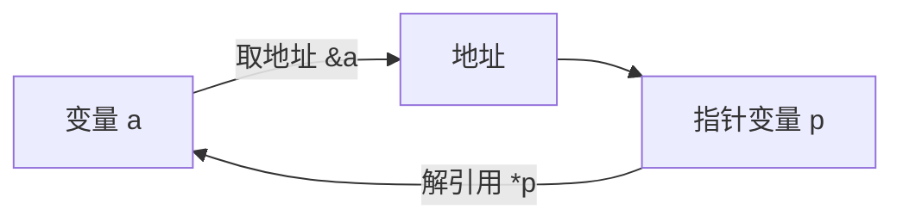
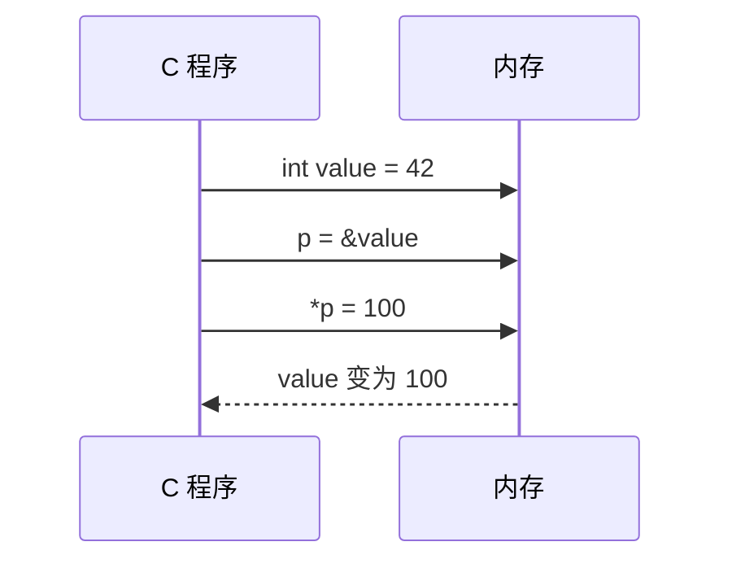
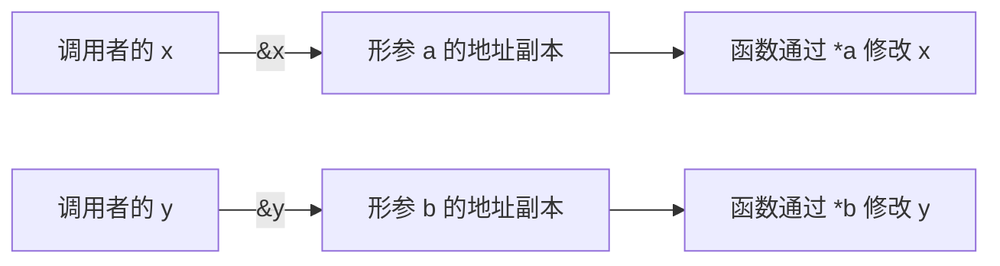
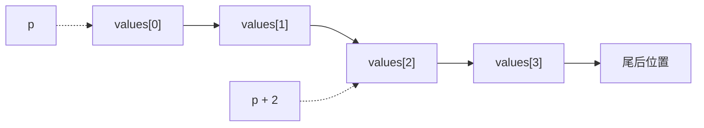
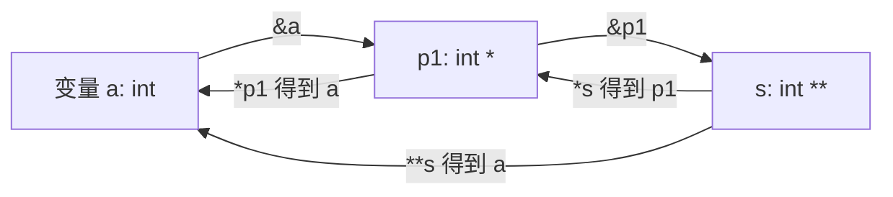
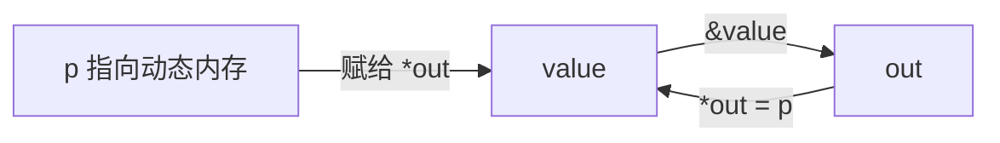
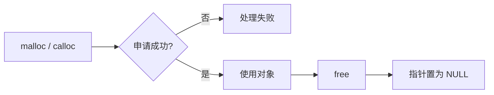

# 指针

指针是 C 语言中保存地址的变量。它本身也占用内存，但保存的不是普通数据，而是另一个对象的位置编号。掌握指针后，数组、字符串、函数参数和动态内存会连成一条线；没掌握时，程序通常会用一次崩溃提醒你检查边界。

## 什么是指针

程序运行时，变量会放在内存中，每个对象都有自己的地址。指针变量保存这个地址，通过解引用可以访问目标对象。

| 名称   | 含义              |
| ---- | --------------- |
| 地址   | 某个内存位置的编号       |
| 指针   | 保存地址的变量         |
| 指针类型 | 描述指针指向对象的类型     |
| 解引用  | 根据指针保存的地址访问目标对象 |



地址是一个值，指针是保存这个值的变量。二者有关，但不能混为一谈。

## 取地址与解引用

& 是取地址运算符，\* 在这里是解引用运算符：

```c
#include <stdio.h>

int main(void) {
    int value = 42;
    int *p = &value;

    printf("value = %d\n", value);
    printf("*p    = %d\n", *p);

    *p = 100;
    printf("value = %d\n", value);
    return 0;
}
```

输出中的地址每次运行可能不同，这是正常现象。不要把一次运行得到的地址抄进程序当常量。



## 定义指针变量

指针声明的一般形式是：

```c
数据类型 *指针名;
```

例如：

```c
int *pi;
char *pc;
double *pd;
```

int、char 和 double 描述指针指向的对象类型，不表示指针本身的大小。对象指针的大小由平台和实现决定。

定义指针时应尽量立即初始化：

```c
int value = 10;
int *p = &value;
int *q = NULL;
```

未初始化的自动指针保存的是不确定值，不能解引用。int \*p 不是“自动指向某个整数”，它只是一个还没有有效目标的变量。

### 指针类型的作用

指针类型影响解引用时如何解释内存，也影响指针加减时跨越多少字节。

```c
int value = 0x12345678;
int *pi = &value;
unsigned char *bytes = (unsigned char *)&value;

printf("%d\n", *pi);
printf("%u\n", bytes[0]);
```

不要用不匹配的类型随意解引用。对齐、对象表示和严格别名规则都可能使这种做法产生未定义行为。

| 指针类型      |          p + 1 的典型步长 |
| --------- | -------------------: |
| char \*   | sizeof(char)，标准保证为 1 |
| int \*    |    sizeof(int)，常见为 4 |
| double \* | sizeof(double)，常见为 8 |

指针本身保存的是地址，因此同一平台上的对象指针通常具有相同的大小；它与指向的对象类型无关。下面的截图分别展示了 32 位和 64 位环境中的典型结果。具体大小应以 `sizeof` 的实际输出为准，不能把某个平台的结果当成 C 标准的硬性规定。


### 小端存储

多字节整数在内存中的排列顺序由平台决定。常见的 x86 平台采用小端存储，低位字节放在低地址处。下面的程序只用于观察对象表示，输出顺序不能当作所有平台都相同。

```c
#include <stdio.h>

int main(void) {
    unsigned int value = 0x12345678;
    unsigned char *p = (unsigned char *)&value;

    for (size_t i = 0; i < sizeof value; ++i) {
        printf("%02x ", p[i]);
    }
    putchar('\n');
    return 0;
}
```

## 空指针、野指针与悬空指针

| 类型   | 含义             | 常见原因           | 处理方式       |
| ---- | -------------- | -------------- | ---------- |
| 空指针  | 不指向有效对象的合法指针值  | int \*p = NULL | 解引用前判断     |
| 野指针  | 未初始化或保存非法地址的指针 | int \*p        | 定义时初始化     |
| 悬空指针 | 指向的对象已经失效      | free(p) 后继续使用  | 释放后置为 NULL |

空指针可以比较、传递和重新赋值，但不能解引用：

```c
int *p = NULL;
if (p != NULL) {
    printf("%d\n", *p);
}
```

把指针置为 NULL 只能防止继续通过这个变量访问，不能修复已经发生的越界写入，也不能让其他副本自动失效。

返回局部变量地址也是常见错误：

```c
int *wrong(void) {
    int value = 10;
    return &value;
}
```

函数返回后 value 的生存期已经结束，返回的地址不再指向有效对象。

## 指针传参

C 语言的参数传递始终是值传递。传入指针时，传递的是地址副本；这个副本仍然可以指向调用者的对象，因此函数能够修改对象内容。

先看普通的值传递：函数得到的是实参的副本，函数内部交换的只是副本，调用者的变量不会改变。


```c
#include <stdio.h>

void swap(int *a, int *b) {
    int tmp = *a;
    *a = *b;
    *b = tmp;
}

int main(void) {
    int x = 3;
    int y = 8;
    swap(&x, &y);
    printf("x = %d, y = %d\n", x, y);
    return 0;
}
```

指针传参仍然是值传递，只是这次复制的值恰好是地址。函数通过地址副本解引用后，修改的就是调用者的对象。


下面这张图从栈帧角度展示了同一过程：形参 `a`、`b` 保存的是 `x`、`y` 的地址，交换发生在地址所指向的对象上。


函数调用时，实参的数量和类型必须与函数原型匹配。旧式的无原型声明无法可靠地检查参数，现代 C 代码应写出完整原型；下面的截图展示了参数数量不匹配时编译器给出的诊断。




如果要让函数修改调用者的指针变量本身，就需要传递指针的地址，也就是二级指针。

## 指针运算

### 指针加减

指针加上整数 n，表示向数组中移动 n 个元素，而不是移动 n 个字节：

```c
int values[] = {10, 20, 30, 40};
int *p = values;

printf("%d\n", *p);
printf("%d\n", *(p + 2));
```

指针运算必须围绕同一个数组对象进行。可以指向数组元素，也可以暂时指向数组末尾的尾后位置，但不能解引用尾后指针。



### 指针相减

同一数组中的两个元素指针可以相减，结果是元素之间的距离，类型为 ptrdiff\_t：

```c
#include <stddef.h>
#include <stdio.h>

int main(void) {
    int values[] = {10, 20, 30, 40, 50};
    int *first = &values[1];
    int *last = &values[4];

    ptrdiff_t distance = last - first;
    printf("%td\n", distance);
    return 0;
}
```

两个无关对象的指针相减、指针相加，以及把指针当普通整数做任意算术，都不符合 C 语言的指针运算规则。

### `p++`、`*p++` 与 `*++p`

后缀 `++` 的优先级高于一元 `*`：

```c
*p++    // 等价于 *(p++)：先取当前元素，再让 p 后移
(*p)++  // 让当前元素加 1
*++p    // 先让 p 前移，再取新位置的元素
```

复杂表达式不值得拿来考验读者的耐心。拆成多条语句，通常更容易检查。

## const 与指针

判断声明时，可以从变量名向外读：const 修饰它左边的类型；如果左边没有类型，就修饰右边的类型。

| 写法                  | 含义                 | 能否修改指向的数据 | 能否改变指向 |
| ------------------- | ------------------ | --------- | ------ |
| const int \*p       | 指向常量的指针            | 不能通过 p 修改 | 可以     |
| int const \*p       | 与 const int \*p 等价 | 不能通过 p 修改 | 可以     |
| int \*const p       | 常量指针               | 可以        | 不可以    |
| const int \*const p | 指向常量的常量指针          | 不能通过 p 修改 | 不可以    |

```c
int a = 10;
int b = 20;

const int *p1 = &a;
p1 = &b;
// *p1 = 30;   // 错误

int *const p2 = &a;
*p2 = 30;
// p2 = &b;    // 错误
```

不要通过强制类型转换去修改原本定义为 const 的对象，这样会产生未定义行为。

## 指针与数组

数组名在大多数表达式中会转换为指向首元素的指针：

```c
int values[3] = {10, 20, 30};
int *p = values;

printf("%d\n", values[1]);
printf("%d\n", *(p + 1));
```

数组名不是可修改的指针变量，不能写 values++。在 sizeof、& 和字符串初始化等场景中，数组不会转换为指针：

```c
int values[3];
printf("%zu\n", sizeof values);
printf("%zu\n", sizeof &values);
```

函数形参中的 values\[] 会调整为指针。数组长度应作为单独参数传入：

```c
#include <stdio.h>
#include <stddef.h>

void print_array(const int values[], size_t count) {
    for (size_t i = 0; i < count; ++i) {
        printf("%d ", values[i]);
    }
    putchar('\n');
}

int main(void) {
    int values[] = {1, 2, 3, 4};
    size_t count = sizeof values / sizeof values[0];
    print_array(values, count);
    return 0;
}
```

### 数组指针与指针数组

这两个声明只差一对括号，含义完全不同：

| 声明                  | 含义                   |
| ------------------- | -------------------- |
| int \*array\[4]     | 包含 4 个 int \* 元素的数组  |
| int (\*pointer)\[4] | 指向含 4 个 int 元素的数组的指针 |

## 字符串与字符指针

C 语言没有内置的字符串类型。字符串通常以字符数组保存，并以终止字符 \0 结束：

```c
char word[] = "hello";
printf("%zu\n", sizeof word);
```

字符串字面量通常放在只读区域，不能通过普通字符指针修改：

```c
const char *message = "hello";
printf("%s\n", message);
// message[0] = 'H';    // 错误

char writable[] = "hello";
writable[0] = 'H';
```

使用字符串函数时，要保证目标数组空间足够，并为终止字符预留一个字节。strcpy、strcat 等函数不会自动检查目标数组容量，目标空间不足时会越界。

## `void *` 通用指针

void \* 可以保存任意对象类型的地址，也可以从其他对象指针隐式转换而来。它不能直接解引用，必须先转换成合适的对象指针。

`void` 作为函数返回类型表示“不返回值”，作为参数列表中的唯一类型表示“不接收参数”；`void *` 则是对象通用指针。三者含义不同，不能因为都出现了 `void` 就混为一谈：

```c
#include <stdio.h>

void print_int(const void *data) {
    const int *p = data;
    printf("%d\n", *p);
}

int main(void) {
    int value = 42;
    print_int(&value);
    return 0;
}
```


malloc 返回 void \*，在 C 中不需要强制转换：

```c
#include <stdlib.h>

int *values = malloc(4 * sizeof *values);
if (values == NULL) {
    return 1;
}

for (int i = 0; i < 4; ++i) {
    values[i] = i * i;
}
free(values);
values = NULL;
```

## 二级指针

### 基本关系

一级指针变量保存普通对象的地址，例如 `int *p1 = &a`；一级指针本身也是一个对象，也有自己的地址。因此，可以再定义一个指针保存它的地址：这就是二级指针。

```c
int a = 10;
int *p1 = &a;       // p1 保存 a 的地址
int **s = &p1;      // s 保存 p1 的地址
```

从声明上读：`p1` 是“指向 `int` 的指针”，`s` 是“指向 `int *` 的指针”。`int **` 不是两个连续的 `int`，而是多经过一层地址间接访问。



对 `int **s = &p1` 而言：

- `s` 的值是 `p1` 的地址，即 `s == &p1`；
- `*s` 访问 `p1` 这个一级指针，因而 `*s == p1`；
- `**s` 先访问 `p1`，再访问 `p1` 指向的 `a`，因而 `**s == a`。

下面的示例把这三个层次写成可观察的修改：

```c
#include <stdio.h>

int main(void) {
    int a = 10;
    int b = 20;
    int *p1 = &a;
    int *p2 = NULL;
    int **s = &p1;

    **s = 100;       // 等价于 *p1 = 100，修改 a
    printf("a = %d, **s = %d\\n", a, **s);

    s = &p2;         // 让二级指针改为管理 p2
    *s = &b;         // 等价于 p2 = &b
    **s = 200;       // 等价于 *p2 = 200，修改 b
    printf("b = %d, **s = %d\\n", b, **s);
    return 0;
}
```


### 用二级指针修改调用者的指针

二级指针保存的是一级指针变量的地址。它常用于让函数修改调用者的指针变量：

```c
#include <stdio.h>
#include <stdlib.h>

int create_value(int **out) {
    int *p = malloc(sizeof *p);
    if (p == NULL) {
        return 0;
    }
    *p = 123;
    *out = p;
    return 1;
}

int main(void) {
    int *value = NULL;
    if (create_value(&value)) {
        printf("%d\n", *value);
        free(value);
        value = NULL;
    }
    return 0;
}
```

`create_value(&value)` 的调用过程可以拆成三步：`&value` 传入 `value` 的地址；函数中的 `*out = p` 改写调用者的 `value`；函数返回后，调用者才能通过 `value` 访问新对象。失败时函数不应覆盖原指针，也不应泄漏已经申请的内存。



### 二级指针与二维数组不是一回事

`int matrix[2][3]` 是连续存放的二维数组，数组名衰减后类型为 `int (*)[3]`；`int **` 通常表示“指向一个 `int *` 变量的指针”。二者的内存布局和指针步长不同，不能互相替代。

```c
int matrix[2][3] = {{1, 2, 3}, {4, 5, 6}};
int (*row)[3] = matrix;  // 正确：指向一行
// int **wrong = matrix; // 类型不匹配，不能这样写
```

如果确实需要 `int **`，就必须先为指针数组和每一行分别分配空间，并按相反顺序释放；这属于另一种“分行存储”的数据结构。

`int **` 不是“两个连续的整数”，而是“指向 `int *` 变量的指针”。

## 二维数组与指针

二维数组是连续的数组对象。例如 `int matrix[2][3]` 是“包含 2 个元素的数组，每个元素又是包含 3 个 int 的数组”。它不是 `int **`。

```c
#include <stdio.h>

void print_matrix(size_t rows, size_t cols, int matrix[rows][cols]) {
    for (size_t r = 0; r < rows; ++r) {
        for (size_t c = 0; c < cols; ++c) {
            printf("%d ", matrix[r][c]);
        }
        putchar('\n');
    }
}

int main(void) {
    int matrix[2][3] = {{1, 2, 3}, {4, 5, 6}};
    print_matrix(2, 3, matrix);
    return 0;
}
```

对于固定列数，也可以写成：

```c
void print_matrix_fixed(size_t rows, int matrix[][3]) {
    for (size_t r = 0; r < rows; ++r) {
        for (size_t c = 0; c < 3; ++c) {
            printf("%d ", matrix[r][c]);
        }
        putchar('\n');
    }
}
```

参数中的第一维可以省略，但后续维度必须让编译器知道，否则编译器无法计算 `matrix[r][c]` 的地址。若使用 `int **`，每次加一的步长是一个指针大小，与二维数组行的实际步长不匹配。

## 结构体指针

结构体指针使用 -> 访问成员，`(*p).member` 与 `p->member` 等价：

```c
#include <stdio.h>

struct Student {
    char name[32];
    int score;
};

int main(void) {
    struct Student student = {"Lin", 95};
    struct Student *p = &student;

    printf("%s: %d\n", p->name, p->score);
    p->score = 98;
    return 0;
}
```

## 动态内存与生存期

动态内存由 malloc、calloc、realloc 申请，由 free 释放。申请成功后，调用者负责在不再使用时释放它。



```c
int *p = malloc(10 * sizeof *p);
if (p == NULL) {
    /* 处理内存不足 */
}

/* 使用 p 指向的 10 个 int */
free(p);
p = NULL;
```

`free(NULL)` 是安全的。把释放后的指针置为 NULL 可以降低重复释放的风险，但仍应保证每块动态内存只由一个清晰的所有者负责释放。

## 常见错误

| 错误               | 后果            |
| ---------------- | ------------- |
| 解引用未初始化指针        | 未定义行为         |
| 解引用 NULL         | 未定义行为，常见结果是崩溃 |
| free 后继续使用指针     | 使用悬空指针        |
| 返回局部变量地址         | 函数结束后指针失效     |
| 数组越界访问           | 未定义行为         |
| 用错误类型解引用         | 可能违反对齐和别名规则   |
| 把二维数组当作 int \*\* | 地址步长不匹配       |
| 忘记释放动态内存         | 内存泄漏          |
| 把字符串字面量当可写数组     | 未定义行为         |
| 把尾后指针解引用         | 未定义行为         |

编译时建议打开警告：

```bash
gcc -std=c17 -Wall -Wextra -Wpedantic -g pointer_demo.c -o pointer_demo
```

还可以使用 AddressSanitizer 查找越界和释放后使用：

```bash
gcc -std=c17 -Wall -Wextra -fsanitize=address,undefined -g pointer_demo.c -o pointer_demo
./pointer_demo
```

总的来说：

1. 指针变量保存地址，解引用才会访问目标对象。
2. 指针类型决定了解引用方式和指针运算的步长。
3. C 语言参数传递始终是值传递；指针参数传递的是地址副本。
4. 指针运算应限制在同一个数组对象及其尾后位置内。
5. const 用来约束通过某个指针能否修改对象，以及指针能否改指向。
6. 数组、字符串、二维数组和动态内存都需要特别关注边界与生存期。
7. 遇到指针问题，先问三个问题：它指向哪里？对象还活着吗？访问范围合法吗？

## 指针边界、别名与有效类型

指针加减只有在同一个数组对象（或数组末尾后一个位置）内才有定义。指向单个对象的指针可以与末尾后位置形成比较，但不能继续解引用：

```c
int values[3] = {10, 20, 30};
int *begin = values;
int *end = values + 3;

for (int *p = begin; p != end; ++p) {
    /* p 指向有效元素 */
}
```

C 还受到对象表示和别名规则的约束。通过不兼容类型的指针随意读取对象，可能触发未定义行为。需要按字节查看对象表示时，使用 `unsigned char *`；需要复制对象时，优先使用 `memcpy`。不要把“地址数值相同”误解为“任意指针类型都可以互换”。

数组指针（如 `int (*)[4]`）、指针数组（如 `int *[4]`）和二级指针（如 `int **`）是三种不同类型，声明时应先读清楚括号和星号的结合关系。

## 原稿图示
