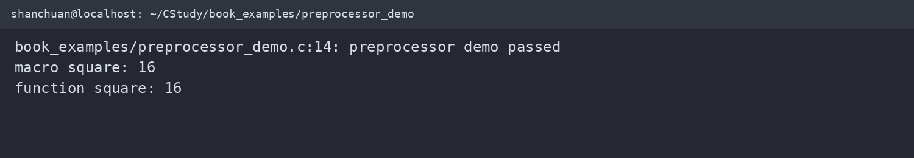

# 预处理器进阶

预处理器在真正编译前处理源文件。它只做文本层面的变换，不理解变量类型，也不会替宏调用检查参数。理解这一点，才能解释宏的括号、重复求值和条件编译问题。

下面的示例在 WSL2 `/home/shanchuan/CStudy/book_examples/preprocessor_demo.c` 中编译运行：




## 宏必须保护运算优先级

```c
#define BAD_SQUARE(x) x * x
#define SQUARE(x) ((x) * (x))

int a = BAD_SQUARE(1 + 2); // 展开为 1 + 2 * 1 + 2，结果是 5
int b = SQUARE(1 + 2);     // 结果是 9
```

宏参数可能被求值多次，因此带副作用的表达式不能直接传入：

```c
#define SQUARE(x) ((x) * (x))
int i = 3;
int value = SQUARE(i++); // 未定义行为风险：i 被递增两次
```

需要单次求值时，优先使用 `static inline` 函数：

```c
static inline int square_int(int x) {
    return x * x;
}
```

## 字符串化与标记连接

```c
#define TEXT(x) #x
#define JOIN(a, b) a##b

const char *name = TEXT(C language); // "C language"
int value = JOIN(error_, code);      // error_code
```

多语句宏应使用 `do { ... } while (0)` 包裹，避免调用者的 `if/else` 结构被破坏：

```c
#define SWAP_INT(a, b) do { \
    int temporary = (a);     \
    (a) = (b);                \
    (b) = temporary;          \
} while (0)
```

## 条件编译

条件编译适合处理平台差异、调试代码和头文件保护：

```c
#if defined(_WIN32)
    #define PATH_SEPARATOR '\\'
#else
    #define PATH_SEPARATOR '/'
#endif

#ifdef DEBUG
    #define LOG(message) fprintf(stderr, "DEBUG: %s\n", (message))
#else
    #define LOG(message) ((void)0)
#endif
```

头文件保护的完整形式如下：

```c
#ifndef STACK_H
#define STACK_H

typedef struct Stack Stack;
Stack *stack_create(void);
void stack_destroy(Stack *stack);

#endif
```

## 预定义宏与断言

常用预定义宏包括 `__FILE__`、`__LINE__`、`__func__`、`__DATE__` 和 `__TIME__`。它们适合生成诊断信息：

```c
#include <stdio.h>

#define TRACE(message) \
    fprintf(stderr, "%s:%d (%s): %s\n", \
            __FILE__, __LINE__, __func__, (message))
```

断言用于表达“这里必须成立”的程序不变量：

```c
#include <assert.h>

int divide(int total, int count) {
    assert(count != 0);
    return total / count;
}
```

定义 `NDEBUG` 后，标准 `assert` 会被禁用。断言不应代替用户输入校验或运行时错误处理。

## C11 `_Generic`

`_Generic` 可以按表达式类型选择实现，常用于轻量级泛型接口：

```c
#include <stdio.h>

#define print_value(value) _Generic((value), \
    int: print_int,                         \
    double: print_double                    \
)(value)

static void print_int(int value) { printf("int: %d\n", value); }
static void print_double(double value) { printf("double: %.2f\n", value); }
```

实际项目中应优先选择类型安全的普通函数、`static inline` 或函数指针；宏和 `_Generic` 适合减少重复接口，不适合隐藏复杂控制流。

## 可运行完整示例

将下面内容保存为 `preprocessor_demo.c`：

```c
#include <assert.h>
#include <stdio.h>

#define SQUARE(x) ((x) * (x))
#define TRACE(message) fprintf(stderr, "%s:%d: %s\n", __FILE__, __LINE__, (message))

static int square_int(int value) {
    return value * value;
}

int main(void) {
    int value = 4;
    assert(value > 0);
    printf("macro square: %d\n", SQUARE(value));
    printf("function square: %d\n", square_int(value));
    TRACE("preprocessor demo passed");
    return 0;
}
```

编译运行：

```sh
gcc -std=c11 -Wall -Wextra -Wpedantic preprocessor_demo.c -o preprocessor_demo
./preprocessor_demo
```

预期输出包含 `macro square: 16`、`function square: 16` 和一行带文件名、行号的诊断信息。

## 练习方向

* 使用 `gcc -E` 观察宏展开。
* 修复一个存在优先级错误的宏。
* 写一个带 `DEBUG` 开关的日志宏。
* 用 `__FILE__` 和 `__LINE__` 输出错误位置。
* 用 `_Generic` 实现整数和浮点数的统一打印接口。
