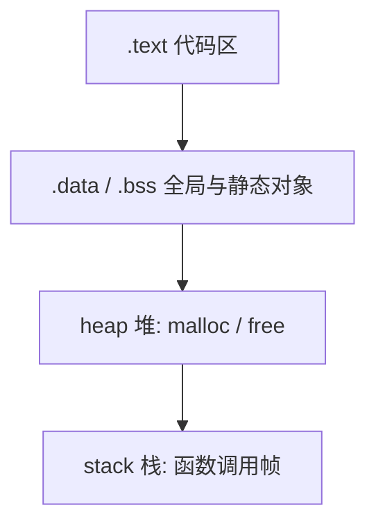

# 可见性和生存期

可执行程序的用户空间通常分成几类区域。实际布局由操作系统和链接器决定，下面的图只表示常见关系，不是硬编码的地址地图。

| 区域 | 典型内容 | 生命周期 |
| --- | --- | --- |
| `.text` | 机器指令 | 进程整个运行期间 |
| `.data` / `.bss` | 已初始化和零初始化的全局、静态对象 | 进程整个运行期间 |
| heap | 动态分配的对象 | 从分配到 `free` |
| stack | 参数、局部变量、返回地址 | 从进入代码块到离开代码块 |

### 作用域

​	标识符作用域就是程序中该标识符可以被使用的区域,**此阶段针对编译链接过程**

1. 函数中定义的标识符,包括形参和函数中定义的局部变量,作用域都在函数内,,也称作函数域

2. 文件作用域也叫全局作用域,定义在所有函数之外的标识符,具有文件作用域,作用域为定义处到整个源文件结束,文件中定义的全局变量和函数都有文件作用域

### 生存期

也叫生命期(Life time),**此阶段针对程序运行过程**

生命期指标识符从程序开始时被创建,具有储存空间,到程序运行结束时消亡,释放储存空间的时间段

1. 局部变量的生存期:函数被调用,分配储存空间,函数执行结束,储存空间释放,存储 .stack 区
2. 全局变量的生存期:从**程序执行前**开始,到执行后结束,存储在 .data 区
3. 动态生命期:标识符由特定的函数调用或运算来创建和释放,如 malloc 函数为变量分配存储空间,变量的生命期开始,调用 free 函数释放空间或程序结束时,变量生命期结束,具有动态生命期的变量存储在 .heap 区
