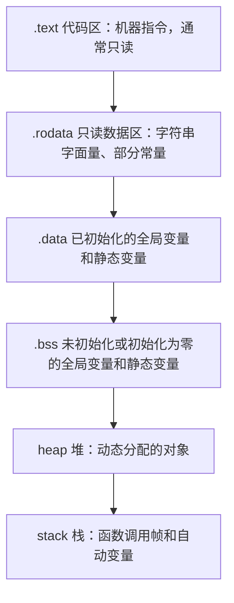
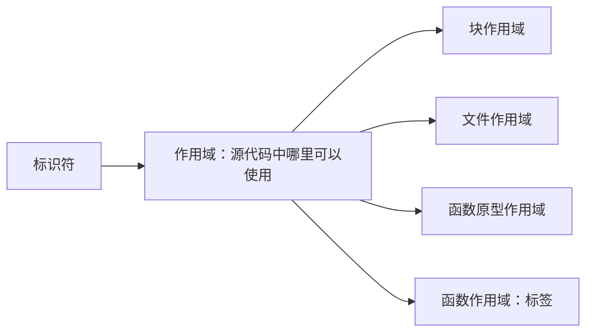

# 可见性和生存期

## 程序的用户空间布局

可执行程序加载到内存后，操作系统通常会为它建立多个区域。不同操作系统、编译器和链接器的具体布局可能不同，下面的图只表示常见关系，不代表固定地址，也不代表所有区域一定按照这个方向排列。



常见区域的作用如下：

| 区域        | 主要内容                              | 典型特点         |
| --------- | --------------------------------- | ------------ |
| `.text`   | 编译后的机器指令                          | 通常可执行、不可写    |
| `.rodata` | 字符串字面量、只读数据                       | 通常只读         |
| `.data`   | 已初始化的全局变量和静态变量                    | 程序启动时已经存在    |
| `.bss`    | 未初始化或显式初始化为零的全局变量和静态变量            | 程序启动时由系统清零   |
| heap      | `malloc`、`calloc`、`realloc` 分配的对象 | 由程序员或分配器管理   |
| stack     | 函数调用帧、参数和普通局部变量                   | 通常随函数调用创建和销毁 |

<figure><figcaption></figcaption></figure>

例如：

```c
#include <stdlib.h>
​
int global_value = 10;       // 通常位于 .data
int global_count;            // 通常位于 .bss
static int cache = 1;        // 通常位于 .data
​
const char message[] = "hi"; // 可能位于只读数据区
​
int main(void)
{
    int local_value = 20;    // 通常属于自动存储期对象
    int *data = malloc(sizeof(*data));
​
    if (data != NULL)
    {
        *data = 30;
        free(data);
    }
​
    return local_value;
}
```

需要注意：

* 具体对象放在哪个区域由编译器、链接器和操作系统共同决定。
* 栈通常向低地址方向增长，堆通常向高地址方向增长，但这不是 C 语言标准保证的规则。
* C 语言标准描述的是对象的作用域、链接和存储期，并不规定必须存在名为 `.text`、`.data` 或 `.heap` 的内存段。
* 动态分配的对象位于堆管理的存储区域，指向它的指针变量本身可能是局部变量，二者不要混为一谈。

## 作用域

作用域（scope）是标识符在源代码中可以被直接使用的范围。它属于编译阶段的语言规则，决定编译器在某个位置能否找到这个名字。



### 块作用域

在代码块中定义的变量、函数参数以及 `for` 循环中的控制变量，通常具有块作用域。作用域从声明处开始，到所在代码块的右花括号结束。

```c
#include <stdio.h>
​
int main(void)
{
    int value = 10;
​
    {
        int inner = 20;
        printf("%d %d\n", value, inner);
    }
​
    // inner 在这里已经超出作用域，不能继续使用
    return 0;
}
```

内层代码块可以定义与外层同名的变量。此时，内层变量会遮蔽外层变量：

```c
#include <stdio.h>
​
int main(void)
{
    int value = 10;
​
    {
        int value = 20;
        printf("inner: %d\n", value);
    }
​
    printf("outer: %d\n", value);
​
    return 0;
}
```

输出：

```
inner: 20
outer: 10
```

这两个 `value` 是两个不同的对象。为了减少阅读时的误会，实际编程中不应过度使用同名遮蔽。

### 文件作用域

定义在所有函数外部的标识符具有文件作用域。它的作用域从声明处开始，一直到当前源文件末尾。

```c
#include <stdio.h>
​
int total = 100;  // 文件作用域
​
void print_total(void)
{
    printf("%d\n", total);
}
​
int main(void)
{
    print_total();
    return 0;
}
```

文件作用域的变量和函数常被称为全局变量和全局函数，但“全局”只描述它们位于函数外，并不表示它们一定能被所有源文件访问。

例如，使用 `static` 修饰的文件作用域对象只有内部链接：

```
static int hidden_value = 10;
```

它仍然具有文件作用域，但只能在当前源文件中使用。

### 函数原型作用域

函数声明中的参数名称，如果只出现在函数原型中，其作用域到函数声明末尾为止：

```c
int add(int left, int right);
```

这里的 `left` 和 `right` 只用于说明参数位置和类型，不能在声明外直接使用。

函数定义中的参数则具有块作用域：

```c
int add(int left, int right)
{
    return left + right;
}
```

### 函数作用域

标签具有函数作用域，只能在定义它的函数内部使用：

```c
void example(void)
{
    goto finish;

finish:
    return;
}
```

即使两个不同函数中使用了相同的标签名，也不会发生冲突，因为标签的作用范围不会超出当前函数。

## 生存期与存储期

生存期通常称为生命周期（lifetime），表示一个对象从创建到销毁所持续的时间。

在 C 语言标准中，更常使用“存储期”（storage duration）来描述对象的存在时间。作用域回答“在哪里可以使用这个名字”，存储期回答“对象能够存在多久”。两者不是同一个概念。

| 存储期   | 对象的存在时间           | 常见对象                        |
| ----- | ----------------- | --------------------------- |
| 自动存储期 | 进入代码块时创建，离开代码块时销毁 | 普通局部变量、函数参数                 |
| 静态存储期 | 程序开始执行前创建，程序结束时销毁 | 全局变量、文件作用域变量、局部 `static` 变量 |
| 动态存储期 | 分配时创建，释放时销毁       | `malloc` 等函数分配的对象           |
| 线程存储期 | 线程开始时创建，线程结束时销毁   | 使用 `_Thread_local` 定义的对象    |

### 自动存储期

普通局部变量和函数参数通常具有自动存储期：

```c
void function(void)
{
    int value = 10;  // 进入函数时创建
    printf("%d\n", value);
}                      // 离开函数后生命周期结束
```

函数每次调用时，`value` 都会获得一个新的对象。函数返回后，该对象的生命周期结束，不能继续访问它。

自动变量通常使用栈上的存储空间，但 C 语言标准并不要求编译器必须把它们放在名为“栈”的区域中。

### 静态存储期

文件作用域变量和使用 `static` 修饰的变量具有静态存储期：

```c
#include <stdio.h>

void count_calls(void)
{
    static int count = 0;

    ++count;
    printf("%d\n", count);
}
```

调用示例：

```c
int main(void)
{
    count_calls();  // 1
    count_calls();  // 2
    count_calls();  // 3

    return 0;
}
```

`count` 的作用域只在 `count_calls` 函数内部，但它从程序开始到程序结束一直存在。它只初始化一次，函数返回后值仍然保留。

未显式初始化的静态存储期对象会被初始化为零：

```c
int global_count;       // 初始化为 0
static int cache;       // 初始化为 0

void function(void)
{
    static int calls;   // 初始化为 0
}
```

已经初始化为非零值的对象通常放入 `.data` 区域；未初始化或初始化为零的对象通常放入 `.bss` 区域。这是常见实现方式，不是 C 标准强制规定的物理布局。

### 动态存储期

由 `malloc`、`calloc` 或 `realloc` 分配的对象具有动态存储期：

```c
#include <stdlib.h>

int main(void)
{
    int *value = malloc(sizeof(*value));

    if (value == NULL)
    {
        return 1;
    }

    *value = 42;

    free(value);
    value = NULL;

    return 0;
}
```

这里需要区分两个对象：

* `value` 是一个局部指针变量，通常具有自动存储期；
* `malloc` 分配的整数对象具有动态存储期。

调用 `free(value)` 后，动态对象的生命周期结束，不能再通过原指针访问它。将指针设置为 `NULL` 可以减少误用悬空指针的风险，但不会恢复已经释放的对象。

## 作用域与存储期的对照

下面的示例说明：作用域和存储期可以独立变化。

```c
#include <stdio.h>

void example(void)
{
    static int count = 0;  // 块作用域，静态存储期

    ++count;
    printf("%d\n", count);
}
```

`count` 的名字只能在 `example` 函数内部使用，这是作用域；但它在函数返回后仍然存在，直到程序结束，这是存储期。

可以把两者简单记成：

```
作用域：这个名字在哪里可见？
存储期：这个对象能够存在多久？
```

理解这两个问题后，`static`、全局变量、局部变量和动态内存之间的关系就不会再挤成一团。

## 作用域、链接与存储期的三个问题

遇到一个标识符时，可以依次问三个问题：

1. 名字在源代码的哪一段可见？这是作用域；
2. 不同源文件的同名名字是否指向同一实体？这是链接；
3. 对象从什么时候存在到什么时候销毁？这是存储期。

例如函数内部的 `static` 变量具有块作用域和静态存储期；`malloc` 返回的对象没有一个可以直接书写的 C 标识符，但对象本身具有动态存储期，直到调用 `free` 或程序结束。

## 原稿图示
