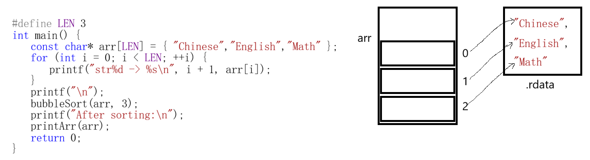

# 字符串

### 字符串常量

```c
int main() {
	char stra[] = "hello";
	char strb[] = "hello";
	char* ptra = "world";
	char* ptrb = "world";

	printf("%d\n", stra == strb); //0
	printf("%d\n", ptra == ptrb); //1
	return 0;
}
```

字符串常量通常存储在内存.data区的**只读数据段（.rodata）**，因此**不允许被修改**。


编译器会对相同的字符串常量进行 “合并”，即多个相同的字符串常量在内存中只存储一份。因此两个指针指向的为同一处地址`00577B38`,所以打印`1`。同时，指针 `ptra` 指向的是只读内存中的字符串，此时修改 `ptra[0] = 'x'` 会导致写入访问权限冲突。

```c
char ch = ptra[0]; // *(ptra+0)
//ptra[0] = 'W';
```


字符串常量通常被赋值给`char*`类型的指针（如`char *p = "hello";`）。从语法上看，`char*`指针是允许修改指向的内容的（因为早期C语言并没有引入const关键字），但实际上字符串常量存储在只读内存段（如`.rodata`），**物理上不允许修改**。

```c
char stra[] = "he";
char* ptra = "llo";

int len = strlen(stra);
printf("Length: %d\n", len); //Length: 2
len = strlen(ptra);
printf("Length: %d\n", len); //Length: 3
return 0;
```

### 字符串排序

#### 指针数组的排序

```c
#define LEN 3
int main() {
	const char* arr[LEN] = { "Chinese","English","Math" };
	for (int i = 0; i < LEN; ++i) {
		printf("str%d -> %s\n",i+1, arr[i]);
	}
	printf("\n");
	bubbleSort(arr, 3);
	printf("After sorting:\n");
	printArr(arr);
    return 0;
}
```

我们在定义一个指向包含3个字符指针的数组后，准备开始进行字符串排序。



在`printArr()`函数中，传参`const char* arr[]`会退化为二级指针的形式`const char** arr`，`arr[i]`变为`arr + i`，打印时对其解引用，将打印指针指向的内容。

```c
void printArr(const char* arr[]) {
    assert(arr != NULL);
	for (int i = 0; i < LEN; ++i) {
		printf("str%d -> %s\n", i + 1, arr[i]);
	}
	printf("\n");
}
```

以上便是打印函数的相关内容，接下来开始编写最主要的排序部分。

需要注意的是，我们并不能直接通过比较`arr[i]`与`arr[i+1]`，这是因为他们两个存放的为指针，我们要比较的应当为两个字符串的ASCII值。

在这里可以使用`strcmp`函数，该函数会对指针进行解引用操作，逐个比较字符串的ASCII 值并根据结果返回不同的值。那数据存储在只读数据区，又是如何进行数据的更换，让其按值的大小进行排列的呢？

很简单，我们只需要交换二者的指针即可，让他们的指向发生交换，从而间接地对字符串数组进行排序：

```c
void bubbleSort(const char* arr[], int n) {
    assert(arr != NULL);  // 断言防止传入空指针
    for (int i = 0; i < n - 1; ++i) {
        for (int j = 0; j < n - 1 - i; ++j) {
            // strcmp比较两个字符串：前者>后者返回>0，相等返回0，前者<后者返回<0
            if (strcmp(arr[j], arr[j + 1]) > 0) {
                // 交换指针（仅交换指向，不修改字符串内容）
                const char* temp = arr[j];
                arr[j] = arr[j + 1];
                arr[j + 1] = temp;
            }
        }
    }
}
```

最后通过测试用例进行验证，该功能完美实现。

```c
int main() {
	const char* arr[LEN] = { "English","Chinese","Math" };
	printArr(arr);
	bubbleSort(arr, 3);
	printf("After sorting:\n");
	printArr(arr);
	return 0;
}
```

```
str1 -> English
str2 -> Chinese
str3 -> Math

After sorting:
str1 -> Chinese
str2 -> English
str3 -> Math
```

#### 二维数组的排序

指针数组对于数据的存储并不友好，当我们想通过scanf来写入数据时，会因为指针并未初始化，指向的空间无效而导致失败。而二维数组则完全没有这类烦恼。因为当我们开辟空间之后地址已经确定，因此可以使用scanf等函数来进行数据的写入和修改。

```c
#define LEN 128
#define N 5
int main(){
	char stra[N][LEN] = { 0 };
	for (int i = 0; i < N; ++i) gets_s(stra[i], LEN);		// 读取字符串
	for (int i = 0; i < N; ++i) printf("%s \n", stra[i]);	// 打印字符串
}
```

```c
i
am
shan
chuan
good
i
am
shan
chuan
good
```

那么如何编写二维数组初始化函数呢？二维数组在传参时，会退化为一级指针。

```c
//void initArr(char arr[N][LEN], int row, int cal)
void initArr(char (*arr)[LEN],int row,int cal){
	assert(arr != NULL);
	for (int i = 0; i < row; ++i) {
		gets_s(arr[i],cal);
	}
}
```

在初始化时需要cal，让长度并不会超过cal，打印时则不需要：
```c
void printArr(char (*arr)[LEN], int row) {
	assert(arr != NULL);
	for (int i = 0; i < row; ++i) {
		printf("%s \n", arr[i]);
	}
}
```

```c
int main(){
	char stra[N][LEN] = { 0 };
	initArr(stra, N, LEN);	// 初始化字符串数组
	printArr(stra, N);		// 打印字符串数组
	return 0;
}
```

由于这次的数据并未存储在只读数据区且是由二维数组存储，因此可以采用传统的复制替换的方法对整行数据进行交换。

```c
void bubbleSort(char (*arr)[LEN], int row) {
	assert(arr != NULL);
	for (int i = 0; i < row - 1; ++i) {
		for (int j = 0; j < row - 1 - i; ++j) {
			if (strcmp(arr[j], arr[j + 1]) > 0) {
				char temp[LEN] = { 0 };
				strcpy(temp, arr[j]);
				strcpy(arr[j], arr[j + 1]);
				strcpy(arr[j + 1], temp);
			}
		}
	}
}
```

但同样的，我们依旧可以定义一个指向每个高维数组的指针数组用于存放每个字符串的首地址，如此就不在需要进行字符数组的交换操作，仅仅是进行指针交换即可。

```c
int main(){
	char stra[N][LEN] = { 0 };
	initArr(stra, N, LEN);	// 初始化字符串数组
	bubbleSort(stra, N);	// 对字符串数组进行排序
	printArr(stra, N);		// 打印字符串数组
	return 0;
}
```

```
somethingfornothing
blacksheepwall
buyaosi
thegathering
noglues
blacksheepwall
buyaosi
noglues
somethingfornothing
thegathering
```


### 字符串函数与其的自定义

#### 自定义`strlen`

```c
int otherstrlen(const char* str) {
    assert(str != NULL);
	int length = 0;
	while (str[length] != '\0') {
		length++;
	}
	return length;
}
```

替换`strlen`为`otherstrlen`后输出:

```
Length: 2
Length: 3
```

> 设计程序需要满足其基本原则,需要添加`const`并断言`char* str`不为空来提高程序健壮性

上一个重写`strlen`的函数中我们定义了计数值`length`,如何在不定义计数值,甚至是任何值的情况下完成对`strlen`的重写呢?

在不定义计数值的情况下，可以采用指针相减的方法：

```c
int nonumstrlen(const char* str){
    assert (str != NULL);
    const char* cp = str;
    while (*cp !='\0'){
        cp = cp+1;
    }
    return (int) (cp - str);
}
```

而若是不定义任何值，则需采用递归的思想实现：

```c
int nolengthstrlen(const char* str) {
	assert(str != NULL);
	if (*str == '\0')
		return 0;
	return 1 + nolengthstrlen(str + 1);
}
```

```c
char stra[] = "he";
char* ptra = "llo";
printf("%zu\n", nolengthstrlen(ptra)); //3
printf("%zu\n", nolengthstrlen(stra)); //2
```

#### strcmp 函数

```c
char str1[] = "apple";
char str2[] = "apple";
char str3[] = "apicot";
char str4[] = "app";

printf("%d\n", strcmp(str1, str2)); // 0
printf("%d\n", strcmp(str1, str3)); // -1
printf("%d\n", strcmp(str1, str4)); // 1
```

`strcmp`（string compare）是 C 语言标准库中用于**比较两个字符串**的函数，定义在 `<string.h>` 头文件中。它的核心逻辑是**逐字符比较两个字符串的 ASCII 值**，直到遇到不同字符或字符串结束符 `'\0'`，最终返回一个整数表示比较结果。

比较规则与返回值

从两个字符串的**首字符开始逐位比较**，直到出现以下情况之一：

1. 对应位置字符的 ASCII 值不同；
2. 遇到其中一个或两个字符串的结束符 `'\0'`。

返回值判定：

- 若两字符串**完全相同**（所有字符一致且同时结束）：返回 0（如 `str1` 与 `str2` 比较）；
- 若 `s1` 在第一处不同位置的字符 ASCII 值**小于** `s2`：返回-1；
- 若 `s1` 在第一处不同位置的字符 ASCII 值**大于** `s2`：返回1。
- 当遇见`\0`时,认为`\0`为ASCII值最小的字符,按上两条的判定方法返回

#### 自定义`strcmp`

```c
int mystrcmp(const char* s1, const char* s2) {
    assert(s1 != NULL && s2 != NULL); // 断言指针不为空，增强健壮性
    // 逐字符比较，直到遇到不同字符或'\0'
    while (*s1 != '\0' && *s2 != '\0' && *s1 == *s2) {
        s1++; // 移动到下一个字符
        s2++;
    }
    // 返回差值（ASCII码相减）
    return *s1 - *s2;
}
```

替换标准库`strcmp`后，上述推断结果一致：

```c
char str1[] = "apple";
char str2[] = "apple";
char str3[] = "apicot";
char str4[] = "app";
printf("%d\n", mystrcmp(str1, str2));
printf("%d\n", mystrcmp(str3, str4));
printf("%d\n", mystrcmp(str1, str4));
```

```plaintext
0
-7
108
```

> 用`const`修饰参数，明确不修改原字符串，符合 “只读” 逻辑；
>
> 断言指针非空，避免传入`NULL`导致的访问越界；
>
> 循环条件保证比较到第一个不同字符或结束符为止。

#### `strncmp`

`strncmp`（string compare with n）是 C 语言标准库中用于**比较两个字符串前 n 个字符**的函数，定义在 `<string.h>` 头文件中。它与`strcmp`的核心区别是**通过参数 n 限制最大比较长度**，避免无限制比较长字符串或越界风险。

`int strncmp( const char* lhs, const char* rhs, size_t count );`

```c
void demo(const char* lhs, const char* rhs, int sz)
{
	const int rc = strncmp(lhs, rhs, sz);
	if (rc < 0)
		printf("First %d chars of [%s] precede [%s]\n", sz, lhs, rhs);
	else if (rc > 0)
		printf("First %d chars of [%s] follow [%s]\n", sz, lhs, rhs);
	else
		printf("First %d chars of [%s] equal [%s]\n", sz, lhs, rhs);
}
int main(void)
{
	const char* string = "Hello World!";
	demo(string, "Hello!", 5);
	demo(string, "Hello", 10);
	demo(string, "Hello there", 10);
	demo("Hello, everybody!" + 12, "Hello, somebody!" + 11, 5);
}
```

```
First 5 chars of [Hello World!] equal [Hello!]
First 10 chars of [Hello World!] follow [Hello]
First 10 chars of [Hello World!] precede [Hello there]
First 5 chars of [body!] equal [body!]
```

#### 自定义`strncmp`

与之前自定义`strcmp`函数类似,仅仅加入了对于`n`的判断

```c
int mystrncmp(const char* s1, const char* s2,unsigned int n) {
	assert(s1 != NULL && s2 != NULL); // 断言指针不为空
	// 逐字符比较，直到遇到不同字符或'\0'
	if (n == 0) {
		return 0; // 如果n为0，表示比较长度为0，直接返回0
	}
	int i = 0;
	while (--n > 0 && s1[i] != '\0' && s2[i] != '\0' && s1[i] == s2[i]) {
		i++; // 移动到下一个字符
	}
	// 返回差值（ASCII码相减）
	return s1[i] - s2[i];
}
```

```c
char str1[] = "hello";
char str2[] = "hello world";
char str3[] = "ahh";
printf("%d\n", mystrncmp(str1, str2, 5));  //0
printf("%d\n", mystrncmp(str1, str2, 10)); //空格ASCII值为32，"\0" - " " = -32
printf("%d\n", mystrncmp(str1, str3, 1));  //7
```

#### `strchr`

定义于头文件<string.h> `char *strchr( const char *str, int ch );`
在 `str` 指向的以空字符结尾的字节字符串中查找 `ch` 的第一次出现（在转换为 `char` 后，如同通过 `(char)ch` ）。终止空字符被认为是字符串的一部分，可以在搜索 `'\0'` 时找到。
`strchr`的参数

- str指向待分析的空终止字节字符串的指针

- ch要搜索的字符

返回值
指向str找到的字符的指针，若未找到该字符则为空指针。

```c
int main() {
	const char* str = "hello world";
	char* p = strchr(str, 'o');
	char* p2 = strchr(str, 'x');
	if (p != NULL) {
		printf("Found 'o' at position: %ld\n", p - str);
	} else {
		printf("'o' not found in the string.\n");
	}
	if (p2 != NULL) {
		printf("Found 'x' at position: %ld\n", p2 - str);
	} else {
		printf("'x' not found in the string.\n");
	}
}
// Found 'o' at position: 4
// 'x' not found in the string.
```

#### 自定义`strchr`

```c
char* mystrchr(const char* str,char ch) {
	assert(str != NULL);		// 断言指针不为空
	while (*str != '\0') {		// 遍历字符串直到遇到'\0'
		if (*str == ch) {		// 如果当前字符匹配
			return (char*)str;	// 返回指向该字符的指针
		}
		str++;					// 移动到下一个字符
	}
	if (*str == ch) {			// 最后检查'\0'是否匹配
		return (char*)str;		// 返回指向'\0'的指针
	}
	return NULL;				// 如果未找到，返回NULL
}
```

```c
int main() {
	const char* str = "hello world";
	char* p = mystrchr(str, '\0');
	if (p != NULL) {
		printf("Found '\\0' at position: %ld\n", p - str);
	}
	else {
		printf("'\\0' not found in the string.\n");
	}
}
// Found 'o' at position: 7
```

可以看到不仅对查找功能做出复现，也对`'\0'`的匹配也进行了复现。

#### `strrchr`

`char* strrchr( const char* str, int ch ); `

与`strchr`类似，唯一区别是该函数查找为最后一次出现的字符。

```c
int main() {
	const char* str = "hello world";
	char* p = strrchr(str, 'o');
	if (p != NULL) {
		printf("Found 'o' at position: %ld\n", p - str);
	} else {
		printf("'o' not found in the string.\n");
	}
}
// Found 'o' at position: 7
```

#### 自定义`strrchr`

```c
char* mystrrchr(const char* str, char ch) {
	assert(str != NULL);				// 断言指针不为空
	const char* last_occurrence = NULL; // 用于记录最后一次出现的位置
	while (*str != '\0') {				// 遍历字符串直到遇到'\0'
		if (*str == ch) {				// 如果当前字符匹配
			last_occurrence = str;		// 更新最后一次出现的位置
		}
		str++;							// 移动到下一个字符
	}
	if (*str == ch) {					// 最后检查'\0'是否匹配
		last_occurrence = str;			// 更新最后一次出现的位置
	}
	return (char*)last_occurrence;		// 返回最后一次出现的位置，如果未找到则返回NULL
}
```

将原函数替换为自定义函数后，输出不变。

#### `strstr`

`char* strstr( const char* str, const char* substr );`

查找在 null 结尾的字节字符串 str 中，首次出现的 null 结尾的字节字符串 substr。不比较终止 null 字符。

str指向要检查的 null 结尾的字节字符串的指针，substr指向要搜索的 null 结尾的字节字符串的指针 

返回值为指向 str 中找到的子字符串的第一个字符的指针，如果未找到此类子字符串，则为 null 指针。如果 substr 指向空字符串，则返回 str。

```c
int main() {
	const char* str = "hello world";
	const char* substr = "world";
	char* p = strstr(str, substr);
	if (p != NULL) {
		printf("Found substring '%s' at position: %ld\n", substr, p - str);
	} else {
		printf("Substring '%s' not found in the string.\n", substr);
	}
}
// Found substring 'world' at position: 6
```

#### 自定义`strstr`

可以采用双指针的方法，对字符串进行比较，当不匹配时则主串指针后移，直至两两匹配并顺利读取完字串（读取到`'\0'`）。

```c
char* mystrstr(const char* str, const char* substr) {
	assert(str != NULL && substr != NULL);				// 断言指针不为空
	if (*substr == '\0') return (char*)str;
	while (*str != '\0') {								// 遍历str
		const char* h = str;
		const char* n = substr;
		while (*h != '\0' && *n != '\0' && *h == *n) {	// 比较当前字符
			h++;
			n++;
		}
		if (*n == '\0') return (char*)str;				// 如果substr完全匹配，返回起始位置
		str++;											// 移动到下一个字符
	}
	return NULL;										// 如果未找到，返回NULL
}
```

> 补充说明：
>
> 当后续学习到算法部分时，会接触到KMP（Knuth-Morris-Pratt）算法，该算法是一种用于字符串匹配的高效算法，能够在时间复杂度为 O(n + m) 的情况下找到一个模式串（pattern）在文本串（text）中的所有出现位置。它通过预处理模式串生成部分匹配表（Partial Match Table，也称为前缀函数），避免了重复比较，从而提高效率。在此提供采用KMP算法的自定义`strstr`作为参考
>
> ```c
> char* mystrstrUseKMP(const char* str, const char* substr) {
> 	assert(str != NULL && substr != NULL);				// 断言指针不为空
> 	if (*substr == '\0') return (char*)str;				// 如果substr为空字符串，返回str
> 	int m = strlen(str);
> 	int n = strlen(substr);
> 	if (n > m) return NULL;								// 如果substr比str长，直接返回NULL
> 	// 构建KMP的部分匹配表
> 	int* lps = (int*)malloc(n * sizeof(int));
> 	lps[0] = 0;
> 	for (int i = 1, len = 0; i < n; ) {
> 		if (substr[i] == substr[len]) {
> 			len++;
> 			lps[i++] = len;
> 		} 
> 		else if (len > 0) len = lps[len - 1];
> 		else lps[i++] = 0;
> 	}
> 	// 使用KMP算法进行匹配
> 	for (int i = 0, j = 0; i < m; ) {
> 		if (str[i] == substr[j]) {
> 			i++;
> 			j++;
> 			if (j == n) { // 找到匹配
> 				free(lps);
> 				return (char*)(str + i - j);
> 			}
> 		} 
> 		else if (j > 0) j = lps[j - 1];
> 		else i++;
> 	}
> 	free(lps);
> 	return NULL; // 未找到匹配
> }
> ```

#### `strcpy`

`char* strcpy( char* dest, const char* src );`

复制以 src 所指向的、以空字符结尾的字节字符串（包括空终止符）到其第一个元素由 dest 指向的字符数组。如果 dest 数组不够大，则行为未定义。如果字符串重叠，则行为未定义。如果 dest 不是指向字符数组的指针，或者 src 不是指向以空字符结尾的字节字符串的指针，则行为未定义。

其中dest指向要写入的字符数组的指针，src指向要复制的以空字符结尾的字节字符串的指针。

函数将返回 dest 的副本。成功时返回零，错误时返回非零。还，在错误时，将零写入 dest[0]（除非 dest 是空指针）。

```c
int main() {
	char dest[20];
	const char* src = "Hello, World!";
	strcpy_s(dest, 20, src);
	printf("Copied string: %s\n", dest);
	return 0;
}
// Copied string: Hello, World!
```

> 在visual Studio中，直接使用`strcpy`会提示“ 'strcpy': This function or variable may be unsafe. Consider using strcpy_s instead. To disable deprecation, use _CRT_SECURE_NO_WARNINGS. See online help for details. ”，通常可以使用 `#define _CRT_SECURE_NO_WARNINGS` 来保证程序正常运行，但更好的方法是使用`strcpy_s`来代替(`errno_t strcpy_s( char* restrict dest, rsize_t destsz, const char* restrict src );`) ，它与`strcpy`相同，但它可能会用未指定的值覆盖目标数组的其余部分，并且以下错误会在运行时检测到并调用当前安装的 [约束处理函数](https://cppreference.cn/w/c/error/set_constraint_handler_s):
>
> - src 或 dest 是空指针
> - destsz 为零或大于 RSIZE_MAX
> - destsz 小于或等于 strnlen_s(src, destsz)；换句话说，将发生截断
> - 源字符串和目标字符串之间会发生重叠
>
> 如果 dest 指向的字符数组的大小 `<=` `strnlen_s(src, destsz)` `<` `destsz`，则行为未定义；换句话说，`destsz` 的错误值不会暴露即将发生的缓冲区溢出。
>
> 在函数中，destsz代表要写入的最大字符数，通常是目标缓冲区的长度。

#### 自定义`strcpy`

```c
char* mystrcpy(char* dest, const char* src) {
	assert(dest != NULL && src != NULL);	// 断言指针不为空
	char* original_dest = dest;				// 保存原始dest指针以便返回
	while (*src != '\0') {					// 复制字符直到遇到'\0'
		*dest++ = *src++;
	}
	*dest = '\0';							// 添加字符串结束标志
	return original_dest;					// 返回原始dest指针
}
```

```
Copied string: Hello, World!
```

#### `strncpy`

`char *strncpy( char *dest, const char *src, size_t count );`

函数从 `src` 指向的字符数组中复制最多 `count` 个字符（包括终止空字符，但不包括空字符之后的任何字符）到 `dest` 指向的字符数组中。

如果在复制完整个 `src` 数组之前达到 `count`，则结果字符数组不是以空字符结尾的。如果从 `src` 复制终止空字符后，仍未达到 `count`，则会在 `dest` 中写入额外的空字符，直到写入的总字符数为 `count`。如果字符数组重叠，如果 `dest` 或 `src` 不是指向字符数组的指针（包括 `dest` 或 `src` 为空指针），如果 `dest` 指向的数组大小小于 `count`，或者如果 `src` 指向的数组大小小于 `count` 且不包含空字符，则行为是未定义的。

其中，dest指向要复制到的字符数组的指针，src指向要复制来源的字符数组的指针，count表示要复制的最大字符数。

函数将返回 `dest` 的副本。成功时返回零，错误时返回非零。还，在错误时，将零写入 dest[0]（除非 `dest` 是空指针），并且可能会用未指定的值覆盖目标数组的其余部分。

> 需要注意的是，根据 C11 后 DR 468 的修正，`strncpy_s`与 `strcpy_s`不同，只允许在发生错误时覆盖目标数组的其余部分。
>
> 同样也与 `strncpy` 不同，`strncpy_s` 不会用零填充目标数组。这在将现有代码转换为边界检查版本时，是一个常见的错误来源。
>
> 尽管截断以适应目标缓冲区是一种安全风险，因此对于 `strncpy_s` 而言是运行时约束违规，但通过将 `count` 指定为目标数组大小减一，可以获得截断行为：它将复制前 `count` 个字节并始终附加空终止符：`strncpy_s(dst, sizeof dst, src, (sizeof dst)-1);`

```c
int main() {
	char dest[20];
	const char* src = "Hello, World!";
	strncpy(dest, src, sizeof(dest) - 1); // 复制字符串，确保不超过dest的大小
	dest[sizeof(dest) - 1] = '\0'; // 确保dest以'\0'结尾
	printf("Copied string: %s\n", dest);
	return 0;
}
```

> 已经在文件首行添加`#define _CRT_SECURE_NO_WARNINGS`

#### 自定义`strncpy`

```c
char* mystrncpy(char* dest, const char* src, size_t n) {
	assert(dest != NULL && src != NULL);		// 断言指针不为空
	char* original_dest = dest;					// 保存原始dest指针以便返回
	size_t i;
	for (i = 0; i < n && src[i] != '\0'; i++) { // 复制字符直到遇到'\0'或达到n
		dest[i] = src[i];
	}
	for (; i < n; i++) {						// 如果src长度小于n，填充'\0'
		dest[i] = '\0';
	}
	return original_dest;						// 返回原始dest指针
}
```

#### `strcat`

`char *strcat( char *dest, const char *src );`

函数将 `src` 指向的以 null 结尾的字节字符串的副本附加到 `dest` 指向的以 null 结尾的字节字符串的末尾。字符 `src[0]` 替换 `dest` 末尾的 null 终止符。结果字节字符串以 null 结尾。

如果目标数组不足以容纳 `src` 和 `dest` 的内容以及终止 null 字符，则行为是未定义的。如果字符串重叠，则行为是未定义的。如果 `dest` 或 `src` 都不是指向以 null 结尾的字节字符串的指针，则行为是未定义的。

其中，dest指向要追加的以空字符结尾的字节字符串的指针，src 指向要复制的以空字符结尾的字节字符串的指针。

函数返回 `dest` 的副本。成功时返回零，错误时返回非零。还，在错误时，将零写入 dest[0]（除非 `dest` 是空指针）。

```c
int main() {
	char dest[50] = "Hello, ";
	const char* src = "World!";
	strcat(dest, src); // 将src连接到dest的末尾
	printf("Concatenated string: %s\n", dest);
	return 0;
}
```

```
Concatenated string: Hello, World!
```

#### 自定义`strcat`

```c
char* mystrcat(char* dest, const char* src) {
	assert(dest != NULL && src != NULL);	// 断言指针不为空
	char* original_dest = dest;				// 保存原始dest指针以便返回
	while (*dest != '\0') {					// 移动dest指针到字符串末尾
		dest++;
	}
	while (*src != '\0') {					// 复制src到dest
		*dest++ = *src++;
	}
	*dest = '\0';							// 添加字符串结束标志
	return original_dest;					// 返回原始dest指针
}
```

#### `strncat`

`char *strncat( char *dest, const char *src, size_t count );`

与`strcpy`和`strncpy`之间的关系一样，`strncat`相较于`strcat`多出“最多 `count` 个字符”的指定形式参数。

该函数将最多 `count` 个字符从 `src` 指向的字符数组追加到 `dest` 指向的以空字符结尾的字节字符串的末尾，如果在 `src` 中遇到空字符则停止。字符 src[0] 替换 `dest` 末尾的空终止符。终止空字符始终附加在末尾（因此函数最多可以写入 count+1 个字节）。

如果目标数组没有足够的空间容纳 `dest` 的内容和 `src` 的前 `count` 个字符，以及终止空字符，则行为是未定义的。如果源对象和目标对象重叠，则行为是未定义的。如果 `dest` 不是指向以空字符结尾的字节字符串的指针，或者 `src` 不是指向字符数组的指针，则行为是未定义的。

dest指向要追加的以空字符结尾的字节字符串的指针，src 指向要复制的字符数组的指针，count表示要复制的最大字符数

函数将返回 `dest` 的副本。成功时返回零，错误时返回非零。还，在错误时，将零写入 dest[0]（除非 `dest` 是空指针）。

```c
int main() {
	char dest[50] = "Hello, ";
	const char* src = "World!";
	strncat(dest, src, sizeof(dest) - strlen(dest) - 1); // 将src连接到dest的末尾，确保不超过dest的大小
	printf("Concatenated string: %s\n", dest);
	return 0;
}
```

#### 自定义`strncat`

```c
char* mystrncat(char* dest, const char* src, size_t n) {
	assert(dest != NULL && src != NULL);		// 断言指针不为空
	char* original_dest = dest;					// 保存原始dest指针以便返回
	while (*dest != '\0') {						// 移动dest指针到字符串末尾
		dest++;
	}
	size_t i;
	for (i = 0; i < n && src[i] != '\0'; i++) { // 复制src到dest，直到达到n或遇到'\0'
		dest[i] = src[i];
	}
	dest[i] = '\0';								// 添加字符串结束标志
	return original_dest;						// 返回原始dest指针
}
// Concatenated string: Hello, World!
```

#### `strdup`

`char *strdup( const char *src );`

函数返回一个指向以空字符结尾的字节字符串的指针，该字符串是 `src` 所指向的字符串的副本。新字符串的空间获取方式如同调用了 malloc。返回的指针必须传递给 free 以避免内存泄漏。如果发生错误，则返回空指针，并且可能设置 errno。

形参 src 指向要复制的以空字符结尾的字节字符串的指针，返回一个指向新分配字符串的指针，如果发生错误则为 null 指针。

```c
int main(void)
{
	const char* s1 = "Duplicate me!";
	char* s2 = strdup(s1);
	printf("s2 = \"%s\"\n", s2);
	free(s2);
}
// s2 = "Duplicate me!"
```

#### 自定义`strdup`

```c
char* mystrdup(const char* s) {
	assert(s != NULL);				// 断言指针不为空
	size_t len = strlen(s) + 1;		// 计算字符串长度，包括'\0'
	char* dup = (char*)malloc(len); // 分配内存
	if (dup == NULL) return NULL;	// 如果内存分配失败，返回NULL
	strcpy(dup, s);					// 复制字符串到新内存
	return dup;						// 返回指向新字符串的指针
}
```

输出同样的结果。

#### `atoi`, `atol`, `atoll`

| `int atoi ( const char* str );`       | (1)  |          |
| ------------------------------------- | ---- | -------- |
| `long atol ( const char* str );`      | (2)  |          |
| `long long atoll( const char* str );` | (3)  | (C99 起) |

由 str 指向的字节字符串中的整数值。隐含的基数总是 *10*。

丢弃所有空白字符，直到找到第一个非空白字符，然后尽可能多地获取字符以形成有效的整数数字表示，并将其转换为整数值。有效的整数值包含以下部分

- (可选) 加号或减号
- 数字

如果结果的值不能表示，即转换后的值超出相应返回类型的范围，则行为未定义。

形参str指向要解释的空终止字节字符串的指针。函数成功时，返回对应于 str 内容的整数值。如果无法执行转换，则返回 0。

> 名称代表“ASCII to integer”（ASCII 到整数）。

```c
int main() {
	char str[] = "12345";
	int num = atoi(str);
	printf("The integer value is: %d\n", num);
	return 0;
}
```

#### 自定义`atoi`

```c
int myatoi(const char* str) {
	assert(str != NULL);
	int num = 0;
	int sign = 1;
	while (*str == ' ') str++;
	if (*str == '+' || *str == '-') {
		if (*str == '-') sign = -1; str++;
	}
	while (*str >= '0' && *str <= '9') {
		num = num * 10 + (*str - '0'); str++;
	}
	return sign * num;
}
```

自定义 `myatoi` 完全遵循标准 `atoi` 核心规则：**跳过空白、处理符号、提取连续数字、非数字终止、无效转换返回 0**；

测试用例覆盖了纯数字、含特殊字符、带符号、前置 0、非数字开头等典型场景，验证了函数的通用性；

核心转换逻辑 `num = num * 10 + (*str - '0')` 是字符串转整数的关键，通过位累加实现字符到数字的转换。

```c
int main() {
	const char* str[] = {
		"1243",		// 1243
		"12.43",	// 12
		"+12.45",	// 12
		"-12.45",	// -12;
		"0123425898",
		"0x123afbx",
		"-078",		// -78
		"qef2132",	// 0
	};
	int n = sizeof(str) / sizeof(str[0]);
	for (int i = 0; i < n; i++) {
		int num = myatoi(str[i]);
		printf("The integer value of '%s' is: %d\n", str[i], num);
	}
}
```

```
The integer value of '1243' is: 1243
The integer value of '12.43' is: 12
The integer value of '+12.45' is: 12
The integer value of '-12.45' is: -12
The integer value of '0123425898' is: 123425898
The integer value of '0x123afbx' is: 0
The integer value of '-078' is: -78
The integer value of 'qef2132' is: 0
```

倘若我们不满足于当前函数的转换，还想添加其他进制的支持呢？

```c
#include <ctype.h>   // isspace/isdigit/isxdigit/tolower
// 添加其他进制支持
int myatoi_dec(const char* str) { // 10进制
    int num = 0;
    int sign = 1;
    while (isspace(*str)) str++;// 跳过空格
    if (*str == '+' || *str == '-') {// 处理符号
        sign = (*str == '-') ? -1 : 1;
        str++;
    }
    while (isdigit(*str)) {// 解析数字
        num = num * 10 + (*str - '0');
        str++;
    }
    return sign * num;
}
int myatoi_hex(const char* str) { // 16进制
    int num = 0;
    int sign = 1;
    
    while (isspace(*str)) str++;
    if (*str == '+' || *str == '-') {
        sign = (*str == '-') ? -1 : 1;
        str++;
    }
    while (isxdigit(*str)) {
        num = num * 16 + (isdigit(*str) ? (*str - '0') : (tolower(*str) - 'a' + 10));
        str++;
    }
    return sign * num;
}
int myatoi_oct(const char* str) { // 8进制
    int num = 0;
    int sign = 1;
    while (isspace(*str)) str++;
    if (*str == '+' || *str == '-') {
        sign = (*str == '-') ? -1 : 1;
        str++;
    }
    while (*str >= '0' && *str <= '7') {
        num = num * 8 + (*str - '0');
        str++;
    }
    return sign * num;
}

int myatoi(const char* str) {
    while (isspace(*str)) str++;
    if (str[0] == '0' && (str[1] == 'x' || str[1] == 'X')) return myatoi_hex(str + 2);
    else if (str[0] == '0') return myatoi_oct(str + 1);
    else return myatoi_dec(str);
}
```

```
The integer value of '1243' is: 1243
The integer value of '12.43' is: 12
The integer value of '+12.45' is: 12
The integer value of '   -12.45' is: -12
The integer value of '0123 425898' is: 83
The integer value of '0x123afbx' is: 1194747
The integer value of '-078' is: -78
The integer value of 'qef2132' is: 0
```

这段代码实现了对 `myatoi` 函数的扩展，支持**十进制、十六进制、八进制**三种进制的字符串转整数，而非仅局限于十进制。`myatoi` 作为统一入口函数，先跳过字符串前置的空白字符，再通过前缀规则判断进制类型：以 `0x`/`0X` 开头则识别为十六进制，调用 `myatoi_hex`；仅以 `0` 开头（无 x/X）则识别为八进制，调用 `myatoi_oct`；其余情况按十进制处理，调用 `myatoi_dec`。

三个进制子函数（`myatoi_dec`/`myatoi_hex`/`myatoi_oct`）共享统一的基础流程：先跳过空白字符，再处理可选的正负号（`+` 为正、`-` 为负，默认正数），最后循环解析数字字符并转换为整数。十进制仅解析 `0-9`、基数为 10；八进制仅解析 `0-7`、基数为 8；十六进制解析 `0-9` 和 `a-f/A-F`（通过 `isxdigit` 判断）、基数为 16，且对字母字符（a-f/A-F）做了特殊转换（小写后减 `'a'` 再加 10，将 `a-f` 转为 10-15）。

代码的转换逻辑是通过 `num = num * 基数 + 数字值` 实现字符到整数的逐位转换（例如十进制中 `12` 由 `0*10+1` ， `1*10+2` 得到）。da但是当前实现未处理**整数溢出**问题（若转换结果超出 `int` 类型范围，会出现未定义行为）。

若想处理溢出的情况，需要引入`#include <limits.h>`进行溢出判断。

```c
#include <limits.h>  // INT_MAX/INT_MIN，用于溢出判断

int myatoi_dec(const char* str) { // 十进制转换
    int num = 0;
    int sign = 1;
    const int base = 10;
    while (isspace((unsigned char)*str)) str++; // 跳过前置空白
    if (*str == '+' || *str == '-') { // 处理符号
        sign = (*str == '-') ? -1 : 1;
        str++;
    }
    while (isdigit((unsigned char)*str)) { // 解析数字并判断溢出
        int digit = *str - '0';
        // 正数溢出判断：num > INT_MAX/base 或 (num == INT_MAX/base 且 digit > INT_MAX%base)
        if (sign == 1 && (num > INT_MAX / base || (num == INT_MAX / base && digit > INT_MAX % base))) {
            return INT_MAX; // 正数溢出，返回最大值
        }
        // 负数溢出判断：num < INT_MIN/base 或 (num == INT_MIN/base 且 digit > -(INT_MIN%base))
        if (sign == -1 && (num < INT_MIN / base || (num == INT_MIN / base && digit > -(INT_MIN % base)))) {
            return INT_MIN; // 负数溢出，返回最小值
        }
        num = num * base + digit;
        str++;
    }
    return sign * num;
}
int myatoi_hex(const char* str) { // 十六进制转换
    int num = 0;
    int sign = 1;
    const int base = 16;
    while (isspace((unsigned char)*str)) str++;
    if (*str == '+' || *str == '-') {
        sign = (*str == '-') ? -1 : 1;
        str++;
    }
    while (isxdigit((unsigned char)*str)) {
        int digit;
        if (isdigit((unsigned char)*str)) { // 转换字符为十六进制数字
            digit = *str - '0';
        }
        else digit = tolower((unsigned char)*str) - 'a' + 10;
        // 正数溢出判断
        if (sign == 1 && (num > INT_MAX / base || (num == INT_MAX / base && digit > INT_MAX % base))) {
            return INT_MAX;
        }
        // 负数溢出判断
        if (sign == -1 && (num < INT_MIN / base || (num == INT_MIN / base && digit > -(INT_MIN % base)))) {
            return INT_MIN;
        }
        num = num * base + digit;
        str++;
    }
    return sign * num;
}
int myatoi_oct(const char* str) { // 八进制转换
    int num = 0;
    int sign = 1;
    const int base = 8;
    while (isspace((unsigned char)*str)) str++;
    if (*str == '+' || *str == '-') {
        sign = (*str == '-') ? -1 : 1;
        str++;
    }
    while (*str >= '0' && *str <= '7') {
        int digit = *str - '0';
        if (sign == 1 && (num > INT_MAX / base || (num == INT_MAX / base && digit > INT_MAX % base))) {
            return INT_MAX;
        }
        if (sign == -1 && (num < INT_MIN / base || (num == INT_MIN / base && digit > -(INT_MIN % base)))) {
            return INT_MIN;
        }
        num = num * base + digit;
        str++;
    }
    return sign * num;
}
```

以上所有转换函数都遵循统一的基础流程：

1. 依赖`<limits.h>`头文件获取`INT_MAX`（`int`类型最大值）和`INT_MIN`（`int`类型最小值），作为溢出判断的边界值；
2. 定义核心变量：`num`存储转换后的整数结果，`sign`标记数值正负（默认 1 为正数，-1 为负数），`base`标记对应进制的基数（十进制 10、十六进制 16、八进制 8）；
3. 第一步通过`isspace((unsigned char)*str)`跳过字符串前置的所有空白字符（转换为`unsigned char`避免字符编码异常）；
4. 第二步识别并处理开头的`+`/`-`符号：更新`sign`值后，将字符串指针后移跳过符号字符；
5. 第三步循环解析对应进制的有效数字，**每一步先判断溢出再更新数值**（避免计算后溢出产生未定义行为），最后返回`sign * num`作为最终结果。

##### 十进制转换函数`myatoi_dec`

通过`isdigit((unsigned char)*str)`判断 0-9 的十进制数字字符，通过`*str - '0'`将字符转换为对应整数；

正数溢出：若`num > INT_MAX / base`（当前值乘基数已超过`INT_MAX`），或`num == INT_MAX / base`且`digit > INT_MAX % base`（当前值乘基数后加数字会超`INT_MAX`），直接返回`INT_MAX`；

负数溢出：若`num < INT_MIN / base`（当前值乘基数已低于`INT_MIN`），或`num == INT_MIN / base`且`digit > -(INT_MIN % base)`（当前值乘基数后加数字会低于`INT_MIN`），直接返回`INT_MIN`；

通过`num = num * base + digit`逐位累加十进制数值。

代码`if (sign == 1 && (num > INT_MAX / base || (num == INT_MAX / base && digit > INT_MAX % base)))`的作用是：

- 当`num > INT_MAX / 10`时，`num * 10`必然超过`INT_MAX`（如`214748365 * 10 = 2147483650 > 2147483647`）；

- 当`num == INT_MAX / 10`（即 214748364）时，若后续数字`digit > 7`（`INT_MAX % 10 = 7`），则`214748364 * 10 + 8 = 2147483648 > 2147483647`，触发溢出。

负数溢出判断同理，通过反向校验`INT_MIN` 边界避免溢出。

##### 十六进制转换函数`myatoi_hex`

通过`isxdigit((unsigned char)*str)`判断十六进制有效字符（0-9、a-f/A-F）；数字字符直接用`*str - '0'`转换，字母字符先通过`tolower((unsigned char)*str)`转为小写，再用`- 'a' + 10`转换为 10-15 的数值；

溢出判断逻辑与十进制完全一致，仅基数`base`改为 16；

通过`num = num * base + digit`逐位累加十六进制数值。

##### 八进制转换函数`myatoi_oct`

直接通过`*str >= '0' && *str <= '7'`判断 0-7 的八进制有效数字字符，通过`*str - '0'`转换为对应整数；

溢出判断逻辑与前两者一致，仅基数`base`改为 8；

通过`num = num * base + digit`逐位累加八进制数值。

```c
// 识别进制并调用对应转换函数
int myatoi(const char* str) {
    assert(str != NULL); // 确保输入非空
    while (isspace((unsigned char)*str)) str++; // 跳过前置空白
    if (str[0] == '0' && (str[1] == 'x' || str[1] == 'X')) { // 判断进制前缀
        return myatoi_hex(str + 2); // 十六进制（跳过0x/0X）
    }
    else if (str[0] == '0') return myatoi_oct(str + 1); // 八进制（跳过前置0）
    else return myatoi_dec(str);     // 十进制
}
```

最后通过统一的函数进行分别调用，实现`myatoi`函数。

```c
int main() {
    const char* test_cases[] = {
        "2147483647",        // 十进制最大值 2147483647
        "2147483648",        // 十进制溢出 INT_MAX
        "-2147483648",       // 十进制最小值 -2147483648
        "-2147483649",       // 十进制溢出 INT_MIN
        "0x7FFFFFFF",        // 十六进制最大值 2147483647
        "0x80000000",        // 十六进制溢出 INT_MAX
        "-0x80000000",       // 十六进制最小值 -2147483648
        "-0x80000001",       // 十六进制溢出 INT_MIN
        "017777777777",      // 八进制最大值 2147483647
        "020000000000",      // 八进制溢出 INT_MAX
        "-020000000000",     // 八进制最小值 -2147483648
        "-020000000001",     // 八进制溢出 INT_MIN
        "12.43",             // 十进制（含小数点） 12
        "qef2132"            // 非数字开头 0
    };

    int n = sizeof(test_cases) / sizeof(test_cases[0]);
    for (int i = 0; i < n; i++) {
        int res = myatoi(test_cases[i]);
        printf("'%s' -> %d\n", test_cases[i], res);
    }
    return 0;
}
```

```
'2147483647' -> 2147483647
'2147483648' -> 2147483647
'-2147483648' -> -2147483648
'-2147483649' -> 2147483647
'0x7FFFFFFF' -> 2147483647
'0x80000000' -> 2147483647
'-0x80000000' -> 0
'-0x80000001' -> 0
'017777777777' -> 2147483647
'020000000000' -> 2147483647
'-020000000000' -> 1474836480
'-020000000001' -> 1474836479
'12.43' -> 12
'qef2132' -> 0
```

#### `itoa`

`itoa`（integer to ASCII）是用于**将整数转换为指定进制的字符串**的函数，但他并不是一个标准的C函数，它是Windows特有的，如果要写跨平台的程序，需要用sprintf。

`char* itoa(int num, char* str, int base);`

`num`表示要转换的整数，`str`表示转换后的字符串,`base`表示转换进制数，如2,8,10,16 进制等。

```c
int main() {
	int num = 12345;
	char buffer[20];
	_itoa(num, buffer, 10); // 将整数num转换为字符串，使用10进制
	printf("String representation: %s\n", buffer); // 输出: String representation: 12345
	return 0;
}
```

在编译器中无法直接使用`itoa`，“'itoa': The POSIX name for this item is deprecated. Instead, use the ISO C and C++ conformant name: _itoa. See online help for details.”提示我们要使用`_itoa`,POSIX 标准已明确弃用`itoa`这个名称，MSVC 为了符合规范，将原`itoa`标记为 “过时”，改用前缀下划线的`_itoa`,除了`_itoa`，MSVC 还提供了更安全的`_itoa_s`（带缓冲区大小检查），进一步规避缓冲区溢出风险。

函数能做的事情通过`sprintf`均可实现，在这里只做提及，有兴趣的可以继续阅读。

> `sprintf`可实现十进制 / 十六进制转换，缺点是不支持直接输出二进制，如果需要支持二进制等任意进制，可手动实现

#### 自定义itoa

```c
char* my_itoa(int num, char* str, int base) {
	if (base < 2 || base > 36 || str == NULL) { // 校验参数合法性
		*str = '\0';
		return str;
	}
	char* ptr = str;       // 指向字符串起始位置
	char* digits = "0123456789abcdefghijklmnopqrstuvwxyz"; // 进制字符集
	int is_negative = 0;   // 标记负数
	if (num == 0) { // 处理0的特殊情况
		*ptr++ = '0';
		*ptr = '\0';
		return str;
	}
	// 处理负数（仅十进制支持负号，其他进制按无符号处理）
	if (num < 0 && base == 10) {
		is_negative = 1;
		num = -num; // 转为正数处理
	}
	// 进制转换（逆序存储）
	unsigned int n = (unsigned int)num; // 避免负数溢出问题
	while (n > 0) {
		*ptr++ = digits[n % base]; // 取余数，对应进制字符
		n = n / base;              // 商作为新的被除数
	}
	// 补充负号（仅十进制负数）
	if (is_negative) *ptr++ = '-';
	// 字符串逆序（因为转换时是逆序存储的）
	*ptr = '\0'; // 字符串结束符
	int len = strlen(str);
	for (int i = 0; i < len / 2; i++) {
		char temp = str[i];
		str[i] = str[len - 1 - i];
		str[len - 1 - i] = temp;
	}
	return str;
}
```

```c
int main() {
	int num = -123;
	char str[20];
	my_itoa(num, str, 10);			// 十进制转换
	printf("十进制：%s\n", str);		// 输出：-123
	my_itoa(123, str, 2);			// 二进制转换
	printf("二进制：%s\n", str);		// 输出：1111011
	my_itoa(123, str, 16);			// 十六进制转换
	printf("十六进制：%s\n", str);	// 输出：7b
	return 0;
}
```

```c
十进制：-123
二进制：1111011
十六进制：7b
```

做到了，这样在跨平台编写代码时就可以采用自定义`itoa`的方法来实现想要的功能。

### 格式化字符串

`printf`是将数据输出到标准输出设备如屏幕，而`sprintf`是将数据存放进字符缓冲区。

#### `sprintf`

`int sprintf( char* buffer, const char* format, ... );`

将结果写入字符字符串 `buffer`。如果待写入的字符串（加上终止空字符）超出 `buffer` 指向的数组大小，则行为未定义。

`buffer`表示要写入的字符字符串指针，`format`指向空终止字节字符串的指针，指定如何解释数据。`...`表示指定要打印数据的参数，**个数不定**。如果在默认参数提升后，任何参数的类型与相应转换规范期望的类型不符（期望类型为提升后的类型或提升后类型的兼容类型），或者参数数量少于 format 所需，则行为未定义。如果参数数量多于 format 所需，则多余的参数会被评估并忽略。函数返回写入 `buffer` 的字符数（不包括终止空字符），如果发生编码错误（对于字符串和字符转换说明符），则为负值。

```c
int main() {
	char buffer[50];
	int num = 42;
	sprintf(buffer, "The answer is %d", num); // 将格式化字符串写入buffer
	printf("%s\n", buffer); // 输出: The answer is 42
	return 0;
}
```

函数将占位符替换为数据后转换为字符依次存入字符数组中。

#### `snprintf`

`int snprintf( char* restrict buffer, size_t bufsz, const char* restrict format, ... );`

将结果写入字符字符串 `buffer`。最多写入 `bufsz - 1` 个字符。除非 `bufsz` 为零，否则生成的字符字符串将以空字符终止。如果 `bufsz` 为零，则不写入任何内容，`buffer` 可以是空指针，但仍会计算并返回返回值（不包括空终止符的写入字节数）。

其中，`bufsz`表示最多可写入 `bufsz - 1` 个字符，外加空终止符，其他参数等同于`sprintf`。如果忽略 `bufsz`，函数返回本应写入 `buffer` 的字符数（不包括终止空字符），如果发生编码错误（对于字符串和字符转换说明符），则为负值。

```c
int main() {
	char buffer[50];
	int num = 42;
	snprintf(buffer, sizeof(buffer), "The answer is %d", num); // 将格式化字符串写入buffer，确保不超过buffer大小
	printf("%s\n", buffer); // 输出: The answer is 42
	return 0;
}
```

#### `sscanf`

`int sscanf( const char *buffer, const char *format, ... );`

相较于`scanf`从标准输入设备读取内容，`sscanf`是从以空字符结尾的字符串 `buffer` 读取数据。到达字符串末尾相当于 `fscanf` 的文件结束条件。

`buffer`指向要从中读取的以空字符结尾的字符串的指针，`format`指向以空字符结尾的字符串的指针，指定如何读取输入，`...` 用于接收参数。函数成功赋值的接收参数数量（如果在第一个接收参数赋值之前发生匹配失败，则可能为零），如果在第一个接收参数赋值之前发生输入失败，则为 EOF。

```c
int main() {
	const char* input = "42 Hello 3.14";
	int intValue;
	char strValue[20];
	float floatValue;
	sscanf(input, "%d %s %f", &intValue, strValue, &floatValue); // 从input中读取格式化数据
	printf("Integer: %d\n", intValue);        // 输出: Integer: 42
	printf("String: %s\n", strValue);         // 输出: String: Hello
	printf("Float: %.2f\n", floatValue);      // 输出: Float: 3.14
	return 0;
}
```

> **format** 字符串由以下部分组成：
>
> 非空白多字节字符（除了 %）：格式字符串中的每个此类字符都从输入流中消耗一个完全相同的字符，如果流中的下一个字符不相等，则导致函数失败。
>
> 空白字符：格式字符串中的任何单个空白字符都从输入中消耗所有可用的连续空白字符。格式字符串中的 **`"\n"`**、**`" "`**、**`"\t\t"`** 或其他空白没有区别。
>
> 转换说明符。每个转换说明符具有以下格式：
>
> - 开头的 `%` 字符。
> - (可选) 赋值抑制字符 `*`。如果此选项存在，函数不会将转换结果赋值给任何接收参数。
> - (可选) 整数（大于零），指定最大字段宽度，即函数在执行当前转换说明指定的转换时允许消耗的最大字符数。请注意，如果未提供宽度，`%s` 和 `%[` 可能会导致缓冲区溢出。
> - (可选) 长度修饰符，指定接收参数的大小，即实际目标类型。这会影响转换精度和溢出规则。每个转换类型的默认目标类型不同,[见表格](https://cppreference.cn/w/c/io/fscanf)。
> - 转换格式说明符。
