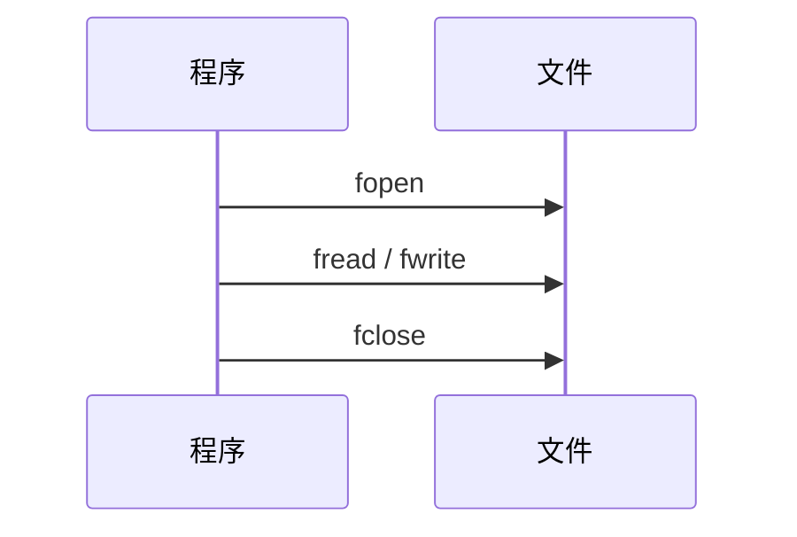
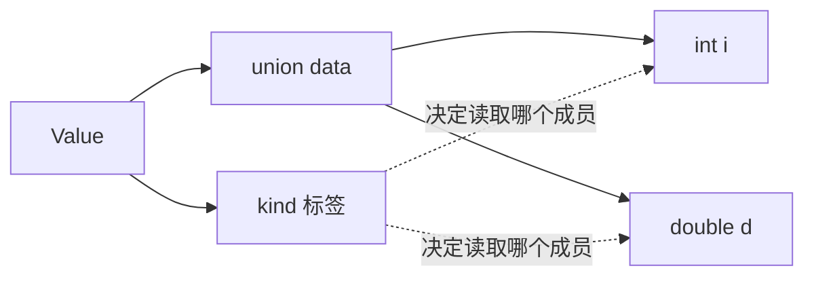

# 结构体

一种数据类型

```c
struct Student
{
    char s_id[10];
    char s_name[10];
    char s_sex[10];
    int s_age;
}stud1;
struct Student stud2;
int main(void){
    int a = 10;
	struct Student stud = 			 
    {"09001","zhangsan","man",12};
    struct Student* sp = &stud;//sizeof(sp);
    printf("id: %s\n",stud1.s_id);
    //......
    (*sp).s_id;
    sp->s_id;
    printf("id: %s\n",sp->s_id);
    return 0;
}
```

 ## 文件

- 显示器:**标准输出文件**,printf就是向这个文件输出数据;putchar
- 键盘:**标准输入文件**,scanf就是从这个文件读取数据;getchar



### 缓冲区(Buffer)

1. 概念：在使用标准IO时，无论是是输入还是输出，系统会自动的为当前文件在内存中开辟一个缓冲区，从内存向文件中保存数据或从文件向内存中写入数据时，都会先将数据送入进缓冲区，然后再从缓冲区中将数据移动到对应的地方。
2. 缓冲区存在的原因:需要提高IO效率，减少频繁的IO操作。如果没有缓冲区意味着每次写入或者读取一个字节，都会调用底层的IO操作，当大量读写时，底层的IO操作会被频繁调用。因此，C语言提供了在IO时所用到的缓冲区，现将数据保存到缓冲区中，然后当缓冲区满或者某一条件满足时，然后再一起将数据进行读出或写入进文件。当缓冲区满（== 4096字节）就会将缓冲区的内容取出，清空缓冲区.
3. 指在程序执行时，所提供的一块存储空间(在内存中)，可用来暂时存放做准备执行的数据。它的设置是为了提高存取效率，因为内存的存取速度比磁盘驱动器快得多。
    C语言的文件处理功能依据系统是否设置“缓冲区”分为两种:一种是设置缓冲区，另一种是不设置缓冲区。由于不设置缓冲区的文件处理方式，必须使用较低级别的 I/O 函数(包含在头文件 io.h 和 fcntl.h 中)来直接对磁盘存取，这种方式的存取速度慢，并且由于不是 c 的标准函数，跨平台操作时容易出问题。	下面只介绍第一种处理方式，即设置缓冲区的文件处理方式。
    当使用标准 I/O 函数(包含在头文件 stdio.h 中)时，系统会自动设置缓冲区，并通过数据流来读写文件。当进行文件读取时，不会直接对磁盘进行读取，而是先打开数据流，将磁盘上的文件信息拷贝到缓冲区内，然后程序再从缓冲区中读取所需数据


```c
int main(void)
{
    int sum = 0;
    char ch = '\0';
    while(getchar() != '\n')//持续从键盘输入放入缓冲区,读到换行后从缓冲区输出
  //while(getchar() != EOF)
    {
    	sum++;    
    }
    printf("sum: %d \n",sum);
    return 0;
}
```

3. 强制刷新缓冲区

   立刻将缓冲区中的内容取出，并清空缓冲区

​	**int fflush(FILE* stream)**

​	stream:文件流指针

​       返回值为0,刷新成功

​	对于 stdout,该函数会强制的将输出缓冲区的内容取出执行输出操作，并清空缓冲区

​	对于stdin,会强制的丢弃缓冲区的内容

​	全缓冲 调用 fflush 或缓冲区满

​	行缓冲 遇到 \n ,程序结束,缓冲区满

4. 设置缓冲区大小

   **void setbuf(FILE* stream,char*buf);**

​	buf:指向文件流所使用的缓冲区指针

​	**int setvbuf(FILE *stream,char *buf,int mode,size_t size);**

​	mode: _IOFBF 全缓冲, _IOLBF 行缓冲, _NONBF 不缓冲

​	size:缓冲区大小

7. 设置文件读写偏移量:在使用标准 IO 对文件进行读写操作是, C语言 底层会为当前的读写文件操作提供一个类似于游标的一个结构,目的是记录程序在运行时,读取或写入过程中,识别到文件的第几个字节

8. API ( 文件指示器 ):**long ftell(FILE*stream);**

9. 重置文件读写偏移量:**int fseek(FILE*stream,long offset,int whence);**

   offset 偏移量 >0 文件末尾偏移

   ​			<0文件开头偏移

   ​			==0不偏移

   whence 开始偏移的位置 SEEK_SET 文件开头

   ​					   SEEK_CUR当前文件指示器位置

   ​					   SEEK_END文件末尾

### 结构体的布局、联合体与枚举

结构体把多个成员放在同一个对象中，成员地址按声明顺序递增，但中间可能有填充字节：

```c
#include <stddef.h>
#include <stdio.h>

typedef struct {
    char name[16];
    int score;
} Student;

int main(void) {
    printf("size=%zu, score offset=%zu\\n",
           sizeof(Student), offsetof(Student, score));
}
```

`sizeof(Student)` 不一定等于两个成员大小之和。结构体直接写入文件前，要确认字节序、对齐和整数宽度；面向交换的数据格式应逐字段编码，而不是把内存原样倾倒出去。

联合体的所有成员共享同一段存储，适合表示“同一位置可能有不同类型”的数据。联合体本身不记录当前有效成员，通常要配一个枚举标签：

```c
enum ValueKind { VALUE_INT, VALUE_DOUBLE };
typedef struct {
    enum ValueKind kind;
    union { int i; double d; } data;
} Value;
```



枚举常量让代码脱离“魔法数字”。从文件或用户输入得到整数时，仍然要检查它是否落在允许的枚举范围内。
