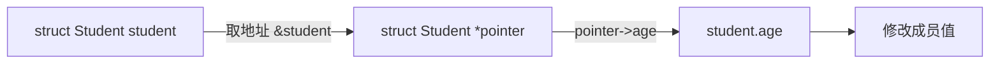
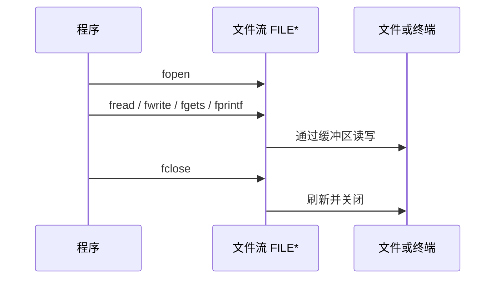
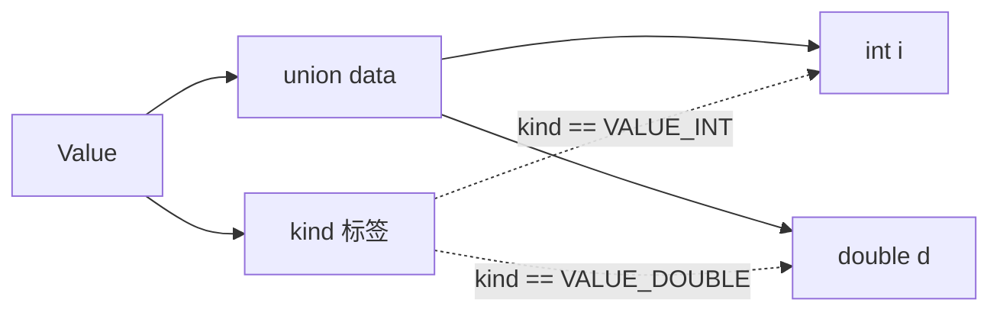

# 结构体

## 结构体

结构体是一种由多个成员组成的自定义类型。成员可以是基本类型、数组、指针，甚至是另一个结构体。它适合把同一对象的不同属性放在一起，例如一个学生的学号、姓名、性别和年龄。

### 定义与使用

结构体类型的基本语法如下：

```c
struct Student {
    char id[10];
    char name[20];
    char sex[10];
    int age;
};
```

定义类型后，可以声明结构体变量：

```c
struct Student student1;
struct Student student2 = {"09001", "Zhang San", "man", 20};
```

也可以在定义结构体类型的同时声明变量：

```c
struct Student {
    char id[10];
    char name[20];
    int age;
} student1;
```

这里的 student1 是变量，不是结构体类型名称。类型名称仍然是 struct Student。

访问普通结构体变量的成员使用点运算符：

结构体把多个不同类型的成员组织成一个对象，访问成员时使用点运算符。

```c
#include <stdio.h>

struct Student {
    char id[10];
    char name[20];
    char sex[10];
    int age;
};

int main(void) {
    struct Student student = {"09001", "Zhang San", "man", 20};

    printf("id: %s\n", student.id);
    printf("name: %s\n", student.name);
    printf("age: %d\n", student.age);

    student.age = 21;
    printf("new age: %d\n", student.age);
    return 0;
}
```

### 结构体指针

结构体指针可以使用 -> 访问成员。下面两种写法等价：

结构体指针保存结构体对象的地址，使用箭头运算符访问成员；它与先解引用再使用点运算符的写法等价。

```c
(*pointer).age
pointer->age
```

完整示例：

```c
#include <stdio.h>

struct Student {
    char id[10];
    char name[20];
    int age;
};

int main(void) {
    struct Student student = {"09001", "Zhang San", 20};
    struct Student *pointer = &student;

    printf("id: %s\n", (*pointer).id);
    printf("name: %s\n", pointer->name);

    pointer->age = 21;
    printf("age: %d\n", pointer->age);
    return 0;
}
```



### 初始化与指定初始化

结构体可以按成员声明顺序初始化：

```c
struct Point {
    int x;
    int y;
};

struct Point p1 = {10, 20};
struct Point p2 = {0};
```

C99 支持指定初始化器，成员较多时更清楚：

```c
struct Point p = {
    .y = 20,
    .x = 10
};
```

没有被指定的成员会初始化为零。指定初始化器只改变书写顺序，不改变成员在结构体中的声明顺序。

### typedef 为结构体取别名

直接使用 struct Student 有些冗长，可以用 typedef 创建别名：

```c
typedef struct {
    char id[10];
    char name[20];
    int age;
} Student;

int main(void) {
    Student student = {"09001", "Zhang San", 20};
    return student.age == 20 ? 0 : 1;
}
```

typedef 只是为已有类型取别名，不会创建新的运行时对象，也不会因此改变内存布局。

### 嵌套结构体

结构体成员可以是另一个结构体：

```c
struct Date {
    int year;
    int month;
    int day;
};

struct Employee {
    char name[20];
    struct Date birthday;
};

int main(void) {
    struct Employee employee = {
        "Li Si",
        {2000, 5, 12}
    };

    return employee.birthday.year == 2000 ? 0 : 1;
}
```

## 结构体内存布局

结构体成员按声明顺序排列，但成员之间可能存在填充字节。编译器加入填充是为了满足对齐要求，让处理器更容易访问成员。

```c
#include <stddef.h>
#include <stdio.h>

typedef struct {
    char name[16];
    int score;
} Student;

int main(void) {
    printf("size = %zu\n", sizeof(Student));
    printf("score offset = %zu\n", offsetof(Student, score));
    return 0;
}
```

sizeof(Student) 不一定等于所有成员 sizeof 之和。布局由实现决定，不能把某个平台上的字节排列当作 C 标准的固定承诺。

因此，结构体对象可能包含编译器加入的对齐填充，不能简单地把成员大小相加来推断对象大小。

如果需要比较两个结构体是否逻辑相等，应逐个比较成员，不要直接用 memcmp 比较整个结构体。填充字节可能没有确定值，直接比较会得到误导结果。

把结构体原样写入文件也有类似问题：

* 不同平台的字节序可能不同；
* int、long 的宽度可能不同；
* 对齐和填充可能不同；
* 指针成员保存的是进程地址，不能直接当作持久化数据。

面向交换的文件格式应逐字段编码，或者使用明确规定字节序和字段宽度的格式。

## 文件与标准输入输出

C 标准库把文件抽象成文件流，用 FILE \* 表示。程序启动时通常已经打开三个标准流：

| 标准流  | 常量     | 默认用途     |
| ---- | ------ | -------- |
| 标准输入 | stdin  | 键盘或重定向输入 |
| 标准输出 | stdout | 终端正常输出   |
| 标准错误 | stderr | 错误和诊断信息  |

printf 默认写入 stdout，scanf 默认从 stdin 读取，putchar 和 getchar 分别处理一个字符。

stdout、stdin 和 stderr 是程序启动时通常已经提供的三个标准流。

```c
#include <stdio.h>

int main(void) {
    int ch;

    fputs("请输入一行文字：", stdout);
    while ((ch = getchar()) != '\n' && ch != EOF) {
        putchar(ch);
    }
    fputc('\n', stdout);
    fputs("程序结束\n", stderr);
    return 0;
}
```

getchar 的返回类型必须使用 int，不能使用 char 接收，因为它需要同时表示所有字符和特殊值 EOF。

## 打开、读写与关闭文件

文件操作通常遵循“打开、检查、读写、关闭”的顺序：

先打开文件并检查返回值，再进行读写，最后关闭文件。少一个步骤，文件程序就可能变成一场小型事故演示。

```c
#include <stdio.h>

int main(void) {
    FILE *file = fopen("scores.txt", "w");
    if (file == NULL) {
        perror("fopen");
        return 1;
    }

    if (fprintf(file, "Alice 95\n") < 0) {
        perror("fprintf");
        fclose(file);
        return 1;
    }

    if (fclose(file) != 0) {
        perror("fclose");
        return 1;
    }
    return 0;
}
```

fopen 失败时返回 NULL。常用模式如下：

| 模式       | 含义              |
| -------- | --------------- |
| r        | 以文本方式读取，文件必须存在  |
| w        | 以文本方式写入，原内容会被截断 |
| a        | 以文本方式追加，写入位置在末尾 |
| r+       | 读写，文件必须存在       |
| w+       | 读写，原内容会被截断      |
| a+       | 读写，写入始终追加到末尾    |
| rb、wb、ab | 对应的二进制模式        |

w 和 w+ 会清空原文件，打开前必须确认这正是想要的行为。需要保留原内容时，使用 a 或先采用临时文件写入再替换。



### 文本读写

按行读取文本时，优先使用 fgets，它可以限制最多读取的字符数：

```c
#include <stdio.h>

int main(void) {
    FILE *file = fopen("scores.txt", "r");
    if (file == NULL) {
        perror("scores.txt");
        return 1;
    }

    char line[128];
    while (fgets(line, sizeof line, file) != NULL) {
        fputs(line, stdout);
    }

    if (ferror(file)) {
        perror("读取文件");
        fclose(file);
        return 1;
    }

    fclose(file);
    return 0;
}
```

fgets 在缓冲区足够时会保留换行符。读取结束后，应使用 feof 和 ferror 区分“正常到达文件末尾”和“读取发生错误”。

### 二进制读写

fread 和 fwrite 以字节块为单位读写，返回实际读写的元素个数：

```c
#include <stdio.h>

struct Record {
    int id;
    double score;
};

int main(void) {
    struct Record out = {1, 98.5};
    struct Record in;

    FILE *file = fopen("record.bin", "wb");
    if (file == NULL) {
        perror("record.bin");
        return 1;
    }

    if (fwrite(&out, sizeof out, 1, file) != 1) {
        perror("fwrite");
        fclose(file);
        return 1;
    }
    fclose(file);

    file = fopen("record.bin", "rb");
    if (file == NULL) {
        perror("record.bin");
        return 1;
    }

    if (fread(&in, sizeof in, 1, file) == 1) {
        printf("id=%d score=%.1f\n", in.id, in.score);
    }
    fclose(file);
    return 0;
}
```

这个示例适合说明本机程序之间的简单读写。若文件需要跨平台交换，不应直接把结构体对象的内存表示写入文件，而应逐字段编码。

## 缓冲区

标准 I/O 通常会为文件流维护一块缓冲区。程序先和缓冲区交互，库再根据条件批量调用操作系统的 I/O 接口，这样可以减少频繁的系统调用。

缓冲区的实际大小由实现和运行环境决定，不能写死为 4096 字节。缓冲区可能因为以下原因被刷新：

* 缓冲区已满；
* 调用了 fflush；
* 调用了 fclose；
* 程序正常结束；
* 行缓冲流写入换行，或读取交互设备时触发实现定义的刷新行为。


### 缓冲模式

| 模式  | 宏       | 说明             |
| --- | ------- | -------------- |
| 全缓冲 | \_IOFBF | 缓冲区满时刷新        |
| 行缓冲 | \_IOLBF | 遇到换行或其他刷新条件时刷新 |
| 不缓冲 | \_IONBF | 尽量直接交给底层 I/O   |

可以使用 setbuf 或 setvbuf 设置缓冲区。必须在对流进行其他读写操作前调用：

```c
#include <stdio.h>

int main(void) {
    char buffer[BUFSIZ];
    FILE *file = fopen("output.txt", "w");
    if (file == NULL) {
        return 1;
    }

    if (setvbuf(file, buffer, _IOFBF, sizeof buffer) != 0) {
        fclose(file);
        return 1;
    }

    fputs("buffered output\n", file);
    fclose(file);
    return 0;
}
```

函数声明：

```c
void setbuf(FILE *stream, char *buffer);
int setvbuf(FILE *stream, char *buffer, int mode, size_t size);
```

传入的缓冲数组必须在文件流关闭前保持有效。局部数组可以使用，但不能在函数返回后仍让文件流继续使用它。

### 刷新输出缓冲区

fflush 用于刷新输出流：

```c
#include <stdio.h>

int main(void) {
    printf("正在处理...");
    fflush(stdout);

    /* 执行耗时操作 */
    putchar('\n');
    return 0;
}
```

对输出流调用 fflush 是标准且可移植的。对输入流调用 fflush(stdin) 并不是 ISO C 规定的清空输入缓冲区方法，不应把它写成通用技巧。需要丢弃当前输入行时，应显式读取字符直到换行或 EOF：

fflush 主要用于刷新输出流，而不是清空输入流。

```c
#include <stdio.h>

void discard_line(void) {
    int ch;
    while ((ch = getchar()) != '\n' && ch != EOF) {
    }
}
```

## 文件位置指示器

每个文件流都有一个位置指示器，可以理解为下一次读写发生的位置。fseek 改变位置，ftell 查询位置，rewind 回到文件开头。

这三个函数共同管理文件读写位置：fseek 负责移动，ftell 负责查询，rewind 负责回到开头。

| 函数                                                | 作用                    |
| ------------------------------------------------- | --------------------- |
| long ftell(FILE \*stream)                         | 返回当前位置；失败时返回 -1L      |
| int fseek(FILE \*stream, long offset, int whence) | 从指定基准移动位置；成功返回 0      |
| void rewind(FILE \*stream)                        | 回到文件开头，同时清除错误和 EOF 标志 |

whence 决定偏移基准：

| 常量        | 基准位置   |
| --------- | ------ |
| SEEK\_SET | 文件开头   |
| SEEK\_CUR | 当前文件位置 |
| SEEK\_END | 文件末尾   |

offset 是相对于基准位置的偏移量，可以为正数、负数或零。

```c
#include <stdio.h>

int main(void) {
    FILE *file = fopen("scores.txt", "rb");
    if (file == NULL) {
        return 1;
    }

    if (fseek(file, 0, SEEK_END) != 0) {
        fclose(file);
        return 1;
    }

    long size = ftell(file);
    if (size >= 0) {
        printf("size = %ld bytes\n", size);
    }

    rewind(file);
    fclose(file);
    return 0;
}
```

文本流的随机定位受平台换行规则影响；需要按字节精确定位时，应使用二进制模式。对超大文件，还应考虑平台提供的更宽文件偏移接口。

## 联合体

联合体使用关键字 union，所有成员共享同一段存储空间。联合体的大小至少能够容纳最大的成员，但它不记录当前哪个成员有效。

```c
#include <stdio.h>

union Number {
    int i;
    float f;
};

int main(void) {
    union Number number;
    number.i = 42;
    printf("i = %d\n", number.i);

    number.f = 3.14f;
    printf("f = %.2f\n", number.f);
    return 0;
}
```

写入一个成员后，再读取另一个成员的结果受 C 标准和实现规则限制，不应把联合体当作无条件的类型转换工具。实际项目中通常使用枚举标签记录当前有效成员：

```c
enum ValueKind {
    VALUE_INT,
    VALUE_DOUBLE
};

typedef struct {
    enum ValueKind kind;
    union {
        int i;
        double d;
    } data;
} Value;
```



使用联合体时，读取成员必须和当前标签一致。标签负责告诉程序这一块共享存储现在应该按哪种类型解释。

联合体的成员共享同一段存储，枚举标签记录当前有效成员，读取时必须遵循标签。

## 枚举

枚举使用关键字 enum，用于表示一组相关的整数常量：

```c
enum Color {
    COLOR_RED,
    COLOR_GREEN,
    COLOR_BLUE
};

int main(void) {
    enum Color color = COLOR_GREEN;
    return color == COLOR_GREEN ? 0 : 1;
}
```

默认情况下，枚举成员从 0 开始递增，也可以显式指定值：

```c
enum HttpStatus {
    STATUS_OK = 200,
    STATUS_NOT_FOUND = 404,
    STATUS_ERROR = 500
};
```

枚举常量比直接写数字更容易阅读，也能减少魔法数字：

```c
enum Direction {
    DIRECTION_UP,
    DIRECTION_DOWN,
    DIRECTION_LEFT,
    DIRECTION_RIGHT
};

void move(enum Direction direction) {
    switch (direction) {
        case DIRECTION_UP:
            break;
        case DIRECTION_DOWN:
            break;
        case DIRECTION_LEFT:
            break;
        case DIRECTION_RIGHT:
            break;
    }
}
```

从文件、网络或用户输入得到整数后，不能假定它自动属于某个枚举集合。使用前应检查范围或逐项验证：

枚举常量可以替代魔法数字，但来自外部的数据仍然需要校验。

```c
int value = 2;
if (value >= DIRECTION_UP && value <= DIRECTION_RIGHT) {
    enum Direction direction = (enum Direction)value;
    move(direction);
}
```

枚举对象的底层表示由实现决定。不要依赖它一定是某种固定宽度的整数。

## 结构体序列化的可移植性

结构体在内存中的布局可能包含填充字节，直接执行：

```c
fwrite(&student, sizeof student, 1, file);
```

只适合同一编译器、同一 ABI 和相同字节序的受控场景。面向长期保存或跨平台交换的数据，应逐字段写入，并规定整数宽度、字节序和文本编码。读取时还要检查 `fread` 的返回值，不能假设文件一定完整。
