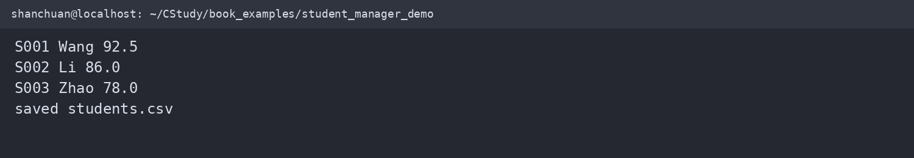
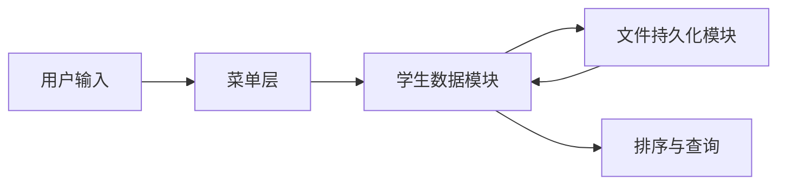

# 学生成绩管理系统

这是全书的综合项目。它把结构体、数组、指针、动态内存、文件、排序、函数指针、错误处理和多文件组织连接起来。

下面的最小版本在 WSL2 `/home/shanchuan/CStudy/book_examples/student_manager_demo.c` 中编译运行：





## 数据模型

```c
#include <stddef.h>
#include <stdint.h>

typedef struct {
    char id[16];
    char name[32];
    double score;
} Student;

typedef struct {
    Student *items;
    size_t size;
    size_t capacity;
} StudentList;
```

下面的单文件版本先完成“排序并保存”这条最小闭环，再逐步拆分为多个模块：

```c
#include <stdio.h>
#include <stdlib.h>

typedef struct { char id[16]; char name[32]; double score; } Student;

static int compare_score_desc(const void *left, const void *right) {
    const Student *a = left, *b = right;
    return (a->score < b->score) - (a->score > b->score);
}

static int save_students(const char *path, const Student students[], size_t count) {
    FILE *file = fopen(path, "w");
    if (file == NULL) return -1;
    for (size_t i = 0; i < count; ++i) {
        if (fprintf(file, "%s,%s,%.1f\n", students[i].id,
                    students[i].name, students[i].score) < 0) {
            fclose(file);
            return -1;
        }
    }
    return fclose(file) == 0 ? 0 : -1;
}

int main(void) {
    Student students[] = {
        {"S002", "Li", 86.0}, {"S001", "Wang", 92.5}, {"S003", "Zhao", 78.0}
    };
    size_t count = sizeof students / sizeof students[0];
    qsort(students, count, sizeof students[0], compare_score_desc);
    if (save_students("students.csv", students, count) != 0) return 1;
    for (size_t i = 0; i < count; ++i)
        printf("%s %s %.1f\n", students[i].id, students[i].name, students[i].score);
    puts("saved students.csv");
    return 0;
}
```

动态数组扩容时，不能直接把 `realloc` 的结果覆盖唯一原指针：

```c
int student_list_reserve(StudentList *list, size_t capacity) {
    if (capacity <= list->capacity) return 0;
    if (capacity > SIZE_MAX / sizeof *list->items) return -1;
    Student *new_items = realloc(list->items, capacity * sizeof *new_items);
    if (new_items == NULL) return -1;
    list->items = new_items;
    list->capacity = capacity;
    return 0;
}
```

## 功能拆分

建议的多文件结构：

```
student-manager/
├── main.c
├── student.c
├── student.h
├── storage.c
├── storage.h
├── menu.c
└── menu.h
```

核心功能包括：

* 添加、删除、修改学生；
* 按学号查找；
* 按成绩排序；
* 统计平均分、最高分和最低分；
* 从文件加载；
* 保存到文件；
* 对输入和文件错误给出明确提示。

## 项目边界

这个项目首先使用文本文件，便于观察和调试；完成基础版本后，再增加二进制文件和逐字段序列化版本。书中代码应始终检查内存分配、文件打开、读写返回值和输入长度。

## 完成标准

项目完成并不只看“能运行”：

1. 空数据文件可以正常启动；
2. 文件不存在时能给出可理解的错误；
3. 添加、删除、查询、排序结果稳定；
4. 程序退出前释放所有动态内存；
5. 使用 `-Wall -Wextra -Wpedantic` 编译无警告；
6. 代码可以拆分为多个编译单元并独立测试。
